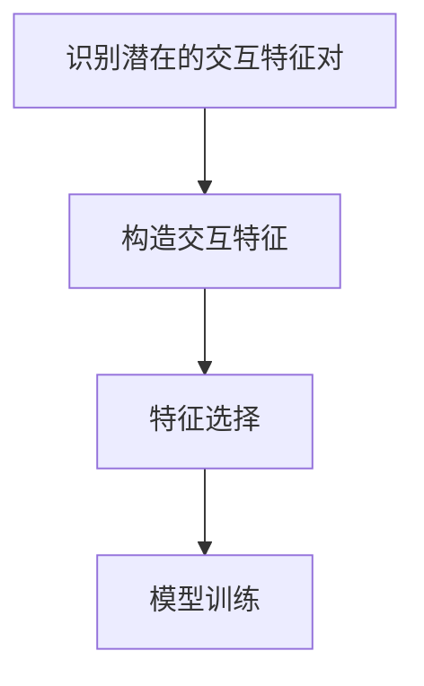
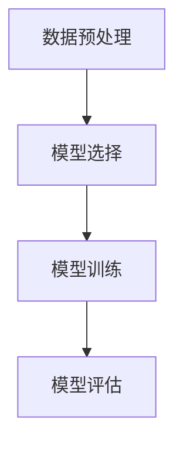
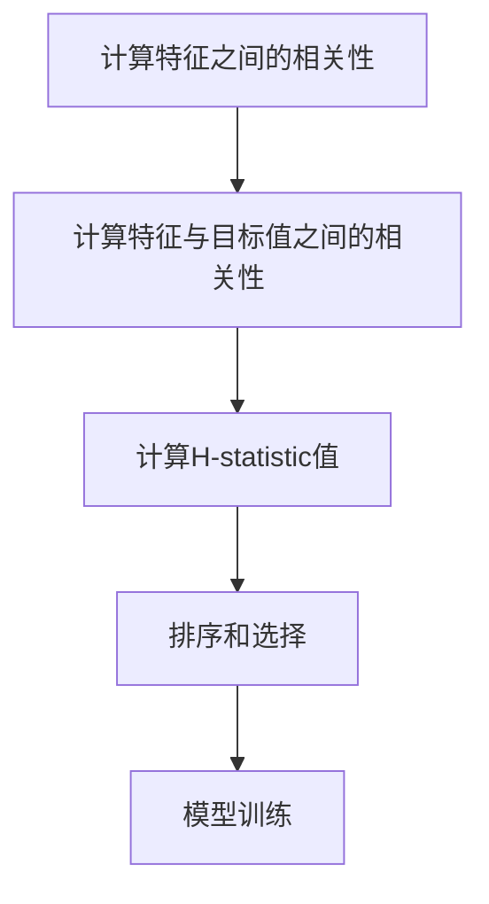

以下是我根据您的要求撰写的技术博客文章正文内容：

# 特征工程实战技巧：特征交互探索

## 1.背景介绍

### 1.1 特征工程的重要性

在机器学习和数据挖掘领域中,特征工程被公认为最重要的环节之一。高质量的特征可以极大提升模型的性能和泛化能力,而低质量的特征则会导致模型欠拟合或过拟合。因此,特征工程对于构建高性能的机器学习模型至关重要。

### 1.2 特征交互的概念

特征交互(Feature Interaction)指的是不同特征之间存在的相互作用关系。例如,在房价预测任务中,房屋面积和房龄这两个特征之间可能存在交互作用,即面积越大、房龄越新的房屋价格通常会更高。考虑特征交互有助于捕捉数据中更加复杂的模式,从而提高模型性能。

## 2.核心概念与联系

### 2.1 特征交互的类型

特征交互主要分为以下几种类型:

1. **一阶交互(One-way Interaction)**: 单个特征对目标值的影响,如房屋面积对房价的影响。

2. **二阶交互(Two-way Interaction)**: 两个特征之间的交互作用,如房屋面积和房龄对房价的交互影响。

3. **高阶交互(Higher-order Interaction)**: 三个或更多特征之间的交互作用。

### 2.2 特征交互与模型复杂度

考虑特征交互会增加模型的复杂度。一般来说,线性模型(如线性回归)只能捕捉一阶交互,而非线性模型(如决策树、神经网络)能够自动学习特征之间的高阶交互。因此,在使用线性模型时,我们需要手动构造交互特征;而对于非线性模型,我们可以让模型自己学习特征交互。

### 2.3 特征交互与特征选择

特征选择旨在从原始特征集中选择出对模型性能影响最大的一组特征。当考虑特征交互时,我们不仅需要评估单个特征的重要性,还需要评估特征交互对模型性能的影响。因此,特征选择和特征交互探索是密切相关的两个环节。

## 3.核心算法原理具体操作步骤

### 3.1 线性模型中的特征交互

对于线性模型,我们需要手动构造交互特征。以下是一个具体的操作步骤:

1. **识别潜在的交互特征对**: 根据领域知识和经验,识别出可能存在交互作用的特征对。

2. **构造交互特征**: 对于每个特征对,构造一个新的交互特征,通常是两个特征的乘积。例如,对于特征 $x_1$ 和 $x_2$,我们可以构造交互特征 $x_1 \times x_2$。

3. **特征选择**: 在包含原始特征和交互特征的特征集中,进行特征选择以选择出对模型性能影响最大的一组特征。

4. **模型训练**: 使用选定的特征集训练线性模型。

以上步骤可以通过以下 Mermaid 流程图进行总结:



### 3.2 非线性模型中的特征交互

对于非线性模型(如决策树、随机森林、梯度提升树等),它们能够自动学习特征之间的交互作用。我们无需手动构造交互特征,只需要将原始特征输入到模型中即可。以下是一个具体的操作步骤:

1. **数据预处理**: 对原始数据进行必要的预处理,如处理缺失值、编码分类特征等。

2. **模型选择**: 选择合适的非线性模型,如决策树、随机森林或梯度提升树。

3. **模型训练**: 使用原始特征集训练非线性模型。在训练过程中,模型会自动捕捉特征之间的交互作用。

4. **模型评估**: 在测试集上评估模型性能,并根据需要进行模型调优。

以上步骤可以通过以下 Mermaid 流程图进行总结:



### 3.3 特征交互探索算法

除了手动构造和自动学习特征交互之外,还有一些专门用于探索特征交互的算法,如ANOVA(Analysis of Variance)、MARS(Multivariate Adaptive Regression Splines)和H-statistic等。这些算法可以自动识别出对目标值影响较大的特征交互。

以 H-statistic 算法为例,它的具体操作步骤如下:

1. **计算特征之间的相关性**: 计算每对特征之间的相关性,可以使用皮尔逊相关系数、互信息等方法。

2. **计算特征与目标值之间的相关性**: 计算每个特征与目标值之间的相关性。

3. **计算 H-statistic 值**: 对于每对特征,计算它们与目标值之间的最大相关性与它们之间的相关性的比值,这个比值就是 H-statistic 值。

4. **排序和选择**: 根据 H-statistic 值对特征对进行排序,选择排名靠前的特征对作为重要的交互特征。

5. **模型训练**: 使用包含重要交互特征的特征集训练模型。

以上步骤可以通过以下 Mermaid 流程图进行总结:



## 4.数学模型和公式详细讲解举例说明

### 4.1 互信息

互信息(Mutual Information)是衡量两个随机变量之间相关性的一种度量方法。在特征交互探索中,我们可以使用互信息来度量两个特征之间的相关性。

对于两个离散随机变量 $X$ 和 $Y$,它们的互信息定义为:

$$I(X;Y) = \sum_{x \in X} \sum_{y \in Y} p(x,y) \log \frac{p(x,y)}{p(x)p(y)}$$

其中,

- $p(x,y)$ 是 $X$ 和 $Y$ 的联合概率分布;
- $p(x)$ 和 $p(y)$ 分别是 $X$ 和 $Y$ 的边缘概率分布。

互信息的取值范围是 $[0, +\infty)$,当 $X$ 和 $Y$ 相互独立时,互信息为 0;当 $X$ 和 $Y$ 之间的相关性越强时,互信息值越大。

在实际应用中,我们通常需要对连续特征进行离散化处理,然后计算离散化后的特征之间的互信息。

### 4.2 H-statistic

H-statistic 是一种用于评估特征交互重要性的指标。对于两个特征 $X$ 和 $Y$,以及目标值 $Z$,H-statistic 的计算公式如下:

$$H(X,Y;Z) = \frac{\max\{I(X;Z), I(Y;Z)\}}{I(X;Y)}$$

其中,

- $I(X;Z)$ 和 $I(Y;Z)$ 分别表示特征 $X$ 和 $Y$ 与目标值 $Z$ 之间的互信息;
- $I(X;Y)$ 表示特征 $X$ 和 $Y$ 之间的互信息。

H-statistic 的取值范围是 $[0, +\infty)$。当 $X$ 和 $Y$ 之间存在强交互作用时,H-statistic 值较大;当 $X$ 和 $Y$ 之间没有交互作用时,H-statistic 值较小。

通过计算每对特征的 H-statistic 值,并对其进行排序,我们可以识别出对目标值影响较大的特征交互。

### 4.3 ANOVA 交互检验

ANOVA(Analysis of Variance)是一种用于检验多个变量之间差异是否显著的统计方法。在特征交互探索中,我们可以使用 ANOVA 交互检验来评估特征交互的显著性。

假设我们有两个特征 $X$ 和 $Y$,以及目标值 $Z$,我们可以构建以下线性模型:

$$Z = \beta_0 + \beta_1 X + \beta_2 Y + \beta_3 XY + \epsilon$$

其中,

- $\beta_0$ 是常数项;
- $\beta_1$ 和 $\beta_2$ 分别是特征 $X$ 和 $Y$ 的系数;
- $\beta_3$ 是交互项 $XY$ 的系数;
- $\epsilon$ 是随机误差项。

我们可以使用 ANOVA 检验交互项 $XY$ 的系数 $\beta_3$ 是否显著不为 0。如果 $\beta_3$ 显著不为 0,则说明特征 $X$ 和 $Y$ 之间存在显著的交互作用。

ANOVA 交互检验的具体步骤如下:

1. **构建线性模型**: 构建包含主效应项和交互项的线性模型。

2. **计算均方和(Sum of Squares)**: 计算模型的总均方和、主效应项的均方和和交互项的均方和。

3. **计算 F 统计量**: 根据均方和计算 F 统计量。

4. **检验显著性**: 根据 F 统计量的 p 值判断交互项是否显著。

ANOVA 交互检验可以帮助我们识别出显著的特征交互,从而为构建更好的模型提供支持。

## 5.项目实践:代码实例和详细解释说明

在这一部分,我们将通过一个实际项目案例,演示如何进行特征交互探索和构建包含交互特征的模型。我们将使用 Python 编程语言和 scikit-learn 机器学习库。

### 5.1 数据集介绍

我们将使用著名的加州房价数据集(California Housing dataset)进行实践。该数据集包含加州不同街区的房价数据,以及影响房价的各种特征,如人口统计数据、房屋信息等。我们的目标是根据这些特征预测房价中位数。

### 5.2 数据预处理

```python
import pandas as pd
from sklearn.datasets import fetch_california_housing
from sklearn.model_selection import train_test_split
from sklearn.preprocessing import StandardScaler

# 加载数据集
housing = fetch_california_housing()
X = pd.DataFrame(housing.data, columns=housing.feature_names)
y = housing.target

# 划分训练集和测试集
X_train, X_test, y_train, y_test = train_test_split(X, y, test_size=0.2, random_state=42)

# 标准化数据
scaler = StandardScaler()
X_train = scaler.fit_transform(X_train)
X_test = scaler.transform(X_test)
```

在这一步骤中,我们加载了加州房价数据集,将其划分为训练集和测试集,并对特征数据进行了标准化处理。

### 5.3 线性模型中的特征交互

对于线性模型,我们需要手动构造交互特征。以下是一个使用线性回归模型的示例:

```python
from sklearn.linear_model import LinearRegression
from sklearn.preprocessing import PolynomialFeatures
from sklearn.metrics import mean_squared_error, r2_score

# 构造二阶交互特征
poly = PolynomialFeatures(degree=2, include_bias=False)
X_train_poly = poly.fit_transform(X_train)
X_test_poly = poly.transform(X_test)

# 训练线性回归模型
lr = LinearRegression()
lr.fit(X_train_poly, y_train)

# 评估模型性能
y_train_pred = lr.predict(X_train_poly)
y_test_pred = lr.predict(X_test_poly)

train_mse = mean_squared_error(y_train, y_train_pred)
test_mse = mean_squared_error(y_test, y_test_pred)
train_r2 = r2_score(y_train, y_train_pred)
test_r2 = r2_score(y_test, y_test_pred)

print(f"训练集 MSE: {train_mse:.2f}, 测试集 MSE: {test_mse:.2f}")
print(f"训练集 R^2: {train_r2:.2f}, 测试集 R^2: {test_r2:.2f}")
```

在这个示例中,我们使用 `PolynomialFeatures` 类从原始特征构造二阶交互特征,然后使用线性回归模型进行训练