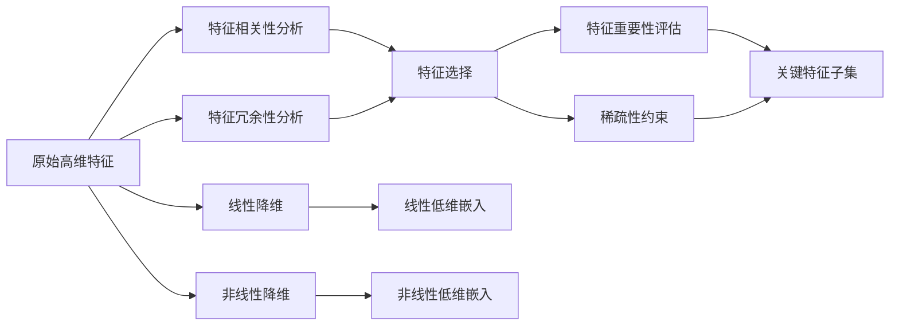

# 特征选择与特征降维原理与代码实战案例讲解

## 1. 背景介绍

在机器学习和数据挖掘任务中,我们经常会遇到高维数据集。高维数据不仅会增加计算复杂度,还可能引入噪声和冗余信息,从而影响模型的性能。为了解决这个问题,我们需要对原始特征进行选择和降维处理。特征选择和特征降维是数据预处理的重要步骤,它们可以帮助我们从原始特征中选出最具有区分性和代表性的特征子集,从而提高模型的泛化能力和训练效率。

### 1.1 特征选择的定义与目的

特征选择(Feature Selection)是指从原始特征集合中选择出一个最优特征子集的过程。其目的是去除不相关、冗余和噪声特征,从而减少特征维度,提高模型的性能和可解释性。通过特征选择,我们可以获得以下好处:

- 降低计算复杂度,加速模型训练和预测过程
- 减少过拟合风险,提高模型泛化能力  
- 增强模型的可解释性,便于理解特征与目标变量之间的关系

### 1.2 特征降维的定义与目的

特征降维(Feature Reduction)是指通过某种数学变换将高维特征映射到低维空间,从而实现维度压缩的过程。与特征选择不同,特征降维并不直接删除原始特征,而是将其转化为新的综合特征。通过特征降维,我们可以获得以下好处:

- 消除特征之间的多重共线性
- 可视化高维数据,便于探索数据内在结构
- 加速距离计算和相似度度量
- 降低存储和通信开销

### 1.3 特征选择与特征降维的区别与联系

特征选择和特征降维都是降维技术,但它们在原理和效果上存在一定差异:

- 特征选择是从原始特征中选择子集,特征降维是将原始特征映射到新空间
- 特征选择保持了原始特征的物理意义,特征降维生成了新的综合特征
- 特征选择的结果是离散的特征子集,特征降维的结果是连续的低维嵌入
- 许多特征选择方法可以作为特征降维的预处理步骤

尽管存在差异,但特征选择和特征降维并不是互斥的,它们可以结合起来使用。例如,我们可以先用特征选择粗略筛选出重要特征,再用特征降维方法进一步压缩维度。

## 2. 核心概念与联系

为了更好地理解特征选择和特征降维技术,我们需要掌握一些核心概念:

### 2.1 特征相关性与冗余性

- 特征相关性(Feature Relevance):指特征与目标变量之间的相关程度。相关性高的特征对预测目标变量更有帮助。
- 特征冗余性(Feature Redundancy):指特征之间的相关程度。冗余特征所包含的信息可以被其他特征替代。

理想的特征子集应该与目标变量高度相关,而特征之间相互独立。因此,许多特征选择方法都是在最大化相关性和最小化冗余性之间寻求平衡。

### 2.2 特征重要性与稀疏性

- 特征重要性(Feature Importance):指单个特征对模型性能的贡献程度。基于树的集成学习算法(如随机森林)可以很方便地计算特征重要性。
- 稀疏性(Sparsity):指只有少数特征是有效的,大部分特征系数为零。稀疏性是许多特征选择方法(如L1正则化)的重要性质。

通过特征重要性分析和稀疏约束,我们可以自动识别出关键特征,过滤掉大量的冗余特征。

### 2.3 线性降维与非线性降维

根据特征变换的性质,特征降维可以分为线性降维和非线性降维两大类:

- 线性降维(Linear Dimensionality Reduction):将原始高维空间通过线性变换映射到低维子空间。代表方法有PCA、LDA等。
- 非线性降维(Nonlinear Dimensionality Reduction):通过非线性变换(如流形学习)找到高维数据的低维嵌入。代表方法有Isomap、LLE、t-SNE等。  

线性降维方法简单高效,适合处理线性可分的数据。非线性降维方法能够保持数据的内在结构,揭示复杂流形,但计算开销较大。

下图展示了特征选择与特征降维核心概念之间的联系:

## 3. 核心算法原理具体操作步骤

特征选择和特征降维包含许多经典算法,下面我们重点介绍几种常用方法的原理和步骤。

### 3.1 过滤式特征选择

过滤式特征选择(Filter Feature Selection)根据特征本身的统计特性来评估其重要性,与具体的学习器无关。常见的评估指标有:

- 方差(Variance):方差越大,特征越有区分性
- 相关系数(Correlation Coefficient):特征与目标变量的相关性越强,特征越重要
- 互信息(Mutual Information):特征与目标变量的互信息越大,特征越重要
- 卡方检验(Chi-Square Test):特征与目标变量的相关性越显著,特征越重要

过滤式选择的一般步骤如下:

1. 计算每个特征的评估指标
2. 根据指标值排序特征
3. 选取排名前K的特征作为最优子集

过滤式选择的优点是计算简单,缺点是没有考虑特征之间的交互作用。

### 3.2 包裹式特征选择

包裹式特征选择(Wrapper Feature Selection)将特征子集的选择看作一个搜索问题,用学习器的性能作为特征子集的评估准则。常见的搜索策略有:

- 前向选择(Forward Selection):从空集开始,每次添加一个特征,直到性能不再提升
- 后向消除(Backward Elimination):从全集开始,每次删除一个特征,直到性能不再提升  
- 递归特征消除(Recursive Feature Elimination):反复训练模型,每次消除若干最不重要的特征

包裹式选择的一般步骤如下:

1. 定义学习器和性能评估方法
2. 初始化特征子集
3. 迭代搜索最优特征子集:
   - 训练学习器,评估当前子集
   - 根据搜索策略更新子集
4. 返回最优特征子集

包裹式选择考虑了特征与学习器之间的相互作用,但计算开销较大。

### 3.3 嵌入式特征选择  

嵌入式特征选择(Embedded Feature Selection)将特征选择过程与学习器的训练过程融合在一起。常见的方法有:

- L1正则化(L1 Regularization):在目标函数中加入L1范数惩罚项,使得部分特征系数被压缩为0
- 决策树(Decision Tree):根据信息增益或基尼指数选择分裂特征,未被选中的特征自动被过滤
- 梯度提升树(Gradient Boosting Tree):通过特征重要性评分来选择关键特征

嵌入式选择的优点是计算高效,特征选择与模型训练同时进行。缺点是选择结果与具体学习器绑定。

### 3.4 主成分分析(PCA)

主成分分析(Principal Component Analysis)是最经典的线性降维方法。它通过正交变换将原始特征映射到一组新的正交基上,使得数据的方差最大化。PCA的主要步骤如下:

1. 对原始数据进行中心化(减去均值)
2. 计算数据的协方差矩阵
3. 对协方差矩阵进行特征值分解  
4. 选取前K个最大特征值对应的特征向量作为主成分
5. 将原始数据投影到主成分上得到降维后的数据

PCA可以有效地去除数据中的噪声和冗余信息,但它假设数据是线性的,对非线性结构无能为力。

### 3.5 t-SNE

t-SNE(t-Distributed Stochastic Neighbor Embedding)是一种流行的非线性降维方法。它通过最小化数据点在高维空间和低维空间的条件概率分布之间的KL散度,实现维度压缩。t-SNE的主要步骤如下:

1. 计算高维空间中数据点之间的成对相似度(如欧氏距离)
2. 根据相似度构建高维空间的条件概率分布
3. 在低维空间中随机初始化数据点  
4. 计算低维空间中数据点之间的成对相似度
5. 根据相似度构建低维空间的条件概率分布
6. 最小化两个条件概率分布之间的KL散度,更新低维坐标
7. 重复4-6步直到收敛

t-SNE擅长保持数据的局部结构,在可视化高维数据方面有独特优势。但它对参数敏感,计算复杂度较高。

## 4. 数学模型和公式详细讲解举例说明

为了加深理解,我们对几个关键的数学模型和公式进行详细讲解和举例说明。

### 4.1 互信息

互信息(Mutual Information)衡量了两个随机变量之间的相互依赖性。对于离散型随机变量X和Y,它们的互信息定义为:

$$
I(X;Y) = \sum_{x \in X} \sum_{y \in Y} p(x,y) \log \frac{p(x,y)}{p(x)p(y)}
$$

其中,$p(x,y)$是X和Y的联合概率分布,$p(x)$和$p(y)$分别是X和Y的边缘概率分布。

举例来说,假设我们有两个二值特征X和Y,它们的联合分布如下:

|  X\Y  |  0   |  1   | p(x) |
| :---: | :--: | :--: | :--: |
|   0   | 0.1  | 0.2  | 0.3  |
|   1   | 0.4  | 0.3  | 0.7  |
| p(y)  | 0.5  | 0.5  |  1   |

根据定义,我们可以计算X和Y的互信息:

$$
\begin{aligned}
I(X;Y) &= 0.1 \log \frac{0.1}{0.3 \times 0.5} + 0.2 \log \frac{0.2}{0.3 \times 0.5} \\
&+ 0.4 \log \frac{0.4}{0.7 \times 0.5} + 0.3 \log \frac{0.3}{0.7 \times 0.5} \\
&\approx 0.0349
\end{aligned}
$$

可见,X和Y之间存在一定的相关性,但并不是非常强。

### 4.2 主成分分析

主成分分析的核心是协方差矩阵的特征值分解。对于样本矩阵$\mathbf{X} \in \mathbb{R}^{n \times p}$,其中n是样本数,p是特征数,协方差矩阵定义为:

$$
\mathbf{C} = \frac{1}{n-1} (\mathbf{X} - \bar{\mathbf{x}})^T (\mathbf{X} - \bar{\mathbf{x}})
$$

其中,$\bar{\mathbf{x}}$是样本均值向量。

对协方差矩阵$\mathbf{C}$进行特征值分解,可以得到:

$$
\mathbf{C} = \mathbf{U} \mathbf{\Lambda} \mathbf{U}^T
$$

其中,$\mathbf{U}$是正交特征向量矩阵,$\mathbf{\Lambda}$是特征值对角矩阵。

前K个最大特征值对应的特征向量构成了主成分矩阵$\mathbf{W} \in \mathbb{R}^{p \times k}$。原始数据$\mathbf{X}$经过主成分投影后得到降维后的数据$\mathbf{Z} \in \mathbb{R}^{n \times k}$:

$$
\mathbf{Z} = \mathbf{X} \mathbf{W}
$$

举例来说,