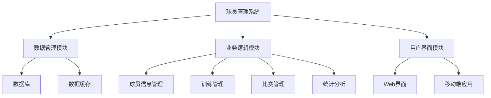

# 球员管理系统详细设计与具体代码实现

## 1.背景介绍

在体育运动领域中，高效的球员管理系统对于俱乐部的运营和发展至关重要。随着科技的不断进步,现代化的球员管理系统已经成为俱乐部管理的核心部分。一个优秀的球员管理系统不仅能够帮助俱乐部更好地管理球员信息,还能够提高训练效率,优化比赛策略,并为俱乐部的决策提供数据支持。

## 2.核心概念与联系

### 2.1 系统架构

球员管理系统的核心架构可以概括为三个主要模块:数据管理模块、业务逻辑模块和用户界面模块。



### 2.2 数据管理模块

数据管理模块负责管理系统中所有的数据,包括球员个人信息、训练数据、比赛数据等。该模块通常由数据库和数据缓存组成,用于存储和高效访问数据。

### 2.3 业务逻辑模块

业务逻辑模块是系统的核心部分,负责处理各种业务需求,如球员信息管理、训练管理、比赛管理和数据统计分析等。该模块通过对数据的处理和计算,为用户提供所需的功能和服务。

### 2.4 用户界面模块

用户界面模块为用户提供友好的交互界面,包括Web界面和移动端应用程序。用户可以通过这些界面访问系统的各项功能,查看和管理相关数据。

## 3.核心算法原理具体操作步骤

### 3.1 球员信息管理算法

球员信息管理算法负责维护球员的个人信息,包括姓名、年龄、位置、身高体重等基本信息,以及过往的比赛数据和训练数据。该算法需要具备高效的数据存储和检索能力,以及对数据的增删改查操作。

具体操作步骤如下:

1. 新建球员信息
   - 接收用户输入的球员基本信息
   - 对输入数据进行合法性校验
   - 将合法数据存储到数据库中

2. 查询球员信息
   - 接收用户的查询条件(姓名、年龄范围等)
   - 从数据库中检索符合条件的球员信息
   - 返回查询结果

3. 更新球员信息
   - 接收用户的更新请求和新的球员信息
   - 对新信息进行合法性校验
   - 更新数据库中对应的球员信息

4. 删除球员信息
   - 接收用户的删除请求和球员标识
   - 从数据库中删除对应的球员信息

### 3.2 训练管理算法

训练管理算法负责记录和管理球员的训练情况,包括训练计划、训练内容、训练数据等。该算法需要具备对训练数据的高效存储和分析能力,以及对训练计划的合理安排能力。

具体操作步骤如下:

1. 制定训练计划
   - 根据球队目标和球员状态制定训练计划
   - 安排训练时间、内容和强度
   - 将训练计划存储到数据库中

2. 记录训练数据
   - 在训练过程中记录球员的各项数据(如心率、速度等)
   - 对数据进行实时处理和分析
   - 将处理后的数据存储到数据库中

3. 评估训练效果
   - 从数据库中获取历史训练数据
   - 对数据进行统计和分析
   - 评估训练效果,并提出改进建议

4. 调整训练计划
   - 根据训练效果评估结果
   - 对训练计划进行动态调整
   - 更新数据库中的训练计划信息

### 3.3 比赛管理算法

比赛管理算法负责记录和管理球队的比赛情况,包括比赛安排、战术部署、比赛数据等。该算法需要具备对比赛数据的高效存储和分析能力,以及对战术策略的优化能力。

具体操作步骤如下:

1. 安排比赛
   - 根据赛程安排比赛时间和地点
   - 确定出场球员名单
   - 将比赛信息存储到数据库中

2. 部署战术
   - 根据对手情况和球员状态制定战术策略
   - 确定首发阵容和替补名单
   - 将战术策略存储到数据库中

3. 记录比赛数据
   - 在比赛过程中记录球员的各项数据(如位置、射门等)
   - 对数据进行实时处理和分析
   - 将处理后的数据存储到数据库中

4. 分析比赛表现
   - 从数据库中获取比赛数据
   - 对数据进行统计和分析
   - 评估球队和球员的表现
   - 提出战术调整建议

### 3.4 统计分析算法

统计分析算法负责对系统中的各种数据进行综合分析,为俱乐部的决策提供数据支持。该算法需要具备对海量数据的高效处理能力,以及对复杂数据模型的建模和分析能力。

具体操作步骤如下:

1. 数据采集
   - 从数据库中获取所需的数据
   - 对数据进行清洗和预处理

2. 数据建模
   - 根据分析目标构建数据模型
   - 选择合适的机器学习算法
   - 对模型进行训练和优化

3. 数据分析
   - 使用训练好的模型对数据进行分析
   - 生成分析报告和可视化结果

4. 决策支持
   - 根据分析结果提出建议和策略
   - 为俱乐部的决策提供数据支持

## 4.数学模型和公式详细讲解举例说明

在球员管理系统中,数学模型和公式在多个模块中都有应用,如统计分析、训练管理和比赛管理等。下面我们将详细介绍其中的一些典型模型和公式。

### 4.1 线性回归模型

线性回归模型是一种常用的监督学习算法,可以用于预测连续型目标变量。在球员管理系统中,线性回归模型可以用于预测球员的某些指标,如射门数、助攻数等。

线性回归模型的数学表达式如下:

$$y = \beta_0 + \beta_1x_1 + \beta_2x_2 + ... + \beta_nx_n + \epsilon$$

其中:
- $y$ 是目标变量
- $x_1, x_2, ..., x_n$ 是自变量
- $\beta_0, \beta_1, ..., \beta_n$ 是回归系数
- $\epsilon$ 是随机误差项

通过最小二乘法,我们可以估计出回归系数 $\beta$ 的值,从而得到预测模型。

例如,我们可以使用球员的年龄、身高、体重等特征作为自变量,射门数作为目标变量,构建线性回归模型来预测球员的射门数。

### 4.2 逻辑回归模型

逻辑回归模型是一种常用的分类算法,可以用于预测二元或多元分类问题。在球员管理系统中,逻辑回归模型可以用于预测球员的某些状态,如是否受伤、是否能够出场等。

逻辑回归模型的数学表达式如下:

$$\log\left(\frac{p}{1-p}\right) = \beta_0 + \beta_1x_1 + \beta_2x_2 + ... + \beta_nx_n$$

其中:
- $p$ 是目标变量取值为1的概率
- $x_1, x_2, ..., x_n$ 是自变量
- $\beta_0, \beta_1, ..., \beta_n$ 是回归系数

通过最大似然估计,我们可以估计出回归系数 $\beta$ 的值,从而得到预测模型。

例如,我们可以使用球员的训练数据、伤病史等特征作为自变量,是否能够出场作为目标变量,构建逻辑回归模型来预测球员的出场概率。

### 4.3 决策树模型

决策树模型是一种常用的分类和回归算法,可以用于处理各种类型的预测问题。在球员管理系统中,决策树模型可以用于预测球员的各种状态和表现。

决策树模型通过递归地构建决策树,将特征空间划分为多个区域,每个区域对应一个预测值。决策树的构建过程如下:

1. 选择一个特征作为根节点
2. 根据该特征的不同取值,将数据集划分为多个子集
3. 对每个子集,递归地重复步骤1和2,构建子树
4. 直到满足停止条件,将子节点标记为叶节点

在构建决策树时,我们需要选择一个合适的特征划分准则,如信息增益或基尼系数等。

例如,我们可以使用球员的身高、体重、年龄等特征构建决策树模型,预测球员的位置或者是否受伤等状态。

### 4.4 聚类算法

聚类算法是一种无监督学习算法,可以将相似的数据点划分到同一个簇中。在球员管理系统中,聚类算法可以用于发现球员之间的相似模式,从而进行分组和策略制定。

常用的聚类算法包括K-Means算法、层次聚类算法等。以K-Means算法为例,其算法步骤如下:

1. 随机选择K个初始质心
2. 计算每个数据点到各个质心的距离,将其划分到最近的簇中
3. 重新计算每个簇的质心
4. 重复步骤2和3,直到簇不再发生变化

其中,质心的计算公式如下:

$$c_i = \frac{1}{|C_i|}\sum_{x \in C_i}x$$

其中:
- $c_i$ 是第i个簇的质心
- $C_i$ 是第i个簇中的所有数据点
- $|C_i|$ 是第i个簇中数据点的个数

例如,我们可以使用球员的身高、体重、年龄等特征,对球员进行聚类,发现不同类型的球员群体,从而制定针对性的训练和战术策略。

## 5.项目实践:代码实例和详细解释说明

在本节中,我们将提供一些代码示例,展示如何在实际项目中实现球员管理系统的核心功能。

### 5.1 球员信息管理

以下是使用Python和SQLAlchemy实现球员信息管理的示例代码:

```python
from sqlalchemy import Column, Integer, String, Float
from sqlalchemy.ext.declarative import declarative_base

Base = declarative_base()

class Player(Base):
    __tablename__ = 'players'

    id = Column(Integer, primary_key=True)
    name = Column(String)
    age = Column(Integer)
    position = Column(String)
    height = Column(Float)
    weight = Column(Float)

    def __repr__(self):
        return f"<Player(name='{self.name}', age={self.age}, position='{self.position}')>"

# 创建新球员
player = Player(name='John Doe', age=25, position='Forward', height=1.85, weight=80.0)
session.add(player)
session.commit()

# 查询球员信息
players = session.query(Player).filter(Player.age > 20).all()
for player in players:
    print(player)

# 更新球员信息
player = session.query(Player).filter_by(name='John Doe').first()
player.age = 26
session.commit()

# 删除球员信息
player = session.query(Player).filter_by(name='John Doe').first()
session.delete(player)
session.commit()
```

在上面的代码中,我们首先定义了`Player`类,用于表示球员的基本信息。然后,我们展示了如何创建新球员、查询球员信息、更新球员信息和删除球员信息的操作。

### 5.2 训练管理

以下是使用Python和pandas实现训练数据处理和分析的示例代码:

```python
import pandas as pd

# 读取训练数据
training_data = pd.read_csv('training_data.csv')

# 统计每个球员的训练时长
player_training_time = training_data.groupby('player_id')['duration'].sum()
print(player_training