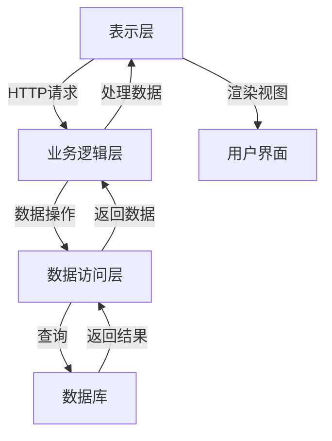

# 电子商务网站详细设计与具体代码实现

## 1. 背景介绍

随着互联网和移动技术的快速发展,电子商务已经成为一种主流的商业模式。电子商务网站作为企业与客户之间的重要桥梁,其设计和实现对于提供优质的用户体验、促进销售和建立品牌形象至关重要。本文将深入探讨电子商务网站的详细设计和具体代码实现,为读者提供一个全面的指南。

## 2. 核心概念与联系

在设计和实现电子商务网站之前,需要了解以下几个核心概念及其相互关系:

### 2.1 用户体验 (User Experience, UX)

用户体验是指用户在与产品或服务进行交互时的感受和体验。良好的用户体验可以提高用户满意度、增强品牌忠诚度,并最终促进销售。在电子商务网站中,用户体验涉及多个方面,包括网站设计、导航、搜索功能、购物车和结账流程等。

### 2.2 用户界面 (User Interface, UI)

用户界面是用户与产品或服务进行交互的视觉表现形式。它是用户体验的重要组成部分,直接影响用户对网站的第一印象和使用体验。在电子商务网站中,用户界面包括网站布局、颜色、字体、图像和交互元素等。

### 2.3 功能性

功能性是指电子商务网站提供的各种功能和特性,如产品展示、搜索、购物车、结账、订单跟踪、会员系统等。这些功能需要与用户体验和用户界面相结合,以提供无缝的购物体验。

### 2.4 可扩展性

可扩展性是指电子商务网站能够适应未来业务增长和技术变革的能力。随着业务规模的扩大和新技术的出现,网站需要具备良好的可扩展性,以便轻松地添加新功能、集成新系统或处理更大的流量。

### 2.5 安全性

安全性是电子商务网站的一个关键因素,涉及用户数据保护、支付安全和系统安全等方面。网站需要采取各种安全措施,如加密技术、身份验证和访问控制,以保护用户隐私和交易安全。

这些核心概念相互关联,共同构建了一个成功的电子商务网站。设计和实现过程中需要权衡和平衡各个方面,以提供卓越的用户体验、强大的功能性、良好的可扩展性和高度的安全性。

## 3. 核心算法原理具体操作步骤

在电子商务网站的设计和实现过程中,涉及多种算法和原理。以下是一些核心算法和原理的具体操作步骤:

### 3.1 推荐系统算法

推荐系统算法用于为用户推荐相关产品或内容,提高用户体验和销售转化率。常见的推荐算法包括协同过滤算法、基于内容的推荐算法和混合推荐算法。

1. **协同过滤算法**
   - 收集用户对产品的评分数据
   - 计算用户之间的相似度
   - 根据相似用户的评分,预测目标用户对未评分产品的可能评分
   - 推荐预测评分高的产品

2. **基于内容的推荐算法**
   - 提取产品的特征向量
   - 计算用户历史喜好与产品特征向量的相似度
   - 推荐与用户喜好相似的产品

3. **混合推荐算法**
   - 结合协同过滤和基于内容的推荐算法
   - 利用两种算法的优势,提高推荐精度

### 3.2 搜索算法

搜索算法用于帮助用户快速找到所需的产品或信息。常见的搜索算法包括全文搜索、模糊搜索和语义搜索等。

1. **全文搜索**
   - 建立倒排索引
   - 根据用户输入的关键词,查找包含这些关键词的文档
   - 根据相关性排序返回结果

2. **模糊搜索**
   - 使用字符串相似度算法(如编辑距离)
   - 查找与用户输入相似的词条
   - 返回相似词条对应的结果

3. **语义搜索**
   - 使用自然语言处理技术
   - 理解用户输入的语义
   - 根据语义匹配相关内容

### 3.3 安全算法

安全算法用于保护用户数据和交易安全。常见的安全算法包括加密算法、哈希算法和数字签名算法等。

1. **加密算法**
   - 使用对称加密算法(如AES)或非对称加密算法(如RSA)
   - 对敏感数据进行加密,防止窃听和篡改

2. **哈希算法**
   - 使用哈希函数(如SHA-256)
   - 对密码等敏感数据进行哈希处理,存储哈希值而非原始数据

3. **数字签名算法**
   - 使用非对称加密算法
   - 发送方对数据进行签名,接收方验证签名
   - 确保数据的完整性和来源可信

这些算法和原理为电子商务网站提供了强大的功能支持,包括个性化推荐、高效搜索和数据安全保护等。在实现过程中,需要根据具体需求选择合适的算法,并进行优化和调整。

## 4. 数学模型和公式详细讲解举例说明

在电子商务网站的设计和实现过程中,数学模型和公式扮演着重要的角色。以下是一些常见的数学模型和公式,以及它们在电子商务中的应用场景。

### 4.1 协同过滤算法中的相似度计算

协同过滤算法是推荐系统中广泛使用的一种技术。它通过计算用户之间的相似度,为目标用户推荐与其相似用户喜欢的产品。常见的相似度计算方法包括余弦相似度、皮尔逊相关系数和调整余弦相似度等。

1. **余弦相似度**

余弦相似度用于计算两个向量之间的夹角余弦值,常用于计算用户之间的相似度。公式如下:

$$\text{sim}(u, v) = \cos(\theta) = \frac{\vec{u} \cdot \vec{v}}{|\vec{u}||\vec{v}|} = \frac{\sum_{i=1}^{n}u_iv_i}{\sqrt{\sum_{i=1}^{n}u_i^2}\sqrt{\sum_{i=1}^{n}v_i^2}}$$

其中,\(\vec{u}\)和\(\vec{v}\)分别表示用户\(u\)和\(v\)的评分向量,\(n\)表示产品数量。

2. **皮尔逊相关系数**

皮尔逊相关系数用于测量两个变量之间的线性相关程度,也可用于计算用户之间的相似度。公式如下:

$$r_{uv} = \frac{\sum_{i=1}^{n}(r_{ui} - \overline{r_u})(r_{vi} - \overline{r_v})}{\sqrt{\sum_{i=1}^{n}(r_{ui} - \overline{r_u})^2}\sqrt{\sum_{i=1}^{n}(r_{vi} - \overline{r_v})^2}}$$

其中,\(r_{ui}\)和\(r_{vi}\)分别表示用户\(u\)和\(v\)对第\(i\)个产品的评分,\(\overline{r_u}\)和\(\overline{r_v}\)分别表示用户\(u\)和\(v\)的平均评分。

### 4.2 搜索算法中的相关性计算

在搜索算法中,相关性计算用于确定文档与查询的匹配程度,从而对搜索结果进行排序。常见的相关性计算方法包括TF-IDF、BM25和语义相似度等。

1. **TF-IDF**

TF-IDF (Term Frequency-Inverse Document Frequency) 是一种常用的相关性计算方法,它考虑了词项在文档中的频率和在整个语料库中的普遍程度。公式如下:

$$\text{tfidf}(t, d, D) = \text{tf}(t, d) \times \text{idf}(t, D)$$

其中,\(\text{tf}(t, d)\)表示词项\(t\)在文档\(d\)中的词频,\(\text{idf}(t, D)\)表示词项\(t\)在语料库\(D\)中的逆文档频率,定义如下:

$$\text{idf}(t, D) = \log \frac{|D|}{|\{d \in D: t \in d\}|}$$

2. **BM25**

BM25是一种改进的相关性计算方法,它考虑了词频、文档长度和查询词的重要性等因素。公式如下:

$$\text{score}(D, Q) = \sum_{i=1}^{n} \text{IDF}(q_i) \times \frac{f(q_i, D) \times (k_1 + 1)}{f(q_i, D) + k_1 \times (1 - b + b \times \frac{|D|}{avgdl})}$$

其中,\(Q\)表示查询,\(q_i\)表示查询中的第\(i\)个词项,\(f(q_i, D)\)表示词项\(q_i\)在文档\(D\)中的词频,\(|D|\)表示文档\(D\)的长度,\(avgdl\)表示语料库中文档的平均长度,\(k_1\)和\(b\)是调节参数。

### 4.3 安全算法中的加密和哈希

在电子商务网站中,加密和哈希算法用于保护用户数据和交易安全。常见的加密算法包括对称加密算法和非对称加密算法,哈希算法则用于生成消息摘要。

1. **对称加密算法**

对称加密算法使用相同的密钥进行加密和解密,常见的算法包括AES、DES等。加密过程如下:

$$C = E_k(P)$$

其中,\(P\)表示明文,\(C\)表示密文,\(E_k\)表示使用密钥\(k\)进行加密的函数。解密过程如下:

$$P = D_k(C)$$

其中,\(D_k\)表示使用密钥\(k\)进行解密的函数。

2. **非对称加密算法**

非对称加密算法使用一对公钥和私钥进行加密和解密,常见的算法包括RSA、ECC等。加密过程如下:

$$C = E_{PK}(P)$$

其中,\(PK\)表示公钥,\(E_{PK}\)表示使用公钥进行加密的函数。解密过程如下:

$$P = D_{SK}(C)$$

其中,\(SK\)表示私钥,\(D_{SK}\)表示使用私钥进行解密的函数。

3. **哈希算法**

哈希算法用于生成消息摘要,常见的算法包括SHA-256、MD5等。哈希过程如下:

$$h = H(M)$$

其中,\(M\)表示输入消息,\(H\)表示哈希函数,\(h\)表示生成的哈希值或消息摘要。

这些数学模型和公式在电子商务网站的设计和实现中扮演着重要的角色,为推荐系统、搜索引擎和安全保护等功能提供了理论基础和计算支持。根据具体需求,可以选择合适的模型和公式,并进行优化和调整,以提高系统的性能和效率。

## 5. 项目实践: 代码实例和详细解释说明

在本节中,我们将通过一个实际的电子商务网站项目,展示代码实现的具体细节。该项目使用Python的Flask Web框架和SQLAlchemy ORM库进行开发,并集成了推荐系统、搜索功能和安全措施等核心功能。

### 5.1 项目架构

该电子商务网站项目采用了经典的三层架构,包括表示层、业务逻辑层和数据访问层。下面是项目的整体架构图:

- **表示层**:负责处理HTTP请求,渲染视图,与用户进行交互。使用Flask框架实现路由、视图函数和模板渲染。
- **业务逻辑层**:实现核心业务逻