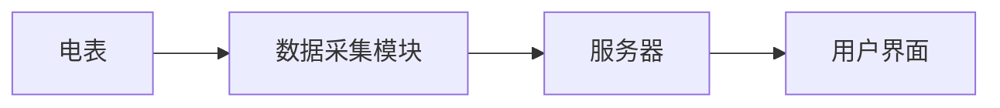

## 1.背景介绍

在现代社会，电力已经成为我们生活中不可或缺的一部分。电表管理系统是电力供应商用来监控、管理和收费的重要工具。它不仅可以实时监控电表的使用情况，还可以进行远程控制，提高电力管理的效率和准确性。

## 2.核心概念与联系

电表管理系统主要由以下几个部分组成：

- **电表**：用于测量电力使用情况的设备。
- **数据采集模块**：负责收集电表的数据，并将其发送到服务器。
- **服务器**：存储和处理从电表收集的数据。
- **用户界面**：供电力供应商进行电表管理的界面。

这些部分之间的联系可以用以下的Mermaid流程图表示：



## 3.核心算法原理具体操作步骤

电表管理系统的核心算法主要包括数据采集、数据处理和数据展示。

1. **数据采集**：数据采集模块周期性地从电表读取数据，并将其发送到服务器。这一步通常使用无线通信技术，如蓝牙或Wi-Fi。
2. **数据处理**：服务器接收到数据后，对其进行处理，包括数据清洗、数据转换和数据分析。
3. **数据展示**：处理后的数据通过用户界面展示给电力供应商，供其进行电表管理。

## 4.数学模型和公式详细讲解举例说明

在电表管理系统中，我们通常会使用一些数学模型和公式来帮助我们进行数据处理和分析。例如，我们可以使用线性回归模型来预测未来的电力使用情况。

线性回归模型的公式为：

$$ Y = aX + b $$

其中，$Y$表示预测的电力使用情况，$X$表示历史的电力使用情况，$a$和$b$是模型的参数，需要通过历史数据进行学习得到。

## 5.项目实践：代码实例和详细解释说明

以下是一个简单的电表管理系统的代码实例：

```python
class ElectricMeter:
    def __init__(self, id, location):
        self.id = id
        self.location = location
        self.data = []

    def collect_data(self):
        # 从电表收集数据的代码
        pass

    def send_data(self, server):
        # 将数据发送到服务器的代码
        pass

class Server:
    def __init__(self):
        self.data = []

    def receive_data(self, data):
        # 接收数据的代码
        pass

    def process_data(self):
        # 处理数据的代码
        pass

class UserInterface:
    def __init__(self, server):
        self.server = server

    def display_data(self):
        # 展示数据的代码
        pass
```

## 6.实际应用场景

电表管理系统在电力供应商中有广泛的应用。例如，它可以帮助电力供应商实时监控电表的使用情况，及时发现异常，提高电力供应的稳定性。此外，通过分析电表的使用数据，电力供应商还可以优化电力分配，提高电力使用的效率。

## 7.工具和资源推荐

以下是一些在开发电表管理系统时可能会用到的工具和资源：

- **Python**：一种广泛用于数据处理和分析的编程语言。
- **Django**：一个用Python编写的开源Web框架，可以用来开发用户界面。
- **MySQL**：一个用于存储和管理数据的数据库系统。
- **Scikit-learn**：一个用Python编写的开源机器学习库，提供了许多用于数据处理和分析的工具。

## 8.总结：未来发展趋势与挑战

随着技术的发展，电表管理系统将会变得更加智能和高效。然而，这也带来了一些挑战，例如如何处理大量的数据，如何保护用户的隐私，以及如何提高系统的稳定性和安全性。

## 9.附录：常见问题与解答

1. **电表管理系统可以远程控制电表吗？**

   是的，一些高级的电表管理系统可以远程控制电表，例如远程断电或调整电力供应。

2. **电表管理系统如何处理数据？**

   电表管理系统通常会使用一些数据处理和分析的算法，例如数据清洗、数据转换和数据分析。

作者：禅与计算机程序设计艺术 / Zen and the Art of Computer Programming