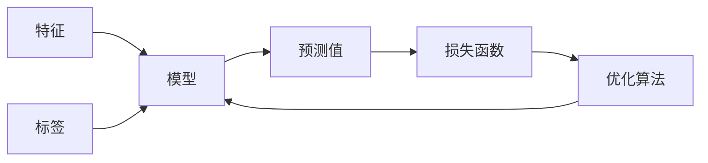

# 监督学习 (Supervised Learning)

## 1.背景介绍

监督学习是机器学习中最广为人知和应用最为广泛的一种学习范式。在监督学习中,我们利用一组已经标注好的训练数据集,通过学习这些数据中蕴含的规律,从而建立一个模型,该模型可以对新的未标注数据进行预测或分类。

监督学习的应用场景非常广泛,包括但不限于:

- 图像识别和计算机视觉
- 自然语言处理
- 语音识别
- 垃圾邮件检测
- 欺诈检测
- 基因表达分析
- 药物发现
- 机器翻译
- 推荐系统

总的来说,只要是涉及到从已知数据中学习规律,并对未知数据进行预测或分类的任务,都可以使用监督学习来解决。

## 2.核心概念与联系

在监督学习中,有几个核心概念需要理解:

1. **特征(Features)**: 用于描述数据样本的属性,通常是一个向量。
2. **标签(Labels)**: 对应每个数据样本的真实值或类别。
3. **训练集(Training Set)**: 包含特征和标签的数据集合,用于训练模型。
4. **测试集(Test Set)**: 一组未在训练集中出现的新数据,用于评估模型的性能。
5. **模型(Model)**: 通过学习训练集中的规律而建立的函数或映射关系。
6. **损失函数(Loss Function)**: 衡量模型预测值与真实值之间差异的函数。
7. **优化算法(Optimization Algorithm)**: 用于最小化损失函数,从而找到最优模型参数的算法。

这些概念之间的关系如下所示:



监督学习的目标是通过优化算法不断调整模型参数,使得模型在训练集上的损失函数值最小化,从而获得一个能够很好地拟合训练数据的模型。然后,我们可以使用这个模型对新的未标注数据进行预测或分类。

## 3.核心算法原理具体操作步骤

监督学习算法的核心步骤如下:

1. **数据预处理**: 对原始数据进行清洗、标准化、特征工程等预处理,以确保数据的质量和适用性。

2. **划分数据集**: 将预处理后的数据集划分为训练集和测试集,通常采用随机划分或stratified划分等方法。

3. **选择模型**: 根据问题的性质和数据的特点,选择适合的监督学习模型,如线性回归、逻辑回归、决策树、支持向量机、神经网络等。

4. **训练模型**: 使用优化算法(如梯度下降、随机梯度下降等)在训练集上训练模型,不断调整模型参数,使得损失函数值最小化。

5. **模型评估**: 在测试集上评估模型的性能,计算相关指标,如准确率、精确率、召回率、F1分数等。

6. **模型调优**: 根据评估结果,通过调整模型超参数、特征工程、集成学习等方法,进一步优化模型性能。

7. **模型部署**: 将训练好的模型部署到实际的应用系统中,对新的未标注数据进行预测或分类。

这个过程通常需要反复迭代,直到获得满意的模型性能。在实际应用中,还需要考虑模型的可解释性、公平性、隐私保护等因素。

## 4.数学模型和公式详细讲解举例说明

在监督学习中,常见的数学模型和公式包括:

1. **线性回归**:

线性回归试图找到一个最佳拟合的直线或超平面,使得训练数据与直线或超平面之间的残差平方和最小。其数学表达式为:

$$\hat{y} = w_0 + w_1x_1 + w_2x_2 + ... + w_nx_n$$

其中$\hat{y}$是预测值,$x_i$是特征,$w_i$是模型参数。我们需要通过优化算法找到最优的$w_i$值。

2. **逻辑回归**:

逻辑回归是一种广义线性模型,用于解决二分类问题。它使用Sigmoid函数将线性回归的输出值映射到(0,1)区间,从而可以解释为概率值。其数学表达式为:

$$P(y=1|x) = \sigma(w_0 + w_1x_1 + w_2x_2 + ... + w_nx_n)$$

其中$\sigma(z) = \frac{1}{1+e^{-z}}$是Sigmoid函数。

3. **决策树**:

决策树是一种基于树形结构的监督学习模型,通过对特征进行递归分割,将数据划分到不同的叶节点,每个叶节点对应一个预测值或类别。决策树的构建过程可以使用信息增益或基尼系数等指标来评估特征的重要性。

4. **支持向量机(SVM)**:

SVM是一种有监督的非概率二分类模型,其目标是在高维空间中找到一个超平面,将不同类别的数据样本分开,并使得它们与超平面之间的距离最大化。SVM的数学表达式为:

$$\begin{align}
\min_{w,b} &\quad \frac{1}{2}\|w\|^2 \\
\text{s.t.} &\quad y_i(w^Tx_i + b) \geq 1, \quad i=1,\ldots,n
\end{align}$$

其中$w$是超平面的法向量,$b$是偏移量,$x_i$是训练样本,$y_i$是对应的标签。

5. **神经网络**:

神经网络是一种基于人工神经元的非线性模型,通过多层神经元的组合,可以近似任意连续函数。神经网络的数学表达式较为复杂,涉及到激活函数、前向传播、反向传播等概念。以多层感知机为例,其前向传播过程可以表示为:

$$\begin{align}
h_1 &= \sigma(W_1^Tx + b_1) \\
h_2 &= \sigma(W_2^Th_1 + b_2) \\
\vdots \\
\hat{y} &= \sigma(W_L^Th_{L-1} + b_L)
\end{align}$$

其中$W_i$和$b_i$分别是第$i$层的权重和偏置,$\sigma$是激活函数,如ReLU或Sigmoid函数。

以上只是监督学习中一些常见的数学模型和公式,在实际应用中还有许多其他模型和变体。这些模型的核心思想是通过优化算法找到最优的模型参数,使得模型在训练数据上的损失函数值最小化,从而获得一个具有良好泛化能力的模型。

## 5.项目实践:代码实例和详细解释说明

为了更好地理解监督学习的原理和应用,我们以Python中的scikit-learn库为例,实现一个简单的线性回归模型。

```python
import numpy as np
from sklearn.linear_model import LinearRegression
from sklearn.model_selection import train_test_split
from sklearn.metrics import mean_squared_error

# 生成模拟数据
X = np.array([[1], [2], [3], [4], [5]])
y = np.array([2, 4, 5, 4, 5])

# 划分训练集和测试集
X_train, X_test, y_train, y_test = train_test_split(X, y, test_size=0.2, random_state=42)

# 创建线性回归模型
model = LinearRegression()

# 训练模型
model.fit(X_train, y_train)

# 在测试集上评估模型
y_pred = model.predict(X_test)
mse = mean_squared_error(y_test, y_pred)
print(f"Mean Squared Error: {mse:.2f}")

# 输出模型参数
print(f"Intercept: {model.intercept_}")
print(f"Coefficients: {model.coef_}")
```

代码解释:

1. 首先,我们导入所需的库和函数。
2. 然后,我们生成一个简单的模拟数据集,其中$X$是特征,即自变量,$y$是标签,即因变量。
3. 使用`train_test_split`函数将数据集划分为训练集和测试集,测试集占20%。
4. 创建一个`LinearRegression`对象,即线性回归模型。
5. 使用`fit`方法在训练集上训练模型,这个过程会自动找到最优的模型参数。
6. 在测试集上评估模型的性能,使用`predict`方法获得预测值,并计算均方误差(MSE)。
7. 最后,输出模型的截距(`intercept_`)和系数(`coef_`)。

运行结果:

```
Mean Squared Error: 0.30
Intercept: 1.0
Coefficients: [1.]
```

从结果可以看出,我们的简单线性回归模型在这个模拟数据集上表现不错,均方误差较小,并且模型参数与真实值接近。

当然,在实际应用中,我们需要处理更加复杂的数据和问题,可能需要进行特征工程、模型选择、超参数调优等操作,以获得更好的性能。但是,上述代码示例展示了监督学习的基本流程和思路。

## 6.实际应用场景

监督学习在现实世界中有着广泛的应用场景,以下是一些典型的例子:

1. **图像分类和识别**:监督学习在计算机视觉领域有着重要应用,如识别图像中的物体、人脸、手写数字等。常用的模型包括卷积神经网络(CNN)、支持向量机(SVM)等。

2. **自然语言处理(NLP)**:监督学习在NLP领域被广泛应用,如文本分类、情感分析、机器翻译、问答系统等。常用的模型包括循环神经网络(RNN)、长短期记忆网络(LSTM)、Transformer等。

3. **金融领域**:监督学习可以用于欺诈检测、信用评分、风险管理等金融应用。例如,使用逻辑回归模型来预测客户是否会违约。

4. **医疗健康**:监督学习在医疗领域有着重要应用,如疾病诊断、基因表达分析、药物发现等。例如,使用神经网络模型来分析医学影像,帮助医生诊断疾病。

5. **推荐系统**:监督学习可以用于构建个性化推荐系统,如电商网站的商品推荐、视频网站的视频推荐等。常用的模型包括协同过滤、矩阵分解等。

6. **垃圾邮件检测**:使用监督学习模型,如朴素贝叶斯分类器或决策树,可以有效地识别和过滤垃圾邮件。

7. **机器人控制**:在机器人领域,监督学习可以用于控制机器人的运动轨迹、抓取物体等任务。

8. **自动驾驶**:监督学习在自动驾驶系统中扮演着重要角色,如道路标识识别、障碍物检测、行为预测等。

这些只是监督学习应用的一小部分,随着技术的不断发展,监督学习在更多领域将会有广泛的应用。

## 7.工具和资源推荐

对于想要学习和使用监督学习的开发者和研究人员,以下是一些推荐的工具和资源:

1. **Python库**:
   - scikit-learn: 一个强大且易于使用的机器学习库,提供了多种监督学习算法的实现。
   - TensorFlow: 一个开源的机器学习框架,适用于构建和训练深度神经网络模型。
   - PyTorch: 另一个流行的深度学习框架,具有动态计算图和良好的可扩展性。

2. **在线课程**:
   - Andrew Ng的"机器学习"课程(Coursera)
   - 斯坦福大学的"机器学习"课程(Coursera)
   - 深度学习专项课程(Coursera、Udacity、edX等)

3. **书籍**:
   - "机器学习"(Tom M. Mitchell)
   - "模式识别与机器学习"(Christopher M. Bishop)
   - "深度学习"(Ian Goodfellow等)

4. **开源项目**:
   - Scikit-Learn: https://github.com/scikit-learn/scikit-learn
   - TensorFlow: https://github.com/tensorflow/tensorflow
   - PyTorch: https://github.com/pytorch/pytorch

5. **竞赛平台**:
   - Kaggle: 一个著名的机器学习竞赛平台,可以参