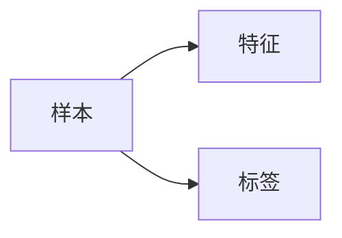
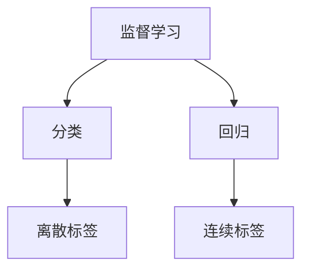
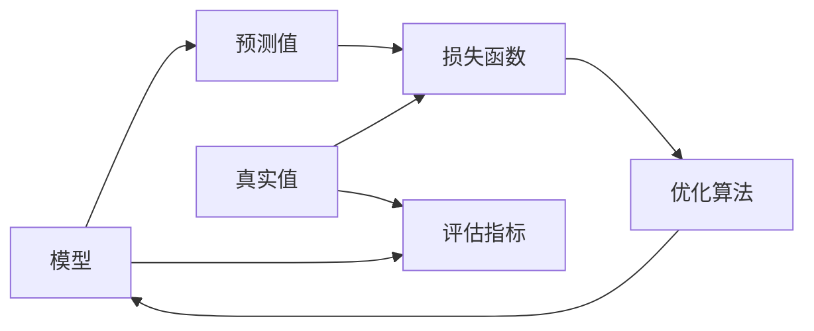

# 监督学习 原理与代码实例讲解

## 1. 背景介绍

### 1.1 监督学习的定义与特点
监督学习(Supervised Learning)是机器学习中的一个重要分支,它通过已标记的训练数据来训练模型,使模型能够对新的未见过的数据做出正确的预测或分类。监督学习的核心思想是通过学习已知答案的样本,总结出一个模型,再利用这个模型对未知答案的新样本进行预测。

监督学习的主要特点包括:
1. 训练数据是带标签的,即每个样本都有对应的正确答案
2. 训练过程是有指导的,模型通过不断尝试修正参数,使预测结果尽可能接近真实标签
3. 模型训练完成后,可以对新的未知数据做出预测

### 1.2 监督学习的应用场景
监督学习在实际应用中非常广泛,典型的应用场景包括:
- 图像识别与分类:如人脸识别、手写数字识别等
- 自然语言处理:如情感分析、文本分类、命名实体识别等 
- 语音识别:将语音信号转换为对应的文本
- 医疗诊断:通过医学影像或生理指标预测疾病
- 垃圾邮件检测:判断一封邮件是否为垃圾邮件
- 金融风控:预测用户是否有违约、欺诈等风险

### 1.3 监督学习与无监督学习、强化学习的区别
除了监督学习,机器学习的另外两个重要分支是无监督学习(Unsupervised Learning)和强化学习(Reinforcement Learning)。它们之间的主要区别在于:

- 监督学习:训练数据带标签,目标是学习输入到输出的映射关系
- 无监督学习:训练数据没有标签,目标是发现数据内在的结构和规律
- 强化学习:通过智能体(Agent)与环境的交互,根据反馈的奖励或惩罚来优化决策

## 2. 核心概念与联系

### 2.1 样本、特征与标签
在监督学习中,训练数据由样本(Sample)组成,每个样本包含特征(Feature)和标签(Label)两部分:
- 特征:描述样本属性的一组观测值,通常用特征向量表示
- 标签:样本的真实答案,可以是离散值(分类)或连续值(回归)

样本、特征和标签的关系可以用下面的 Mermaid 图来表示:

### 2.2 分类与回归任务
监督学习可以分为分类(Classification)和回归(Regression)两大类任务:
- 分类:标签是离散的类别,如二分类和多分类问题
- 回归:标签是连续的实数,如预测房价、股票价格等

分类和回归任务的区别可以用下面的 Mermaid 图来表示:

### 2.3 损失函数、优化算法与评估指标
监督学习的训练过程就是通过优化模型参数,使损失函数最小化。其中涉及到几个关键概念:
- 损失函数(Loss Function):衡量模型预测值与真实值之间的差距,常见的有均方误差、交叉熵等
- 优化算法(Optimization Algorithm):通过迭代的方式更新模型参数,使损失函数下降,如梯度下降法
- 评估指标(Evaluation Metric):衡量模型在测试集上的性能,如准确率、精确率、召回率、F1分数等

损失函数、优化算法和评估指标的关系可以用下面的 Mermaid 图来表示:

## 3. 核心算法原理具体操作步骤

### 3.1 线性回归
线性回归(Linear Regression)是一种简单但非常实用的监督学习算法,用于处理连续型标签的回归问题。其基本思想是找到一个线性函数,使得预测值与真实值之间的误差平方和最小。

线性回归的具体步骤如下:
1. 准备训练数据,包括特征矩阵 $X$ 和标签向量 $y$
2. 初始化模型参数 $w$ 和 $b$,通常初始化为 0
3. 定义损失函数,常用的是均方误差(Mean Squared Error,MSE):
$$
J(w,b) = \frac{1}{2m}\sum_{i=1}^m(f_{w,b}(x^{(i)})-y^{(i)})^2
$$
其中 $f_{w,b}(x)=wx+b$ 是线性函数,$m$ 是样本数。
4. 使用梯度下降法更新参数 $w$ 和 $b$,直到损失函数收敛或达到最大迭代次数:
$$
w := w - \alpha \frac{\partial J(w,b)}{\partial w} \\
b := b - \alpha \frac{\partial J(w,b)}{\partial b}
$$
其中 $\alpha$ 是学习率。
5. 使用训练好的模型对新样本做预测:$\hat{y} = f_{w,b}(x)$

### 3.2 Logistic 回归
Logistic 回归是一种常用的二分类算法,它将线性函数的输出值映射到 0~1 之间,得到样本属于正类的概率。当概率大于 0.5 时预测为正类,否则预测为负类。

Logistic 回归的具体步骤如下:
1. 准备训练数据,包括特征矩阵 $X$ 和标签向量 $y \in \{0,1\}$
2. 初始化模型参数 $w$ 和 $b$,通常初始化为 0  
3. 定义 Sigmoid 函数:
$$
g(z) = \frac{1}{1+e^{-z}}
$$
4. 定义损失函数,常用的是交叉熵(Cross Entropy):
$$
J(w,b)=-\frac{1}{m}\sum_{i=1}^m[y^{(i)}\log(f_{w,b}(x^{(i)}))+(1-y^{(i)})\log(1-f_{w,b}(x^{(i)}))]
$$
其中 $f_{w,b}(x)=g(wx+b)$ 是 Logistic 函数。
5. 使用梯度下降法更新参数 $w$ 和 $b$,直到损失函数收敛或达到最大迭代次数
6. 使用训练好的模型对新样本做预测:如果 $f_{w,b}(x) \geq 0.5$,则预测为正类,否则预测为负类

### 3.3 支持向量机
支持向量机(Support Vector Machine,SVM)是一种经典的二分类算法,它的目标是找到一个最大间隔的超平面,使得两个类别的样本能够被超平面很好地分开。支持向量机不仅能处理线性可分的情况,还可以用核技巧处理非线性分类问题。

线性支持向量机的具体步骤如下:
1. 准备训练数据,包括特征矩阵 $X$ 和标签向量 $y \in \{-1,+1\}$
2. 定义决策函数:$f(x)=w^Tx+b$,如果 $f(x) \geq 0$ 则预测为正类,否则预测为负类
3. 定义优化目标,使得两个类别的支持向量到超平面的距离之和最大化:
$$
\max_{w,b} \frac{2}{\|w\|} \\
s.t. \quad y^{(i)}(w^Tx^{(i)}+b) \geq 1, \quad i=1,2,...,m
$$
4. 将原始问题转化为对偶问题求解,得到最优的 $w^*$ 和 $b^*$
5. 使用训练好的模型对新样本做预测:如果 $f(x) \geq 0$,则预测为正类,否则预测为负类

对于非线性支持向量机,只需在计算内积时使用核函数 $K(x,z)$ 替代即可,常用的核函数有多项式核、高斯核(RBF)等。

## 4. 数学模型和公式详细讲解举例说明

### 4.1 线性回归的推导与求解
对于线性回归 $f_{w,b}(x)=wx+b$,我们的目标是最小化均方误差损失函数:
$$
J(w,b) = \frac{1}{2m}\sum_{i=1}^m(f_{w,b}(x^{(i)})-y^{(i)})^2
$$
将 $f_{w,b}(x)=wx+b$ 代入,并对 $w$ 和 $b$ 求偏导,可得:
$$
\frac{\partial J(w,b)}{\partial w} = \frac{1}{m}\sum_{i=1}^m(f_{w,b}(x^{(i)})-y^{(i)})x^{(i)} \\
\frac{\partial J(w,b)}{\partial b} = \frac{1}{m}\sum_{i=1}^m(f_{w,b}(x^{(i)})-y^{(i)}) 
$$
使用梯度下降法,不断更新 $w$ 和 $b$ 直到收敛:
$$
w := w - \alpha \frac{1}{m}\sum_{i=1}^m(f_{w,b}(x^{(i)})-y^{(i)})x^{(i)} \\
b := b - \alpha \frac{1}{m}\sum_{i=1}^m(f_{w,b}(x^{(i)})-y^{(i)})
$$
其中 $\alpha$ 是学习率,控制每次更新的步长。

举个例子,假设我们要根据房屋面积预测房价,已知如下训练数据:

| 面积($m^2$) | 价格(万元) |
|------------|-----------|
| 90         | 300       |
| 80         | 280       |
| 70         | 250       | 
| 100        | 350       |
| 60         | 220       |

我们令 $x^{(i)}$ 表示第 $i$ 个样本的面积,$y^{(i)}$ 表示第 $i$ 个样本的价格,则特征矩阵 $X$ 和标签向量 $y$ 分别为:
$$
X=\left[ \begin{matrix} 90\\80\\70\\100\\60 \end{matrix} \right], \quad
y=\left[ \begin{matrix} 300\\280\\250\\350\\220 \end{matrix} \right]
$$
假设初始化 $w=0,b=0$,学习率 $\alpha=0.0001$,最大迭代次数为 1000,则每次迭代时的损失函数值如下图所示:

最终得到的最优参数为 $w=3.506,b=-16.62$,即房价与面积的线性关系为:
$$
price = 3.506 \times area - 16.62
$$

### 4.2 Logistic 回归的推导与求解
对于 Logistic 回归,我们的目标是最小化交叉熵损失函数:
$$
J(w,b)=-\frac{1}{m}\sum_{i=1}^m[y^{(i)}\log(f_{w,b}(x^{(i)}))+(1-y^{(i)})\log(1-f_{w,b}(x^{(i)}))]
$$
其中 $f_{w,b}(x)=g(wx+b)=\frac{1}{1+e^{-(wx+b)}}$ 是 Logistic 函数。

将 $f_{w,b}(x)$ 代入损失函数,并对 $w$ 和 $b$ 求偏导,可得:
$$
\frac{\partial J(w,b)}{\partial w} = \frac{1}{m}\sum_{i=1}^m(f_{w,b}(x^{(i)})-y^{(i)})x^{(i)} \\
\frac{\partial J(w,b)}{\partial b} = \frac{1}{m}\sum_{i=1}^m(f_{w,b}(x^{(i)})-y^{(i)})
$$
使用梯度下降法,不断更新 $w$ 和 $b$ 直到收敛:
$$
w := w - \alpha \frac{1}{m}\sum_{i=1}^m(f_{w,b}(x^{(i)})-y^{(i)})x^{(i)} \\
b := b - \alpha \frac{1}{m}\sum_{i=1}^m(f_{w,b}(x^{(i)})-y^{(i)})
$$

举个例子,假设我们要根据学生的两门考试成绩预测其是否被大学录取,已知