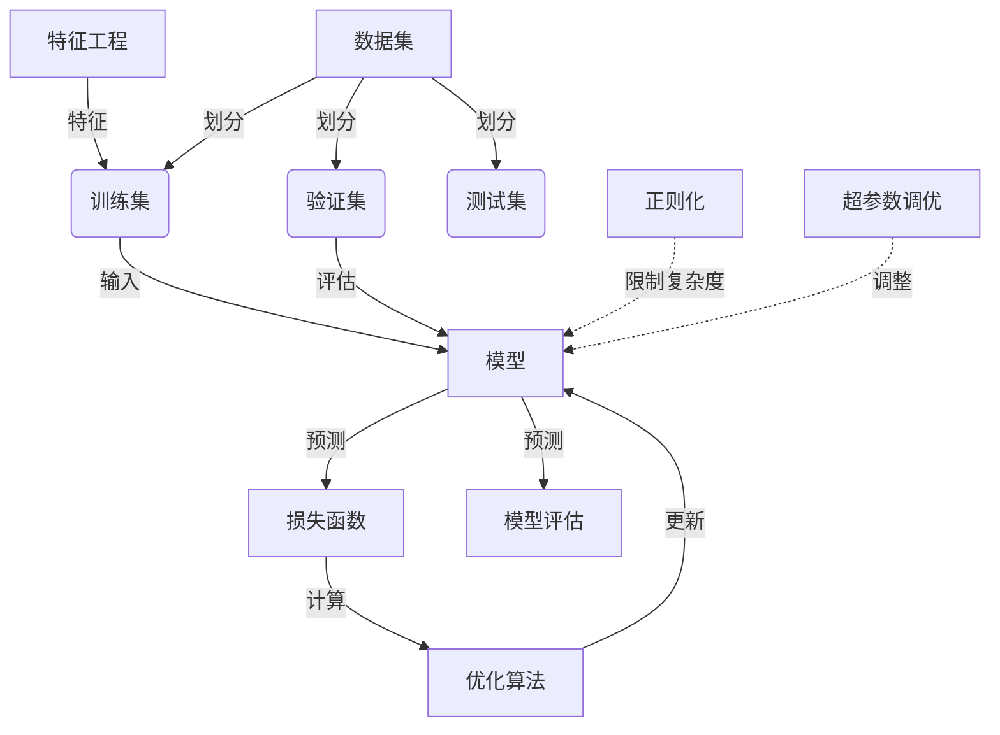

# 监督学习原理与代码实例讲解

## 1. 背景介绍

监督学习是机器学习中最常见和最成熟的一种范式。它通过从标注的训练数据中学习出一个映射函数,从而能够对新的输入数据做出预测或决策。监督学习广泛应用于分类、回归、序列生成等各种任务中。

监督学习的关键在于利用大量高质量的标注数据训练模型。这些数据由人工标注或通过某些可靠的程序生成,每个数据实例都有对应的正确答案或目标值。模型的目标是从训练数据中学习出一个能够概括训练数据规律并很好地适用于新数据的函数映射。

### 1.1 监督学习的任务类型

监督学习主要分为以下几种任务类型:

- **分类 (Classification)**: 将输入实例划分到有限的离散类别中。常见的二分类和多分类问题都属于这一范畴,如垃圾邮件分类、图像识别等。

- **回归 (Regression)**: 基于输入实例预测一个连续的数值输出。常见的应用包括房价预测、销量预测等。

- **序列生成 (Sequence Generation)**: 输入一个序列,生成另一个相关的序列作为输出。机器翻译、文本摘要等都属于这一类型。

- **结构化预测 (Structured Prediction)**: 同时预测结构化对象的多个相互关联的输出。如图像分割、语音识别等。

### 1.2 监督学习的优缺点

优点:

- 直观易懂,有明确的学习目标
- 在大量标注数据的支持下,性能通常较好
- 算法成熟,工程应用广泛

缺点: 

- 需要大量的高质量标注数据,获取成本高
- 只能学习训练数据覆盖的知识,无法举一反三
- 算法性能受训练数据质量和分布的限制

## 2. 核心概念与联系

监督学习的核心概念主要包括:

1. **数据集 (Dataset)**: 由输入实例和对应标签组成的数据集合。通常划分为训练集、验证集和测试集。

2. **模型 (Model)**: 学习到的能够从输入映射到输出的函数或者结构。

3. **损失函数 (Loss Function)**: 用于衡量模型预测和真实标签之间的差异程度。

4. **优化算法 (Optimization Algorithm)**: 通过迭代优化损失函数,学习出最优模型参数的算法。

5. **过拟合与欠拟合 (Overfitting & Underfitting)**: 模型在训练数据上表现良好但在新数据上表现差的现象称为过拟合;反之则是欠拟合。

6. **正则化 (Regularization)**: 通过限制模型复杂度来防止过拟合的一系列技术。

7. **特征工程 (Feature Engineering)**: 从原始数据中提取有意义的特征,对模型性能影响重大。

8. **模型评估 (Model Evaluation)**: 使用各种评估指标衡量模型在测试数据上的实际性能表现。

9. **超参数调优 (Hyperparameter Tuning)**: 通过搜索最优超参数组合来提升模型性能。

这些核心概念相互关联、环环相扣,共同构建了监督学习的理论框架和实践流程。



## 3. 核心算法原理具体操作步骤

监督学习的核心算法原理可以概括为以下几个步骤:

1. **数据预处理**:
    - 清洗和标准化数据,处理缺失值等
    - 将数据集划分为训练集、验证集和测试集
    - 对数据进行特征工程,提取有意义的特征

2. **选择模型和损失函数**:
    - 根据任务类型选择合适的模型,如线性模型、决策树、神经网络等
    - 选择合适的损失函数,如交叉熵损失、均方误差等

3. **模型训练**:
    - 使用优化算法(如梯度下降)在训练集上优化模型参数
    - 以损失函数的值作为模型优化的反馈信号
    - 可使用验证集对模型进行评估,防止过拟合

4. **模型调优**:
    - 使用正则化技术限制模型复杂度,防止过拟合
    - 进行超参数调优,寻找最优超参数组合
    - 根据评估指标反复调整模型和超参数

5. **模型评估**:
    - 在保留的测试集上评估模型的实际性能
    - 使用合适的评估指标,如准确率、F1分数、均方根误差等

6. **模型部署**:
    - 将训练好的模型应用到实际任务或者系统中
    - 监控模型在线运行状态,持续优化和改进模型

这个过程是循环迭代的,需要根据具体任务进行多次试验和调优,以获得最佳性能。

## 4. 数学模型和公式详细讲解举例说明

监督学习算法通常基于数学模型和公式,这些公式描述了模型如何从数据中学习,以及如何评估模型性能。以下是一些常见的数学模型和公式:

### 4.1 线性回归

线性回归是最基础和常见的回归模型之一,其数学形式为:

$$y = w_0 + w_1x_1 + w_2x_2 + ... + w_nx_n$$

其中 $y$ 是预测的目标值, $x_i$ 是输入特征, $w_i$ 是对应的权重系数。

线性回归的目标是找到一组最优权重 $w$,使得预测值 $y$ 与真实值 $\hat{y}$ 之间的差异最小化。通常使用均方误差(MSE)作为损失函数:

$$\text{MSE}(w) = \frac{1}{N}\sum_{i=1}^N(y_i - \hat{y}_i)^2$$

可以使用最小二乘法或梯度下降法来优化权重 $w$,从而获得最优的线性回归模型。

### 4.2 logistic 回归

对于二分类问题,我们通常使用 logistic 回归模型,其数学形式为:

$$y = \sigma(w_0 + w_1x_1 + w_2x_2 + ... + w_nx_n)$$

其中 $\sigma(x) = \frac{1}{1 + e^{-x}}$ 是 Sigmoid 函数,将线性模型的输出映射到 (0,1) 范围内,作为概率值的预测。

Logistic 回归的损失函数通常使用交叉熵损失:

$$\text{Loss}(w) = -\frac{1}{N}\sum_{i=1}^N[y_i\log(\hat{y}_i}) + (1-y_i)\log(1-\hat{y}_i)]$$

其中 $y_i$ 是实际标签(0或1), $\hat{y}_i$ 是模型预测的概率值。

### 4.3 softmax 回归

对于多分类问题,我们使用 softmax 回归模型,其数学形式为:

$$\hat{y}_k = \frac{e^{w_k^Tx}}{\sum_{j=1}^K e^{w_j^Tx}}$$

其中 $\hat{y}_k$ 表示样本 $x$ 属于第 $k$ 类的预测概率, $w_k$ 是第 $k$ 类的权重向量, $K$ 是总类别数。

Softmax 回归的交叉熵损失函数为:

$$\text{Loss}(W) = -\frac{1}{N}\sum_{i=1}^N\sum_{k=1}^Ky_k^{(i)}\log(\hat{y}_k^{(i)})$$

其中 $y_k^{(i)}$ 是样本 $i$ 的真实标签,如果属于第 $k$ 类则为1,否则为0。

通过最小化损失函数,我们可以学习到最优的权重矩阵 $W$,从而获得分类器模型。

### 4.4 支持向量机 (SVM)

支持向量机是一种常用的分类模型,其基本思想是找到一个最大边界超平面,将不同类别的样本分开。

对于线性可分的情况,支持向量机的目标是最大化几何间隔 $\gamma$:

$$\gamma = \frac{2}{\|w\|}$$

这等价于最小化 $\|w\|^2/2$,同时满足约束条件:

$$y_i(w^Tx_i + b) \geq 1, \quad i=1,2,...,N$$

通过拉格朗日乘子法,我们可以将其转化为对偶形式,从而求解最优 $w$ 和 $b$。

对于非线性情况,我们可以使用核技巧,将样本映射到高维特征空间,从而获得非线性决策边界。

### 4.5 评估指标

常用的监督学习模型评估指标包括:

- **准确率 (Accuracy)**: 正确预测的样本数占总样本数的比例。
- **精确率 (Precision)**: 被预测为正例的样本中实际为正例的比例。
- **召回率 (Recall)**: 实际为正例的样本中被正确预测为正例的比例。
- **F1 分数**: 精确率和召回率的调和平均数。
- **ROC 曲线和 AUC**: 描绘真正例率和假正例率的变化曲线,曲线下面积即 AUC 值。
- **均方根误差 (RMSE)**: 对于回归问题,预测值与真实值之间的均方根误差。

不同的任务类型和应用场景需要选择合适的评估指标。

以上是监督学习中一些常见的数学模型和公式,掌握这些基础知识对于理解和应用监督学习算法至关重要。在实践中,我们还需要结合具体问题和数据特点,选择合适的模型、损失函数和优化算法。

## 5. 项目实践:代码实例和详细解释说明

为了更好地理解监督学习的原理和实践,我们将通过一个实际案例来讲解相关代码。这个案例是基于 Python 和 Scikit-learn 机器学习库实现的。

### 5.1 案例背景

我们将使用著名的 Iris 数据集作为示例,这是一个常用的分类数据集。该数据集包含 150 个样本,每个样本有 4 个特征:花萼长度、花萼宽度、花瓣长度和花瓣宽度。我们需要根据这些特征将鸢尾花分为三个品种:Setosa、Versicolour 和 Virginica。

### 5.2 数据加载和预处理

```python
from sklearn.datasets import load_iris
from sklearn.model_selection import train_test_split

# 加载数据集
iris = load_iris()
X, y = iris.data, iris.target

# 划分训练集和测试集
X_train, X_test, y_train, y_test = train_test_split(X, y, test_size=0.2, random_state=42)
```

我们首先从 Scikit-learn 加载 Iris 数据集,并将其划分为训练集和测试集。`X` 是特征矩阵,`y` 是标签向量。`train_test_split` 函数将数据集随机划分为训练集和测试集,其中 20% 的数据作为测试集。

### 5.3 模型训练

```python
from sklearn.linear_model import LogisticRegression

# 创建 Logistic 回归模型
clf = LogisticRegression(multi_class='ovr', solver='liblinear')

# 训练模型
clf.fit(X_train, y_train)
```

我们选择使用 Logistic 回归模型进行多分类。`LogisticRegression` 类提供了一种 "one-vs-rest" 的策略来处理多分类问题。`solver` 参数指定了优化算法,这里我们使用 `liblinear` 库。

`fit` 函数用于在训练集上训练模型,学习出最优的权重参数。

### 5.4 模型评估

```python
from sklearn.metrics import accuracy_score, classification_report

# 在测试集上评估模型
y_pred = clf.predict(X_test)
acc = accuracy_score(y_test, y_pred)
print("Accuracy:", acc)

# 输出分类报