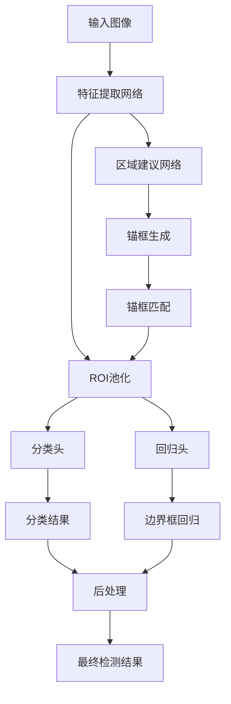
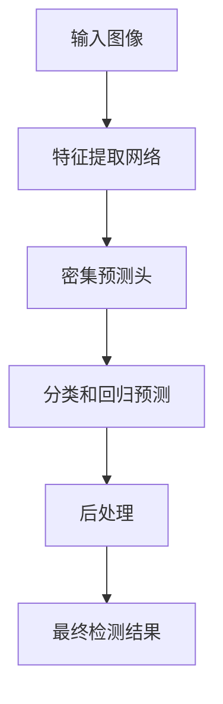

# 目标检测中的锚框机制和预测头设计

## 1. 背景介绍

在计算机视觉领域,目标检测是一项极具挑战性的任务,旨在定位图像中感兴趣的对象并对其进行分类。随着深度学习技术的不断发展,基于卷积神经网络(CNN)的目标检测算法取得了长足进展。其中,锚框(Anchor Box)机制和预测头(Prediction Head)设计是目标检测算法中两个关键组成部分。

### 1.1 目标检测的重要性

目标检测广泛应用于计算机视觉的各个领域,如自动驾驶、视频监控、人脸识别等。准确高效的目标检测算法不仅能够提高系统的性能,还能为更高级的视觉任务奠定基础。

### 1.2 传统目标检测方法的局限性

在深度学习时代之前,传统的目标检测算法主要依赖手工设计的特征提取器和滑动窗口机制。这些方法存在一些固有的缺陷,如鲁棒性差、计算效率低下、难以捕捉复杂的目标等。

## 2. 核心概念与联系

### 2.1 锚框机制

锚框机制是目标检测算法中一种常用的技术,它通过预先定义一组锚框(Anchor Box),并在图像上密集采样,从而生成大量的候选区域。每个锚框都对应一个预测值,用于判断该区域是否包含目标对象,以及对象的类别和位置。

锚框的设计对算法的性能有着重要影响。一般来说,锚框的数量、形状、比例和尺度等参数需要根据具体的数据集和任务进行调整和优化。

#### 2.1.1 锚框的生成

锚框通常在图像的每个位置进行密集采样,形成一个密集的锚框网格。常见的锚框生成策略包括:

- 平铺锚框(Anchor Tiling)
- 滑动窗口(Sliding Window)
- 基于特征图的锚框生成

#### 2.1.2 锚框的匹配

为了训练目标检测模型,需要将锚框与ground truth边界框进行匹配。常用的匹配策略包括:

- 最大交并比(Intersection over Union, IoU)匹配
- 最大覆盖率(Coverage Rate)匹配

#### 2.1.3 锚框机制的优缺点

优点:

- 提高了对目标的召回率
- 简化了模型的训练和预测过程

缺点:

- 生成大量冗余的锚框,增加了计算开销
- 锚框设计需要人工调参,难以完全适应所有场景

### 2.2 预测头设计

预测头是目标检测网络的输出部分,它基于特征图预测目标的类别、位置和其他属性。预测头的设计直接影响着模型的性能和效率。

#### 2.2.1 分类头和回归头

传统的预测头通常包括两个并行的子网络:

- 分类头(Classification Head):预测每个锚框内是否包含目标对象,以及对象的类别。
- 回归头(Regression Head):预测目标对象的位置和大小,通常采用边界框回归(Bounding Box Regression)的方式。

#### 2.2.2 多任务损失函数

为了同时优化分类和回归任务,通常采用多任务损失函数,如:

$$
L = L_{cls} + \lambda L_{reg}
$$

其中,$ L_{cls} $是分类损失,$ L_{reg} $是回归损失,$ \lambda $是平衡两个任务的超参数。

#### 2.2.3 预测头的设计变体

除了传统的分类头和回归头之外,还有一些预测头的设计变体,如:

- 基于密集预测的预测头
- 基于关键点的预测头
- 基于掩码的预测头

这些变体旨在改善模型在特定场景下的性能,如处理密集目标、非规则形状的目标等。

## 3. 核心算法原理具体操作步骤

### 3.1 基于锚框的目标检测算法流程

基于锚框的目标检测算法通常包括以下步骤:

1. **特征提取**:使用卷积神经网络从输入图像中提取特征图。
2. **锚框生成**:在特征图上密集采样一组锚框。
3. **锚框匹配**:将锚框与ground truth边界框进行匹配,确定正负样本。
4. **预测头**:基于特征图和锚框,预测每个锚框内是否包含目标对象、对象的类别和位置。
5. **后处理**:执行非极大值抑制(Non-Maximum Suppression, NMS)等后处理操作,去除冗余的检测结果。

#### 3.1.1 Faster R-CNN算法流程

Faster R-CNN是一种经典的基于锚框的目标检测算法,其流程如下:



### 3.2 基于密集预测的目标检测算法流程

基于密集预测的算法(如YOLO和SSD)采用了不同的方式,它们直接在特征图上进行密集预测,而不依赖于锚框机制。



## 4. 数学模型和公式详细讲解举例说明

### 4.1 锚框匹配策略

#### 4.1.1 最大交并比(IoU)匹配

最大交并比(IoU)是一种常用的锚框匹配策略。对于每个锚框,计算它与所有ground truth边界框的IoU,并选择IoU最大的那个作为正样本。

IoU的计算公式如下:

$$
IoU(b_1, b_2) = \frac{area(b_1 \cap b_2)}{area(b_1 \cup b_2)}
$$

其中,$ b_1 $和$ b_2 $分别表示两个边界框。

通常会设置两个阈值$ \tau_{pos} $和$ \tau_{neg} $,当$ IoU > \tau_{pos} $时,将锚框视为正样本;当$ IoU < \tau_{neg} $时,将锚框视为负样本。

#### 4.1.2 最大覆盖率匹配

最大覆盖率匹配策略考虑了锚框与ground truth边界框的相对位置关系。对于每个ground truth边界框,选择与之重叠面积最大的锚框作为正样本。

覆盖率的计算公式如下:

$$
Coverage(a, b) = \frac{area(a \cap b)}{area(b)}
$$

其中,$ a $表示锚框,$ b $表示ground truth边界框。

### 4.2 边界框回归

边界框回归是预测头中回归头的核心任务,它旨在从锚框出发,预测出更加精确的目标边界框。

常用的边界框回归方法包括:

- 基于中心点和宽高的参数化
- 基于四个坐标值的参数化

以基于中心点和宽高的参数化为例,预测值$ (t_x, t_y, t_w, t_h) $与ground truth的映射关系如下:

$$
\begin{aligned}
b_x &= p_w a_x + t_x \\
b_y &= p_h a_y + t_y \\
b_w &= p_w e^{t_w} \\
b_h &= p_h e^{t_h}
\end{aligned}
$$

其中,$ (a_x, a_y, a_w, a_h) $表示锚框的中心坐标、宽度和高度,$ (b_x, b_y, b_w, b_h) $表示预测的边界框,$ (p_w, p_h) $是用于调节回归范围的超参数。

通过优化回归损失函数,可以学习到更加精确的边界框预测值。

### 4.3 非极大值抑制(NMS)

非极大值抑制是目标检测算法中的一种后处理技术,用于去除重叠的冗余检测结果。

NMS的基本思路是:对于每个类别,按照置信度从高到低排序,然后逐个选择置信度最高的检测结果,并移除与之重叠程度较高的其他检测结果。

具体操作步骤如下:

1. 对所有检测结果按照置信度从高到低排序。
2. 选择置信度最高的检测结果$ b_1 $,将其加入最终结果集。
3. 计算其他检测结果$ b_i $与$ b_1 $的IoU,如果$ IoU(b_i, b_1) > \tau_{nms} $,则移除$ b_i $。
4. 重复步骤2和3,直到所有检测结果都被处理完毕。

其中,$ \tau_{nms} $是一个预设的IoU阈值,通常取值在0.5到0.7之间。

## 5. 项目实践:代码实例和详细解释说明

下面以PyTorch实现的Faster R-CNN为例,展示锚框机制和预测头的具体代码实现。

### 5.1 锚框生成

```python
import torch

def generate_anchors(base_size=16, ratios=[0.5, 1, 2], scales=2**np.arange(3, 6)):
    """
    生成锚框
    :param base_size: 基准锚框的大小
    :param ratios: 锚框的宽高比
    :param scales: 锚框的缩放比例
    :return: 锚框张量
    """
    anchor_ratios = [(1., 1.)] + list(ratios)
    anchor_scales = [1.] + list(scales)

    anchors = []
    for ratio in anchor_ratios:
        for scale in anchor_scales:
            w = base_size * ratio[0] * scale
            h = base_size * ratio[1] * scale
            x_ctr = 0.5 * (w - 1)
            y_ctr = 0.5 * (h - 1)
            anchors.append([x_ctr, y_ctr, w, h])

    anchors = torch.tensor(anchors, dtype=torch.float32)
    return anchors
```

这段代码定义了一个`generate_anchors`函数,用于生成锚框。它接受三个参数:基准锚框大小`base_size`、锚框宽高比`ratios`和缩放比例`scales`。函数返回一个包含所有锚框的张量。

锚框的生成过程如下:

1. 初始化锚框宽高比`anchor_ratios`和缩放比例`anchor_scales`。
2. 遍历所有的宽高比和缩放比例组合。
3. 计算每个锚框的宽度`w`、高度`h`、中心点坐标`x_ctr`和`y_ctr`。
4. 将锚框的参数存储在`anchors`列表中。
5. 将`anchors`列表转换为PyTorch张量,并返回。

### 5.2 锚框匹配

```python
def anchor_target(anchors, gt_boxes, image_size, rpn_batch_size=-1):
    """
    对锚框和ground truth边界框进行匹配
    :param anchors: 锚框张量
    :param gt_boxes: ground truth边界框张量
    :param image_size: 图像大小
    :param rpn_batch_size: RPN批次大小
    :return: 匹配结果张量
    """
    anchor_scales = anchors.shape[0]
    anchor_ratios = anchors.shape[1]
    feat_strides = anchors.shape[2]

    # 计算锚框与ground truth边界框的IoU
    ious = box_iou(anchors, gt_boxes)

    # 初始化匹配结果
    match = torch.full((rpn_batch_size, anchor_scales, anchor_ratios, feat_strides), -1, dtype=torch.long)
    gt_match = torch.full((rpn_batch_size, gt_boxes.shape[1]), -1, dtype=torch.long)

    # 匹配策略: 最大IoU匹配
    max_ious, max_gt_idx = ious.max(dim=2)
    gt_max_ious, anchor_idx = ious.max(dim=3)

    for batch_idx in range(rpn_batch_size):
        for gt_idx in range(gt_boxes.shape[1]):
            max_iou = gt_max_ious[batch_idx, gt_idx]
            if max_iou > 0.5:
                match[batch_idx, :, :, anchor_idx[batch_idx, gt_idx]] = gt_idx + 1
                gt_match[batch_idx, gt_idx] = anchor_idx[batch_idx, gt_idx