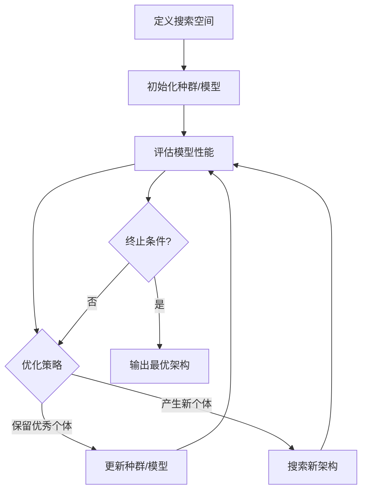

# 神经网络架构搜索NAS原理与代码实战案例讲解

## 1.背景介绍

### 1.1 深度学习的挑战

深度学习在过去几年取得了令人瞩目的成就,但是设计高效的神经网络架构仍然是一个巨大的挑战。传统的神经网络架构设计过程需要大量的人工经验和反复试验,这种方式不仅效率低下,而且很难找到最优的架构。随着深度学习应用的不断扩展,人工设计神经网络架构的方式已经无法满足不断增长的需求。

### 1.2 神经网络架构搜索的兴起

为了解决这一难题,神经网络架构搜索(Neural Architecture Search, NAS)应运而生。NAS的核心思想是将神经网络架构设计自动化,使用机器学习算法从大量可能的架构中搜索出性能最优的神经网络架构。这种自动化的方法不仅可以节省大量的人力和时间成本,而且有望发现人工难以设计的优秀架构。

### 1.3 NAS的重要意义

NAS的出现为解决深度学习中的架构设计问题提供了一种全新的思路。通过NAS,我们可以自动化地探索海量的架构空间,从中发现性能最优的神经网络架构。这不仅可以极大地提高深度学习模型的性能,而且还可以推动深度学习在更多领域的应用。因此,NAS被认为是深度学习领域的一个重要突破,吸引了众多研究人员和工程师的关注。

## 2.核心概念与联系

### 2.1 搜索空间

搜索空间(Search Space)定义了神经网络架构的所有可能的组合。一个合理的搜索空间对于NAS的成功至关重要。搜索空间过小,可能无法找到性能最优的架构;搜索空间过大,则会导致计算代价过高。因此,设计一个合适的搜索空间是NAS的关键挑战之一。

### 2.2 搜索策略

搜索策略(Search Strategy)指导着如何高效地在搜索空间中探索最优的神经网络架构。常见的搜索策略包括随机搜索、演化算法、强化学习和梯度优化等。不同的搜索策略具有不同的优缺点,需要根据具体问题进行选择和调整。

### 2.3 评估指标

评估指标(Evaluation Metric)用于衡量神经网络架构的性能,通常包括模型精度、计算复杂度、内存占用等。不同的应用场景对评估指标有不同的侧重,需要根据具体需求进行权衡和选择。

### 2.4 硬件资源

由于NAS过程需要评估大量的神经网络架构,因此需要大量的计算资源。硬件资源的配置直接影响着NAS的效率和可行性。常见的硬件资源包括GPU、TPU等加速器,以及分布式计算集群。

### 2.5 NAS与模型压缩

NAS与模型压缩(Model Compression)是两个紧密相关的领域。模型压缩旨在减小已有神经网络模型的计算复杂度和内存占用,而NAS则是从头开始搜索高效的神经网络架构。两者可以相互结合,通过NAS获得初始的高效架构,再利用模型压缩技术进一步优化模型。

### 2.6 NAS与迁移学习

NAS与迁移学习(Transfer Learning)也存在一定的联系。一方面,NAS可以利用迁移学习的思想,将在某一领域搜索得到的优秀架构迁移到其他相关领域;另一方面,迁移学习也可以借助NAS来自动搜索适合特定领域的神经网络架构。

## 3.核心算法原理具体操作步骤

神经网络架构搜索(NAS)的核心算法原理可以概括为以下几个步骤:



### 3.1 定义搜索空间

第一步是定义神经网络架构的搜索空间。搜索空间描述了所有可能的神经网络架构的集合,通常包括网络层的类型、连接方式、超参数范围等。一个合理的搜索空间对于NAS的成功至关重要,因为它决定了可以探索的架构的多样性和质量。

### 3.2 初始化种群/模型

根据搜索空间,初始化一个种群或模型集合作为搜索的起点。这个初始化过程可以是随机的,也可以利用一些启发式方法或先验知识。

### 3.3 评估模型性能

对种群或模型集合中的每个个体(即神经网络架构)进行评估,计算其在指定任务上的性能指标,如准确率、计算复杂度等。这个过程通常需要训练和测试每个神经网络架构,因此计算代价很高。

### 3.4 优化策略

根据模型性能评估的结果,采用特定的优化策略来更新种群或模型集合。常见的优化策略包括:

- **随机搜索(Random Search)**: 随机生成新的架构,替换性能较差的架构。
- **演化算法(Evolutionary Algorithms)**: 模拟生物进化过程,通过选择、交叉、变异等操作产生新的架构。
- **强化学习(Reinforcement Learning)**: 将架构搜索建模为强化学习问题,通过探索和利用来优化架构。
- **梯度优化(Gradient-based Optimization)**: 将架构编码为连续的向量,利用梯度下降等优化算法搜索最优架构。

### 3.5 更新种群/模型

根据优化策略的结果,保留性能较好的架构,并产生新的架构,更新种群或模型集合。

### 3.6 终止条件

重复执行评估-优化-更新的循环,直到满足终止条件。常见的终止条件包括:

- 达到预设的迭代次数或计算资源限制
- 性能指标收敛或达到预期水平
- 搜索空间被充分探索

### 3.7 输出最优架构

当终止条件满足时,从种群或模型集合中选择性能最优的神经网络架构作为NAS的输出结果。

需要注意的是,上述步骤是NAS的一般框架,不同的NAS算法在具体实现上可能有所差异。另外,NAS过程通常需要大量的计算资源,因此如何提高搜索效率也是一个重要的研究方向。

## 4.数学模型和公式详细讲解举例说明

在神经网络架构搜索(NAS)过程中,常常需要利用数学模型和公式来量化和优化神经网络架构的性能。下面将详细介绍一些常见的数学模型和公式,并给出具体的例子说明。

### 4.1 编码神经网络架构

为了将神经网络架构纳入搜索和优化的范畴,我们需要首先将其编码为数学表示形式。常见的编码方式包括:

1. **序列编码**

   将神经网络架构表示为一个序列,每个元素对应一个操作或层。例如,序列 `[3, 5, 0, 2, 1]` 可以表示一个包含三个卷积层、一个最大池化层和一个全连接层的神经网络架构。

2. **计算图编码**

   将神经网络架构表示为一个计算图,节点代表操作或层,边代表数据流。这种编码方式可以很好地捕捉神经网络架构的拓扑结构。

3. **矩阵编码**

   将神经网络架构编码为一个二进制矩阵或实值矩阵,每个元素表示两个层之间是否存在连接或连接的强度。

不同的编码方式各有优缺点,需要根据具体的搜索算法和应用场景进行选择。

### 4.2 评估指标

评估指标用于衡量神经网络架构的性能,是NAS过程中的关键组成部分。常见的评估指标包括:

1. **准确率(Accuracy)**

   准确率是最常用的评估指标,它反映了神经网络在特定任务上的预测能力。对于分类任务,准确率可以用公式 $Accuracy = \frac{TP + TN}{TP + TN + FP + FN}$ 计算,其中 TP、TN、FP、FN 分别代表真正例、真负例、假正例和假负例的数量。

2. **计算复杂度(Computational Complexity)**

   计算复杂度反映了神经网络架构的计算效率,通常用浮点运算次数(FLOPs)来衡量。对于一个神经网络架构 $\mathcal{A}$,其计算复杂度可以用公式 $\text{FLOPs}(\mathcal{A}) = \sum_{l=1}^{L} \text{FLOPs}(l)$ 计算,其中 $L$ 是网络的层数,$ \text{FLOPs}(l)$ 是第 $l$ 层的浮点运算次数。

3. **模型大小(Model Size)**

   模型大小反映了神经网络架构的内存占用,通常用参数数量来衡量。对于一个神经网络架构 $\mathcal{A}$,其模型大小可以用公式 $\text{Size}(\mathcal{A}) = \sum_{l=1}^{L} \text{Size}(l)$ 计算,其中 $\text{Size}(l)$ 是第 $l$ 层的参数数量。

4. **能耗(Energy Consumption)**

   在移动设备和嵌入式系统中,能耗是一个重要的评估指标。神经网络架构的能耗与其计算复杂度和硬件特性密切相关,可以通过建模和测量来估计。

在实际应用中,通常需要根据具体场景对多个评估指标进行权衡和组合,以获得满足特定需求的最优神经网络架构。

### 4.3 搜索算法

NAS过程中常用的搜索算法包括随机搜索、演化算法、强化学习和梯度优化等。下面将介绍其中的梯度优化算法的数学模型。

梯度优化算法将神经网络架构编码为一个连续的向量 $\alpha$,然后通过优化目标函数 $\mathcal{L}(\alpha)$ 来搜索最优的架构向量。目标函数 $\mathcal{L}(\alpha)$ 通常是评估指标的加权组合,例如:

$$\mathcal{L}(\alpha) = w_1 \text{Accuracy}(\alpha) - w_2 \text{FLOPs}(\alpha) - w_3 \text{Size}(\alpha)$$

其中 $w_1$、$w_2$、$w_3$ 是权重系数,用于调节不同评估指标的重要性。

为了优化目标函数 $\mathcal{L}(\alpha)$,我们可以使用梯度下降法:

$$\alpha_{t+1} = \alpha_t - \eta \frac{\partial \mathcal{L}(\alpha_t)}{\partial \alpha_t}$$

其中 $\eta$ 是学习率,$ \frac{\partial \mathcal{L}(\alpha_t)}{\partial \alpha_t}$ 是目标函数关于架构向量的梯度。

在实际应用中,由于神经网络架构的离散性质,直接计算梯度往往是困难的。因此,常常采用近似方法或连续松弛技术来估计梯度,例如使用连续的门控函数代替离散的选择操作。

除了梯度优化算法,其他搜索算法也有各自的数学模型和公式,在这里不一一赘述。总的来说,数学模型和公式为NAS提供了理论基础和量化工具,是实现高效架构搜索的关键。

## 5.项目实践:代码实例和详细解释说明

为了更好地理解神经网络架构搜索(NAS)的原理和实现,我们将通过一个基于PyTorch的代码示例来进行实践。在这个示例中,我们将使用一种简单但有效的NAS算法——随机搜索(Random Search),来搜索一个用于手写数字识别任务的卷积神经网络架构。

### 5.1 导入必要的库

```python
import torch
import torch.nn as nn
import torch.optim as optim
from torchvision import datasets, transforms
```

### 5.2 定义搜索空间