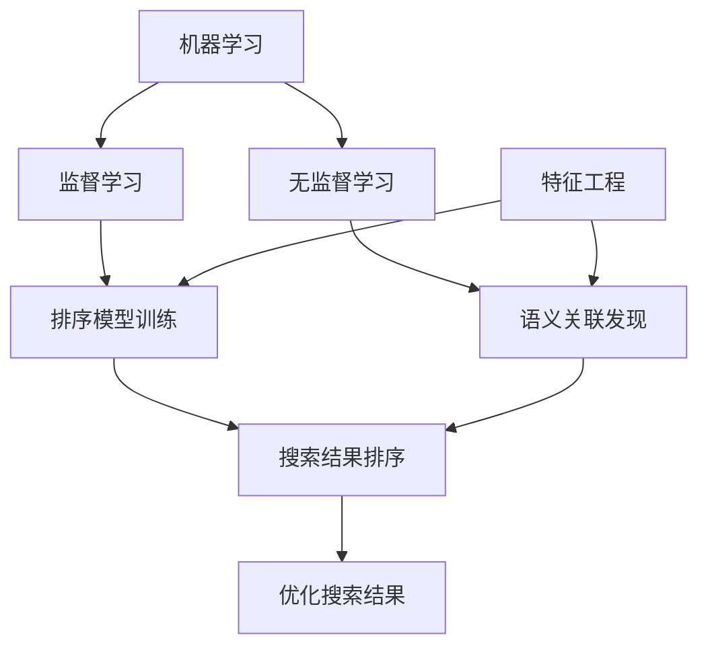

# 第九篇：机器学习与搜索排序：让搜索引擎更懂你

## 1.背景介绍

### 1.1 搜索引擎的重要性

在当今信息时代,搜索引擎已成为我们获取信息、探索知识的重要工具。无论是学习、工作还是日常生活,我们都离不开搜索引擎的指引。一个优秀的搜索引擎能够快速、准确地为用户提供所需信息,极大提高了我们的工作效率和生活质量。

### 1.2 搜索排序的挑战

然而,随着互联网信息的爆炸式增长,如何从海量数据中挖掘出最相关、最有价值的信息,并将其呈现给用户,成为搜索引擎面临的巨大挑战。传统的基于关键词匹配的排序算法已经无法满足用户的需求,因为它们无法真正理解查询意图和网页内容的语义。

### 1.3 机器学习的应用

幸运的是,机器学习技术的发展为解决这一难题提供了新的思路。通过机器学习算法,搜索引擎可以自动发现查询与文档之间的语义关联,更好地理解用户的真实需求,从而提供更加准确和个性化的搜索结果。

## 2.核心概念与联系

### 2.1 机器学习

机器学习是一门研究计算机怎样模拟或实现人类的学习行为,并获取新的知识或技能,重新组织已有的知识结构使之不断自我完善的科学。它是人工智能的一个重要分支,涉及概率论、统计学、逼近理论、凸分析等多门学科。

### 2.2 监督学习与无监督学习

机器学习可分为监督学习和无监督学习两大类。监督学习是从给定的训练数据中学习出一个函数,使之能够预测新的输入数据的输出值。无监督学习则是从未标记的原始数据中发现其内在的统计规律或其他规律性质。

在搜索排序中,监督学习和无监督学习都发挥着重要作用。监督学习可以利用人工标注的相关性数据训练排序模型,而无监督学习则可以自动发现查询和文档之间的语义关联。

### 2.3 特征工程

特征工程是将原始数据转化为可被机器学习算法effectively利用的特征向量的过程。在搜索排序中,常用的特征包括查询词频、文档词频、查询词与文档标题的相似度、URL路径信息、网页质量等。合理的特征工程对排序效果有着至关重要的影响。



## 3.核心算法原理具体操作步骤

### 3.1 学习排序(Learning to Rank)

Learning to Rank是将机器学习应用于搜索排序的一种主要方法。它的基本思路是将排序问题转化为机器学习的分类或回归问题,利用训练数据学习一个排序模型,从而对新的查询和文档对进行打分排序。

Learning to Rank的具体步骤如下:

1. **数据收集和标注**:收集用户的查询日志和相关文档,并由人工或半自动方式标注每个查询-文档对的相关性分数。
2. **特征提取**:对查询和文档提取相关的统计特征和语义特征,构建特征向量。
3. **模型训练**:使用监督学习算法(如LambdaRank、RankNet等),将特征向量和人工标注的相关性分数作为训练数据,学习一个排序模型。
4. **模型评估**:在保留的测试集上评估模型的排序性能,通常使用指标如NDCG(Normalized Discounted Cumulative Gain)。
5. **模型调优**:根据评估结果,调整特征、算法参数等,重复训练评估,直至模型性能满意。
6. **上线服务**:将训练好的排序模型部署到线上系统,为用户提供排序服务。

### 3.2 语义匹配

除了利用人工标注的相关性数据进行监督学习,搜索引擎还可以使用无监督学习的方法自动发现查询与文档之间的语义关联。常用的语义匹配模型包括:

- **主题模型(Topic Model)**: 通过无监督学习自动发现文档的潜在主题分布,并根据查询与主题的相关性对文档进行排序。
- **词嵌入(Word Embedding)**: 将词映射为低维密集向量的分布式表示,用于计算查询与文档的语义相似度。
- **深度学习模型**: 利用神经网络自动提取查询和文档的高阶语义特征,并构建语义匹配模型。

这些语义匹配技术能够有效捕捉查询与文档之间的语义关联,从而提高搜索的准确性和召回率。

## 4.数学模型和公式详细讲解举例说明 

### 4.1 LambdaRank

LambdaRank是一种常用的Learning to Rank算法,它将排序问题建模为优化一个特定的评价指标,如NDCG。LambdaRank的目标函数为:

$$\lambda_{\Lambda} = \sum_{i=1}^{m}\left|\Delta_{i}\right| \cdot \left|\Delta_{i}^{\prime}\right| \cdot\left|\Delta_{i}-\Delta_{i}^{\prime}\right|$$

其中:
- $m$是训练数据的查询数
- $\Delta_i$是第$i$个查询的真实NDCG值
- $\Delta_i^{'}$是第$i$个查询的预测NDCG值

LambdaRank通过梯度下降法最小化目标函数,从而学习出一个能最大化NDCG的排序模型。

### 4.2 词嵌入(Word Embedding)

词嵌入是将词映射为低维密集向量的分布式表示,常用的方法有Word2Vec、Glove等。以Word2Vec的CBOW模型为例,它的目标是最大化上下文词语$w_{t-k},...,w_{t-1},w_{t+1},...,w_{t+k}$预测中心词$w_t$的条件概率:

$$\max _{\theta} \frac{1}{T} \sum_{t=k}^{T-k} \log p\left(w_{t} | w_{t-k}, \ldots, w_{t-1}, w_{t+1}, \ldots, w_{t+k}\right)$$

其中$\theta$是模型参数,通过梯度上升法进行优化求解。训练得到的词向量能较好地刻画词与词之间的语义关系。

### 4.3 神经网络语义匹配

深度学习在语义匹配任务中也表现出色。以DSSM(Deep Structured Semantic Model)为例,它使用一个多层前馈神经网络将查询和文档映射到同一语义空间,并最小化它们之间的欧氏距离:

$$\min _{\theta}\left\|\phi\left(q, \theta_{q}\right)-\psi\left(d, \theta_{d}\right)\right\|_{2}^{2}+\lambda\|\theta\|_{2}^{2}$$

其中$\phi(q,\theta_q)$和$\psi(d,\theta_d)$分别表示查询$q$和文档$d$的语义向量表示,$\theta$是需要学习的模型参数,$\lambda$是正则化系数。通过梯度下降法优化该目标函数,DSSM能够自动从原始数据中挖掘出查询和文档的语义特征,从而实现高质量的语义匹配。

## 5.项目实践：代码实例和详细解释说明

为了帮助读者更好地理解机器学习在搜索排序中的应用,我们提供了一个基于LambdaRank算法的搜索排序实践项目。该项目使用Python和TensorFlow框架实现,包含数据预处理、特征工程、模型训练和评估等全流程。

### 5.1 数据预处理

我们使用了LETOR4.0数据集进行实验,该数据集包含大约75,000个查询和38,000个文档,并由人工标注了相关性分数。我们首先对原始数据进行清洗和格式化处理,提取出查询、文档ID、相关性分数等关键信息。

```python
import pandas as pd

# 读取原始数据
data = pd.read_csv('dataset/train.txt', delimiter=' ', header=None)

# 提取关键信息
queries = data[1].unique()  # 提取查询
docs = data[2].unique()  # 提取文档ID
rel_scores = data[0]  # 提取相关性分数

# 保存处理后的数据
processed_data = pd.DataFrame({'query': data[1], 'doc': data[2], 'rel': data[0]})
processed_data.to_csv('processed_data.csv', index=False)
```

### 5.2 特征工程

接下来,我们为每个查询-文档对提取统计特征和语义特征,构建特征向量作为模型的输入。这里我们使用了TF-IDF、BM25等传统检索特征,以及基于Word2Vec的查询-文档相似度特征。

```python
from sklearn.feature_extraction.text import TfidfVectorizer
import numpy as np

# 计算TF-IDF特征
tfidf = TfidfVectorizer()
queries_tfidf = tfidf.fit_transform([queries[i] for i in processed_data['query']])
docs_tfidf = tfidf.transform([docs[i] for i in processed_data['doc']])

# 计算BM25特征
from rank_bm25 import BM25Okapi
bm25 = BM25Okapi([docs[i] for i in processed_data['doc']])
bm25_scores = bm25.get_scores([queries[i] for i in processed_data['query']])

# 计算Word2Vec相似度特征
from gensim.models import Word2Vec
w2v_model = Word2Vec.load('word2vec.model')

def w2v_sim(query, doc):
    query_vec = np.mean([w2v_model.wv[w] for w in query.split() if w in w2v_model.wv], axis=0)
    doc_vec = np.mean([w2v_model.wv[w] for w in doc.split() if w in w2v_model.wv], axis=0)
    return np.dot(query_vec, doc_vec) / (np.linalg.norm(query_vec) * np.linalg.norm(doc_vec))

w2v_sims = [w2v_sim(queries[i], docs[j]) for i, j in zip(processed_data['query'], processed_data['doc'])]

# 构建特征向量
X = np.column_stack((queries_tfidf.toarray(), docs_tfidf.toarray(), bm25_scores, w2v_sims))
y = processed_data['rel'].values
```

### 5.3 模型训练

有了特征向量和标签,我们就可以使用LambdaRank算法训练排序模型了。我们使用TensorFlow框架实现了LambdaRank,并使用小批量梯度下降法进行优化。

```python
import tensorflow as tf

# 定义输入特征和标签占位符
X = tf.placeholder(tf.float32, [None, X_dim])
y = tf.placeholder(tf.float32, [None])

# 定义全连接神经网络
W1 = tf.Variable(tf.random_normal([X_dim, 256]))
b1 = tf.Variable(tf.zeros([256]))
h1 = tf.nn.relu(tf.matmul(X, W1) + b1)

W2 = tf.Variable(tf.random_normal([256, 1]))
b2 = tf.Variable(tf.zeros([1]))
y_pred = tf.matmul(h1, W2) + b2

# 定义LambdaRank损失函数
lambda_loss = ...  # 实现LambdaRank损失函数

# 定义优化器
optimizer = tf.train.GradientDescentOptimizer(0.01).minimize(lambda_loss)

# 模型训练
with tf.Session() as sess:
    sess.run(tf.global_variables_initializer())
    for epoch in range(100):
        ...  # 小批量梯度下降训练
```

### 5.4 模型评估

在保留的测试集上,我们评估了模型的排序性能,使用NDCG@10作为评价指标。同时,我们也与基于BM25的传统排序模型进行了对比。

```python
from sklearn.metrics import ndcg_score

# 在测试集上评估模型
test_ndcgs = []
for query in test_queries:
    docs = [doc for doc in test_docs if (query, doc) in test_data]
    rels = [test_data[(query, doc)] for doc in docs]
    preds = model.predict([test_data[(query, doc)] for doc in docs])
    
    test_ndcgs.append(ndcg_score([rels], [preds], k=10))

print('NDCG@10 on test set: {:.4f}'.