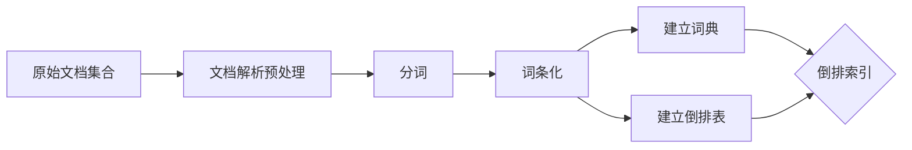

# 第八章 全文搜索应用实践

## 1. 背景介绍
### 1.1 全文搜索的发展历程
### 1.2 全文搜索的重要性
### 1.3 全文搜索的应用现状

## 2. 核心概念与联系
### 2.1 倒排索引
#### 2.1.1 倒排索引的定义
#### 2.1.2 倒排索引的原理
#### 2.1.3 倒排索引的优缺点
### 2.2 分词技术  
#### 2.2.1 中文分词的难点
#### 2.2.2 常见的分词算法
#### 2.2.3 分词技术的评估指标
### 2.3 相关度排序
#### 2.3.1 布尔模型
#### 2.3.2 向量空间模型
#### 2.3.3 概率模型
### 2.4 查询扩展
#### 2.4.1 查询扩展的目的
#### 2.4.2 基于反馈的查询扩展
#### 2.4.3 基于同义词的查询扩展

## 3. 核心算法原理具体操作步骤
### 3.1 构建倒排索引
#### 3.1.1 文档解析和预处理
#### 3.1.2 分词和词条化
#### 3.1.3 建立词典和倒排表
### 3.2 查询处理
#### 3.2.1 查询解析和分词
#### 3.2.2 布尔查询
#### 3.2.3 短语查询
#### 3.2.4 通配符查询
### 3.3 相关度计算
#### 3.3.1 TF-IDF权重计算
#### 3.3.2 向量空间模型相似度计算
#### 3.3.3 BM25相关度计算

## 4. 数学模型和公式详细讲解举例说明 
### 4.1 布尔模型
### 4.2 向量空间模型
### 4.3 概率模型
### 4.4 语言模型

## 5. 项目实践：代码实例和详细解释说明
### 5.1 使用Lucene实现全文搜索
#### 5.1.1 Lucene简介
#### 5.1.2 使用Lucene构建索引
#### 5.1.3 使用Lucene进行搜索
### 5.2 使用Elasticsearch实现全文搜索
#### 5.2.1 Elasticsearch简介
#### 5.2.2 使用Elasticsearch构建索引
#### 5.2.3 使用Elasticsearch进行搜索
### 5.3 使用Solr实现全文搜索
#### 5.3.1 Solr简介 
#### 5.3.2 使用Solr构建索引
#### 5.3.3 使用Solr进行搜索

## 6. 实际应用场景
### 6.1 电商搜索
### 6.2 论文文献搜索
### 6.3 企业内部文档搜索
### 6.4 社交媒体搜索

## 7. 工具和资源推荐
### 7.1 开源搜索引擎
#### 7.1.1 Lucene
#### 7.1.2 Elasticsearch
#### 7.1.3 Solr
### 7.2 商业搜索引擎
#### 7.2.1 Google Search Appliance
#### 7.2.2 Autonomy
### 7.3 相关学习资源
#### 7.3.1 搜索引擎相关书籍
#### 7.3.2 搜索引擎相关课程
#### 7.3.3 搜索引擎相关博客

## 8. 总结：未来发展趋势与挑战
### 8.1 个性化搜索
### 8.2 语义搜索
### 8.3 实时搜索
### 8.4 移动搜索

## 9. 附录：常见问题与解答
### 9.1 如何选择合适的搜索引擎？
### 9.2 如何优化搜索结果的相关性？
### 9.3 如何提高索引构建的效率？
### 9.4 如何实现跨语言搜索？

全文搜索是一项非常重要且具有广泛应用前景的技术。在互联网时代，海量的信息资源给人们获取知识带来了极大的便利，但同时也带来了信息过载的问题。如何从海量的文档中快速准确地找到自己需要的信息，成为了全文搜索技术需要解决的核心问题。

全文搜索的核心是倒排索引。倒排索引是一种特殊的数据结构，它以词项为索引，记录了每个词项在文档集合中的出现情况。通过倒排索引，可以快速定位包含查询词的文档，大大提高了搜索效率。构建倒排索引的过程主要包括文档解析、分词、词条化、建立词典和倒排表等步骤。

在全文搜索中，分词技术是一个关键环节。对于中文等语言，由于词与词之间没有明显的分隔符，因此分词的准确性直接影响搜索结果的质量。常见的分词算法有基于字典的正向最大匹配法、逆向最大匹配法，以及基于统计的隐马尔可夫模型等。

相关度排序是搜索引擎的另一个重要组成部分。它决定了搜索结果的展示顺序，直接影响用户的搜索体验。常见的相关度排序模型有布尔模型、向量空间模型和概率模型等。其中，向量空间模型是最为经典和应用最广泛的，它将文档和查询都表示成向量，通过计算向量之间的夹角余弦值来衡量相关程度。TF-IDF权重是向量空间模型中常用的一种权重计算方法，能够很好地平衡词频和逆文档频率的影响。

下面我们通过一个具体的例子来说明向量空间模型的计算过程。假设有两个文档 $D_1$ 和 $D_2$，它们的内容分别为：

$D_1$: "The quick brown fox jumps over the lazy dog"
$D_2$: "Quick fox jumps over lazy dog"

对这两个文档进行分词后，得到以下的词项列表：

```
[the, quick, brown, fox, jumps, over, lazy, dog]
```

然后，计算每个词项在每个文档中的词频（TF）和逆文档频率（IDF）。假设语料库中总共有100个文档，其中包含"the"的文档有80个，包含"quick"的文档有10个，以此类推。则各个词项的IDF值为：

```
the: log(100/80) = 0.097
quick: log(100/10) = 1
brown: log(100/1) = 2
fox: log(100/2) = 1.699
jumps: log(100/2) = 1.699
over: log(100/2) = 1.699
lazy: log(100/2) = 1.699
dog: log(100/2) = 1.699
```

接下来，计算每个词项在每个文档中的TF-IDF权重。以$D_1$为例，"the"在$D_1$中出现了2次，因此其TF值为2，而IDF值为0.097，所以"the"在$D_1$中的TF-IDF权重为：

$$
2 \times 0.097 = 0.194
$$

按照同样的方法，可以计算出$D_1$和$D_2$的TF-IDF权重向量：

$$
D_1 = [0.194, 1, 2, 1.699, 1.699, 1.699, 1.699, 1.699] \\
D_2 = [0, 1, 0, 1.699, 1.699, 1.699, 1.699, 1.699]
$$

现在，假设用户输入的查询词为"quick fox"，同样计算其TF-IDF权重向量：

$$
Q = [0, 1, 0, 1.699, 0, 0, 0, 0]
$$  

最后，计算查询向量$Q$与文档向量$D_1$和$D_2$的夹角余弦值：

$$
\cos(Q,D_1) = \frac{Q \cdot D_1}{|Q||D_1|} = 0.450 \\
\cos(Q,D_2) = \frac{Q \cdot D_2}{|Q||D_2|} = 0.707
$$

可以看出，$D_2$与查询的相关度更高，因此搜索结果中$D_2$应该排在$D_1$前面。

除了向量空间模型，布尔模型和概率模型也是常用的相关度排序模型。布尔模型主要用于精确匹配，只考虑词项是否出现，而不考虑词频等因素。概率模型则从概率论的角度来衡量相关性，常见的有二元独立模型和BM25模型等。语言模型是近年来兴起的一种新的排序模型，它以生成查询的概率来衡量文档与查询的相关性。

在实际的全文搜索应用中，常常需要综合运用多种技术和模型。比如，可以先用布尔模型过滤出包含查询词的文档，再用向量空间模型对这些文档进行相关度排序。此外，还可以引入查询扩展、相关反馈等技术，进一步提高搜索的准确率和召回率。

全文搜索在电商、论文文献、企业内部文档、社交媒体等领域都有广泛应用。主流的开源搜索引擎有Lucene、Elasticsearch和Solr等，它们提供了强大的全文搜索功能和丰富的API，使得开发人员可以快速构建高效的搜索应用。一些大型商业搜索引擎，如Google Search Appliance和Autonomy，则提供了更加完善和智能化的企业搜索解决方案。

展望未来，全文搜索技术还有很大的发展空间。个性化搜索、语义搜索、实时搜索、移动搜索等都是备受关注的研究方向。个性化搜索根据用户的兴趣爱好和历史行为，为不同用户提供定制化的搜索结果。语义搜索利用自然语言处理和知识图谱等技术，理解查询的语义，提供更加准确和智能的搜索服务。实时搜索则强调数据的实时性，使得用户可以搜索到最新发布的内容。移动搜索需要考虑移动设备的特点，优化搜索界面和交互方式，提供更加便捷和高效的搜索体验。

总之，全文搜索是一个涉及多学科、多技术的综合性课题。要实现高质量的全文搜索，需要在信息检索、自然语言处理、机器学习等领域有扎实的理论基础，还需要在海量数据处理、分布式计算等方面有丰富的工程实践经验。随着互联网数据的爆炸式增长和用户需求的不断变化，全文搜索技术也必将持续演进和创新，为人们高效获取信息提供更加智能和人性化的服务。



**作者：禅与计算机程序设计艺术 / Zen and the Art of Computer Programming**