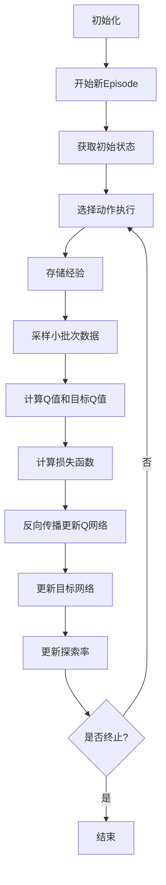

# 经验回放：DQN的秘密武器

## 1.背景介绍

### 1.1 强化学习的挑战

在强化学习领域中,智能体(Agent)需要通过与环境(Environment)的交互来学习最优策略,以获得最大的累积奖励。然而,这个过程存在一些固有的挑战:

1. **样本相关性(Sample Correlation)**: 由于数据是按照时间序列收集的,因此相邻的样本之间存在很强的相关性。这违背了大多数机器学习算法关于数据独立同分布(i.i.d)的假设,从而导致训练不稳定。

2. **数据分布不平衡(Distribution Drift)**: 随着智能体策略的不断更新,收集到的数据分布也会发生变化,导致之前学习到的知识可能在新的数据分布下失效。

3. **高方差(High Variance)**: 由于奖励信号的稀疏性,基于单个序列更新的方法会产生很高的方差,从而降低学习效率。

### 1.2 经验回放的作用

为了解决上述挑战,DeepMind在2015年提出了"经验回放(Experience Replay)"的技术,并将其应用于他们开创性的深度强化学习算法DQN(Deep Q-Network)中。经验回放的核心思想是:将智能体与环境交互过程中获得的经验(状态、动作、奖励等)存储在经验池(Replay Buffer)中,并在训练时从中均匀随机采样数据批次(Minibatch)进行训练。这种方法带来了以下好处:

1. **打破数据相关性**: 通过从经验池中随机采样,可以打破数据之间的相关性,从而满足机器学习算法的i.i.d假设。

2. **数据高效利用**: 每个经验可以被重复使用多次,提高了数据的利用效率。

3. **方差降低**: 通过小批量采样,可以减小梯度更新的方差,提高学习的稳定性。

4. **离线学习**: 智能体可以在与环境交互之外的时间进行学习,提高了算法的效率。

经验回放的引入极大地提高了DQN算法的性能,使其能够在多种复杂的Atari游戏中达到超人类的水平。从此,经验回放成为了深度强化学习算法中不可或缺的一个重要组成部分。

## 2.核心概念与联系

### 2.1 经验回放的核心概念

经验回放主要涉及以下几个核心概念:

1. **经验(Experience)**: 指智能体与环境交互过程中获得的一个转换样本,通常包括当前状态(state)、采取的动作(action)、获得的奖励(reward)和下一个状态(next state)等。

2. **经验池(Replay Buffer)**: 用于存储经验的数据结构,通常采用先进先出(FIFO)队列或环形缓冲区的形式。

3. **采样(Sampling)**: 从经验池中选取一个小批次(Minibatch)的经验数据,用于网络的训练。常用的采样方式有均匀随机采样(Uniform Sampling)和优先级采样(Prioritized Sampling)等。

4. **目标网络(Target Network)**: 为了提高训练稳定性,DQN引入了目标网络的概念。目标网络是评估网络(Q网络)的一个延迟更新的副本,用于计算目标Q值。通过这种方式,可以避免Q值过于频繁的变化,提高训练稳定性。

5. **$\epsilon$-贪婪策略($\epsilon$-greedy Policy)**: 在训练过程中,智能体需要在探索(Exploration)和利用(Exploitation)之间寻求平衡。$\epsilon$-贪婪策略就是一种常用的权衡方法,它以$\epsilon$的概率选择随机动作(探索),以1-$\epsilon$的概率选择当前Q值最大的动作(利用)。

### 2.2 经验回放与其他技术的关系

经验回放与其他强化学习技术存在密切的联系:

1. **Q-Learning**: DQN是基于Q-Learning算法的深度神经网络实现,经验回放为Q-Learning提供了稳定的数据来源。

2. **策略梯度(Policy Gradient)**: 经验回放也被广泛应用于基于策略梯度的算法中,如DDPG(Deep Deterministic Policy Gradient)、PPO(Proximal Policy Optimization)等。

3. **多步Bootstrap**: 经验回放使得智能体可以利用多步奖励来更新Q值,提高了学习效率。这与多步Bootstrap的思想一致。

4. **分布式训练**: 在分布式训练场景下,多个智能体可以将经验存储在同一个经验池中,实现数据共享和高效利用。

5. **模仿学习(Imitation Learning)**: 经验池中存储的数据可以被用于训练模仿学习模型,使智能体学习人类专家的行为。

总的来说,经验回放是一种通用的技术,为强化学习算法提供了稳定的数据支持,并与其他技术形成了良好的互补关系。

## 3.核心算法原理具体操作步骤

### 3.1 经验回放算法流程

经验回放算法的基本流程如下:

1. 初始化经验池和Q网络(评估网络)、目标网络。

2. 对于每一个episode:
    - 初始化环境状态$s_0$。
    - 对于每一个时间步:
        - 根据$\epsilon$-贪婪策略选择动作$a_t$。
        - 在环境中执行动作$a_t$,获得奖励$r_t$和新状态$s_{t+1}$。
        - 将转换$(s_t, a_t, r_t, s_{t+1})$存入经验池。
        - 从经验池中采样一个小批次数据。
        - 计算当前Q网络对应的Q值和目标Q值。
        - 计算损失函数(如均方误差损失)。
        - 对Q网络进行反向传播和参数更新。
        - 每隔一定步数同步目标网络的参数。
    - 根据需要更新$\epsilon$值(探索率)。

3. 直到达到终止条件(如最大episode数)。

该算法的核心步骤可以用以下Mermaid流程图表示:

### 3.2 算法细节

以下是一些算法细节:

1. **经验池的实现**:
    - 使用双端队列(deque)或环形缓冲区实现FIFO队列。
    - 设置最大容量以限制内存占用。
    - 可以采用优先级经验回放(Prioritized Experience Replay),根据TD误差给经验赋予不同的优先级,提高重要经验的采样概率。

2. **小批次采样**:
    - 通常采用均匀随机采样,确保每个经验被等概率采样到。
    - 批量大小(batch size)是一个超参数,通常设置为32或64等。

3. **目标网络更新**:
    - 目标网络参数每隔一定步数(如10000步)从Q网络复制一次。
    - 也可以采用Polyak平均的方式,使目标网络的参数是Q网络参数的移动平均。

4. **$\epsilon$-贵婪策略**:
    - $\epsilon$值通常会从较大值(如1.0)开始,以探索不同的状态。
    - 随着训练的进行,逐渐降低$\epsilon$值,增加利用已学习策略的概率。
    - 也可以采用其他探索策略,如噪声探索(Noisy Exploration)等。

5. **损失函数**:
    - DQN通常采用均方误差损失(Mean Squared Error)。
    - 也可以使用其他损失函数,如Huber损失等。

6. **优化算法**:
    - 常用的优化算法包括RMSProp、Adam等。
    - 也可以采用其他优化技术,如梯度剪裁(Gradient Clipping)等。

通过上述步骤,DQN算法可以有效地利用经验回放来提高训练的稳定性和数据利用率,从而取得更好的强化学习效果。

## 4.数学模型和公式详细讲解举例说明

在经验回放算法中,涉及到一些重要的数学模型和公式,下面将对它们进行详细的讲解和举例说明。

### 4.1 Q-Learning

Q-Learning是一种基于价值函数(Value Function)的强化学习算法,它试图直接学习状态-动作对的价值函数Q(s,a),也称为Q函数。Q函数定义为在状态s下执行动作a,之后能获得的预期累积奖励。Q-Learning的核心更新公式如下:

$$Q(s_t, a_t) \leftarrow Q(s_t, a_t) + \alpha \left[ r_t + \gamma \max_{a} Q(s_{t+1}, a) - Q(s_t, a_t) \right]$$

其中:

- $s_t$和$a_t$分别表示当前状态和动作。
- $r_t$是执行动作$a_t$后获得的即时奖励。
- $\gamma$是折现因子(Discount Factor),用于权衡未来奖励的重要性。
- $\alpha$是学习率(Learning Rate),控制新知识对旧知识的影响程度。
- $\max_{a} Q(s_{t+1}, a)$是在下一状态$s_{t+1}$下可获得的最大预期累积奖励,也称为目标Q值(Target Q-Value)。

通过不断更新Q函数,最终可以得到一个最优的Q函数,使得在任意状态下选择Q值最大的动作,就可以获得最大的预期累积奖励。

**举例说明**:

假设我们有一个简单的格子世界环境,智能体的目标是从起点到达终点。每一步行走都会获得-1的奖励,到达终点获得+100的奖励。设置$\gamma=0.9$, $\alpha=0.1$。

在某一个状态s下,智能体执行动作a,获得即时奖励-1,并转移到新状态s'。假设在s'状态下,执行最优动作可获得的最大Q值为20。根据Q-Learning更新公式,我们可以计算出Q(s,a)的新值:

$$Q(s, a) \leftarrow Q(s, a) + 0.1 \left[ -1 + 0.9 \times 20 - Q(s, a) \right]$$

如果之前Q(s,a)的值为10,那么更新后的Q(s,a)将变为:

$$Q(s, a) = 10 + 0.1 \times (-1 + 0.9 \times 20 - 10) = 10 + 0.1 \times 7 = 10.7$$

通过不断地更新和迭代,Q函数将逐渐收敛到最优解。

### 4.2 深度Q网络(DQN)

在传统的Q-Learning算法中,Q函数通常由一个表格或者简单的函数近似器(如线性函数)来表示。但是当状态空间和动作空间变大时,这种表示方式就变得力不从心。为了解决这个问题,DQN算法将Q函数用深度神经网络来拟合,从而能够处理高维的状态输入。

DQN的神经网络输入是当前状态s,输出是所有动作的Q值,即$Q(s, a_1), Q(s, a_2), \cdots, Q(s, a_n)$。在训练时,我们需要最小化网络输出的Q值与目标Q值之间的差异,即最小化损失函数:

$$L = \mathbb{E}_{(s, a, r, s')\sim D} \left[ \left( r + \gamma \max_{a'} Q(s', a'; \theta^-) - Q(s, a; \theta) \right)^2 \right]$$

其中:

- $D$是经验回放池,$(s, a, r, s')$是从中采样的一个转换样本。
- $\theta$和$\theta^-$分别表示Q网络和目标网络的参数。
- $Q(s', a'; \theta^-)$是目标网络计算出的在$s'$状态下各个动作的Q值。
- $\max_{a'} Q(s', a'; \theta^-)$是目标Q值,即在$s'$状态下可获得的最大Q值。

通过最小化上述损失函数,我们可以使Q网络的输出Q值逐