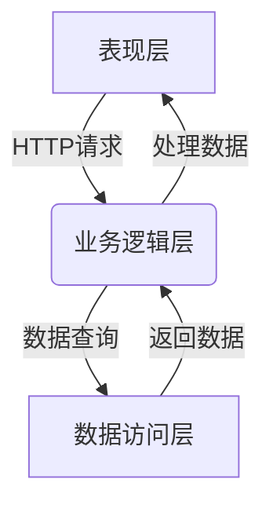
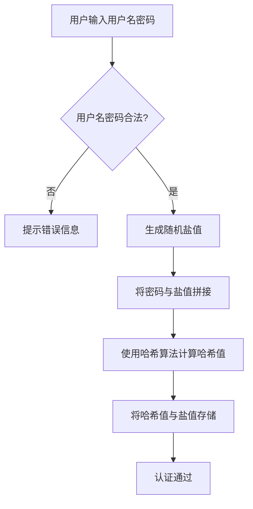
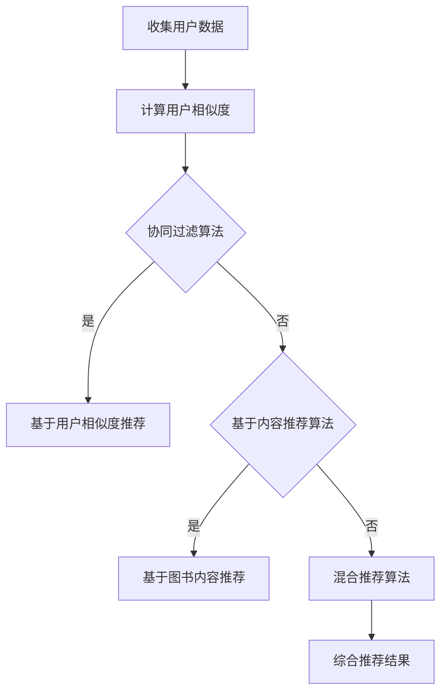

# 网上图书超市系统详细设计与具体代码实现

## 1.背景介绍

随着互联网技术的飞速发展和电子商务的兴起,网上购物已成为人们生活中不可或缺的一部分。图书作为知识和文化的载体,网上图书超市应运而生,为读者提供了便捷的购书渠道。本文将详细介绍网上图书超市系统的设计与实现,包括系统架构、核心功能模块、关键算法等,并给出具体的代码示例,以帮助读者深入理解该系统的工作原理。

## 2.核心概念与联系

### 2.1 系统架构

网上图书超市系统通常采用经典的三层架构,包括表现层(前端)、业务逻辑层(后端)和数据访问层。



1. **表现层**:负责与用户交互,展示数据和接收用户输入。通常使用HTML、CSS和JavaScript等前端技术实现。
2. **业务逻辑层**:处理用户请求,执行业务逻辑,与数据库交互。通常使用Java、Python、Node.js等编程语言实现。
3. **数据访问层**:负责与数据库进行交互,执行数据查询、插入、更新和删除操作。

### 2.2 核心功能模块

网上图书超市系统的核心功能模块包括:

1. **用户管理模块**:实现用户注册、登录、个人信息管理等功能。
2. **图书管理模块**:实现图书信息的添加、修改、删除和查询功能。
3. **购物车模块**:允许用户将想要购买的图书加入购物车,并进行结算。
4. **订单管理模块**:处理用户下单、支付、发货和订单跟踪等功能。
5. **评论系统模块**:允许用户对已购买的图书进行评论和打分。

## 3.核心算法原理具体操作步骤

### 3.1 用户认证算法

用户认证是网上图书超市系统的基础,确保系统的安全性。常见的用户认证算法包括:

1. **密码哈希算法**:将用户密码通过单向哈希函数(如SHA-256)进行哈希处理,存储哈希值而非明文密码,提高安全性。
2. **盐值算法**:在哈希密码时添加随机盐值,防止相同密码的哈希值相同。
3. **密钥加密算法**:使用对称或非对称加密算法(如AES、RSA)对密码进行加密。

用户认证算法的具体步骤如下:



### 3.2 个性化推荐算法

为了提高用户体验,网上图书超市系统通常会采用个性化推荐算法,根据用户的浏览记录、购买历史和评分等数据,推荐感兴趣的图书。常见的推荐算法包括:

1. **协同过滤算法**:基于用户之间的相似性,推荐其他相似用户喜欢的图书。
2. **基于内容的推荐算法**:根据图书的内容特征(如类别、作者等)与用户的兴趣相匹配,推荐相关图书。
3. **混合推荐算法**:结合协同过滤和基于内容的推荐,提高推荐准确性。

个性化推荐算法的核心步骤如下:



## 4.数学模型和公式详细讲解举例说明

### 4.1 协同过滤算法

协同过滤算法是推荐系统中常用的一种技术,它通过计算用户之间的相似度,推荐其他相似用户喜欢的项目。常见的相似度计算方法包括欧几里得距离、皮尔逊相关系数和余弦相似度。

#### 4.1.1 欧几里得距离

欧几里得距离用于计算两个向量之间的距离,公式如下:

$$
d(x, y) = \sqrt{\sum_{i=1}^{n}(x_i - y_i)^2}
$$

其中,$$x$$和$$y$$分别表示两个$$n$$维向量,$$x_i$$和$$y_i$$表示第$$i$$个维度上的值。距离越小,表示两个向量越相似。

#### 4.1.2 皮尔逊相关系数

皮尔逊相关系数用于计算两个向量之间的线性相关性,公式如下:

$$
r(x, y) = \frac{\sum_{i=1}^{n}(x_i - \overline{x})(y_i - \overline{y})}{\sqrt{\sum_{i=1}^{n}(x_i - \overline{x})^2}\sqrt{\sum_{i=1}^{n}(y_i - \overline{y})^2}}
$$

其中,$$\overline{x}$$和$$\overline{y}$$分别表示$$x$$和$$y$$的均值。相关系数的取值范围为$$[-1, 1]$$,值越接近$$1$$表示两个向量越相似。

#### 4.1.3 余弦相似度

余弦相似度用于计算两个向量之间的夹角余弦值,公式如下:

$$
\text{sim}(x, y) = \frac{x \cdot y}{\|x\| \|y\|} = \frac{\sum_{i=1}^{n}x_i y_i}{\sqrt{\sum_{i=1}^{n}x_i^2} \sqrt{\sum_{i=1}^{n}y_i^2}}
$$

其中,$$x \cdot y$$表示$$x$$和$$y$$的点积,$$\|x\|$$和$$\|y\|$$分别表示$$x$$和$$y$$的范数。余弦相似度的取值范围为$$[0, 1]$$,值越接近$$1$$表示两个向量越相似。

以上三种相似度计算方法各有优缺点,需要根据具体场景选择合适的方法。

### 4.2 基于内容的推荐算法

基于内容的推荐算法通过分析用户过去喜欢的项目的特征,推荐具有相似特征的新项目。常见的特征包括文本特征(如关键词、主题等)和数值特征(如评分、价格等)。

#### 4.2.1 TF-IDF

TF-IDF(Term Frequency-Inverse Document Frequency)是一种常用的文本特征提取方法,用于计算词项在文档中的重要程度。公式如下:

$$
\text{tfidf}(t, d, D) = \text{tf}(t, d) \times \text{idf}(t, D)
$$

其中,$$\text{tf}(t, d)$$表示词项$$t$$在文档$$d$$中出现的频率,$$\text{idf}(t, D)$$表示词项$$t$$在整个文档集$$D$$中的逆文档频率,用于衡量词项的重要性。

$$
\text{tf}(t, d) = \frac{n_{t,d}}{\sum_{t' \in d}n_{t',d}}
$$

$$
\text{idf}(t, D) = \log\frac{|D|}{|\{d \in D: t \in d\}|}
$$

其中,$$n_{t,d}$$表示词项$$t$$在文档$$d$$中出现的次数,$$|D|$$表示文档集$$D$$的文档总数,$$|\{d \in D: t \in d\}|$$表示包含词项$$t$$的文档数量。

#### 4.2.2 余弦相似度

在基于内容的推荐算法中,常使用余弦相似度来计算用户兴趣与项目特征之间的相似度。假设用户兴趣向量为$$u$$,项目特征向量为$$v$$,则相似度计算公式如下:

$$
\text{sim}(u, v) = \frac{u \cdot v}{\|u\| \|v\|}
$$

相似度越高,表示用户对该项目的兴趣越大,就越有可能被推荐。

## 5.项目实践:代码实例和详细解释说明

### 5.1 用户认证模块

以下是使用Python实现的用户认证模块代码示例:

```python
import hashlib
import os
import base64

# 生成随机盐值
def generate_salt():
    return base64.b64encode(os.urandom(16)).decode('utf-8')

# 计算密码哈希值
def hash_password(password, salt):
    key = hashlib.pbkdf2_hmac('sha256', password.encode('utf-8'), salt.encode('utf-8'), 100000)
    return base64.b64encode(key).decode('utf-8')

# 用户注册
def register(username, password):
    salt = generate_salt()
    hashed_password = hash_password(password, salt)
    # 将用户名、哈希密码和盐值存储到数据库
    save_user(username, hashed_password, salt)

# 用户登录
def login(username, password):
    user = get_user(username)
    if user:
        hashed_password = hash_password(password, user.salt)
        if hashed_password == user.hashed_password:
            return True
    return False
```

1. `generate_salt()`函数用于生成随机盐值,使用`os.urandom()`生成16字节的随机数据,并使用Base64编码。
2. `hash_password(password, salt)`函数使用PBKDF2算法计算密码的哈希值,并使用Base64编码。
3. `register(username, password)`函数在注册新用户时,首先生成随机盐值,然后计算密码哈希值,最后将用户名、哈希密码和盐值存储到数据库中。
4. `login(username, password)`函数在用户登录时,首先从数据库中获取用户的盐值,然后计算输入密码的哈希值,并与存储的哈希密码进行比较,如果相同则认证通过。

### 5.2 个性化推荐模块

以下是使用Python实现的基于协同过滤的个性化推荐模块代码示例:

```python
import numpy as np
from scipy.spatial.distance import cosine

# 计算用户相似度矩阵
def build_user_sim_matrix(data):
    user_sim_matrix = np.zeros((len(data), len(data)))
    for i in range(len(data)):
        for j in range(len(data)):
            if i != j:
                user_sim_matrix[i, j] = 1 - cosine(data[i], data[j])
    return user_sim_matrix

# 获取相似用户的物品评分
def get_similar_users_items(data, user_id, user_sim_matrix, n=10):
    similar_users = np.argsort(user_sim_matrix[user_id])[::-1]
    similar_users = similar_users[similar_users != user_id][:n]
    similar_users_items = data[similar_users, :]
    return similar_users_items

# 计算物品评分
def predict_rating(data, user_id, item_id, user_sim_matrix):
    similar_users_items = get_similar_users_items(data, user_id, user_sim_matrix)
    rated_users = np.where(similar_users_items[:, item_id] > 0)[0]
    if len(rated_users) == 0:
        return 0
    sim_scores = user_sim_matrix[user_id, similar_users[rated_users]]
    item_ratings = similar_users_items[rated_users, item_id]
    predicted_rating = np.dot(sim_scores, item_ratings) / np.sum(sim_scores)
    return predicted_rating
```

1. `build_user_sim_matrix(data)`函数计算用户相似度矩阵,使用余弦相似度作为相似度度量。
2. `get_similar_users_items(data, user_id, user_sim_matrix, n=10)`函数获取与指定用户最相似的`n`个用户的物品评分矩阵。
3. `predict_rating(data, user_id, item_id, user_sim_matrix)`函数预测指定用户对某个物品的评分,使用相似用户对该物品的评分进行加权平均。

### 5.3 图书管理模块

以下是使用Java实现的图书管理模块代码示例:

```java
import java.util.List;

public class BookManager {
    private BookRepository bookRepository;

    public BookManager(BookRepository bookRepository) {
        this.bookRepository = bookRepository;
    }

    public void addBook(Book book) {
        