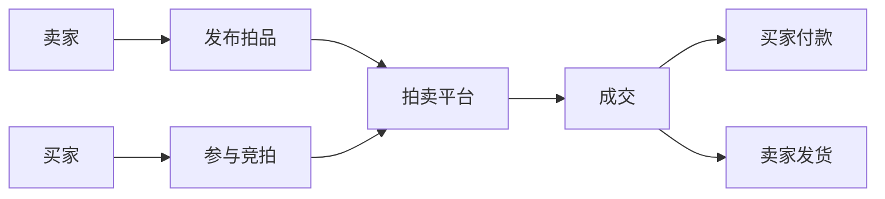

# 网上拍卖平台系统详细设计与具体代码实现

## 1. 背景介绍

### 1.1 网上拍卖平台的发展历程

网上拍卖平台是随着互联网的发展而兴起的一种新型交易模式。早在20世纪90年代中期,eBay就开始尝试将拍卖业务搬到网上进行。经过20多年的发展,网上拍卖已经成为电子商务的重要组成部分,在全球范围内得到广泛应用。

### 1.2 网上拍卖平台的优势

与传统的线下拍卖相比,网上拍卖具有以下优势:

- 突破时空限制,买卖双方可以随时随地参与竞拍
- 降低交易成本,节省场地、人工等费用
- 拓宽交易品类,从艺术品到日用品应有尽有  
- 提高交易效率,缩短拍卖周期,加快资金周转

### 1.3 网上拍卖平台面临的挑战

尽管网上拍卖蓬勃发展,但仍面临一些亟待解决的问题:

- 诚信问题:虚假竞拍、恶意违约时有发生
- 安全问题:账户被盗、支付风险等威胁交易安全
- 物流问题:运输损坏、货不对板等影响用户体验
- 法律问题:拍卖纠纷、税收问题尚缺乏完善的法律规范

## 2. 核心概念与联系

### 2.1 拍卖 Auction

拍卖是指以公开竞价的方式,将商品售给出价最高者的一种交易方式。拍卖一般包括英式拍卖(增价拍卖)和荷式拍卖(减价拍卖)两种形式。

### 2.2 竞拍 Bidding

竞拍是指买方在拍卖过程中对商品进行出价,与其他买家竞争以获得商品所有权的行为。竞拍可以是明拍,也可以是暗拍(如密封拍卖)。

### 2.3 卖家 Seller

卖家是将商品放到拍卖平台上进行拍卖的用户。卖家需要提供商品信息,设置起拍价、保留价等拍卖要素,并最终将商品售出。

### 2.4 买家 Bidder

买家是参与竞拍,有意购买拍卖商品的用户。买家通过出价与其他买家竞争,如果竞拍成功,则需按成交价付款并获得商品。

### 2.5 拍品 Auction Item

拍品是指在拍卖平台上被拍卖的商品。拍品可以是实物商品,也可以是虚拟商品或服务。

### 2.6 核心概念关系图

下图展示了网上拍卖平台的核心概念及其关系:



## 3. 核心算法原理与操作步骤

### 3.1 英式拍卖(增价拍卖)

英式拍卖又称增价拍卖,是最常见的拍卖方式。其基本规则如下:

1. 卖家设定起拍价和加价幅度
2. 买家按加价幅度递增出价
3. 出价最高者在无人再出更高价时成交

英式拍卖一般采用"最高价即时成交"原则,但卖家也可设置保留价,当最高出价未达到保留价时,卖家有权选择流拍。

### 3.2 代理竞价

为了方便买家参与竞拍,许多拍卖平台提供代理竞价功能。买家可设置心理价位,由系统代为出价,直至竞拍成功或达到心理价位上限。

代理竞价的基本算法如下:

1. 初始化代理价为买家设定的心理价位
2. 监控拍卖实时价格p
3. 若p低于代理价,则以p+加价幅度出价
4. 重复2-3直至竞拍结束或达到代理价

### 3.3 荷式拍卖(减价拍卖)

荷式拍卖与英式拍卖相反,价格由高到低递减,买家先按下按钮者成交。其优点是节奏快、成交率高,但容易造成恶意竞拍。

荷式拍卖的操作步骤如下:

1. 卖家设定起拍价和降价幅度
2. 系统按降价幅度定时调低价格 
3. 买家按下按钮即可按当前价格成交
4. 无人出价时,拍卖流拍

## 4. 数学模型与公式

### 4.1 均衡价格模型

拍卖的理论基础是均衡价格理论。假设市场是完全竞争的,买卖双方都是理性人,则存在一个均衡价格p使得供给量等于需求量。

令供给函数为$Q_s=a_sp+b_s$,需求函数为$Q_d=-a_dp+b_d$,则均衡价格p满足:

$$a_sp+b_s=-a_dp+b_d$$

解得:

$$p=\frac{b_d-b_s}{a_s+a_d}$$

### 4.2 最优出价策略

对于买家而言,如何制定最优出价策略以在预算范围内竞拍成功是一个重要问题。威克瑞(Vickrey)拍卖机制给出了一种理想的策略。

假设买家对拍品的估值为$v_i$,其他买家出价为$b_j(j\neq i)$,令$b_{-i}=max\{b_1,\cdots,b_{i-1},b_{i+1},\cdots,b_n\}$,则最优策略是:

$$
b_i^*=\begin{cases}
v_i & v_i\geq b_{-i}\\
任意值<b_{-i} & v_i<b_{-i}
\end{cases}
$$

直观地说,买家应该据实出价,出价等于自己的真实估值。这种策略下,买家的期望支付等于其他买家的最高估值,是一种激励相容机制。

## 5. 项目实践:代码实例与解释

下面我们以Java语言为例,展示网上拍卖系统的部分核心代码。

### 5.1 拍品类 AuctionItem

```java
public class AuctionItem {
    private Long id; //拍品ID
    private String name; //拍品名称
    private String desc; //拍品描述
    private BigDecimal startPrice; //起拍价
    private BigDecimal reservePrice; //保留价
    private Date startTime; //开始时间
    private Date endTime; //结束时间
    //省略getter、setter方法
}
```

`AuctionItem`类定义了拍品的基本属性,包括拍品ID、名称、描述、起拍价、保留价、开始时间、结束时间等。

### 5.2 竞拍类 Bid

```java
public class Bid {
    private Long id; //竞拍ID
    private Long itemId; //拍品ID
    private Long bidderId; //竞拍者ID 
    private BigDecimal price; //竞拍价格
    private Date createTime; //竞拍时间
    //省略getter、setter方法
}
```

`Bid`类表示一次竞拍行为,包含竞拍ID、拍品ID、竞拍者ID、竞拍价格、竞拍时间等信息。

### 5.3 拍卖服务接口 AuctionService

```java
public interface AuctionService {
    //发布拍品
    void publishItem(AuctionItem item);
    //参与竞拍
    void placeBid(Bid bid);
    //查询拍品
    AuctionItem getItem(Long itemId);
    //查询竞拍历史
    List<Bid> getBidHistory(Long itemId);
    //结束拍卖
    void endAuction(Long itemId);
}
```

`AuctionService`定义了拍卖系统的核心服务,包括发布拍品、参与竞拍、查询拍品、查询竞拍历史、结束拍卖等。

### 5.4 拍卖服务实现 AuctionServiceImpl

```java
@Service
public class AuctionServiceImpl implements AuctionService {
    
    @Autowired
    private AuctionItemDao itemDao;
    
    @Autowired
    private BidDao bidDao;
    
    @Override
    public void publishItem(AuctionItem item) {
        itemDao.save(item);
    }
    
    @Override
    public void placeBid(Bid bid) {
        AuctionItem item = itemDao.findById(bid.getItemId());
        if(item == null) {
            throw new IllegalStateException("拍品不存在");
        }
        if(bid.getPrice().compareTo(item.getStartPrice()) < 0) {
            throw new IllegalArgumentException("出价不能低于起拍价");
        }
        if(bid.getCreateTime().before(item.getStartTime()) 
            || bid.getCreateTime().after(item.getEndTime())) {
            throw new IllegalStateException("当前不在拍卖时间范围内");
        }
        bidDao.save(bid);
    }
    
    @Override
    public AuctionItem getItem(Long itemId) {
        return itemDao.findById(itemId);
    }
    
    @Override
    public List<Bid> getBidHistory(Long itemId) {
        return bidDao.findByItemId(itemId);
    }
    
    @Override
    public void endAuction(Long itemId) {
        AuctionItem item = itemDao.findById(itemId);
        if(item == null) {
            throw new IllegalStateException("拍品不存在");
        }
        Bid maxBid = bidDao.findMaxByItemId(itemId);
        if(maxBid != null && 
           maxBid.getPrice().compareTo(item.getReservePrice()) >= 0) {
            item.setStatus(ItemStatus.SOLD);
            item.setWinnerId(maxBid.getBidderId());
            item.setFinalPrice(maxBid.getPrice());
        } else {
            item.setStatus(ItemStatus.UNSOLD);
        }
        itemDao.update(item);
    }
}
```

`AuctionServiceImpl`是拍卖服务的具体实现。其中的关键逻辑包括:

- 发布拍品时,将拍品信息保存到数据库
- 参与竞拍时,校验出价是否合法,然后保存竞拍记录
- 查询拍品时,从数据库读取拍品信息
- 查询竞拍历史时,从数据库读取指定拍品的所有竞拍记录
- 结束拍卖时,判断最高出价是否达到保留价,设置拍品状态为成交或流拍,更新拍品信息

以上代码虽然简化了许多细节,但展示了网上拍卖系统的核心功能的基本实现思路。实际项目中,还需要考虑并发、性能、安全、支付、物流等诸多因素。

## 6. 实际应用场景

网上拍卖平台可应用于多种场景,满足不同需求:

- 艺术品拍卖:艺术家、画廊、拍卖行可借助网上平台拍卖油画、雕塑、古董等艺术品
- 二手商品交易:个人卖家可通过拍卖平台出售闲置物品,如电子产品、收藏品、服饰等
- 房地产拍卖:房产中介、开发商可利用网络进行房屋、土地等不动产拍卖
- 司法拍卖:法院可委托拍卖平台处置查封、扣押、冻结的财产
- 无形资产拍卖:版权、专利、域名等无形资产也可通过网拍变现
- 慈善拍卖:将拍卖所得捐赠慈善机构,支持公益事业

总之,只要有买卖需求、适合公开竞价,都可以借助网上拍卖平台高效、透明地达成交易。

## 7. 工具和资源推荐

### 7.1 开源拍卖系统

- [OpenAuction](https://github.com/mbaranowski/OpenAuction):基于Java的开源拍卖平台
- [Auction](https://github.com/cjwk/auction):基于PHP的拍卖网站系统
- [Django Auction](https://github.com/mmoschenskikh/django-auction):基于Python Django框架的拍卖网站

### 7.2 第三方服务

- [eBay API](https://developer.ebay.com/):eBay开发者平台,提供拍卖相关API
- [Paypal](https://developer.paypal.com/):知名支付平台,可用于拍卖交易的资金结算
- [顺丰](https://open.sf-express.com/):物流服务商,为网拍提供配送解决方案

### 7.3 拍卖算法研究

- Easley, D., & Kleinberg, J. (2010). Networks, crowds, and markets: Reasoning about a highly connected world. Cambridge University Press