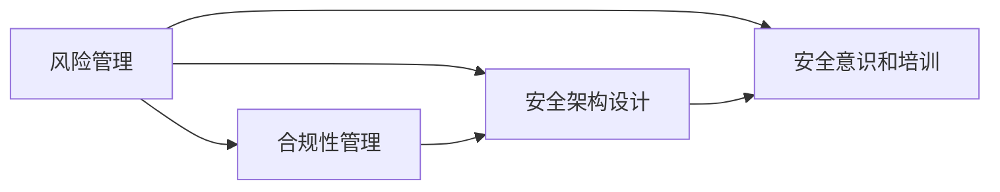

# 网络安全领导力:保护您的组织免受威胁

## 1.背景介绍

### 1.1 网络安全的重要性
在当今数字化时代,网络安全已成为每个组织最关键的议题之一。随着技术的快速发展和网络攻击手段的日益复杂化,保护组织的数字资产和敏感信息变得越来越具有挑战性。网络安全事件不仅会导致财务损失,还会对组织的声誉和客户信任造成严重影响。因此,建立强大的网络安全领导力至关重要。

### 1.2 网络安全领导力的定义
网络安全领导力是指在组织内部推动和实施有效的网络安全战略、政策和实践的能力。它涉及到技术专业知识、风险管理、合规性以及与利益相关方的沟通和协作。网络安全领导者需要具备战略思维、决策能力和领导才能,以应对不断变化的网络安全形势。

### 1.3 网络安全领导力的必要性
在网络安全日益成为董事会关注的重点问题的情况下,组织需要强有力的网络安全领导来制定和执行有效的安全战略。网络安全领导者不仅要确保组织的技术防御措施到位,还要培养全员的网络安全意识和文化。此外,网络安全领导者还需要与业务部门紧密合作,平衡安全需求与业务目标,确保网络安全成为组织运营的核心组成部分。

## 2.核心概念与联系

### 2.1 风险管理
风险管理是网络安全领导力的核心概念之一。它涉及识别、评估和优先处理组织面临的网络安全风险。有效的风险管理需要全面了解组织的资产、威胁形势以及潜在的脆弱性。网络安全领导者需要制定风险管理框架,并确保风险评估和处置流程得到有效执行。

### 2.2 合规性管理
合规性管理是确保组织遵守相关法律法规、行业标准以及内部政策的过程。网络安全领导者需要深入了解适用于组织的合规性要求,并制定相应的控制措施。合规性管理还涉及定期审计和报告,以证明组织的合规性状况。

### 2.3 安全架构设计
安全架构设计是指根据组织的业务需求和风险状况,设计和实施全面的网络安全技术架构。这包括选择适当的安全技术和工具、制定安全配置标准以及建立安全运营流程。网络安全领导者需要与IT团队紧密合作,确保安全架构能够有效防御网络威胁。

### 2.4 安全意识和培训
提高全员的网络安全意识是网络安全领导力的重要组成部分。网络安全领导者需要制定和实施全面的安全意识培训计划,涵盖从高管到普通员工的所有人员。培训内容应包括识别网络威胁、安全最佳实践以及事件报告流程等。定期的安全意识培训有助于营造积极的网络安全文化。

以下是核心概念之间的联系图:



## 3.核心算法原理具体操作步骤

### 3.1 风险评估算法
风险评估是风险管理的关键步骤,它涉及识别资产、评估威胁和脆弱性以及确定风险等级。常用的风险评估算法包括:

#### 3.1.1 资产识别
- 列出组织的所有信息资产,包括硬件、软件、数据等
- 对每个资产进行分类和优先级排序

#### 3.1.2 威胁识别
- 识别可能影响资产的潜在威胁,如恶意软件、黑客攻击、内部威胁等
- 评估每种威胁的可能性和影响

#### 3.1.3 脆弱性识别  
- 识别资产中存在的安全漏洞和薄弱环节
- 评估每个脆弱性被利用的可能性和影响

#### 3.1.4 风险计算
- 使用风险矩阵或其他量化方法计算每个风险的等级
- 风险等级 = 威胁可能性 × 脆弱性影响

### 3.2 访问控制算法
访问控制是限制对信息资源的访问,确保只有授权用户才能访问敏感数据。常用的访问控制算法包括:

#### 3.2.1 自主访问控制(DAC)
- 资源所有者决定谁可以访问资源
- 基于访问控制列表(ACL)实现

#### 3.2.2 强制访问控制(MAC) 
- 系统根据预定义的安全策略控制访问
- 通常用于高安全级别的环境,如军事系统

#### 3.2.3 基于角色的访问控制(RBAC)
- 根据用户的角色和职责授予访问权限
- 简化了权限管理,提高了灵活性

### 3.3 加密算法
加密是保护数据机密性的重要手段。常用的加密算法包括:

#### 3.3.1 对称加密
- 使用同一个密钥进行加密和解密
- 常见算法:AES、DES、3DES等

#### 3.3.2 非对称加密
- 使用公钥进行加密,私钥进行解密  
- 常见算法:RSA、ECC等

#### 3.3.3 哈希函数
- 将任意长度的数据映射为固定长度的唯一值
- 常见算法:SHA-256、MD5等

## 4.数学模型和公式详细讲解举例说明

### 4.1 风险评估模型
风险评估常用的数学模型是风险矩阵,它将风险的可能性和影响映射到一个矩阵中,以确定风险等级。

风险矩阵示例:

|   | 影响 | 轻微 | 中等 | 严重 |
|:---:|:---:|:---:|:---:|:---:|
| **可能性** | **高** | 中风险 | 高风险 | 极高风险 |
|   | **中** | 低风险 | 中风险 | 高风险 |
|   | **低** | 极低风险 | 低风险 | 中风险 |

风险等级计算公式:

$$ 风险等级 = 可能性 \times 影响 $$

例如,如果一个威胁的发生可能性为"中",影响为"严重",则风险等级为:

$$ 风险等级 = 中 \times 严重 = 高风险 $$

### 4.2 密码学中的模运算
在密码学中,模运算是一种常用的数学运算。它在有限域上进行运算,对于整数a和正整数m,a模m的运算结果是a除以m的余数。

模运算公式:

$$ a \equiv b \pmod m \Leftrightarrow a = km + b, k \in \mathbb{Z} $$

例如,在RSA加密算法中,加密和解密过程涉及模运算:

$$ c \equiv m^e \pmod n $$
$$ m \equiv c^d \pmod n $$

其中,m是明文,c是密文,e是公钥,d是私钥,n是模数(p和q的乘积)。

### 4.3 机器学习在异常检测中的应用
机器学习算法,如支持向量机(SVM)和隔离森林(Isolation Forest),常用于网络安全中的异常检测。

SVM异常检测模型:

$$ \min_{w, \xi, \rho} \frac{1}{2} \lVert w \rVert^2 + \frac{1}{\nu n} \sum_{i=1}^{n} \xi_i - \rho $$

$$ s.t. \quad w \cdot \Phi(x_i) \geq \rho - \xi_i, \quad \xi_i \geq 0 $$

其中,w是超平面的法向量,$\xi_i$是松弛变量,$\rho$是偏移项,$\nu$控制异常点的比例。

隔离森林异常检测模型:

$$ s(x, n) = 2^{-\frac{E(h(x))}{c(n)}} $$

其中,h(x)是样本x在隔离树中的路径长度,E(h(x))是平均路径长度,c(n)是平均路径长度的归一化因子。

## 5.项目实践:代码实例和详细解释说明

### 5.1 Python实现AES加密

```python
from Crypto.Cipher import AES
from Crypto.Random import get_random_bytes

def encrypt_data(plaintext, key):
    cipher = AES.new(key, AES.MODE_EAX)
    ciphertext, tag = cipher.encrypt_and_digest(plaintext)
    return cipher.nonce + tag + ciphertext

def decrypt_data(ciphertext, key):
    nonce = ciphertext[:16]
    tag = ciphertext[16:32]
    ciphertext = ciphertext[32:]
    cipher = AES.new(key, AES.MODE_EAX, nonce)
    plaintext = cipher.decrypt_and_verify(ciphertext, tag)
    return plaintext

# 示例用法
key = get_random_bytes(16)
plaintext = b'This is a secret message!'
encrypted_data = encrypt_data(plaintext, key)
decrypted_data = decrypt_data(encrypted_data, key)
print("Original plaintext:", plaintext)
print("Decrypted plaintext:", decrypted_data)
```

代码解释:
- 使用Python的PyCryptodome库实现AES加密
- `encrypt_data`函数接受明文和密钥,使用AES的EAX模式进行加密,返回随机生成的nonce、认证标签和密文
- `decrypt_data`函数接受密文和密钥,从密文中提取nonce、标签和实际密文,使用AES的EAX模式进行解密和验证,返回明文
- 示例代码演示了如何生成随机密钥,加密明文,然后解密得到原始明文

### 5.2 使用Scikit-learn实现异常检测

```python
from sklearn.svm import OneClassSVM
from sklearn.datasets import make_blobs

# 生成示例数据
X, _ = make_blobs(n_samples=100, centers=1, cluster_std=1.5, random_state=42)
X_outliers = [[5, 5], [-5, -5]]

# 训练One-Class SVM模型
clf = OneClassSVM(nu=0.05, kernel="rbf", gamma=0.1)
clf.fit(X)

# 预测异常点
y_pred = clf.predict(X)
y_outliers = clf.predict(X_outliers)

print("正常数据点预测结果:", y_pred)
print("异常点预测结果:", y_outliers)
```

代码解释:
- 使用Scikit-learn库中的OneClassSVM实现异常检测
- 使用`make_blobs`函数生成示例数据,包括正常数据点和异常点
- 创建OneClassSVM模型,设置参数nu(异常点比例)、kernel(核函数)和gamma(核函数参数)
- 使用正常数据点训练模型
- 使用训练好的模型预测正常数据点和异常点,其中1表示正常,-1表示异常
- 输出预测结果,演示模型对正常数据点和异常点的识别能力

## 6.实际应用场景

### 6.1 金融行业
- 实时监控和检测异常交易,防止欺诈和洗钱活动
- 保护客户的敏感财务信息,如信用卡号和银行账户信息
- 确保金融系统的高可用性和业务连续性

### 6.2 医疗保健行业
- 保护患者的电子健康记录(EHR)和个人身份信息(PII) 
- 确保医疗设备和系统的安全性,防止恶意攻击
- 遵守HIPAA等医疗保健行业的隐私和安全法规

### 6.3 政府和国防部门
- 保护机密政府文件和敏感情报信息
- 确保关键基础设施(如电网、交通系统)的网络安全
- 应对国家级别的网络攻击和网络战威胁

### 6.4 零售和电子商务
- 保护客户的个人信息和支付数据
- 防止网上欺诈和身份盗用
- 确保在线交易平台的安全性和可靠性

## 7.工具和资源推荐

### 7.1 风险评估工具
- NIST SP 800-30:信息系统风险管理指南
- OCTAVE Allegro:运营关键威胁、资产和脆弱性评估方法
- FAIR:因素分析信息风险框架

### 7.2 漏洞扫描工具
- Nessus:全面的漏洞评估和管理平台
- OpenVAS:开源漏洞扫描器
- Nexpose:自动化漏洞管理和