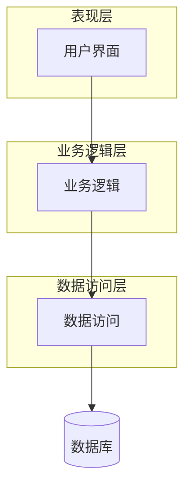
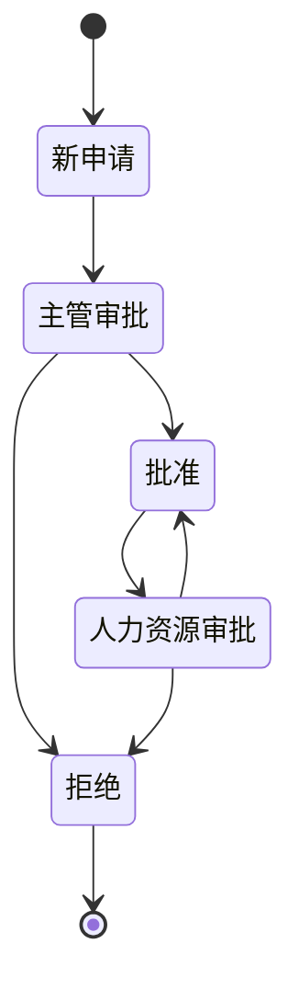

# 考勤信息管理系统详细设计与具体代码实现

## 1. 背景介绍

在现代企业和组织中,员工考勤管理是一项重要的任务。准确记录员工的上下班时间、加班情况以及请假信息,不仅有助于计算工资和奖金,还可以帮助管理层评估工作效率,优化人力资源配置。传统的手工记录方式既低效又容易出错,因此需要一套自动化的考勤信息管理系统来解决这一问题。

本文将详细介绍一个基于 Java 的考勤信息管理系统的设计和实现过程。该系统包括员工信息管理、考勤记录、请假审批、报表生成等多个模块,可以满足大多数企业的考勤管理需求。我们将从需求分析开始,逐步讨论系统架构设计、数据库设计、关键算法实现,并给出具体的代码示例。最后,我们还将探讨系统的实际应用场景、未来发展趋势以及常见的问题和解决方案。

## 2. 核心概念与联系

在深入讨论系统设计之前,我们先介绍一些核心概念:

### 2.1 员工信息

员工信息包括员工的基本个人信息(姓名、部门、职位等)以及工作时间安排(上班时间、下班时间、休息时间等)。这些信息将作为系统的基础数据,用于后续的考勤记录和计算。

### 2.2 考勤记录

考勤记录是指员工实际的上下班打卡时间。这些记录可以通过多种方式获取,如门禁系统、指纹识别、人脸识别等。准确的考勤记录是计算员工工时和加班情况的关键数据。

### 2.3 请假审批

员工可以根据需要申请各种类型的请假(如年假、病假、事假等)。请假申请需要经过审批流程,由相关主管人员进行审核和批准。已批准的请假将影响员工的考勤计算结果。

### 2.4 报表生成

系统需要根据员工的考勤记录和请假信息,生成各种报表,如工时报表、加班报表、出勤率报表等。这些报表将为企业的人力资源管理和绩效考核提供依据。

### 2.5 系统架构

考勤信息管理系统采用了经典的三层架构设计,包括表现层(UI)、业务逻辑层和数据访问层。这种分层设计有利于代码的可维护性和可扩展性。下面是系统的架构图:



## 3. 核心算法原理具体操作步骤

### 3.1 考勤计算算法

考勤计算是整个系统的核心算法,它需要根据员工的考勤记录、工作时间安排和请假信息,计算出员工的实际工时、加班时间等数据。下面是算法的具体步骤:

1. 获取员工的工作时间安排,包括上班时间、下班时间和休息时间。
2. 遍历员工的考勤记录,对每一条记录:
    a. 如果记录时间在工作时间范围内,计入正常工时;
    b. 如果记录时间在工作时间之前或之后,计入加班时间;
    c. 如果记录时间在休息时间内,不计入工时。
3. 查询员工的请假记录,对于每一条请假记录:
    a. 如果请假类型为带薪假期(如年假、事假等),从工时中扣除相应时间;
    b. 如果请假类型为无薪假期(如病假、产假等),不影响工时计算。
4. 将计算结果存储到数据库中,作为报表生成的数据源。

该算法的时间复杂度为 O(n),其中 n 为考勤记录的数量。在实际应用中,我们可以采用优化策略(如缓存、分片等)来提高算法的性能。

### 3.2 请假审批流程

请假审批流程是一个典型的工作流程,需要涉及多个角色和多个步骤。我们可以使用状态机模型来描述和实现该流程。下面是请假审批流程的状态转移图:



其中,请假申请的状态包括:

- 新申请: 员工提交新的请假申请;
- 主管审批: 直接主管审批请假申请;
- 人力资源审批: 人力资源部门进行复核;
- 批准: 请假申请获得批准;
- 拒绝: 请假申请被拒绝。

在实现过程中,我们可以使用有限状态机或工作流引擎来管理这一流程。

## 4. 数学模型和公式详细讲解举例说明

在考勤计算过程中,我们需要处理各种时间段的计算和比较。为了方便描述,我们先定义一些基本概念:

- 时间段 (TimeSpan): 由开始时间和结束时间组成的一个时间区间,记作 $[t_s, t_e]$;
- 时间段长度 (Duration): 一个时间段所包含的时间量,记作 $d = t_e - t_s$;
- 时间段交集 (Intersection): 两个时间段的公共部分,记作 $[t_s, t_e] \cap [t_s', t_e'] = [max(t_s, t_s'), min(t_e, t_e')]$;
- 时间段差集 (Difference): 一个时间段去掉另一个时间段的剩余部分,记作 $[t_s, t_e] - [t_s', t_e'] = [t_s, max(t_s, t_s')] \cup [min(t_e, t_e'), t_e]$。

基于这些概念,我们可以定义一些用于考勤计算的公式:

1. 工作时间计算公式:

$$
工作时间 = \sum_{i=1}^{n} (考勤记录_i \cap 工作时间安排)
$$

其中,n 为考勤记录的数量。对于每一条考勤记录,我们计算它与员工的工作时间安排的交集,并将所有交集的时间段长度相加,即为该员工的工作时间。

2. 加班时间计算公式:

$$
加班时间 = \sum_{i=1}^{n} (考勤记录_i - 工作时间安排)
$$

类似地,我们计算每一条考勤记录与工作时间安排的差集,并将所有差集的时间段长度相加,即为该员工的加班时间。

3. 扣除请假时间公式:

$$
实际工时 = 工作时间 - \sum_{j=1}^{m} 请假记录_j
$$

其中,m 为请假记录的数量。对于每一条请假记录,我们从工作时间中扣除相应的时间,得到员工的实际工时。

通过这些公式,我们可以准确计算出员工的工作时间、加班时间和实际工时,从而为后续的报表生成和工资计算提供依据。

## 5. 项目实践: 代码实例和详细解释说明

在本节中,我们将给出一些核心代码示例,并对其进行详细解释。

### 5.1 员工信息管理

员工信息是整个系统的基础数据,我们需要定义一个 `Employee` 类来表示员工的基本信息和工作时间安排。下面是该类的代码:

```java
public class Employee {
    private String id;
    private String name;
    private String department;
    private String position;
    private LocalTime workStartTime;
    private LocalTime workEndTime;
    private LocalTime breakStartTime;
    private LocalTime breakEndTime;
    
    // 构造函数、getter 和 setter 方法
    // ...
}
```

在这个类中,我们使用 `LocalTime` 类来表示工作时间和休息时间,这是 Java 8 中引入的一种新的日期时间 API,比传统的 `Date` 类更加方便和高效。

我们还需要一个 `EmployeeRepository` 接口来定义员工信息的基本操作,如添加、删除、修改和查询员工信息。下面是该接口的代码:

```java
public interface EmployeeRepository {
    void addEmployee(Employee employee);
    void updateEmployee(Employee employee);
    void deleteEmployee(String id);
    Employee getEmployeeById(String id);
    List<Employee> getAllEmployees();
}
```

在实际实现中,我们可以使用各种持久化方案(如关系数据库、NoSQL 数据库或文件系统)来存储员工信息。

### 5.2 考勤记录管理

考勤记录是系统的核心数据,我们需要定义一个 `AttendanceRecord` 类来表示每一条考勤记录。下面是该类的代码:

```java
public class AttendanceRecord {
    private String employeeId;
    private LocalDateTime clockInTime;
    private LocalDateTime clockOutTime;
    
    // 构造函数、getter 和 setter 方法
    // ...
}
```

在这个类中,我们使用 `LocalDateTime` 类来表示打卡时间,它包含了日期和时间信息。

与员工信息管理类似,我们还需要一个 `AttendanceRecordRepository` 接口来定义考勤记录的基本操作,如添加、删除和查询考勤记录。下面是该接口的代码:

```java
public interface AttendanceRecordRepository {
    void addAttendanceRecord(AttendanceRecord record);
    void deleteAttendanceRecord(long id);
    List<AttendanceRecord> getAttendanceRecordsByEmployeeId(String employeeId);
    List<AttendanceRecord> getAllAttendanceRecords();
}
```

在实现这个接口时,我们可以使用关系数据库或 NoSQL 数据库来存储考勤记录。

### 5.3 考勤计算服务

考勤计算是整个系统的核心功能,我们需要一个 `AttendanceCalculationService` 类来实现相关的算法。下面是该类的代码:

```java
public class AttendanceCalculationService {
    private EmployeeRepository employeeRepository;
    private AttendanceRecordRepository attendanceRecordRepository;

    public AttendanceCalculationService(EmployeeRepository employeeRepository,
                                        AttendanceRecordRepository attendanceRecordRepository) {
        this.employeeRepository = employeeRepository;
        this.attendanceRecordRepository = attendanceRecordRepository;
    }

    public AttendanceResult calculateAttendance(String employeeId, LocalDate startDate, LocalDate endDate) {
        Employee employee = employeeRepository.getEmployeeById(employeeId);
        List<AttendanceRecord> records = attendanceRecordRepository.getAttendanceRecordsByEmployeeId(employeeId);

        // 过滤出指定日期范围内的考勤记录
        records = records.stream()
                .filter(r -> r.getClockInTime().toLocalDate().isAfter(startDate)
                        && r.getClockInTime().toLocalDate().isBefore(endDate))
                .collect(Collectors.toList());

        // 计算工作时间、加班时间和实际工时
        Duration workTime = Duration.ZERO;
        Duration overtimeTime = Duration.ZERO;
        Duration actualWorkTime = Duration.ZERO;

        for (AttendanceRecord record : records) {
            LocalTime workStartTime = employee.getWorkStartTime();
            LocalTime workEndTime = employee.getWorkEndTime();
            LocalTime breakStartTime = employee.getBreakStartTime();
            LocalTime breakEndTime = employee.getBreakEndTime();

            Duration recordDuration = Duration.between(record.getClockInTime(), record.getClockOutTime());
            Duration workDuration = Duration.between(workStartTime, workEndTime)
                    .minus(Duration.between(breakStartTime, breakEndTime));

            if (record.getClockInTime().toLocalTime().isBefore(workStartTime)
                    && record.getClockOutTime().toLocalTime().isAfter(workEndTime)) {
                // 整个工作时间都在考勤记录内
                workTime = workTime.plus(workDuration);
                overtimeTime = overtimeTime.plus(recordDuration.minus(workDuration));
            } else if (record.getClockInTime().toLocalTime().isBefore(workStartTime)) {
                // 上班前打卡
                Duration beforeWorkDuration = Duration.between(record.getClockInTime(), workStartTime.atDate(record.getClockInTime().toLocalDate()));
                overtimeTime = overtimeTime.plus(beforeWorkDuration);
                workTime = workTime.plus(Duration.between(workStartTime, record.getClockOutTime()));
            } else if (record.getClockOutTime().toLocalTime().isAfter(workEndTime)) {
                // 下班后打卡
                Duration afterWorkDuration = Duration.between(workEndTime.atDate(record.getClockOut