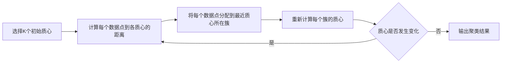
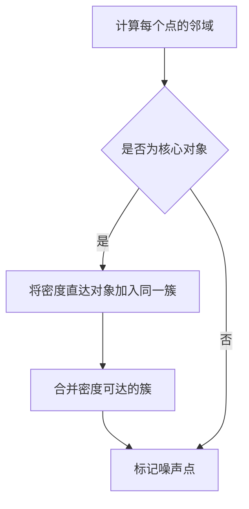
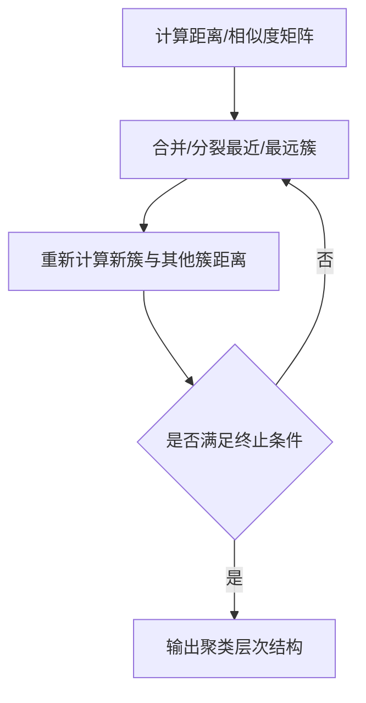

# 聚类算法 原理与代码实例讲解

## 1.背景介绍

### 1.1 什么是聚类

聚类(Clustering)是一种无监督学习技术,其目标是将一组对象划分为多个相似的组(或簇),使得同一个簇中的对象相似度较高,而不同簇之间的对象相似度较低。聚类广泛应用于数据挖掘、图像分割、模式识别、计算机视觉等多个领域。

### 1.2 聚类的意义

在现实世界中,很多数据并没有明确的标签或分类,聚类算法可以自动发现数据内在的结构和模式。通过聚类可以:

- 深入理解数据的分布情况
- 发现数据中隐藏的模式和规律
- 对数据进行有效的划分和组织
- 为监督学习任务提供有用的输入

### 1.3 聚类的挑战

尽管聚类有诸多应用,但也面临一些挑战:

- 确定最优簇数量
- 发现任意形状的簇
- 处理噪声和异常值
- 评估聚类结果的质量
- 高维数据的聚类效率较低

## 2.核心概念与联系

### 2.1 相似度度量

相似度度量是聚类算法的基础,用于量化对象之间的相似程度。常用的相似度度量包括:

1. **欧氏距离**:最常用的距离度量,衡量两个点在欧氏空间的距离。

$$d(x,y)=\sqrt{\sum_{i=1}^{n}(x_i-y_i)^2}$$

2. **曼哈顿距离**:测量两个点在每个维度上的绝对差值之和。

$$d(x,y)=\sum_{i=1}^{n}|x_i-y_i|$$

3. **余弦相似度**:测量两个向量夹角的余弦值,常用于文本挖掘。

$$sim(x,y)=\frac{x\cdot y}{\|x\|\|y\|}$$

4. **Jaccard相似系数**:测量两个集合的交集大小与并集大小的比值,常用于查准率计算。

$$sim(A,B)=\frac{|A\cap B|}{|A\cup B|}$$

### 2.2 簇的紧密度

簇内部对象的紧密程度也是聚类算法的一个重要考虑因素。常用的簇紧密度度量包括:

1. **直径**:簇中任意两个对象之间的最大距离。
2. **半径**:簇中所有对象到簇中心的最大距离。
3. **平均间距离**:簇内所有对象之间距离的均值。
4. **离差平方和(SSE)**:所有对象到簇中心的平方距离之和。

### 2.3 聚类算法分类

根据聚类过程的不同,聚类算法可分为以下几类:

1. **原型聚类**: K-Means, K-Medoids
2. **密度聚类**: DBSCAN, OPTICS  
3. **层次聚类**: AGNES(agglomerative), DIANA(divisive)
4. **基于网格的聚类**: STING
5. **基于模型的聚类**: EM聚类
6. **约简聚类**: BIRCH, CURE

不同类型的算法在聚类效率、发现簇形状、处理噪声等方面有不同的侧重点。

## 3.核心算法原理具体操作步骤  

### 3.1 K-Means聚类

K-Means是最经典的原型聚类算法,具有简单高效的特点。算法思路:

1. 随机选择K个初始质心
2. 将每个数据点分配到最近的质心所在簇
3. 重新计算每个簇的质心
4. 重复2、3步骤,直到质心不再发生变化



K-Means优点是简单高效,但对初始质心、异常值敏感,只能发现球形簇。

### 3.2 DBSCAN聚类 

DBSCAN是基于密度的聚类算法,能发现任意形状的簇,并有效处理噪声。算法思路:

1. 计算每个点的邻域,获取核心对象
2. 对每个核心对象,将它的密度直达对象加入同一个簇
3. 合并密度可达的簇
4. 将噪声点单独作为一个簇



DBSCAN优点是能发现任意形状簇,对噪声不敏感。缺点是对密度参数较为敏感。

### 3.3 层次聚类

层次聚类包括凝聚层次聚类(AGNES)和分裂层次聚类(DIANA)。算法思路:

1. 计算所有对象之间的距离/相似度矩阵
2. 根据距离矩阵,合并/分裂最近/最远的两个簇
3. 重新计算新簇与其他簇的距离
4. 重复2、3步骤,直到所有对象聚为一簇或每个对象为一簇



层次聚类可以很好地展示聚类的层次结构,但计算复杂度较高。

## 4.数学模型和公式详细讲解举例说明

### 4.1 K-Means目标函数

K-Means算法的目标是最小化所有数据点到其所属簇质心的距离平方和,即最小化目标函数:

$$J=\sum_{i=1}^{k}\sum_{x\in C_i}\|x-\mu_i\|^2$$

其中:
- $k$是簇的数量
- $C_i$是第$i$个簇
- $\mu_i$是第$i$个簇的质心
- $\|x-\mu_i\|^2$是$x$到$\mu_i$的欧氏距离平方

通过迭代优化目标函数,可以找到最优的簇划分和质心位置。

### 4.2 层次聚类距离更新

在层次聚类算法中,需要不断更新新簇与其他簇之间的距离。常用的距离更新策略有:

1. **单链接(Nearest Neighbor)**

$$d(C_1,C_2)=\min\limits_{x\in C_1,y\in C_2}d(x,y)$$

2. **完全链接(Farthest Neighbor)** 

$$d(C_1,C_2)=\max\limits_{x\in C_1,y\in C_2}d(x,y)$$

3. **均链接(Average Linkage)**

$$d(C_1,C_2)=\frac{1}{|C_1||C_2|}\sum\limits_{x\in C_1}\sum\limits_{y\in C_2}d(x,y)$$

4. **质心链接(Centroid Linkage)**

$$d(C_1,C_2)=\|\bar{x}_1-\bar{x}_2\|$$

不同的距离更新策略会导致不同的聚类结果,需要根据具体场景选择合适的策略。

### 4.3 DBSCAN核心概念

DBSCAN算法中有两个关键概念:

1. **$\epsilon$-邻域**

对象$x$的$\epsilon$-邻域是由距离$x$不超过$\epsilon$的对象组成的集合,即:

$$N_\epsilon(x)=\{y\in D|dist(x,y)\le\epsilon\}$$

2. **核心对象**

如果一个对象$x$的$\epsilon$-邻域中至少包含$MinPts$个对象,则称$x$为核心对象,即:

$$|N_\epsilon(x)|\ge MinPts$$

基于这两个概念,DBSCAN可以发现任意形状的簇,并有效处理噪声。

### 4.4 聚类评估指标

评估聚类结果的质量是聚类分析中的一个重要环节。常用的评估指标包括:

1. **簇内平方和(Within-Cluster Sum of Squares, WCSS)**

$$WCSS=\sum_{i=1}^{k}\sum_{x\in C_i}\|x-\mu_i\|^2$$

WCSS值越小,簇内部越紧凑。

2. **轮廓系数(Silhouette Coefficient)**

$$s(i)=\frac{b(i)-a(i)}{\max\{a(i),b(i)\}}$$

其中$a(i)$是$i$与同簇其他对象的平均距离,$b(i)$是$i$与最近簇的平均距离。轮廓系数在$[-1,1]$区间,值越大聚类效果越好。

3. **Calinski-Harabasz指数**

$$s(k)=\frac{Trace_B/(k-1)}{Trace_W/(n-k)}$$

$Trace_B$是簇间散布矩阵的迹,$Trace_W$是簇内散布矩阵的迹。该指数越大,聚类效果越好。

通过合理选择评估指标,可以更好地评估和比较不同聚类算法的性能。

## 5.项目实践:代码实例和详细解释说明

以下是使用Python的scikit-learn库实现K-Means和DBSCAN聚类的代码示例:

### 5.1 K-Means聚类

```python
from sklearn.datasets import make_blobs
from sklearn.cluster import KMeans
import matplotlib.pyplot as plt

# 生成模拟数据
X, y = make_blobs(n_samples=500, n_features=2, centers=4, cluster_std=1, random_state=1)

# 构建K-Means模型
kmeans = KMeans(n_clusters=4, random_state=1).fit(X)

# 获取聚类标签
labels = kmeans.labels_

# 可视化聚类结果
plt.scatter(X[:, 0], X[:, 1], c=labels)
plt.scatter(kmeans.cluster_centers_[:, 0], kmeans.cluster_centers_[:, 1], s=300, c='r')
plt.show()
```

该示例首先生成了一个包含4个簇的模拟数据集。然后使用`KMeans`类构建K-Means模型,并对数据进行聚类。最后,使用`matplotlib`库可视化聚类结果,包括数据点和簇质心。

### 5.2 DBSCAN聚类

```python
from sklearn.datasets import make_moons
from sklearn.cluster import DBSCAN
import matplotlib.pyplot as plt

# 生成模拟数据
X, y = make_moons(n_samples=1000, noise=0.05, random_state=1)

# 构建DBSCAN模型
dbscan = DBSCAN(eps=0.05, min_samples=5).fit(X)

# 获取聚类标签
labels = dbscan.labels_

# 可视化聚类结果
plt.scatter(X[:, 0], X[:, 1], c=labels)
plt.show()
```

该示例生成了一个包含两个月牙形簇的模拟数据集,并添加了5%的噪声。然后使用`DBSCAN`类构建DBSCAN模型,对数据进行聚类。最后,使用`matplotlib`库可视化聚类结果。

通过这些示例,您可以了解如何使用Python实现常见的聚类算法,并对结果进行可视化。

## 6.实际应用场景

聚类算法在现实世界中有广泛的应用,包括但不限于:

1. **客户细分**:根据客户的购买行为、人口统计特征等对客户进行细分,为精准营销提供支持。
2. **图像分割**:将图像像素按照颜色、纹理等特征划分为不同的簇,用于图像处理和计算机视觉。
3. **异常检测**:将正常数据点聚为簇,将异常数据点识别为噪声或离群点,用于系统监控和故障检测。
4. **基因表达分析**:根据基因表达水平对基因进行聚类,发现潜在的功能模块。
5. **社交网络分析**:根据用户之间的关系对用户进行聚类,发现社交网络中的社区结构。
6. **推荐系统**:将用户或商品进行聚类,为相似的用户或商品提供个性化推荐。

聚类算法在数据挖掘、模式识别、信