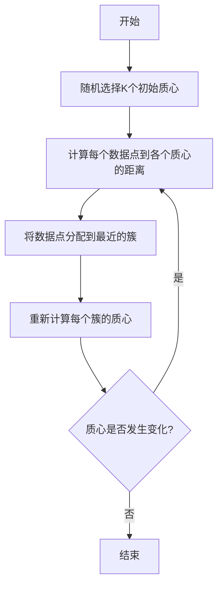
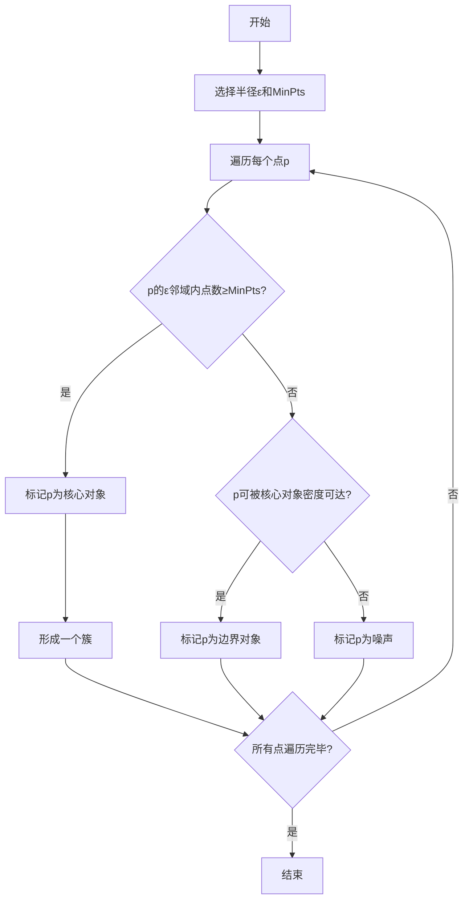
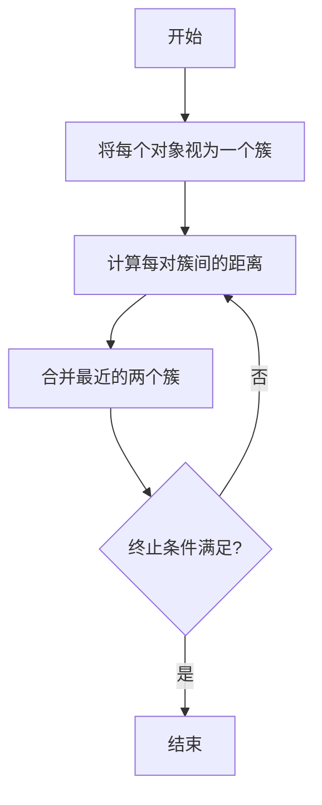

# 聚类算法(Clustering Algorithms) - 原理与代码实例讲解

## 1. 背景介绍

### 1.1 什么是聚类?

聚类(Clustering)是一种无监督学习技术,其目标是将数据集中的对象划分为若干个通常是不相交的子集(称为簇或cluster),使得同一个簇中的对象彼此相似,而不同簇之间的对象则不相似。聚类分析广泛应用于数据挖掘、图像分析、模式识别、信息检索等诸多领域。

### 1.2 聚类算法的应用场景

聚类算法可以应用于以下场景:

- 客户细分(Customer Segmentation)
- 基因组学(Genomics)
-计算机视觉(Computer Vision)
- 网页聚类(Web Clustering)
- 社交网络分析(Social Network Analysis)
- 异常检测(Anomaly Detection)

### 1.3 聚类算法的挑战

设计一个高效、准确的聚类算法并非易事,需要克服以下几个主要挑战:

- 确定最佳簇数量
- 处理高维数据集
- 发现任意形状的簇
- 处理噪声和异常值
- 提高算法的可伸缩性

## 2. 核心概念与联系

### 2.1 相似度度量

相似度度量是聚类算法的核心概念之一,用于量化数据对象之间的相似程度。常用的相似度度量包括:

- 欧几里得距离(Euclidean Distance)
- 曼哈顿距离(Manhattan Distance) 
- 余弦相似度(Cosine Similarity)
- Jaccard相似系数(Jaccard Similarity Coefficient)

### 2.2 聚类算法分类

根据聚类的原理和方法,聚类算法可分为以下几种类型:

- 分区聚类(Partitioning Clustering)
- 层次聚类(Hierarchical Clustering)
- 密度聚类(Density-based Clustering)
- 基于网格的聚类(Grid-based Clustering)
- 基于模型的聚类(Model-based Clustering)

### 2.3 聚类算法评估指标

评估聚类算法性能的常用指标包括:

- 簇内平方和(Intra-cluster Sum of Squares)
- 实洛伐距离(Silhouette Coefficient)
- 调整兰德指数(Adjusted Rand Index)
- 互信息(Mutual Information)

## 3. 核心算法原理具体操作步骤

### 3.1 K-Means聚类算法

K-Means是最经典的分区聚类算法,其步骤如下:

1. 随机选择K个初始质心
2. 计算每个数据点到各个质心的距离,将其分配到最近的簇
3. 重新计算每个簇的质心
4. 重复步骤2-3,直到质心不再发生变化或满足其他终止条件



### 3.2 DBSCAN密度聚类算法 

DBSCAN是基于密度的聚类算法,能发现任意形状的簇,其步骤如下:

1. 选择半径ε和最小点数MinPts
2. 对每个点p:
    - 如果p的ε邻域内点数≥MinPts,则p为核心对象
    - 如果p的ε邻域内点数<MinPts,但可被核心对象密度可达,则p为边界对象
    - 否则p为噪声
3. 对每个核心对象p,形成一个簇,包含p及其密度可达的所有对象



### 3.3 层次聚类算法

层次聚类算法将数据对象构建成一个层次结构,可分为自底向上(凝聚)和自顶向下(分裂)两种方式。

**凝聚聚类步骤:**

1. 将每个对象视为一个簇
2. 计算每对簇间的距离或相似度
3. 合并最近的两个簇
4. 重复步骤2-3,直到所有对象归为一个簇或满足其他终止条件



**分裂聚类步骤:**

1. 将所有对象视为一个簇
2. 计算每个簇的离散程度
3. 将离散程度最高的簇划分为两个簇
4. 重复步骤2-3,直到每个簇内对象足够紧凑或满足其他终止条件

## 4. 数学模型和公式详细讲解举例说明

### 4.1 K-Means目标函数

K-Means算法的目标是最小化所有簇内点到质心的平方距离之和,即:

$$J = \sum_{i=1}^{K}\sum_{x \in C_i}||x - \mu_i||^2$$

其中:
- $K$是簇的数量
- $C_i$是第$i$个簇
- $\mu_i$是第$i$个簇的质心
- $||x - \mu_i||$是数据点$x$到质心$\mu_i$的欧几里得距离

通过不断迭代更新簇分配和质心位置,算法会收敛到一个局部最优解。

### 4.2 DBSCAN核心概念

DBSCAN算法中的两个核心概念是:

- **ε-邻域(ε-neighborhood)**: 给定一个点$p$和半径$\epsilon$,点$p$的$\epsilon$-邻域是由所有距离$p$不超过$\epsilon$的点组成的集合,记为$N_\epsilon(p)$。

$$N_\epsilon(p) = \{q \in D | dist(p,q) \leq \epsilon\}$$

- **密度直达(density-reachable)**: 一个点$q$相对于$p$是密度直达的,如果存在一个点序列$p_1, p_2, ..., p_n$,使得$p_1 = p$,$p_n = q$,且$p_{i+1}$在$p_i$的$\epsilon$-邻域中,且$N_\epsilon(p_i)$中至少包含$MinPts$个点。

基于这两个概念,DBSCAN算法能有效发现任意形状的簇。

### 4.3 层次聚类距离度量

在层次聚类算法中,需要定义簇间距离的度量方式,常用的有:

- **最小距离(Single Linkage)**: 取两个簇中最近的两个对象之间的距离。
- **最大距离(Complete Linkage)**: 取两个簇中最远的两个对象之间的距离。  
- **平均距离(Average Linkage)**: 取两个簇中所有对象之间距离的平均值。
- **质心距离(Centroid Linkage)**: 取两个簇质心之间的距离。

不同的距离度量会导致聚类结果的差异,需要根据具体问题选择合适的度量方式。

## 5. 项目实践: 代码实例和详细解释说明

以下是使用Python中的scikit-learn库实现K-Means和DBSCAN聚类算法的代码示例:

### 5.1 K-Means聚类

```python
from sklearn.cluster import KMeans
import numpy as np

# 生成示例数据
X = np.array([[1, 2], [1, 4], [1, 0],
              [10, 2], [10, 4], [10, 0]])

# 初始化KMeans模型,设置簇数为2              
kmeans = KMeans(n_clusters=2, random_state=0)

# 训练模型
kmeans.fit(X)

# 获取簇标签
labels = kmeans.labels_

# 获取簇质心
centroids = kmeans.cluster_centers_

print("Cluster Labels:")
print(labels)

print("Centroids:")
print(centroids)
```

**代码解释:**

1. 导入KMeans类和numpy库。
2. 生成一个包含6个二维数据点的示例数据集X。
3. 初始化KMeans模型,设置簇数为2,随机状态为0(可重复结果)。
4. 在数据集X上训练KMeans模型。
5. 获取每个数据点的簇标签。
6. 获取每个簇的质心坐标。
7. 输出簇标签和质心。

### 5.2 DBSCAN密度聚类

```python
from sklearn.cluster import DBSCAN
from sklearn.preprocessing import StandardScaler
import numpy as np

# 生成示例数据
X = np.array([[1, 2], [2, 2], [2, 3], [8, 7], [8, 8], [25, 80]])

# 数据标准化
scaler = StandardScaler()
X_scaled = scaler.fit_transform(X)

# 初始化DBSCAN模型,设置ε=3,MinPts=2
dbscan = DBSCAN(eps=3, min_samples=2)

# 训练模型
dbscan.fit(X_scaled)

# 获取簇标签
labels = dbscan.labels_

print("Cluster Labels:")
print(labels)
```

**代码解释:**

1. 导入DBSCAN类、StandardScaler类和numpy库。
2. 生成一个包含6个二维数据点的示例数据集X。
3. 使用StandardScaler对数据进行标准化处理。
4. 初始化DBSCAN模型,设置ε=3,MinPts=2。
5. 在标准化后的数据集X_scaled上训练DBSCAN模型。
6. 获取每个数据点的簇标签。
7. 输出簇标签。

## 6. 实际应用场景

聚类算法在现实世界中有着广泛的应用,包括但不限于:

### 6.1 客户细分

通过对客户数据进行聚类,企业可以发现具有相似特征和行为模式的客户群体,从而制定更有针对性的营销策略和产品定位。

### 6.2 基因组学

在基因组学研究中,聚类算法可用于基因表达数据的分析,识别具有相似表达模式的基因簇,有助于揭示基因调控网络和生物学功能。

### 6.3 计算机视觉

在计算机视觉领域,聚类算法可用于图像分割、目标检测和跟踪等任务,将像素点或目标对象划分为不同的簇。

### 6.4 网页聚类

搜索引擎使用聚类算法对网页进行分组,从而为用户提供更加精准和有针对性的搜索结果。

### 6.5 社交网络分析

在社交网络分析中,聚类算法可用于发现社区结构、识别影响力用户等,为社交网络营销和信息传播提供支持。

### 6.6 异常检测

聚类算法还可用于异常检测,将离群点视为噪声或异常值,从而发现潜在的欺诈行为、系统故障等异常情况。

## 7. 工具和资源推荐

以下是一些流行的用于聚类分析的工具和资源:

### 7.1 Python库

- **scikit-learn**: 机器学习库,提供了多种聚类算法的实现。
- **Pandas**: 数据分析库,可用于数据预处理和可视化。
- **Matplotlib/Seaborn**: 数据可视化库,可用于可视化聚类结果。

### 7.2 R语言包

- **cluster**: 提供常见的聚类算法实现。
- **fpc**: 支持模糊聚类和密度聚类。
- **factoextra**: 用于可视化和解释聚类结果。

### 7.3 在线资源

- **Cluster Analysis基础教程**(DataCamp): https://www.datacamp.com/courses/cluster-analysis-in-python
- **Clustering算法可视化**(Leland Stanford Jr. University): https://stanford.edu/~cpiech/cs221/apps/clusterViz.html
- **Clustering算法动画演示**(University of Miami): https://www.cs.miami.edu/home/demos/codes/csklearn/

## 8. 总结: