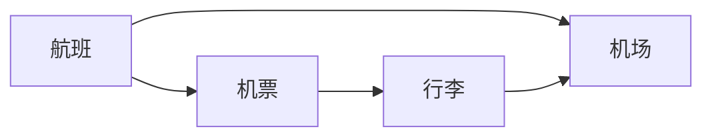

# 航空公司管理系统详细设计与具体代码实现

## 1. 背景介绍

航空公司是一个复杂的系统,需要管理多个不同的业务流程,包括机票预订、行李托运、航班调度、机场运营等。为了高效地管理这些流程,需要一个全面的航空公司管理系统。该系统需要具备多个模块,如机票预订系统、行李系统、机场运营系统等,这些模块相互协作,确保航空公司高效运营。

### 1.1 机票预订系统

机票预订系统是航空公司管理系统的核心模块之一。它允许乘客在线预订机票,并管理他们的行程。该系统还与其他模块集成,如行李系统和值机系统,为乘客提供无缝的旅行体验。

### 1.2 行李系统

行李系统负责跟踪和管理乘客的行李。它与机票预订系统集成,以获取乘客的行李信息。该系统还与机场运营系统集成,以确保行李在正确的时间和地点装载和卸载。

### 1.3 机场运营系统

机场运营系统管理机场的日常运营,包括航班调度、值机、安检等。它与其他模块集成,如机票预订系统和行李系统,以获取相关信息并协调各个流程。

## 2. 核心概念与联系

航空公司管理系统由多个模块组成,这些模块相互关联和协作,确保航空公司的高效运营。以下是一些核心概念及其关系:

### 2.1 航班(Flight)

航班是航空公司运营的基本单元。每个航班都有一个唯一的航班号、起飞和到达机场、日期和时间等信息。航班与机票预订、行李托运、机场运营等模块密切相关。

### 2.2 机票(Ticket)

机票是乘客购买的凭证,允许他们乘坐特定的航班。每张机票都与一个航班相关联,并包含乘客的个人信息、座位号等详细信息。机票预订系统负责管理机票的预订和出售。

### 2.3 行李(Baggage)

行李是乘客携带的个人物品。每件行李都与一个机票相关联,并有自己的唯一标识符。行李系统负责跟踪和管理行李,确保它们与正确的乘客和航班相匹配。

### 2.4 机场(Airport)

机场是航空公司运营的基地。每个机场都有自己的代码和位置信息。机场运营系统负责管理机场的日常运营,包括航班调度、值机、安检等。

### 2.5 核心关系

这些核心概念之间存在着紧密的关系,如下所示:



- 每个航班都有多张与之关联的机票。
- 每张机票都与一件或多件行李相关联。
- 每个航班都与起飞和到达机场相关联。
- 每件行李都与一个机场相关联,即装载或卸载的机场。

通过这些核心概念及其关系,航空公司管理系统可以高效地管理机票预订、行李托运、机场运营等流程。

## 3. 核心算法原理具体操作步骤

在航空公司管理系统中,有几个核心算法用于管理各种业务流程。以下是一些关键算法的原理和具体操作步骤:

### 3.1 航班调度算法

航班调度是航空公司运营的关键任务之一。它需要考虑多个因素,如机场容量、飞机可用性、乘客需求等。常用的航班调度算法包括:

1. **蚁群优化算法(Ant Colony Optimization, ACO)**

   蚁群优化算法模拟蚂蚁寻找食物的行为,用于解决航班调度问题。算法步骤如下:

   1) 初始化蚂蚁群和信息素矩阵。
   2) 对于每只蚂蚁,根据信息素浓度和启发式信息,构建一个可行的航班调度方案。
   3) 更新信息素矩阵,增强好的解决方案的信息素浓度。
   4) 重复步骤2和3,直到达到停止条件。

2. **模拟退火算法(Simulated Annealing, SA)**

   模拟退火算法借鉴了固体退火过程,用于航班调度问题。算法步骤如下:

   1) 初始化一个初始解决方案和初始温度。
   2) 在当前温度下,随机生成一个新的解决方案。
   3) 如果新解决方案比当前解决方案好,则接受新解决方案。否则,以一定概率接受新解决方案(模拟退火过程)。
   4) 降低温度,重复步骤2和3,直到达到停止条件。

这些算法可以有效地解决航班调度问题,并产生高质量的调度方案。

### 3.2 座位分配算法

座位分配是机票预订系统的一个重要功能。它需要考虑乘客的偏好、机舱布局等因素。常用的座位分配算法包括:

1. **贪心算法**

   贪心算法根据一定的启发式规则,每次分配最优的座位。算法步骤如下:

   1) 按照一定规则(如乘客级别、预订时间等)对乘客排序。
   2) 从第一个乘客开始,为每个乘客分配最优的座位。
   3) 重复步骤2,直到所有乘客都被分配到座位。

2. **图着色算法**

   图着色算法将座位分配问题建模为图着色问题。算法步骤如下:

   1) 构建一个无向图,其中节点表示乘客,边表示两个乘客之间的冲突(如同一家庭成员)。
   2) 使用图着色算法为每个节点(乘客)分配一种颜色(座位)。
   3) 将同一颜色的节点分配到相邻的座位。

这些算法可以有效地解决座位分配问题,提高乘客满意度。

## 4. 数学模型和公式详细讲解举例说明

在航空公司管理系统中,有几个核心数学模型和公式用于描述和优化各种业务流程。以下是一些关键模型和公式的详细讲解和举例说明:

### 4.1 航班网络流模型

航班网络流模型用于描述航空公司的航线网络,并优化航班调度和机队分配。该模型将航空公司的航线网络表示为一个有向图$G=(V,E)$,其中:

- $V$是节点集合,表示机场。
- $E$是边集合,表示航线。每条边$e_{ij} \in E$表示从机场$i$到机场$j$的航线。

在该模型中,我们定义以下变量和约束:

- $x_{ij}$: 表示从机场$i$到机场$j$的航班数量。
- $c_{ij}$: 表示从机场$i$到机场$j$的单位成本。
- $d_j$: 表示机场$j$的乘客需求。
- $s_i$: 表示机场$i$的机队容量。

目标函数为最小化总成本:

$$\min \sum_{(i,j) \in E} c_{ij}x_{ij}$$

约束条件包括:

- 流量守恒约束:对于每个机场$j$,进出航班数量之差等于需求$d_j$。
- 机队容量约束:对于每个机场$i$,出发航班数量不超过机队容量$s_i$。

通过求解这个网络流模型,我们可以获得最优的航班调度方案和机队分配方案。

### 4.2 座位分配模型

座位分配模型用于描述机舱座位分配问题,并优化乘客满意度。该模型将机舱座位表示为一个二维矩阵$S$,其中$S_{ij}$表示第$i$行第$j$列的座位。

我们定义以下变量和约束:

- $p_k$: 表示乘客$k$的座位偏好,可以用一个向量表示。
- $x_{ijk}$: 表示乘客$k$是否被分配到第$i$行第$j$列的座位,取值为0或1。
- $w_k$: 表示乘客$k$的权重,可以根据乘客级别或其他因素确定。

目标函数为最大化总满意度:

$$\max \sum_k w_k \sum_{i,j} p_k^T S_{ij} x_{ijk}$$

约束条件包括:

- 每个乘客只能分配一个座位。
- 相邻座位不能分配给不同家庭成员的乘客。
- 某些特殊座位(如紧急出口座位)只能分配给符合条件的乘客。

通过求解这个座位分配模型,我们可以获得最优的座位分配方案,提高乘客满意度。

这些数学模型和公式为航空公司管理系统提供了理论基础,并指导了算法和系统的设计和优化。

## 5. 项目实践:代码实例和详细解释说明

在本节中,我们将提供一些航空公司管理系统的代码实例,并对其进行详细解释。这些代码实例涵盖了系统的不同模块,如机票预订、行李管理和机场运营等。

### 5.1 机票预订模块

以下是一个简单的机票预订系统的代码实例,使用Python和Flask Web框架实现:

```python
from flask import Flask, render_template, request

app = Flask(__name__)

# 模拟航班数据
flights = [
    {'flight_num': 'AA123', 'origin': 'SFO', 'destination': 'JFK', 'departure': '2023-06-01 10:00', 'arrival': '2023-06-01 16:00'},
    {'flight_num': 'UA456', 'origin': 'LAX', 'destination': 'ORD', 'departure': '2023-06-02 08:00', 'arrival': '2023-06-02 12:00'},
    # 添加更多航班数据
]

# 主页路由
@app.route('/')
def index():
    return render_template('index.html', flights=flights)

# 预订机票路由
@app.route('/book', methods=['POST'])
def book():
    flight_num = request.form['flight_num']
    # 处理预订逻辑
    # ...
    return 'Booked flight ' + flight_num

if __name__ == '__main__':
    app.run(debug=True)
```

在这个示例中,我们首先定义了一个模拟的航班数据列表`flights`。然后,我们创建了两个路由:

1. `index()`路由渲染主页模板`index.html`,并传递`flights`数据。
2. `book()`路由处理机票预订请求。它从表单数据中获取航班号,然后执行预订逻辑(这里只是打印了一条消息)。

下面是`index.html`模板的代码:

```html
<!DOCTYPE html>
<html>
<head>
    <title>航空公司管理系统</title>
</head>
<body>
    <h1>航班列表</h1>
    <table>
        <tr>
            <th>航班号</th>
            <th>出发地</th>
            <th>目的地</th>
            <th>出发时间</th>
            <th>到达时间</th>
            <th>操作</th>
        </tr>
        
        <tr>
            <td>{{ flight.flight_num }}</td>
            <td>{{ flight.origin }}</td>
            <td>{{ flight.destination }}</td>
            <td>{{ flight.departure }}</td>
            <td>{{ flight.arrival }}</td>
            <td>
                <form action="/book" method="post">
                    <input type="hidden" name="flight_num" value="{{ flight.flight_num }}">
                    <input type="submit" value="预订">
                </form>
            </td>
        </tr>
        
    </table>
</body>
</html>
```

这个模板显示了所有可用航班的列表,并为每个航班提供了一个"预订"按钮。当用户点击"预订"按钮时,它会向`/book`路由发送一个POST请求,并传递航班号作为表单数据。

这个示例展示了如何使用Python和Flask构建一个简单的机票预订系统。在实际项目中,你需要添加更多功能,如用户认证、支付集成、数据库存储等。

### 5.2 行李管理模块

以下是一个简单的行李管理系统的代码实例,使用Java和Spring框架实现:

```java
import org.springframework.stereotype.Service;

import java.util.HashMap;
import java.util.Map;

@Service
public class BaggageService {
    private Map<String, Baggage> baggages = new HashMap<>();

    public void checkInB