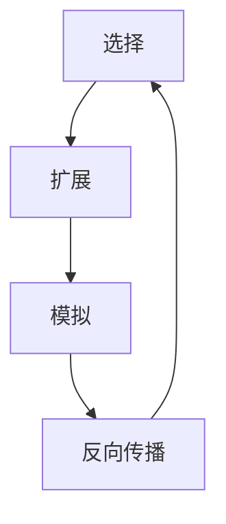
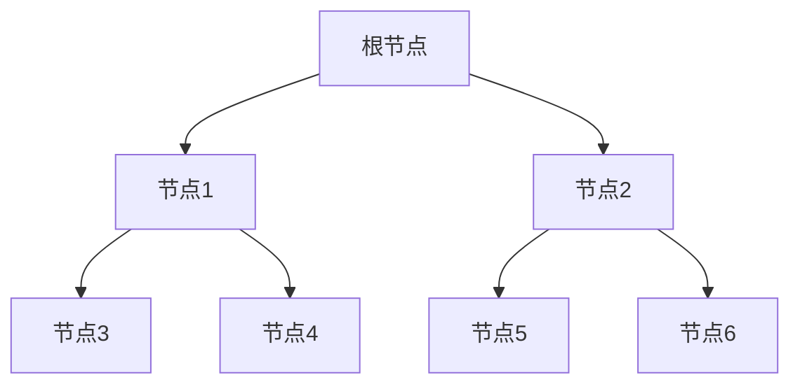

# 蒙特卡罗树搜索 (Monte Carlo Tree Search, MCTS) 原理与代码实例讲解

## 1. 背景介绍

### 1.1 什么是蒙特卡罗树搜索

蒙特卡罗树搜索 (Monte Carlo Tree Search, MCTS) 是一种基于随机采样的决策过程，用于在具有离散的时间步长的决策域中寻找最优解。它被广泛应用于游戏人工智能、规划和优化等领域。MCTS 算法通过反复构建树形结构来逐步改善其决策质量。

### 1.2 MCTS 的应用场景

MCTS 算法在以下领域有着广泛的应用:

- **游戏人工智能**: 如国际象棋、围棋、扑克等游戏的 AI 程序。
- **机器人规划**: 用于机器人路径规划、动作规划等。
- **组合优化**: 解决诸如工作流程调度、网络路由等组合优化问题。
- **计算机辅助设计**: 用于电路布线、芯片设计等领域。

### 1.3 MCTS 的优势

相比于其他搜索算法,MCTS 具有以下优势:

- **无需事先知识**: 不需要领域特定的启发式知识。
- **无偏差性**: 能够有效避免局部最优陷阱。
- **非对称性**: 能够在不平衡的树形结构中有效搜索。
- **非参数性**: 无需调整复杂的参数。
- **渐进收敛性**: 搜索时间越长,结果越精确。

## 2. 核心概念与联系

### 2.1 MCTS 的四个基本步骤

MCTS 算法由四个基本步骤组成,循环往复执行这四个步骤以构建逐渐完善的搜索树:



1. **选择 (Selection)**: 从树的根节点开始,根据某种策略选择移动,一直到达树的叶子节点。
2. **扩展 (Expansion)**: 从选择到的叶子节点处创建一个或多个子节点,并将它们添加到树中。
3. **模拟 (Simulation)**: 从新创建的节点开始,运行一个随机模拟,直到达到终止条件。
4. **反向传播 (Backpropagation)**: 将模拟的结果从新节点沿着选择的路径向上传播,更新每个节点的统计数据。

### 2.2 选择策略: UCB1

在选择步骤中,MCTS 通常使用 UCB1 (Upper Confidence Bound 1) 策略来平衡探索和利用。UCB1 公式如下:

$$
\text{UCB1} = \overline{X_j} + C \sqrt{\frac{2 \ln n_i}{n_j}}
$$

其中:
- $\overline{X_j}$ 是节点 j 的平均回报
- $n_i$ 是父节点 i 被访问的次数
- $n_j$ 是节点 j 被访问的次数
- $C$ 是一个常数,用于控制探索和利用的权衡

UCB1 策略倾向于选择具有较高回报和较少访问次数的节点,从而在探索和利用之间达到平衡。

### 2.3 蒙特卡罗模拟

在模拟步骤中,MCTS 从新扩展的节点开始执行一个随机模拟,直到达到终止条件。这个随机模拟通常由一个简单的策略驱动,例如随机游走或基于一些启发式规则。模拟的结果用于更新搜索树中相应节点的统计数据。

### 2.4 反向传播

在反向传播步骤中,模拟的结果从新扩展的节点沿着之前选择的路径向上传播,更新每个节点的统计数据。常见的统计数据包括:

- **访问次数 (N)**: 节点被访问的次数。
- **总回报 (W)**: 所有从该节点开始的模拟的累计回报。
- **平均回报 (Q)**: 总回报除以访问次数,即 $Q = W / N$。

通过不断更新这些统计数据,MCTS 可以逐步改善其对每个节点的评估,从而提高决策质量。

## 3. 核心算法原理具体操作步骤

下面是 MCTS 算法的伪代码:

```
函数 MCTS(根节点):
    while 时间未耗尽:
        叶子节点 = 树策略(根节点)
        模拟结果 = 默认策略(叶子节点)
        反向传播(叶子节点, 模拟结果)
    返回 根节点的子节点中具有最高访问次数的节点

函数 树策略(节点):
    while 节点不是叶子节点:
        如果 节点没有未探索的子节点:
            节点 = 最优子节点(节点)  # 使用 UCB1 选择策略
        else:
            未探索的子节点 = 节点的某个未探索的子节点
            添加未探索的子节点到树中
            返回 未探索的子节点

函数 最优子节点(节点):
    let 最优分数 = -无穷大
    let 最优子节点 = null
    for 每个子节点 in 节点的子节点:
        let exploitation = 子节点的平均回报
        let exploration = 探索项(节点, 子节点)
        let 分数 = exploitation + exploration
        if 分数 > 最优分数:
            最优分数 = 分数
            最优子节点 = 子节点
    返回 最优子节点

函数 探索项(父节点, 子节点):
    return 探索常数 * sqrt(log(父节点的访问次数) / 子节点的访问次数)

函数 反向传播(节点, 模拟结果):
    while 节点不是 null:
        节点的访问次数 += 1
        节点的总回报 += 模拟结果
        节点 = 节点的父节点
```

该算法的核心步骤如下:

1. **初始化根节点**。
2. **重复以下步骤直到时间耗尽**:
   a. 使用树策略从根节点选择一个叶子节点。
   b. 从选择的叶子节点开始执行一次随机模拟。
   c. 将模拟结果沿着选择的路径向上反向传播,更新每个节点的统计数据。
3. **从根节点的子节点中选择访问次数最多的节点作为最优决策**。

树策略的关键在于使用 UCB1 公式平衡探索和利用。具体来说,对于每个节点,它会计算其每个子节点的 UCB1 分数,然后选择分数最高的子节点继续向下搜索。

反向传播过程会更新从叶子节点到根节点路径上每个节点的统计数据,包括访问次数、总回报和平均回报。通过不断重复这个过程,算法可以逐步改善其对每个节点的评估。

## 4. 数学模型和公式详细讲解举例说明

### 4.1 UCB1 公式推导

UCB1 公式源自于多臂老虎机问题 (Multi-Armed Bandit Problem),旨在平衡探索和利用。我们先来看看这个问题的形式化描述。

假设有 $K$ 个老虎机臂,每次拉动第 $i$ 个臂会获得一个服从某个未知分布 $\nu_i$ 的奖励 $X_i$。我们的目标是最大化获得的累计奖励。一种天真的策略是固定选择单个臂,但这可能会错过其他潜在的高回报臂。另一种策略是均匀地探索所有臂,但这又浪费了太多时间在低回报臂上。

UCB1 策略提供了一种平衡探索和利用的方法。对于第 $i$ 个臂,我们定义其 UCB1 值为:

$$
\text{UCB1}_i = \overline{X_i} + \sqrt{\frac{2 \ln n}{n_i}}
$$

其中 $\overline{X_i}$ 是第 $i$ 个臂的平均奖励, $n_i$ 是第 $i$ 个臂被选择的次数, $n$ 是总的选择次数。

直观上,UCB1 值由两部分组成:
1. **利用项 $\overline{X_i}$**: 表示该臂的历史平均回报,利用这个臂的潜力。
2. **探索项 $\sqrt{\frac{2 \ln n}{n_i}}$**: 随着 $n_i$ 增大而减小,这鼓励我们探索那些访问次数较少的臂。

在每一步,我们选择 UCB1 值最大的臂。可以证明,这种策略能够在 $O(\log n)$ 的范数界内接近最优累计奖励。

在 MCTS 中,我们将每个节点视为一个老虎机臂,其奖励是从该节点开始的模拟路径的累计回报。UCB1 公式用于在节点的历史平均回报和探索新节点之间进行权衡。

### 4.2 UCB1 应用举例

假设我们有一个二叉树,其中每个节点代表一个状态,边代表可能的动作。我们的目标是找到从根节点到叶子节点的最大累计奖励路径。



假设在某个时刻,各节点的统计数据如下:

| 节点 | 访问次数 | 总回报 | 平均回报 | UCB1 值 |
|------|----------|--------|-----------|---------|
| 根节点  | 10       | 40     | 4         | 4 + 1.63 = 5.63 |
| 节点1  | 6        | 18     | 3         | 3 + 2.16 = 5.16 |
| 节点2  | 4        | 22     | 5.5       | 5.5 + 2.83 = 8.33 |
| 节点3  | 3        | 6      | 2         | 2 + 3.46 = 5.46 |
| 节点4  | 3        | 12     | 4         | 4 + 3.46 = 7.46 |
| 节点5  | 2        | 14     | 7         | 7 + 4.24 = 11.24 |
| 节点6  | 2        | 8      | 4         | 4 + 4.24 = 8.24 |

其中 UCB1 值按照公式 $\text{UCB1} = \overline{X} + \sqrt{\frac{2 \ln n_\text{parent}}{n}}$ 计算,其中 $n_\text{parent}$ 是父节点的访问次数。

根据 UCB1 值,MCTS 将选择节点5作为下一步扩展的节点,因为它具有最高的 UCB1 值 11.24。这样做可以在利用节点5的高平均回报和探索新节点之间达到平衡。

通过不断重复选择、扩展、模拟和反向传播的过程,MCTS 将逐步改善对每个节点的评估,最终找到从根节点到叶子节点的最优路径。

## 5. 项目实践: 代码实例和详细解释说明

下面是一个使用 Python 实现的 MCTS 示例,用于解决简单的井字游戏问题。

### 5.1 游戏状态表示

我们首先定义一个类来表示游戏状态:

```python
class GameState:
    def __init__(self, board=None):
        self.board = board or [0] * 9  # 表示 3x3 的棋盘
        self.current_player = 1  # 1 表示玩家 1, -1 表示玩家 -1

    def next_state(self, action):
        # 返回执行 action 后的新状态
        new_board = self.board.copy()
        new_board[action] = self.current_player
        return GameState(new_board), self.current_player * -1

    def legal_actions(self):
        # 返回合法的动作列表
        return [i for i, v in enumerate(self.board) if v == 0]

    def is_terminal(self):
        # 检查是否达到终止状态
        lines = [self.board[0:3], self.board[3:6], self.board[6:9], # 行
                 self.board[0:9:3], self.board[1:9:3], self.board[2:9:3], # 列
                 self.board[0:9:4], self.board[2:7:2]] # 对角线
        if [sum(l) for l in lines].count(3) >= 1 or [sum(l) for l in lines].count(-3) >= 1:
            return True  # 