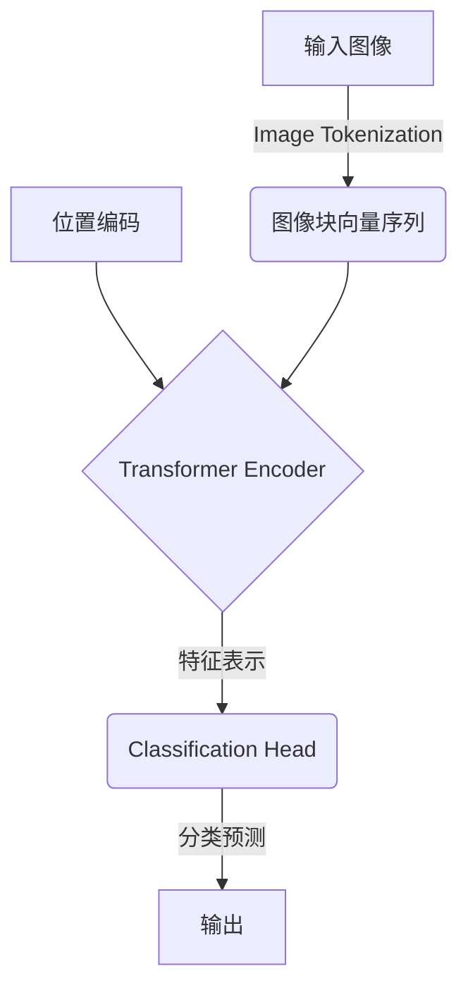

# 视觉Transformer原理与代码实例讲解

## 1.背景介绍

在计算机视觉领域,卷积神经网络(CNN)长期占据主导地位,在图像分类、目标检测、语义分割等任务中取得了巨大成功。然而,CNN在处理长程依赖关系时存在一些局限性,这使得它在一些复杂的视觉任务上表现不佳。为了解决这个问题,Transformer模型应运而生,它最初是为自然语言处理任务而设计的,后来也被成功应用到了计算机视觉领域,称为视觉Transformer(Visual Transformer,ViT)。

视觉Transformer通过自注意力机制直接建模图像中的长程依赖关系,避免了CNN中的局部邻域约束。它将图像分割成一系列patches(图像块),并将每个patch投影到一个向量序列中,然后使用Transformer编码器对这些向量序列进行处理。视觉Transformer在许多视觉任务上展现出了出色的性能,如图像分类、目标检测、实例分割等,并且在一些任务上甚至超过了CNN的表现。

## 2.核心概念与联系

视觉Transformer的核心思想是将图像视为一个序列,并使用Transformer编码器对该序列进行建模。具体来说,它包含以下几个关键概念:

### 2.1 Image Tokenization

将输入图像分割成一系列patches(图像块),每个patch被投影到一个固定维度的向量空间中,形成一个向量序列。这个过程被称为Image Tokenization,类似于自然语言处理中的词嵌入(Word Embedding)。

### 2.2 Position Embedding

由于Transformer没有像CNN那样的位置感知能力,因此需要为每个patch添加位置信息,这就是Position Embedding。它可以是预定义的或者可学习的。

### 2.3 Transformer Encoder

将Image Tokenization和Position Embedding得到的向量序列输入到标准的Transformer Encoder中,利用多头自注意力机制捕获长程依赖关系。Transformer Encoder的输出就是对应图像的特征表示。

### 2.4 Classification Head

在图像分类任务中,将Transformer Encoder的输出通过一个简单的前馈神经网络(MLP)进行分类预测。对于其他任务,如目标检测、实例分割等,则需要设计相应的头部(Head)来处理Transformer Encoder的输出。



上图展示了视觉Transformer的基本结构和工作流程。它首先将输入图像切分成一系列图像块(patches),并将每个块投影到一个向量空间中,形成一个向量序列。然后,将这个向量序列和位置编码(Position Embedding)一起输入到Transformer Encoder中进行处理。Transformer Encoder的输出就是对应图像的特征表示,可以将其输入到不同的头部(Head)中,用于执行不同的视觉任务,如图像分类、目标检测等。

## 3.核心算法原理具体操作步骤  

视觉Transformer的核心算法原理可以分为以下几个步骤:

### 3.1 Image Tokenization

1) 将输入图像划分为一个个固定大小的patches(图像块),例如每个patch的大小为16x16像素。
2) 将每个patch展平(Flatten)成一个向量,例如16x16的patch被展平成一个256维的向量。
3) 为每个向量添加一个可学习的嵌入向量(Embedding Vector),将所有向量拼接在一起,形成最终的Image Tokens序列。

### 3.2 Position Embedding

1) 为每个Image Token生成对应的Position Embedding,用于提供位置信息。
2) Position Embedding可以是预定义的或者可学习的。
3) 将Image Tokens和对应的Position Embedding相加,作为Transformer Encoder的输入。

### 3.3 Transformer Encoder

1) 输入序列被馈送到标准的Transformer Encoder中,通过多头自注意力机制捕获长程依赖关系。
2) Transformer Encoder由多个相同的Encoder Block组成,每个Block包含一个多头自注意力层(Multi-Head Attention)和一个前馈神经网络(Feed-Forward Network)。
3) 在每个Encoder Block中,先进行多头自注意力计算,然后是前馈神经网络计算,并使用残差连接(Residual Connection)和层归一化(Layer Normalization)。
4) Transformer Encoder的输出就是对应输入图像的特征表示。

### 3.4 Classification Head

1) 对于图像分类任务,将Transformer Encoder的输出[CLS]向量(对应于预留的Classification Token)输入到一个简单的前馈神经网络(MLP)中。
2) MLP的输出就是图像的分类概率预测。

以上就是视觉Transformer的核心算法原理和具体操作步骤。需要注意的是,不同的视觉Transformer模型可能在细节上有所不同,但是基本思路和流程是相似的。

## 4.数学模型和公式详细讲解举例说明

为了更好地理解视觉Transformer的工作原理,我们需要深入探讨其中涉及的数学模型和公式。

### 4.1 Image Tokenization

Image Tokenization的目的是将输入图像$I$划分为一系列patches(图像块),并将每个patch映射到一个固定维度的向量空间中。具体步骤如下:

1) 将输入图像$I \in \mathbb{R}^{H \times W \times C}$划分为一个个$P \times P$大小的patches,其中$H$和$W$分别表示图像的高度和宽度,$C$表示通道数。
2) 将每个patch展平(Flatten)成一个向量$x_p \in \mathbb{R}^{P^2 \cdot C}$。
3) 为每个向量$x_p$添加一个可学习的嵌入向量$E \in \mathbb{R}^{(P^2 \cdot C) \times D}$,得到Image Token $z_p$:

$$z_p = x_pE^T$$

其中,$D$是预定义的嵌入维度。

4) 将所有Image Tokens拼接成一个序列$Z = [z_1, z_2, ..., z_N] \in \mathbb{R}^{N \times D}$,其中$N = HW/P^2$是Image Tokens的总数。

通过Image Tokenization,我们将原始的图像$I$转换成了一个Image Tokens序列$Z$,每个Token对应于图像中的一个patch,并且具有固定的嵌入维度$D$。

### 4.2 Position Embedding

由于Transformer缺乏像CNN那样的位置感知能力,因此需要为每个Image Token添加位置信息。这可以通过Position Embedding来实现。

Position Embedding可以是预定义的或者可学习的。对于预定义的Position Embedding,常见的方法是使用正弦/余弦函数:

$$PE(pos, 2i) = sin(pos/10000^{2i/D})$$
$$PE(pos, 2i+1) = cos(pos/10000^{2i/D})$$

其中,$pos$是Token的位置索引,$i$是维度索引,$D$是嵌入维度。

对于可学习的Position Embedding,我们可以定义一个可学习的位置嵌入矩阵$P \in \mathbb{R}^{N \times D}$,其中每一行对应于一个Token的位置嵌入向量。

无论使用哪种Position Embedding,最终我们都需要将其与Image Tokens相加,作为Transformer Encoder的输入:

$$X = Z + PE$$

其中,$X \in \mathbb{R}^{N \times D}$是Transformer Encoder的输入序列。

### 4.3 Transformer Encoder

Transformer Encoder是视觉Transformer的核心部分,它通过多头自注意力机制捕获长程依赖关系,并生成图像的特征表示。

Transformer Encoder由多个相同的Encoder Block组成,每个Encoder Block包含一个多头自注意力层(Multi-Head Attention)和一个前馈神经网络(Feed-Forward Network)。

#### 4.3.1 Multi-Head Attention

多头自注意力层的计算过程如下:

1) 将输入序列$X$通过三个不同的线性变换,得到查询(Query)、键(Key)和值(Value)向量:

$$Q = XW_Q, K = XW_K, V = XW_V$$

其中,$W_Q, W_K, W_V$分别是可学习的权重矩阵。

2) 计算注意力权重:

$$Attention(Q, K, V) = softmax(\frac{QK^T}{\sqrt{d_k}})V$$

其中,$d_k$是缩放因子,用于防止内积过大导致梯度消失或爆炸。

3) 多头注意力机制将注意力计算分成多个头(Head),每个头对应一个注意力计算,最后将所有头的结果拼接起来:

$$MultiHead(Q, K, V) = Concat(head_1, ..., head_h)W^O$$
$$head_i = Attention(QW_i^Q, KW_i^K, VW_i^V)$$

其中,$W_i^Q, W_i^K, W_i^V$是每个头对应的可学习权重矩阵,$W^O$是最终的线性变换。

4) 多头自注意力层的输出是多头注意力计算的结果与输入序列$X$相加,并进行层归一化(Layer Normalization)。

#### 4.3.2 Feed-Forward Network

前馈神经网络(FFN)是Transformer Encoder中的另一个关键部分,它对每个位置的特征向量进行独立的非线性变换。

FFN的计算过程如下:

$$FFN(x) = max(0, xW_1 + b_1)W_2 + b_2$$

其中,$W_1, W_2$是可学习的权重矩阵,$b_1, b_2$是可学习的偏置项。FFN首先对输入$x$进行线性变换,然后应用ReLU激活函数,再进行另一个线性变换。

FFN的输出与其输入相加,并进行层归一化(Layer Normalization)。

通过多个Encoder Block的堆叠,Transformer Encoder可以有效地捕获输入序列中的长程依赖关系,并生成对应的特征表示。

### 4.4 Classification Head

对于图像分类任务,我们需要将Transformer Encoder的输出[CLS]向量(对应于预留的Classification Token)输入到一个简单的前馈神经网络(MLP)中,以获得图像的分类概率预测。

MLP的计算过程如下:

$$y = softmax(W_2(max(0, W_1[CLS] + b_1)) + b_2)$$

其中,$W_1, W_2$是可学习的权重矩阵,$b_1, b_2$是可学习的偏置项。MLP首先对[CLS]向量进行线性变换,然后应用ReLU激活函数,再进行另一个线性变换,最后使用softmax函数获得分类概率预测$y$。

通过上述数学模型和公式,我们可以更好地理解视觉Transformer的内部工作机制,并为进一步优化和改进视觉Transformer模型奠定基础。

## 5.项目实践:代码实例和详细解释说明

为了更好地理解视觉Transformer的原理和实现,我们将使用PyTorch框架提供一个简单的代码示例。该示例实现了一个基本的视觉Transformer模型,用于图像分类任务。

### 5.1 导入必要的库

```python
import torch
import torch.nn as nn
import torch.nn.functional as F
from einops import rearrange
```

我们将使用PyTorch作为深度学习框架,并导入一些必要的库,如`einops`用于张量操作。

### 5.2 实现Image Tokenization和Position Embedding

```python
class ImageTokenizer(nn.Module):
    def __init__(self, img_size, patch_size, embed_dim):
        super().__init__()
        self.img_size = img_size
        self.patch_size = patch_size
        self.num_patches = (img_size // patch_size) ** 2
        self.embed_dim = embed_dim

        self.patch_embed = nn.Conv2d(3, embed_dim, kernel_size=patch_size, stride=patch_size)
        self.pos_embed = nn.Parameter(torch.randn(1, self.num_patches + 1, embed_dim))

    def forward(self, x):
        x = self.patch_embed(x)  # (batch_size, embed_dim, h, w)
        x = rearrange(x, 'b c h w -> b (h w) c')  # (batch_size, num_patches, embed_dim)
        x += self.pos_embed[:, 1:]  # Add position embedding
        return x
```

在`ImageTokenizer`类中,我们实现了Image Tokenization和Position Embedding的功能。

- `__init__`方法中,我们初始化了一些重要的参数,如图像大小、patch大小和嵌入维度。
- `patch_embed`是一个卷积层,用于将每