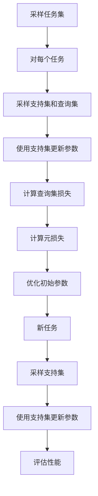

# 解锁MAML高阶应用:多任务学习实战

## 1.背景介绍

### 1.1 多任务学习概述

在现实世界中,我们经常会遇到需要同时解决多个相关但不同的任务的情况。传统的机器学习方法通常是为每个任务单独训练一个模型,这种做法存在一些缺陷:

1. 训练成本高昂,需要为每个任务准备大量的标注数据
2. 不利于知识迁移,每个模型都是从头开始学习
3. 难以捕捉任务之间的相关性和共享知识

多任务学习(Multi-Task Learning, MTL)应运而生,旨在通过同时学习多个相关任务,提高模型的泛化能力,降低训练成本。MTL的核心思想是在神经网络的底层提取出多个任务共享的表示,在顶层为每个任务分别构建专门的输出层。这种结构使得模型能够从相关任务中学习到通用的知识表示,并利用这些知识来帮助每个单一任务的学习。

### 1.2 MAML算法介绍  

模型无关的元学习算法(Model-Agnostic Meta-Learning, MAML)是一种重要的元学习方法,可以高效地解决多任务学习和少样本学习等问题。MAML的核心思想是:在元训练阶段,通过在一系列任务上优化模型参数,使得模型能够快速适应新的任务;在元测试阶段,对于一个新的任务,只需少量数据和少量梯度更新步骤,就可以获得良好的性能。

MAML算法的优势在于:

1. 无需修改模型结构,可插入任何神经网络中
2. 在元测试阶段快速适应新任务,节省数据和计算资源
3. 可扩展到多任务学习、强化学习等多种场景

## 2.核心概念与联系

### 2.1 元学习与MAML

元学习(Meta-Learning)是机器学习中的一个重要概念,指的是"学习如何学习"。具体来说,就是设计一种学习算法,使其能够从一系列相关任务的经验中学习到一些元知识,从而在面对新的任务时,能够更快地适应和学习。

MAML算法就是一种元学习算法,它的目标是在元训练阶段学习到一个好的初始化参数,使得在元测试阶段,只需少量数据和少量梯度更新步骤,就可以快速适应新任务。

MAML的核心思想可以概括为两个步骤:

1. 内循环(Inner Loop):使用支持集(Support Set)对模型进行少量梯度更新,得到针对该任务的适应性参数
2. 外循环(Outer Loop):使用查询集(Query Set)计算损失,并对初始参数进行优化,使其在多个任务上都有良好的适应性

通过这种方式,MAML能够在元训练阶段从多个任务中提取出一些通用的知识,并在元测试阶段快速将这些知识迁移到新任务上。

### 2.2 MAML与多任务学习

多任务学习旨在同时学习多个相关任务,以提高模型的泛化能力。而MAML算法可以看作是一种特殊的多任务学习方法,其中每个任务都是一个小数据集。

在传统的多任务学习中,我们通常会在网络的底层提取出多个任务共享的表示,在顶层为每个任务分别构建专门的输出层。而MAML则采用了一种更加灵活的方式:在元训练阶段,通过优化一个好的初始参数,使得模型能够快速适应新的任务;在元测试阶段,对于每个新任务,只需少量数据和少量梯度更新步骤,就可以获得良好的性能。

因此,MAML不仅可以解决多任务学习问题,还可以扩展到其他领域,如少样本学习、强化学习等。无论是在多任务学习还是其他场景,MAML都能够充分利用相关任务之间的知识共享,提高模型的泛化能力和适应性。

## 3.核心算法原理具体操作步骤

MAML算法的核心思想是:在元训练阶段,通过在一系列任务上优化模型参数,使得模型能够快速适应新的任务;在元测试阶段,对于一个新的任务,只需少量数据和少量梯度更新步骤,就可以获得良好的性能。具体操作步骤如下:

### 3.1 元训练阶段

1. 从任务分布$p(\mathcal{T})$中采样一批任务$\mathcal{T}_i$
2. 对于每个任务$\mathcal{T}_i$:
    - 从$\mathcal{T}_i$中采样一个支持集$\mathcal{D}_i^{tr}$和一个查询集$\mathcal{D}_i^{val}$
    - 使用支持集$\mathcal{D}_i^{tr}$对模型参数$\theta$进行$k$步梯度更新,得到适应性参数$\theta_i'$:
        
        $$\theta_i' = \theta - \alpha \nabla_\theta \sum_{(x,y) \in \mathcal{D}_i^{tr}} \mathcal{L}(f_\theta(x), y)$$
        
        其中$\alpha$是学习率,$\mathcal{L}$是损失函数,$f_\theta$是模型。
        
3. 使用查询集$\mathcal{D}_i^{val}$计算适应性参数$\theta_i'$在该任务上的损失:
    
    $$\mathcal{L}_i(\theta_i') = \sum_{(x,y) \in \mathcal{D}_i^{val}} \mathcal{L}(f_{\theta_i'}(x), y)$$
    
4. 对所有任务的损失求和,得到元损失函数:

    $$\mathcal{L}_\text{meta}(\theta) = \sum_{\mathcal{T}_i \sim p(\mathcal{T})} \mathcal{L}_i(\theta_i')$$
    
5. 使用元损失函数对初始参数$\theta$进行优化,得到新的$\theta$

### 3.2 元测试阶段

对于一个新的任务$\mathcal{T}_{new}$:

1. 从$\mathcal{T}_{new}$中采样一个支持集$\mathcal{D}_{new}^{tr}$
2. 使用支持集$\mathcal{D}_{new}^{tr}$对初始参数$\theta$进行$k$步梯度更新,得到适应性参数$\theta_{new}'$
3. 在$\mathcal{T}_{new}$的测试集上评估$\theta_{new}'$的性能

通过上述步骤,MAML算法能够在元训练阶段从多个任务中提取出一些通用的知识,并在元测试阶段快速将这些知识迁移到新任务上,从而实现快速适应新任务的目标。

### 3.3 MAML算法流程图



## 4.数学模型和公式详细讲解举例说明

MAML算法的核心数学模型是基于梯度下降的元优化过程。我们将通过具体例子来详细讲解相关公式。

### 4.1 元训练阶段

假设我们有一个二分类问题的数据集$\mathcal{D} = \{(x_i, y_i)\}_{i=1}^N$,其中$x_i \in \mathbb{R}^d$是输入,$y_i \in \{0, 1\}$是标签。我们使用一个简单的线性分类器$f_\theta(x) = \sigma(w^Tx + b)$,其中$\theta = (w, b)$是模型参数,$\sigma$是sigmoid函数。

对于一个任务$\mathcal{T}_i$,我们从$\mathcal{D}$中采样一个支持集$\mathcal{D}_i^{tr}$和一个查询集$\mathcal{D}_i^{val}$。我们使用交叉熵损失函数:

$$\mathcal{L}(f_\theta(x), y) = -y \log f_\theta(x) - (1-y) \log (1-f_\theta(x))$$

在内循环中,我们使用支持集$\mathcal{D}_i^{tr}$对模型参数$\theta$进行$k$步梯度更新,得到适应性参数$\theta_i'$:

$$\theta_i' = \theta - \alpha \nabla_\theta \sum_{(x,y) \in \mathcal{D}_i^{tr}} \mathcal{L}(f_\theta(x), y)$$

其中$\alpha$是学习率。

在外循环中,我们使用查询集$\mathcal{D}_i^{val}$计算适应性参数$\theta_i'$在该任务上的损失:

$$\mathcal{L}_i(\theta_i') = \sum_{(x,y) \in \mathcal{D}_i^{val}} \mathcal{L}(f_{\theta_i'}(x), y)$$

对所有任务的损失求和,得到元损失函数:

$$\mathcal{L}_\text{meta}(\theta) = \sum_{\mathcal{T}_i \sim p(\mathcal{T})} \mathcal{L}_i(\theta_i')$$

我们使用元损失函数对初始参数$\theta$进行优化,得到新的$\theta$。

### 4.2 元测试阶段

对于一个新的任务$\mathcal{T}_{new}$,我们从$\mathcal{D}$中采样一个支持集$\mathcal{D}_{new}^{tr}$,使用支持集对初始参数$\theta$进行$k$步梯度更新,得到适应性参数$\theta_{new}'$:

$$\theta_{new}' = \theta - \alpha \nabla_\theta \sum_{(x,y) \in \mathcal{D}_{new}^{tr}} \mathcal{L}(f_\theta(x), y)$$

然后,我们在$\mathcal{T}_{new}$的测试集上评估$\theta_{new}'$的性能,例如计算分类准确率。

通过上述过程,MAML算法能够在元训练阶段从多个任务中提取出一些通用的知识,并在元测试阶段快速将这些知识迁移到新任务上,从而实现快速适应新任务的目标。

## 5.项目实践:代码实例和详细解释说明

为了更好地理解MAML算法,我们将通过一个实际的代码示例来演示如何实现MAML算法。在这个示例中,我们将使用MAML算法解决一个简单的少样本分类问题。

### 5.1 数据准备

我们使用Omniglot数据集,它包含来自50个不同字母表的手写字符图像。我们将每个字母表视为一个独立的任务,每个任务包含20个字符类别。我们将数据集划分为元训练集、元验证集和元测试集。

```python
import omniglot
import torch

# 加载数据集
omniglot_dataset = omniglot.Omniglot(root='./data', download=True)

# 划分数据集
meta_train_dataset, meta_val_dataset, meta_test_dataset = omniglot_dataset.split_dataset()
```

### 5.2 模型定义

我们使用一个简单的卷积神经网络作为基础模型。

```python
import torch.nn as nn

class OmniglotModel(nn.Module):
    def __init__(self):
        super(OmniglotModel, self).__init__()
        self.conv1 = nn.Conv2d(1, 64, kernel_size=3, padding=1)
        self.bn1 = nn.BatchNorm2d(64)
        self.conv2 = nn.Conv2d(64, 64, kernel_size=3, padding=1)
        self.bn2 = nn.BatchNorm2d(64)
        self.conv3 = nn.Conv2d(64, 64, kernel_size=3, padding=1)
        self.bn3 = nn.BatchNorm2d(64)
        self.conv4 = nn.Conv2d(64, 64, kernel_size=3, padding=1)
        self.bn4 = nn.BatchNorm2d(64)
        self.fc = nn.Linear(64, 20)

    def forward(self, x):
        x = F.max_pool2d(F.relu(self.bn1(self.conv1(x))), 2)
        x = F.max_pool2d(F.relu(self.bn2(self.conv2(x))), 2)
        x = F.max_pool2d(F.relu(self.bn3(self.conv3(x))), 2)
        x = F.max_pool2d(F.relu(self.bn4