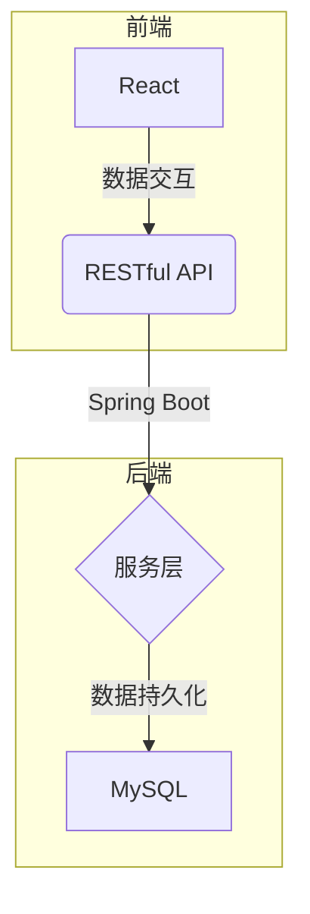
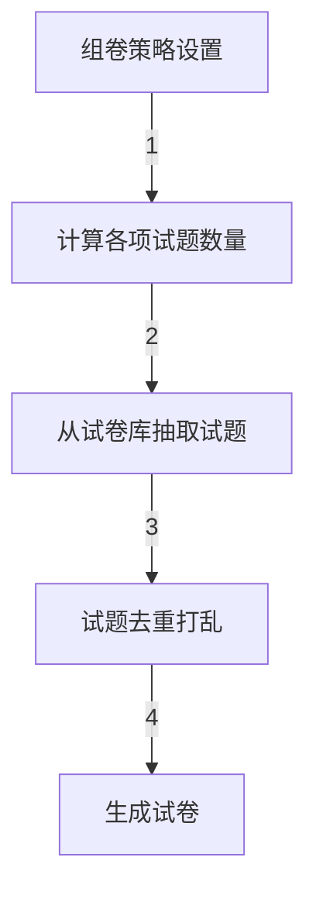
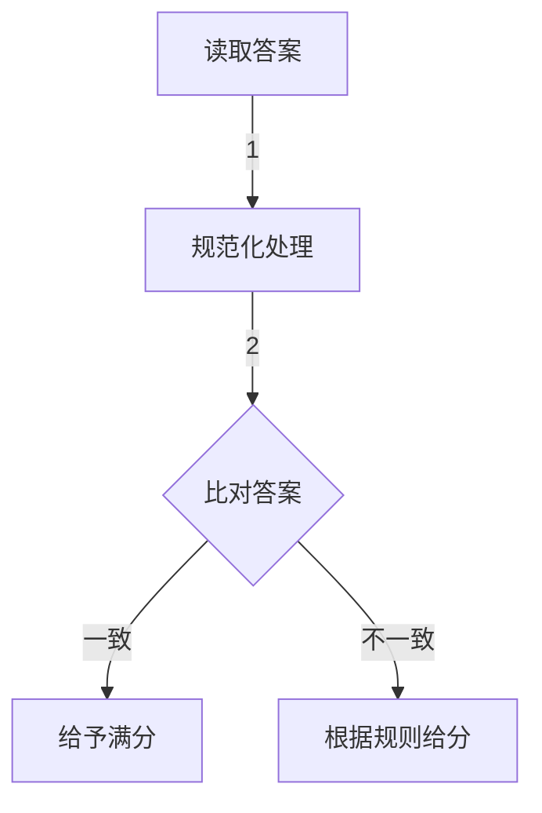
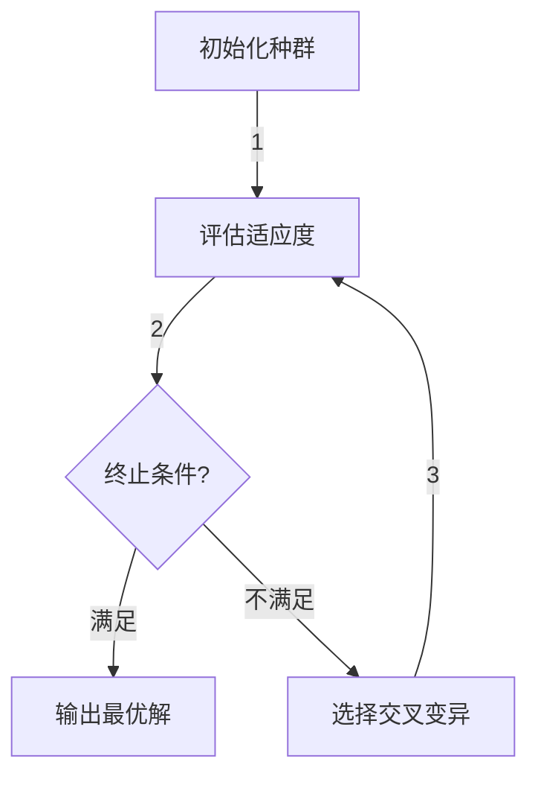

# 试卷管理系统详细设计与具体代码实现

## 1.背景介绍

随着教育信息化进程的不断推进,试卷管理系统在教育领域发挥着越来越重要的作用。传统的纸质试卷管理模式存在诸多弊端,如工作量大、效率低下、容易出错等。因此,构建一套高效、安全、易用的试卷管理系统,对于提高教学质量、节省人力物力成本具有重要意义。

试卷管理系统的主要功能包括:试卷库管理、试卷组卷、阅卷评分、成绩统计分析等。系统需要满足教师、学生、管理员等不同角色的使用需求,并对试卷信息、成绩数据等实现严格的权限控制和安全保护。

### 1.1 系统目标
- 提高试卷管理效率,节省人力物力成本
- 实现试卷信息数字化,提高信息安全性
- 为不同角色提供人性化的使用界面和功能
- 支持在线组卷、阅卷、成绩统计分析等功能
- 确保系统的可扩展性、可维护性和可靠性

### 1.2 系统架构
系统采用B/S架构,前端使用React框架,后端使用Spring Boot框架,数据库使用MySQL。前后端分离设计,通过RESTful API进行数据交互。



## 2.核心概念与联系

### 2.1 试卷库管理
试卷库是存储试题的中央仓库,包括单选题、多选题、判断题、简答题等多种题型。试题具有唯一编号,并按知识点、难度等属性进行分类管理。

### 2.2 试卷组卷
组卷是根据教学大纲要求,从试卷库中按照一定规则和策略抽取试题,生成试卷的过程。常用策略包括:
- 按知识点比例抽题
- 按难度级别比例抽题
- 题型设置
- 分值设置

### 2.3 阅卷评分
阅卷是指批改试卷、给出评分的过程。对于选择题和判断题,可以自动阅卷;对于简答题和作文题,需要人工阅卷并评分。

### 2.4 成绩统计分析
成绩统计分析模块对学生的考试成绩进行汇总、分析,生成多维度的成绩报表,为教学评估和教学改进提供决策依据。

## 3.核心算法原理具体操作步骤

### 3.1 试卷组卷算法

试卷组卷的核心算法是从试卷库中按照预先设定的规则和策略抽取试题,生成符合要求的试卷。常见的组卷策略包括:

1. 按知识点比例抽题
2. 按难度级别比例抽题 
3. 按题型比例抽题
4. 设置每个知识点的试题数量
5. 设置每个难度级别的试题数量
6. 设置每种题型的试题数量

组卷算法的具体步骤如下:

1. 根据预设的组卷策略,计算每个知识点、难度级别、题型所需的试题数量
2. 从试卷库中按照计算结果随机抽取相应数量的试题
3. 对抽取的试题进行去重、打乱顺序等处理
4. 根据题型要求,拼装成完整的试卷格式



组卷算法的关键在于如何根据多种策略进行试题抽取,并保证试卷质量。可以采用启发式算法、遗传算法等方法寻找最优解。

### 3.2 自动阅卷算法

对于选择题、判断题等题型,可以采用自动阅卷算法进行评分。算法原理是将学生的答案与预设的标准答案进行比对,给出得分。

自动阅卷算法步骤:

1. 读取学生答案和标准答案
2. 将答案进行规范化处理(去除空格、大小写等)
3. 比对学生答案与标准答案是否一致
4. 如果一致,给出满分;否则根据评分规则给出部分分数



自动阅卷算法适用于闭卷题型,对于开放性的题型则需要人工阅卷。

## 4.数学模型和公式详细讲解举例说明

在试卷组卷过程中,我们需要根据预设的知识点分布、难度分布、题型分布等策略,从试卷库中抽取试题,生成满足要求的试卷。这可以建模为一个约束优化问题。

### 4.1 优化目标函数

我们的目标是生成一份质量最优的试卷,因此需要定义一个目标函数来衡量试卷质量。常见的指标包括:

- 知识点覆盖率:试卷包含知识点的比例
- 难度分布合理性:试题难度分布与预期相符的程度
- 题型分布合理性:试题题型分布与预期相符的程度
- 分值分布合理性:试题分值分布与预期相符的程度

我们可以将这些指标线性组合,得到目标函数:

$$
\max \sum_{i=1}^{n} w_i f_i(x)
$$

其中:
- $n$为指标个数
- $w_i$为第$i$个指标的权重
- $f_i(x)$为第$i$个指标的评分函数
- $x$为试卷方案,包含所选试题的集合

### 4.2 约束条件

在优化过程中,我们需要满足以下约束条件:

1. 试题总分值约束:

$$
\sum_{j=1}^{m} x_j s_j = S
$$

其中:
- $m$为试卷库中试题总数
- $x_j$为0-1变量,表示第$j$个试题是否被选中
- $s_j$为第$j$个试题的分值
- $S$为预设的试卷总分值

2. 知识点分布约束:

$$
\frac{\sum_{j=1}^{m} x_j k_{ij}}{K_i} = p_i, \quad i=1,2,...,l
$$

其中:
- $l$为知识点总数
- $k_{ij}$为0-1变量,表示第$j$个试题是否属于第$i$个知识点
- $K_i$为第$i$个知识点的总题量
- $p_i$为第$i$个知识点在试卷中的预设占比

3. 难度分布约束、题型分布约束等其他约束条件可以类似地建模

### 4.3 求解方法

上述优化问题属于整数线性规划问题,是NP难问题,可以使用启发式算法或者遗传算法等方法求解。

以遗传算法为例,我们可以:

1. 将试题集合编码为一个01串,作为基因型
2. 定义适应度函数为目标函数,评估个体的优劣
3. 使用选择、交叉、变异等遗传操作产生新一代种群
4. 不断迭代直到满足停止条件,得到最优解



通过数学建模和求解,我们可以得到满足各种约束条件的最优试卷方案。

## 5.项目实践:代码实例和详细解释说明

### 5.1 试卷库管理模块

试卷库管理模块负责试题的增删改查操作,以及试题分类管理等功能。

```java
// 试题实体类
@Entity
public class Question {
    @Id
    private String id; // 试题编号
    private String content; // 试题内容
    private String answer; // 标准答案
    private int score; // 分值
    private QuestionType type; // 题型
    private QuestionLevel level; // 难度级别
    private List<String> knowledgePoints; // 所属知识点
    // 构造函数、getter/setter方法
}

// 试题库服务接口
public interface QuestionService {
    List<Question> findAll();
    Question findById(String id);
    void save(Question question);
    void delete(String id);
    // 其他方法
}

// 试题库服务实现
@Service
public class QuestionServiceImpl implements QuestionService {
    @Autowired
    private QuestionRepository questionRepo;

    public List<Question> findAll() {
        return questionRepo.findAll();
    }

    public Question findById(String id) {
        return questionRepo.findById(id).orElse(null);
    }

    public void save(Question question) {
        questionRepo.save(question);
    }

    public void delete(String id) {
        questionRepo.deleteById(id);
    }

    // 其他方法实现
}
```

### 5.2 试卷组卷模块

试卷组卷模块根据预设的组卷策略,从试卷库中抽取试题生成试卷。

```java
// 试卷实体类
@Entity
public class Paper {
    @Id
    private String id;
    private String name; // 试卷名称
    private int totalScore; // 总分值
    private List<Question> questions; // 试题列表
    // 构造函数、getter/setter方法
}

// 组卷策略配置类
@Component
public class PaperConfig {
    private Map<String, Double> knowledgePointRatios; // 知识点占比
    private Map<QuestionLevel, Double> levelRatios; // 难度级别占比
    private Map<QuestionType, Integer> typeNumbers; // 题型数量
    // getter/setter方法
}

// 组卷服务接口
public interface PaperService {
    Paper generatePaper(PaperConfig config);
    // 其他方法
}

// 组卷服务实现(使用遗传算法)
@Service
public class PaperServiceImpl implements PaperService {
    @Autowired
    private QuestionService questionService;

    public Paper generatePaper(PaperConfig config) {
        // 1. 初始化种群
        Population population = initPopulation(config);

        // 2. 迭代进化
        while (!stopCondition()) {
            // 2.1 评估适应度
            evaluateFitness(population, config);

            // 2.2 选择
            population = selection(population);

            // 2.3 交叉
            population = crossover(population);

            // 2.4 变异
            population = mutation(population);
        }

        // 3. 获取最优解
        Individual bestIndividual = population.getBestIndividual();
        return generatePaperFromIndividual(bestIndividual);
    }

    // 其他方法实现
}
```

### 5.3 阅卷评分模块

阅卷评分模块负责对学生的试卷进行阅卷评分,包括自动阅卷和人工阅卷两种方式。

```java
// 学生答案实体类
@Entity
public class Answer {
    @Id
    private String id;
    private String studentId; // 学生编号
    private String paperId; // 试卷编号
    private Map<String, String> questionAnswers; // 问题答案映射
    // 构造函数、getter/setter方法
}

// 阅卷服务接口
public interface GradingService {
    void gradeAnswers(List<Answer> answers);
    // 其他方法
}

// 阅卷服务实现
@Service
public class GradingServiceImpl implements GradingService {
    @Autowired
    private QuestionService questionService;

    public void gradeAnswers(List<Answer> answers) {
        for (Answer answer : answers) {
            double totalScore = 0;
            for (Map.Entry<String, String> entry : answer.getQuestionAnswers().entrySet()) {
                String questionId = entry.getKey();
                String studentAnswer = entry.getValue();
                Question question = questionService.findById(questionId);
                double score = gradeQuestion(question, studentAnswer);
                totalScore += score;
            }
            // 保存总分
        }
    }

    private double gradeQuestion(Question question, String studentAnswer) {
        // 对于选择题、判断题等闭卷题型,执行自动阅卷
        if (question.getType().isClosedBook()) {
            return autoGrading(question, studentAnswer);
        }
        // 对于开放性题型,执行人工阅卷
        else {
            return manualGrading(question, studentAnswer);
        }
    }

    private double autoGrading(Question question, String{"msg_type":"generate_answer_finish","data":"","from_module":null,"from_unit":null}