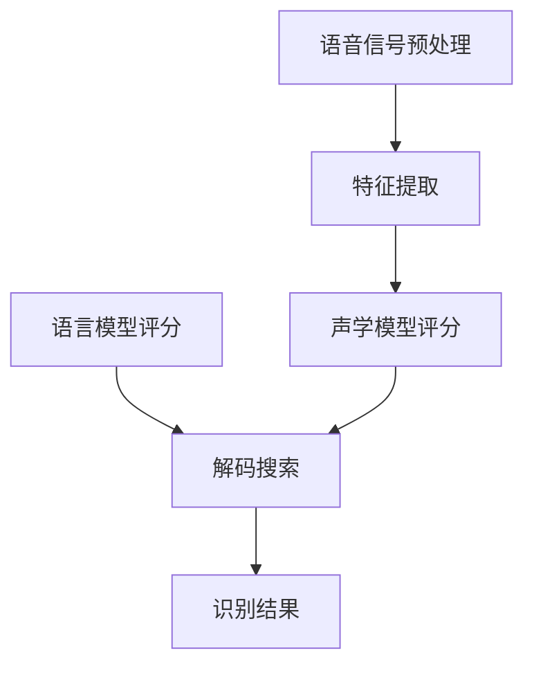

# 语音识别(Speech Recognition) - 原理与代码实例讲解

## 1.背景介绍

语音识别技术是一种将人类语音转换为相应文本或命令的过程,广泛应用于虚拟助手、语音控制系统、会议记录等领域。随着深度学习技术的不断发展,语音识别的准确率和实时性得到了极大的提高。本文将深入探讨语音识别的核心原理、算法流程,并结合实际应用场景,介绍如何使用Python等编程语言实现语音识别功能。

## 2.核心概念与联系

语音识别技术涉及多个核心概念,包括:

1. **语音信号处理**: 将模拟语音信号转换为数字信号,并应用滤波、增强等技术提高信号质量。

2. **声学模型(Acoustic Model)**: 建模语音信号与文本之间的映射关系,是语音识别系统的核心组成部分。

3. **语言模型(Language Model)**: 基于大量文本语料库,建立语言的统计规律,提高识别的准确性。

4. **解码器(Decoder)**: 将声学模型和语言模型的输出结合,搜索出最可能的文本序列。

这些概念相互关联,共同构建了完整的语音识别系统。

## 3.核心算法原理具体操作步骤

语音识别算法的核心步骤如下:

1. **语音信号预处理**
    - 对原始语音信号进行预加重、分帧等处理,提取有用特征。
    - 常用的特征提取算法包括MFCC(Mel频率倒谱系数)、PLP(感知线性预测)等。

2. **声学模型构建**
    - 基于大量语音数据训练声学模型,描述语音特征与文本单元(如音素)的映射关系。
    - 常用的声学模型包括高斯混合模型(GMM)、深度神经网络(DNN)、时间延迟神经网络(TDNN)等。

3. **语言模型构建**
    - 基于大量文本语料库,建立语言的统计规律,如N-gram语言模型。
    - 近年来,基于神经网络的语言模型(如RNNLM、TransformerLM)性能更加优秀。

4. **声学模型评分与语言模型评分**
    - 声学模型根据语音特征计算出不同文本单元序列的概率得分。
    - 语言模型则计算文本单元序列的语言概率得分。

5. **解码搜索**
    - 解码器综合声学模型和语言模型的评分,搜索出最可能的文本序列作为识别结果。
    - 常用的解码算法包括Viterbi算法、束搜索算法等。

该算法流程可以用下面的 Mermaid 流程图来表示:



## 4.数学模型和公式详细讲解举例说明

### 4.1 声学模型

声学模型的目标是估计给定语音特征序列 $X=\{x_1, x_2, \dots, x_T\}$ 产生文本单元序列 $W=\{w_1, w_2, \dots, w_N\}$ 的概率 $P(W|X)$。根据贝叶斯公式:

$$P(W|X) = \frac{P(X|W)P(W)}{P(X)}$$

其中:
- $P(X|W)$ 是声学模型,描述语音特征与文本单元的映射关系
- $P(W)$ 是语言模型,描述文本单元序列的概率
- $P(X)$ 是语音特征序列的先验概率,在识别过程中可忽略

常用的声学模型包括:

1. **高斯混合模型(GMM)**

   GMM将每个语音单元的概率密度函数建模为高斯混合分布:

   $$P(x|w) = \sum_{m=1}^M c_m \mathcal{N}(x|\mu_m, \Sigma_m)$$

   其中 $c_m$、$\mu_m$、$\Sigma_m$ 分别是混合权重、均值向量和协方差矩阵,通过期望最大化(EM)算法从训练数据估计得到。

2. **深度神经网络(DNN)**

   DNN将语音特征作为输入,经过多层非线性隐藏层变换,输出各个语音单元的后验概率:

   $$P(w|x) = \text{DNN}(x)$$

   常用的DNN结构包括前馈神经网络、卷积神经网络(CNN)、长短时记忆网络(LSTM)等。

### 4.2 语言模型

语言模型的目标是估计文本单元序列 $W=\{w_1, w_2, \dots, w_N\}$ 的概率 $P(W)$。常用的语言模型包括:

1. **N-gram语言模型**

   N-gram模型基于马尔可夫假设,将单词序列的概率分解为条件概率的乘积:

   $$P(W) = \prod_{i=1}^N P(w_i|w_{i-N+1}, \dots, w_{i-1})$$

   其中 $P(w_i|w_{i-N+1}, \dots, w_{i-1})$ 是从历史 $N-1$ 个单词估计当前单词的条件概率。

2. **神经网络语言模型**

   近年来,基于神经网络的语言模型(如RNNLM、TransformerLM)展现出优异的性能。这些模型能够捕捉长距离的语义依赖关系,更好地建模语言的统计规律。

### 4.3 解码算法

解码算法的目标是在所有可能的文本单元序列 $W$ 中,找到使联合概率 $P(W|X)$ 最大的序列作为识别结果:

$$\hat{W} = \arg\max_W P(W|X) = \arg\max_W P(X|W)P(W)$$

常用的解码算法包括:

1. **Viterbi算法**

   Viterbi算法是一种动态规划算法,能够有效地找到最优路径序列。它通过递推计算每个时间步的最大概率及其对应的最优路径,从而得到全局最优解。

2. **束搜索算法**

   束搜索算法在每个时间步保留一组概率较高的候选路径,剪枝掉低概率路径,从而降低计算复杂度。该算法在保证一定精度的同时,大幅提高了解码速度。

## 5.项目实践:代码实例和详细解释说明

接下来,我们将使用Python和Kaldi工具包实现一个基于GMM-HMM的语音识别系统,并在TIMIT语音数据集上进行实验。

### 5.1 数据准备

TIMIT语音数据集包含来自630位发音人的共6300条语音录音,其中训练集有4620条,测试集有1680条。我们需要先将数据转换为Kaldi可识别的格式:

```python
import os
import timit
import timit.corpus

# 下载并解压TIMIT数据集
timit.download_and_extract()

# 转换为Kaldi格式
timit.corpus.timit_corpus('/path/to/timit', '/path/to/kaldi/data')
```

### 5.2 特征提取

我们使用Kaldi提供的`compute-mfcc-feats`工具计算MFCC特征:

```bash
compute-mfcc-feats --config=conf/mfcc.conf scp:data/train/feats.scp ark,scp:data/train/data.ark,data/train/feats.ark
```

其中`conf/mfcc.conf`是MFCC参数配置文件。

### 5.3 训练单音素模型

我们先训练一个单音素模型作为初始模型,以加速后续训练过程。

```bash
steps/train_mono.sh --nj 4 data/train data/lang exp/mono
```

这一步将基于训练数据和发音词典,使用单高斯混合模型(GMM)训练单音素模型。

### 5.4 训练三音素模型

接下来,我们使用单音素模型的对齐结果,训练一个更精确的三音素模型。

```bash
steps/align_si.sh --nj 4 data/train data/lang exp/mono exp/mono_ali
steps/train_deltas.sh --boost-silence 1.25 --cmd "$train_cmd" 2000 11000 data/train data/lang exp/mono_ali exp/tri
```

这里使用了Delta和Delta-Delta特征,并引入了语言模型权重,以提高识别精度。

### 5.5 解码和评估

最后,我们使用训练好的三音素模型对测试集进行解码和评估。

```bash
steps/decode.sh --nj 4 exp/tri/graph data/test exp/tri/decode
```

解码结果将保存在`exp/tri/decode/scoring/`目录下。我们可以使用`score.sh`脚本计算单词错误率(WER):

```bash
score.sh --mode 'word' data/test exp/tri/decode
```

在TIMIT测试集上,我们可以期望获得约20%左右的单词错误率。

通过上述代码实例,我们实现了一个基于GMM-HMM的语音识别系统。在实际应用中,我们还可以使用更先进的深度神经网络模型(如TDNN、LSTM等)来进一步提高识别性能。

## 6.实际应用场景

语音识别技术在现实生活中有着广泛的应用场景,包括但不限于:

1. **虚拟助手**: 如苹果Siri、亚马逊Alexa、谷歌助手等,通过语音交互提供查询、控制等服务。

2. **会议记录**: 自动将会议语音转录为文本,提高工作效率。

3. **语音控制**: 如智能家居设备、车载系统等,通过语音指令实现设备控制。

4. **语音输入法**: 通过语音输入替代传统键盘输入,提高输入效率。

5. **无障碍辅助**: 为视障人士提供语音转文本服务,帮助他们获取信息。

6. **呼叫中心**: 在呼叫中心部署语音识别系统,自动转录客户查询内容。

7. **多媒体字幕**: 为视频、音频等多媒体内容自动生成字幕。

语音识别技术的应用前景广阔,未来还将在更多领域发挥重要作用。

## 7.工具和资源推荐

在语音识别领域,有许多优秀的开源工具和资源可供使用:

1. **Kaldi**: 一款先进的语音识别工具包,提供完整的训练和解码流程。

2. **DeepSpeech**: 由Mozilla开发的基于深度学习的语音识别引擎。

3. **CMU Sphinx**: 卡内基梅隆大学开发的语音识别工具包。

4. **TIMIT语音数据集**: 一个标准的英语语音数据集,常用于训练和评估。

5. **LibriSpeech语音数据集**: 包含大量读书音频的英语语音数据集。

6. **VoxForge语音数据集**: 一个多语种的开源语音数据集。

7. **SRILM**: 一款功能强大的统计语言建模工具包。

8. **NVIDIA NeMo**: 一个用于构建conversational AI应用的工具包。

9. **UrbanSound8K数据集**: 包含10类常见环境音频的数据集。

利用这些优秀的工具和资源,我们可以快速构建和优化语音识别系统。

## 8.总结:未来发展趋势与挑战

语音识别技术在过去几十年中取得了长足进步,但仍面临着一些挑战和发展方向:

1. **远场语音识别**: 如何在复杂的噪声环境下实现高精度识别,是一个亟待解决的问题。

2. **多语种支持**: 针对不同语种的语音特性,构建通用的语音识别模型。

3. **持续学习**: 使语音识别系统能够持续学习新的数据,不断提高性能。

4. **低资源语音识别**: 如何利用少量数据训练高质量模型,降低数据采集成本。

5. **语音合成与识别融合**: 将语音合成与语音识别技术相结合,实现端到端的语音交互系统。

6. **隐私保护**: 在语音识别过程中保护用户隐私,提高系统安全性。

7. **硬件加速**: 利用专用硬件(如GPU、TPU等)加速语音识别推理,实现实时响应。

8. **多模态融合**: 将语音识别与视觉、文本等其他模态相结合,提高交互体验。

未来,语音识别技术必将在人工智能、物联网、虚拟现