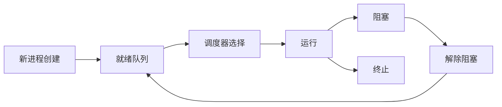

# 调度器 原理与代码实例讲解

## 1.背景介绍

在现代计算机系统中,调度器扮演着至关重要的角色。它负责管理和分配系统资源,确保多个进程能够高效地共享CPU时间和内存等资源,从而实现多任务并发执行。无论是操作系统、数据库、分布式系统还是其他复杂的软件系统,调度器都是不可或缺的核心组件。

调度器的设计和实现直接影响着系统的性能、响应时间、吞吐量、公平性和资源利用率等多个关键指标。因此,深入理解调度器的工作原理、算法和实现技术,对于构建高性能、可扩展的系统至关重要。

## 2.核心概念与联系

### 2.1 进程与线程

进程(Process)是计算机系统进行资源分配和调度的基本单位。每个进程都有自己的地址空间、数据栈、执行计数器等资源。线程(Thread)是进程中的执行流,它共享进程的地址空间和资源,但拥有自己的执行计数器、栈和寄存器等。

大多数现代操作系统都支持多线程,这使得单个进程可以同时执行多个任务,提高了资源利用率和系统吞吐量。调度器需要在进程和线程两个层次上进行调度。

### 2.2 上下文切换

上下文切换(Context Switch)是指CPU从一个进程或线程切换到另一个进程或线程的过程。在切换时,需要保存当前进程或线程的执行状态(寄存器值、内存映射等),并加载新进程或线程的执行状态。上下文切换的开销是调度器需要考虑的重要因素。

### 2.3 调度策略

调度策略决定了调度器如何选择下一个要运行的进程或线程。常见的调度策略包括:

- 先来先服务(FCFS)
- 短作业优先(SJF)
- 优先级调度
- 时间片轮转(RR)
- 多级反馈队列

不同的调度策略针对不同的场景,在公平性、响应时间、吞吐量等方面有不同的权衡。

### 2.4 死锁与饥饿

死锁(Deadlock)是指两个或多个进程或线程由于相互持有对方所需资源而永远阻塞的情况。饥饿(Starvation)是指某个进程或线程无法获得所需资源而长期得不到调度的情况。调度器需要采取适当的策略来预防和避免死锁和饥饿的发生。

## 3.核心算法原理具体操作步骤

调度器的核心算法包括进程或线程的创建、就绪、运行、阻塞和终止等状态转换,以及相应的调度策略。下面我们详细介绍这些算法的原理和具体操作步骤。



### 3.1 进程/线程创建

1. 为新进程或线程分配必要的资源,包括内存空间、PCB(进程控制块)等。
2. 初始化进程或线程的执行环境,包括代码、数据、堆栈等。
3. 将新创建的进程或线程插入就绪队列,等待调度器选择执行。

### 3.2 就绪队列管理

就绪队列存放所有可运行的进程或线程。调度器根据特定的调度策略从就绪队列中选择下一个要运行的进程或线程。

1. 按照调度策略(如优先级、到达时间等)对就绪队列进行排序。
2. 当有新的进程或线程就绪时,将其插入到合适的位置。
3. 当进程或线程被阻塞或终止时,从就绪队列中移除。

### 3.3 进程/线程调度

1. 根据调度策略从就绪队列中选择下一个要运行的进程或线程。
2. 保存当前运行进程或线程的执行状态(上下文切换)。
3. 加载选中的进程或线程的执行状态,并将其转移到运行状态。
4. 分配CPU时间片(如果采用时间片轮转调度策略)。

### 3.4 进程/线程阻塞与解除阻塞

1. 当进程或线程发出I/O请求或等待某些事件发生时,将其从运行状态转移到阻塞状态。
2. 将阻塞的进程或线程移出就绪队列,并将其加入相应的等待队列。
3. 当进程或线程所等待的事件发生时(如I/O操作完成),将其从等待队列移回就绪队列,等待调度器选择执行。

### 3.5 进程/线程终止

1. 当进程或线程完成执行或出现异常时,进入终止状态。
2. 释放进程或线程占用的所有资源,包括内存、文件等。
3. 从就绪队列和其他相关队列中移除该进程或线程。
4. 通知父进程或线程该进程或线程已终止。

## 4.数学模型和公式详细讲解举例说明

在调度器的设计和分析中,常常需要使用数学模型和公式来量化和优化系统性能。下面我们介绍一些常用的数学模型和公式。

### 4.1 响应时间模型

响应时间(Response Time)是指从提交请求到收到响应所经历的时间。对于交互式系统,响应时间直接影响用户体验。我们可以使用下面的公式来估计响应时间:

$$响应时间 = 等待时间 + 服务时间$$

其中,等待时间是指请求在就绪队列中等待的时间,服务时间是指实际执行该请求所需的时间。

调度策略的目标之一是尽量减小响应时间,特别是对于交互式任务。我们可以通过优化调度策略、增加资源等方式来缩短响应时间。

### 4.2 利用率模型

CPU利用率(Utilization)是衡量系统资源利用效率的重要指标。在单CPU系统中,CPU利用率可以用下面的公式计算:

$$CPU利用率 = \frac{忙时间}{忙时间+空闲时间}$$

在多CPU系统中,我们需要考虑负载均衡问题,计算整体CPU利用率:

$$总体CPU利用率 = \frac{\sum_i^n 忙时间_i}{\sum_i^n (忙时间_i+空闲时间_i)}$$

其中,n是CPU的数量。

调度策略的另一个目标是最大化CPU利用率,充分利用系统资源。我们可以通过优化调度算法、减少上下文切换开销等方式来提高CPU利用率。

### 4.3 公平性模型

在多任务环境中,公平性(Fairness)是一个重要的考虑因素。我们希望每个进程或线程都能获得合理的资源份额,避免出现某些任务长期无法获得服务的情况。

我们可以使用标准差来衡量公平性:

$$标准差 = \sqrt{\frac{\sum_i^n (x_i - \overline{x})^2}{n}}$$

其中,x_i是第i个任务的响应时间或其他性能指标,\overline{x}是所有任务的平均值,n是任务数量。

标准差越小,说明各个任务之间的性能差异越小,公平性越好。调度策略需要在性能和公平性之间进行权衡。

### 4.4 优先级反向现象

在采用优先级调度策略时,可能会出现优先级反向(Priority Inversion)的现象。这种情况下,低优先级任务反而比高优先级任务先执行,导致高优先级任务的响应时间变长。

我们可以使用优先级继承(Priority Inheritance)协议来解决这个问题。具体来说,当一个高优先级任务被阻塞时,它会将优先级临时继承给阻塞它的低优先级任务,从而确保高优先级任务能够尽快解除阻塞。

## 5.项目实践:代码实例和详细解释说明

为了更好地理解调度器的工作原理和实现技术,我们将通过一个简单的进程调度器示例来进行说明。这个示例使用C++语言实现,并采用时间片轮转(RR)调度策略。

### 5.1 进程和PCB的定义

首先,我们定义进程(Process)和进程控制块(PCB)的数据结构:

```cpp
// 进程状态
enum ProcessState {
    READY, RUNNING, BLOCKED
};

// 进程控制块
struct PCB {
    int pid;                    // 进程ID
    ProcessState state;         // 进程状态
    int priority;               // 进程优先级
    int remainingTime;          // 剩余执行时间
    // 其他进程信息...
};

// 进程
struct Process {
    PCB pcb;                    // 进程控制块
    std::string name;           // 进程名称
    int burstTime;              // 总执行时间
    // 其他进程信息...
};
```

每个进程都有一个唯一的进程ID(pid)、状态(state)、优先级(priority)和剩余执行时间(remainingTime)等信息,这些信息存储在PCB中。Process结构体则包含了PCB和其他进程相关的信息。

### 5.2 就绪队列和阻塞队列

我们使用std::list容器来实现就绪队列和阻塞队列:

```cpp
std::list<PCB*> readyQueue;     // 就绪队列
std::list<PCB*> blockedQueue;   // 阻塞队列
```

就绪队列存放所有可运行的进程的PCB指针,阻塞队列存放所有被阻塞的进程的PCB指针。

### 5.3 时间片轮转调度算法

时间片轮转(RR)调度算法的核心思想是将CPU时间划分为多个时间片,每个进程轮流执行一个时间片。当一个进程的时间片用完时,它会被切换出去,等待下一轮调度。

我们定义一个调度器类Scheduler来实现RR调度算法:

```cpp
class Scheduler {
private:
    int timeSlice;              // 时间片长度
    PCB* currentProcess;        // 当前运行的进程
    int currentTimeSlice;       // 当前时间片剩余时间

public:
    Scheduler(int slice) : timeSlice(slice), currentProcess(nullptr), currentTimeSlice(0) {}

    void addProcess(Process& p) {
        PCB* pcb = &p.pcb;
        pcb->state = READY;
        readyQueue.push_back(pcb);
    }

    void schedule() {
        // 如果当前进程的时间片用完或就绪队列为空,切换到下一个进程
        if (currentTimeSlice == 0 || readyQueue.empty()) {
            if (currentProcess != nullptr) {
                currentProcess->state = READY;
                readyQueue.push_back(currentProcess);
            }
            if (!readyQueue.empty()) {
                currentProcess = readyQueue.front();
                readyQueue.pop_front();
                currentProcess->state = RUNNING;
                currentTimeSlice = timeSlice;
            } else {
                currentProcess = nullptr;
            }
        }

        // 如果有当前进程在运行,执行一个时间单位
        if (currentProcess != nullptr) {
            currentProcess->remainingTime--;
            currentTimeSlice--;

            // 如果进程执行完毕,将其从就绪队列中移除
            if (currentProcess->remainingTime == 0) {
                currentProcess->state = READY;
                readyQueue.remove(currentProcess);
                currentProcess = nullptr;
            }
        }
    }

    // 其他辅助函数...
};
```

在Scheduler类中,我们定义了时间片长度timeSlice、当前运行进程currentProcess和当前时间片剩余时间currentTimeSlice等成员变量。

addProcess()函数用于将新进程插入就绪队列。schedule()函数实现了RR调度算法的核心逻辑:

1. 检查当前进程的时间片是否用完或就绪队列是否为空,如果是,则切换到下一个进程。
2. 如果有当前进程在运行,执行一个时间单位,并更新剩余时间和当前时间片。
3. 如果当前进程执行完毕,将其从就绪队列中移除。

### 5.4 模拟进程执行

最后,我们编写一个main()函数来模拟多个进程的执行:

```cpp
int main() {
    Scheduler scheduler(2);     // 时间片长度为2

    Process p1 = {"进程1", 5};
    Process p2 = {"进程2", 3};
    Process p3 = {"进程3", 8};

    scheduler.addProcess(p1);
    scheduler.addProcess(p2);{"msg_type":"generate_answer_finish","data":"","from_module":null,"from_unit":null}