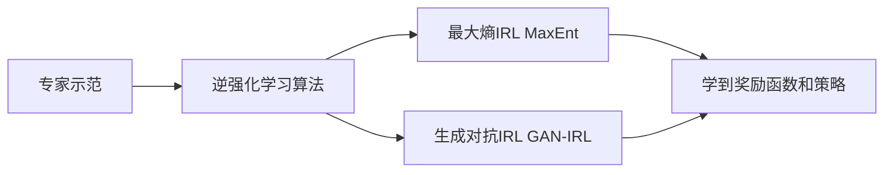

# 逆强化学习 (Inverse Reinforcement Learning) 原理与代码实例讲解

## 1. 背景介绍
### 1.1 强化学习与逆强化学习
强化学习(Reinforcement Learning, RL)是一种重要的机器学习范式,它研究智能体(Agent)如何通过与环境(Environment)的交互来学习最优策略,以获得最大化的累积奖励。而逆强化学习(Inverse Reinforcement Learning, IRL)则是强化学习的逆问题,即给定专家的示范轨迹数据,如何去学习到一个奖励函数,使得基于该奖励函数学到的最优策略能够产生与专家示范相似的行为轨迹。

### 1.2 逆强化学习的应用场景
逆强化学习在很多领域有广泛的应用,例如:
- 机器人学习: 通过人类专家的示范,让机器人学习到复杂任务的策略,如抓取、装配等。  
- 自动驾驶: 通过学习人类驾驶员的驾驶行为数据,训练出更加安全和舒适的自动驾驶策略。
- 游戏AI: 通过学习人类玩家的游戏记录,让AI学会玩游戏,并超越人类。
- 推荐系统: 通过对用户历史行为的学习,推断用户的兴趣偏好,从而给出个性化推荐。

## 2. 核心概念与联系
### 2.1 马尔可夫决策过程(MDP)
马尔可夫决策过程是强化学习的基本框架,由状态空间S、动作空间A、状态转移概率P、奖励函数R和折扣因子γ构成,即一个五元组 $\langle S,A,P,R,\gamma \rangle$。
- 状态 $s \in S$ : 描述智能体所处的环境状态。
- 动作 $a \in A$ : 描述智能体可采取的行动。 
- 状态转移概率 $P(s'|s,a)$ : 在状态s下采取动作a后转移到状态s'的概率。
- 奖励函数 $R(s,a)$ : 在状态s下采取动作a能获得的即时奖励值。
- 折扣因子 $\gamma \in [0,1]$ : 用于平衡当前奖励和未来奖励的相对重要性。

### 2.2 策略与价值函数 
- 策略 $\pi(a|s)$ : 在状态s下选择动作a的概率,决定了智能体的行为。
- 状态价值函数 $V^{\pi}(s)$ : 从状态s开始,遵循策略π所能获得的期望累积奖励。
- 动作价值函数 $Q^{\pi}(s,a)$ : 在状态s下采取动作a,遵循策略π所能获得的期望累积奖励。

状态价值函数和动作价值函数满足贝尔曼方程:

$$
V^{\pi}(s) = \sum_{a} \pi(a|s) \sum_{s'} P(s'|s,a) [R(s,a) + \gamma V^{\pi}(s')]
$$

$$
Q^{\pi}(s,a) = R(s,a) + \gamma \sum_{s'} P(s'|s,a) \sum_{a'} \pi(a'|s') Q^{\pi}(s',a')
$$

### 2.3 最优策略与最优价值函数
强化学习的目标就是寻找最优策略 $\pi^{*}$ 使得期望累积奖励达到最大:

$$
\pi^{*} = \arg \max_{\pi} V^{\pi}(s), \forall s \in S
$$

最优价值函数 $V^{*}(s)$ 和 $Q^{*}(s,a)$ 满足最优贝尔曼方程:

$$
V^{*}(s) = \max_{a} \sum_{s'} P(s'|s,a) [R(s,a) + \gamma V^{*}(s')]
$$

$$
Q^{*}(s,a) = R(s,a) + \gamma \sum_{s'} P(s'|s,a) \max_{a'} Q^{*}(s',a')
$$

### 2.4 逆强化学习的数学定义
给定:
- 状态空间S,动作空间A
- 专家的示范轨迹 $\mathcal{D} = \{ \tau_1, \tau_2, ... , \tau_N \}$,其中 $\tau_i = \{(s_0^i,a_0^i),(s_1^i,a_1^i),...,(s_{T-1}^i,a_{T-1}^i)\}$

逆强化学习的目标是找到一个奖励函数 $\hat{R}$,使得如下优化问题的解 $\hat{\pi}$ 能产生与专家示范相近的轨迹:

$$
\hat{\pi} = \arg \max_{\pi} \mathbb{E}_{\pi}[\sum_{t=0}^{T-1} \gamma^t \hat{R}(s_t,a_t)]
$$

## 3. 核心算法原理与具体步骤
### 3.1 最大熵逆强化学习(MaxEnt IRL) 
MaxEnt IRL是一种经典的逆强化学习算法,它将学习奖励函数看作是一个概率推断问题。

根据最大熵原理,在满足专家示范的约束下,奖励函数应该具有最大熵,即最小信息量。因此,MaxEnt IRL优化如下目标:

$$
\max_{R} \mathcal{L}(R) = (R \cdot \mu - \log Z) - \lambda \| R \|^2
$$

其中, $\mu = \frac{1}{N} \sum_{i=1}^N \sum_{t=0}^{T-1} \gamma^t \phi(s_t^i,a_t^i)$ 是专家轨迹的特征期望, $Z = \int \exp(R \cdot \mu) d\tau$ 是配分函数, $\lambda$ 是正则化系数。

MaxEnt IRL的具体步骤如下:

1. 随机初始化奖励函数 $R$
2. 重复直到收敛:
    1. 策略评估:根据当前奖励函数 $R$ 计算最优策略 $\pi$
    2. 采样轨迹:使用 $\pi$ 采样轨迹 $\mathcal{D}_{\pi}$,计算特征期望 $\mu_{\pi}$  
    3. 梯度上升:根据梯度 $\mu - \mu_{\pi}$ 更新 $R$ 以增大 $\mathcal{L}(R)$
3. 返回学到的奖励函数 $\hat{R}$ 和策略 $\hat{\pi}$

### 3.2 生成对抗逆强化学习(GAN-IRL)
GAN-IRL将逆强化学习问题建模为生成对抗网络(GAN),通过策略网络(Generator)与奖励网络(Discriminator)的博弈学习来同时优化策略和奖励函数。

策略网络 $\pi_{\theta}$ 根据当前的奖励函数 $R_{\omega}$ 学习产生与专家轨迹相似的轨迹,而奖励网络 $R_{\omega}$ 则试图将专家轨迹和策略产生的轨迹进行区分。整个优化过程可用下式表示:

$$
\min_{\theta} \max_{\omega} \mathbb{E}_{\tau \sim \pi_{\theta}}[\log(1-D_{\omega}(\tau))] + \mathbb{E}_{\tau \sim \pi_E}[\log D_{\omega}(\tau)] 
$$

其中, $D_{\omega}(\tau) = \frac{\exp(\sum_{t=0}^{T-1} \gamma^t R_{\omega}(s_t,a_t))}{\exp(\sum_{t=0}^{T-1} \gamma^t R_{\omega}(s_t,a_t)) + \pi_{\theta}(\tau)}$ 是奖励网络对轨迹 $\tau$ 为专家轨迹的概率。 

GAN-IRL的具体步骤如下:

1. 随机初始化策略网络 $\pi_{\theta}$ 和奖励网络 $R_{\omega}$
2. 重复进行策略优化和奖励优化,直到收敛:
    1. 策略优化:固定 $R_{\omega}$,通过最大化 $\mathbb{E}_{\tau \sim \pi_{\theta}}[\sum_{t=0}^{T-1} \gamma^t R_{\omega}(s_t,a_t)]$ 来优化 $\pi_{\theta}$
    2. 奖励优化:固定 $\pi_{\theta}$,通过最小化 $\mathbb{E}_{\tau \sim \pi_{\theta}}[\log(1-D_{\omega}(\tau))] + \mathbb{E}_{\tau \sim \pi_E}[\log D_{\omega}(\tau)]$ 来优化 $R_{\omega}$
3. 返回学到的奖励函数 $\hat{R}_{\omega}$ 和策略 $\hat{\pi}_{\theta}$

### 3.3 逆强化学习算法总结

## 4. 数学模型和公式详细讲解举例说明

### 4.1 最大熵逆强化学习目标函数推导
最大熵IRL将轨迹 $\tau$ 的概率定义为:

$$
P(\tau|R) = \frac{1}{Z} \exp(\sum_{t=0}^{T-1} \gamma^t R(s_t,a_t)) 
$$

其中 $Z = \int \exp(\sum_{t=0}^{T-1} \gamma^t R(s_t,a_t)) d\tau$ 为配分函数。

假设专家轨迹 $\mathcal{D}$ 是从某个未知奖励函数 $R^{*}$ 对应的最优策略 $\pi^{*}$ 中采样得到的,我们希望学到的奖励函数 $\hat{R}$ 能让 $P(\tau|\hat{R})$ 尽可能接近 $P(\tau|R^{*})$。

因此,可以最小化两个分布的KL散度:

$$
\min_{R} D_{KL}(P(\tau|R^{*}) || P(\tau|R)) = \min_{R} \mathbb{E}_{\tau \sim P(\tau|R^{*})} [\log \frac{P(\tau|R^{*})}{P(\tau|R)}]
$$

将 $P(\tau|R)$ 的定义代入化简,可得:

$$
\min_{R} \mathbb{E}_{\tau \sim P(\tau|R^{*})} [-\sum_{t=0}^{T-1} \gamma^t R(s_t,a_t) + \log Z]
$$

其中 $\mathbb{E}_{\tau \sim P(\tau|R^{*})} [\sum_{t=0}^{T-1} \gamma^t R(s_t,a_t)]$ 可以用专家轨迹的特征期望 $\mu$ 来近似:

$$
\mu = \frac{1}{N} \sum_{i=1}^N \sum_{t=0}^{T-1} \gamma^t \phi(s_t^i,a_t^i)
$$

为了避免奖励函数过于复杂,还需要加入L2正则项,最终的优化目标为:

$$
\max_{R} \mathcal{L}(R) = (R \cdot \mu - \log Z) - \lambda \| R \|^2
$$

### 4.2 生成对抗逆强化学习目标函数推导
GAN-IRL将生成器 $G$ 定义为策略网络 $\pi_{\theta}$,判别器 $D$ 定义为奖励网络 $R_{\omega}$,优化目标为:

$$
\min_{\pi_{\theta}} \max_{R_{\omega}} \mathbb{E}_{\tau \sim \pi_{\theta}}[\log(1-D_{\omega}(\tau))] + \mathbb{E}_{\tau \sim \pi_E}[\log D_{\omega}(\tau)]
$$

其中判别器 $D_{\omega}(\tau)$ 定义为:

$$
D_{\omega}(\tau) = \frac{\exp(\sum_{t=0}^{T-1} \gamma^t R_{\omega}(s_t,a_t))}{\exp(\sum_{t=0}^{T-1} \gamma^t R_{\omega}(s_t,a_t)) + \pi_{\theta}(\tau)}
$$

表示奖励网络认为轨迹 $\tau$ 来自专家的概率。

对于生成器即策略网络 $\pi_{\theta}$ 的优化,目标是最大化奖励网络给出的累积奖励:

$$
\max_{\theta} \mathbb{E}_{\tau \sim \pi_{\theta}}[\sum_{t=0}^{T-1} \gamma^t R_{\omega}(s_t,a_t)]
$$

对于判别器即奖励网络 $R_{\omega}$ 的优化,目标是最小化二元交叉熵损失:

$$
\min_{\omega} \mathbb{E}_{\tau \sim \pi_{\theta}}[\log(1-D_{\omega}(\tau))] + \mathbb{E}_{\tau \sim \pi_E}[\log D_{\