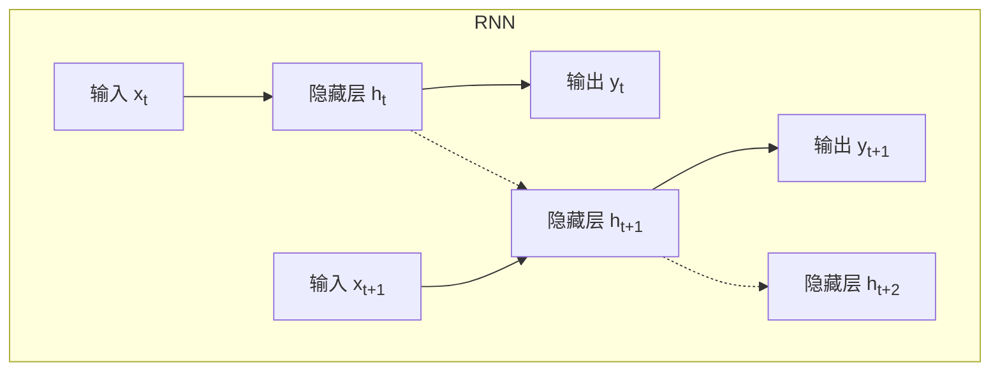

# 递归神经网络 原理与代码实例讲解

## 1.背景介绍

随着深度学习技术的不断发展,递归神经网络(Recurrent Neural Networks,RNNs)作为一种处理序列数据的有力工具,在自然语言处理、语音识别、时间序列预测等领域取得了广泛的应用。与传统的前馈神经网络不同,RNN具有内在的记忆能力,能够捕捉序列数据中的长期依赖关系,从而更好地建模和理解序列数据。

### 1.1 序列数据的挑战

在现实世界中,大量的数据都呈现出序列的形式,如自然语言文本、语音信号、股票走势等。这些序列数据具有以下特点:

- **长度可变**: 序列的长度不是固定的,可以是任意长度。
- **上下文依赖**: 序列中每个元素的含义都依赖于其上下文,即前后元素的信息。
- **长期依赖**: 理解某个元素时,可能需要依赖于很远的上下文信息。

传统的机器学习算法,如隐马尔可夫模型(HMM)和n-gram模型,在处理序列数据时存在局限性,难以有效捕捉长期依赖关系。

### 1.2 RNN的应用场景

RNN由于其独特的结构设计,能够较好地解决序列数据带来的挑战,在以下领域展现出卓越的表现:

- **自然语言处理**: 语言模型、机器翻译、文本生成、情感分析等。
- **语音识别**: 将语音信号转录为文本。
- **时间序列预测**: 预测股票走势、天气变化等。
- **手写识别**: 将手写体转换为计算机可识别的文本。
- **视频分析**: 视频标题生成、行为识别等。

## 2.核心概念与联系

### 2.1 RNN的基本结构

RNN是一种特殊的神经网络,它的核心思想是在隐藏层之间建立循环连接,使得网络能够对序列数据进行建模。RNN的基本结构如下图所示:

在上图中,RNN在处理序列数据时,会逐个元素地进行计算。在时间步t,网络接收当前输入$x_t$和上一时间步的隐藏状态$h_{t-1}$,计算得到当前时间步的隐藏状态$h_t$和输出$y_t$。然后,将$h_t$传递到下一时间步,重复这个过程。这种循环结构使得RNN能够捕捉序列数据中的长期依赖关系。

RNN的核心计算过程可以用以下公式表示:

$$
\begin{aligned}
h_t &= f_W(x_t, h_{t-1}) \\
y_t &= g_V(h_t)
\end{aligned}
$$

其中,$f_W$是一个非线性函数(如tanh或ReLU),用于计算当前隐藏状态;$g_V$是另一个非线性函数,用于从隐藏状态计算输出。$W$和$V$分别是可训练的权重矩阵。

### 2.2 RNN的变体

基于标准RNN的结构,研究人员提出了多种变体,以解决RNN在实际应用中存在的一些问题,如梯度消失/爆炸问题。常见的RNN变体包括:

1. **长短期记忆网络(LSTM)**: 通过引入门控机制,有效解决了长期依赖问题。
2. **门控循环单元(GRU)**: 相比LSTM,结构更加简单,参数更少,在某些任务上表现更好。
3. **双向RNN(Bi-RNN)**: 能够同时利用序列的前向和后向信息。
4. **深层RNN**: 将多个RNN层堆叠,提高了模型的表达能力。
5. **注意力机制(Attention)**: 让模型自动学习关注序列中的重要部分。

这些变体极大地提高了RNN在各种任务上的性能,使其能够更好地处理长序列、捕捉长期依赖等。

## 3.核心算法原理具体操作步骤 

### 3.1 RNN前向传播

我们以一个简单的加法问题来说明RNN的前向传播过程。假设我们要求解"2+3+5"这个表达式,可以将其看作一个长度为3的序列,每个时间步对应一个数字。

1. 初始化隐藏状态$h_0$,通常将其设为全0向量。
2. 在时间步t=1时,输入$x_1=2$,将其与$h_0$连同权重矩阵$W$输入到$f_W$函数中,计算得到$h_1$。再将$h_1$输入到$g_V$函数中,得到输出$y_1$。
3. 将$h_1$传递到下一时间步作为输入。在t=2时,输入$x_2=3$,重复上一步的计算,得到$h_2$和$y_2$。
4. 重复第3步,直到处理完整个序列,得到最终输出$y_3$,即表达式的结果10。

上述过程可以用下面的公式表示:

$$
\begin{aligned}
h_1 &= f_W(x_1, h_0) \\
y_1 &= g_V(h_1) \\
h_2 &= f_W(x_2, h_1) \\
y_2 &= g_V(h_2) \\
h_3 &= f_W(x_3, h_2) \\
y_3 &= g_V(h_3)
\end{aligned}
$$

在实际应用中,我们需要将RNN应用到更加复杂的任务,如语言模型、机器翻译等。这时,输入$x_t$通常是一个one-hot向量,表示当前时间步的词或字符;输出$y_t$则是一个概率分布,表示下一个词或字符的预测概率。

### 3.2 RNN反向传播

为了训练RNN模型,我们需要计算损失函数对模型参数(权重矩阵$W$和$V$)的梯度,并使用优化算法(如SGD或Adam)更新参数。这个过程被称为反向传播(Backpropagation Through Time,BPTT)。

以上面的加法问题为例,假设我们的损失函数是均方误差:

$$J = \frac{1}{2}(y_3 - t)^2$$

其中$t$是期望的目标输出,在这个例子中是10。我们需要计算$\frac{\partial J}{\partial W}$和$\frac{\partial J}{\partial V}$,以更新权重矩阵。

根据链式法则,我们有:

$$
\frac{\partial J}{\partial W} = \frac{\partial J}{\partial y_3} \frac{\partial y_3}{\partial h_3} \frac{\partial h_3}{\partial h_2} \frac{\partial h_2}{\partial h_1} \frac{\partial h_1}{\partial h_0} \frac{\partial h_0}{\partial W}
$$

$$
\frac{\partial J}{\partial V} = \frac{\partial J}{\partial y_3} \frac{\partial y_3}{\partial V}
$$

上式中的各项导数可以通过反向传播算法计算得到。具体步骤如下:

1. 计算$\frac{\partial J}{\partial y_3}$,对于均方误差,它等于$y_3 - t$。
2. 计算$\frac{\partial y_3}{\partial h_3}$和$\frac{\partial y_3}{\partial V}$,这需要对$g_V$函数求导数。
3. 计算$\frac{\partial h_3}{\partial h_2}$,这需要对$f_W$函数求导数,并将结果与$\frac{\partial J}{\partial y_3}\frac{\partial y_3}{\partial h_3}$相乘。
4. 重复第3步,计算$\frac{\partial h_2}{\partial h_1}$、$\frac{\partial h_1}{\partial h_0}$和$\frac{\partial h_0}{\partial W}$,并将它们连乘到$\frac{\partial J}{\partial W}$的计算中。
5. 将计算得到的$\frac{\partial J}{\partial W}$和$\frac{\partial J}{\partial V}$代入优化算法,更新权重矩阵。

需要注意的是,在实际应用中,序列的长度可能会很长,导致反向传播过程中出现梯度消失或爆炸的问题。这就是为什么需要引入LSTM、GRU等RNN变体的原因。

## 4.数学模型和公式详细讲解举例说明

### 4.1 LSTM模型

长短期记忆网络(LSTM)是RNN最成功的变体之一,它通过引入门控机制和记忆细胞的概念,有效解决了标准RNN存在的梯度消失/爆炸问题,能够更好地捕捉长期依赖关系。

LSTM的核心思想是在每个时间步引入一个记忆细胞$c_t$,它会选择性地记住或遗忘之前的状态,并将当前输入$x_t$与之前的隐藏状态$h_{t-1}$相结合,生成当前的隐藏状态$h_t$和输出$y_t$。这个过程由三个门控制:遗忘门(forget gate)、输入门(input gate)和输出门(output gate)。

LSTM的计算过程如下:

1. 遗忘门:决定遗忘多少之前的细胞状态。

$$f_t = \sigma(W_f \cdot [h_{t-1}, x_t] + b_f)$$

2. 输入门:决定记住多少当前的输入。先计算候选细胞状态$\tilde{c}_t$:

$$\tilde{c}_t = \tanh(W_c \cdot [h_{t-1}, x_t] + b_c)$$

然后将其与输入门$i_t$相结合,更新细胞状态$c_t$:

$$\begin{aligned}
i_t &= \sigma(W_i \cdot [h_{t-1}, x_t] + b_i) \\
c_t &= f_t \odot c_{t-1} + i_t \odot \tilde{c}_t
\end{aligned}$$

3. 输出门:决定输出什么。首先根据当前细胞状态$c_t$计算候选隐藏状态$\tilde{h}_t$:

$$\tilde{h}_t = \tanh(c_t)$$

然后将其与输出门$o_t$相结合,得到最终的隐藏状态$h_t$和输出$y_t$:

$$\begin{aligned}
o_t &= \sigma(W_o \cdot [h_{t-1}, x_t] + b_o) \\
h_t &= o_t \odot \tilde{h}_t \\
y_t &= g_V(h_t)
\end{aligned}$$

上述公式中,$\sigma$是sigmoid函数,用于将门的值约束在0到1之间;$\odot$表示元素wise乘积;$W$和$b$是可训练的权重和偏置参数。

通过上述门控机制,LSTM能够有选择性地保留或丢弃之前的细胞状态,从而更好地捕捉长期依赖关系。

### 4.2 GRU模型

门控循环单元(Gated Recurrent Unit,GRU)是另一种流行的RNN变体,相比LSTM,它的结构更加简单,参数更少,在某些任务上表现更好。

GRU的核心思想是将遗忘门和输入门合并为一个更新门(update gate),用于控制细胞状态如何被当前输入和之前的状态所更新。同时,它还引入了一个重置门(reset gate),用于控制忘记之前的状态。

GRU的计算过程如下:

1. 更新门:决定保留多少之前的状态。

$$z_t = \sigma(W_z \cdot [h_{t-1}, x_t])$$

2. 重置门:决定忘记多少之前的状态。

$$r_t = \sigma(W_r \cdot [h_{t-1}, x_t])$$

3. 计算候选隐藏状态,并与更新门相结合,得到最终的隐藏状态。

$$\begin{aligned}
\tilde{h}_t &= \tanh(W \cdot [r_t \odot h_{t-1}, x_t]) \\
h_t &= (1 - z_t) \odot h_{t-1} + z_t \odot \tilde{h}_t
\