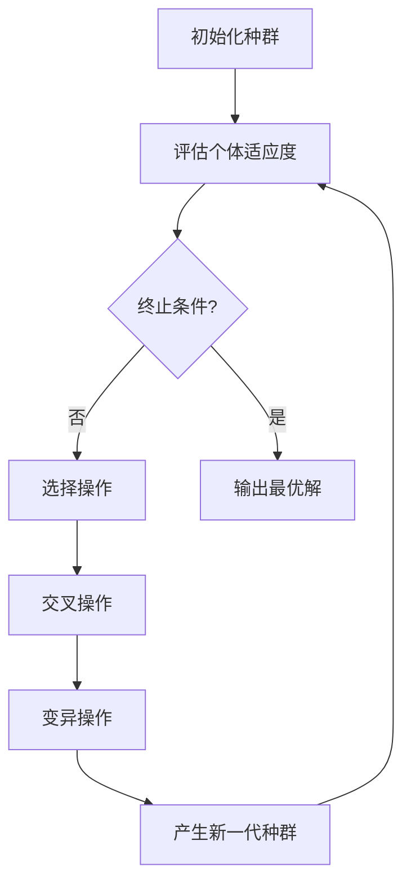

# 遗传算法(Genetic Algorithms) - 原理与代码实例讲解

## 1.背景介绍

### 1.1 什么是遗传算法

遗传算法(Genetic Algorithms, GAs)是一种基于生物进化过程的优化算法,它模拟了自然界中生物进化的过程,包括遗传、变异、选择和交叉等操作。遗传算法通过对一个潜在的解决方案集合(称为种群)进行迭代的计算,逐渐找到最优解或近似最优解。

遗传算法最早由约翰·霍兰德(John Holland)于20世纪60年代在密歇根大学提出。它是一种启发式搜索和优化技术,属于进化算法的一种,用于解决复杂的非线性优化问题。

### 1.2 遗传算法的应用场景

遗传算法由于其鲁棒性、通用性和高效性,已被广泛应用于许多领域,包括:

- 组合优化问题(如旅行商问题、背包问题等)
- 机器学习和模式识别
- 计算机视觉和图像处理
- 自动控制系统
- 人工智能规划和调度
- 工程设计优化
- 生物信息学序列分析
- 金融投资组合优化
- 多目标优化问题

遗传算法擅长解决那些传统方法难以有效求解的高维、非线性、非凸、多峰值等复杂优化问题。

## 2.核心概念与联系

### 2.1 基本概念

遗传算法中有一些核心概念:

- **个体(Individual)**: 潜在的解决方案,通常用一个长度固定的编码串(如二进制串或实数向量)表示。
- **种群(Population)**: 包含多个个体的集合。
- **适应度(Fitness)**: 评估个体优劣程度的指标函数。
- **选择(Selection)**: 根据适应度值选择优秀个体,以产生下一代种群。
- **交叉(Crossover)**: 将两个或多个优秀个体的部分特征组合,产生新的个体。
- **变异(Mutation)**: 对个体的编码随机改变,引入新的特征。

### 2.2 遗传算法流程

遗传算法一般遵循以下流程:



1. 初始化种群,随机生成一定数量的个体。
2. 评估每个个体的适应度。
3. 检查是否满足终止条件(如达到最大迭代次数或找到满意解)。
4. 根据适应度值选择优秀个体。
5. 对选择的个体进行交叉操作,产生新的个体。
6. 对新个体进行变异操作,引入新的特征。
7. 用新产生的个体替换种群中的部分个体,形成新一代种群。
8. 重复2-7步骤,直到满足终止条件。

通过不断迭代,种群中个体的平均适应度会逐渐提高,最终收敛到(近似)最优解。

## 3.核心算法原理具体操作步骤

### 3.1 编码方式

在遗传算法中,首先需要将问题的解决方案用适当的编码方式表示为个体。常用的编码方式有:

1. **二进制编码**: 使用0和1的二进制串表示。
2. **实数编码**: 使用实数向量表示。
3. **排列编码**: 使用排列表示。
4. **树编码**: 使用树形结构表示。

编码方式的选择取决于问题的性质和约束条件。

### 3.2 适应度函数设计

适应度函数(Fitness Function)用于评估个体的优劣程度,是遗传算法的核心部分。设计合适的适应度函数对算法性能至关重要。

适应度函数一般由目标函数(需要优化的函数)和约束条件组成。常见的处理方式有:

1. 惩罚函数法:对违反约束的解施加一定的惩罚值。
2. 可行性规则法:只考虑满足约束的可行解。
3. 修复函数法:对不可行解进行修复,使其变为可行解。

适应度函数的设计需要结合具体问题的特点,权衡目标函数和约束条件的重要性。

### 3.3 选择操作

选择操作(Selection)的目的是从当前种群中选择优秀个体,作为下一代种群的父代。常见的选择方法有:

1. **轮盘赌选择(Roulette Wheel Selection)**: 个体被选中的概率与其适应度值成正比。
2. **排名选择(Rank Selection)**: 根据个体适应度值的排名进行选择。
3. **锦标赛选择(Tournament Selection)**: 从种群中随机选取若干个体,选择其中适应度最高的个体。
4. **精英选择(Elitism)**: 直接将当前种群中适应度最高的个体复制到下一代种群。

选择压力(Selection Pressure)控制着算法收敛的速度,选择压力过大可能导致早熟收敛,而选择压力过小则可能无法有效驱动算法向更优解前进。

### 3.4 交叉操作

交叉操作(Crossover)通过组合两个或多个优秀个体的部分特征,产生新的个体。常见的交叉方法有:

1. **单点交叉(Single Point Crossover)**: 在个体编码串的某个位置随机选择一个交叉点,交换两个个体在该点之后的部分编码。
2. **多点交叉(Multi-Point Crossover)**: 选择多个交叉点,交换多个编码段。
3. **均匀交叉(Uniform Crossover)**: 对每个位置,随机选择父代中的一个个体的编码。
4. **算术交叉(Arithmetic Crossover)**: 对实数编码的个体,新个体是父代个体的线性组合。

交叉概率(Crossover Rate)控制着新个体被产生的频率,一般设置在0.6-0.9之间。

### 3.5 变异操作

变异操作(Mutation)通过对个体的编码随机改变,引入新的特征,维持种群的多样性。常见的变异方法有:

1. **位变异(Bit Mutation)**: 对二进制编码的个体,随机翻转某些位。
2. **均匀变异(Uniform Mutation)**: 对实数编码的个体,在一定范围内随机改变某些维度的值。
3. **高斯变异(Gaussian Mutation)**: 对实数编码的个体,在高斯分布下改变某些维度的值。
4. **插入变异(Insertion Mutation)**: 对排列编码的个体,在随机位置插入一个基因。
5. **交换变异(Swap Mutation)**: 对排列编码的个体,交换两个基因的位置。

变异概率(Mutation Rate)控制着新特征被引入的频率,一般设置为较小的值(如0.01-0.1),以避免破坏优秀个体的结构。

### 3.6 算法终止条件

遗传算法通常设置以下终止条件之一:

1. **达到最大迭代次数**。
2. **种群中个体的适应度值收敛到一定范围内**。
3. **在一定迭代次数内,最优个体的适应度值没有改善**。
4. **找到满足要求的最优解或近似最优解**。

终止条件的选择需要结合具体问题的特点和算法性能要求。

## 4.数学模型和公式详细讲解举例说明

### 4.1 适应度函数数学模型

适应度函数是遗传算法的核心部分,它用于评估个体的优劣程度。一般情况下,适应度函数由目标函数和约束条件组成。

假设我们需要求解如下约束优化问题:

$$
\begin{aligned}
\min\quad & f(x) \\
\text{s.t.}\quad & g_i(x) \leq 0, \quad i = 1, 2, \ldots, m \\
& h_j(x) = 0, \quad j = 1, 2, \ldots, p
\end{aligned}
$$

其中:
- $f(x)$是目标函数,需要最小化
- $g_i(x) \leq 0$是不等式约束条件
- $h_j(x) = 0$是等式约束条件

我们可以使用惩罚函数法构造适应度函数:

$$
\text{Fitness}(x) = f(x) + \sum_{i=1}^m \max(0, g_i(x))^2 + \sum_{j=1}^p |h_j(x)|
$$

其中$\max(0, g_i(x))^2$是对不等式约束条件的惩罚项,$|h_j(x)|$是对等式约束条件的惩罚项。惩罚因子的选择需要根据具体问题进行调整。

适应度函数的值越小,表示个体的质量越高。在遗传算法中,我们希望最小化适应度函数,从而找到最优解。

### 4.2 遗传算法数学模型

遗传算法可以用数学模型进行描述和分析。假设我们有一个最小化问题:

$$
\min\quad f(x), \quad x \in \Omega
$$

其中$\Omega$是可行解空间。

我们用$P(t)$表示第$t$代种群,$P(t) = \{x_1(t), x_2(t), \ldots, x_N(t)\}$,其中$N$是种群大小。

令$\overline{f}(t)$表示第$t$代种群的平均适应度值:

$$
\overline{f}(t) = \frac{1}{N} \sum_{i=1}^N f(x_i(t))
$$

则遗传算法的目标是找到一个$x^*$,使得:

$$
f(x^*) = \min\limits_{x \in \Omega} f(x)
$$

或者至少找到一个$x^*$,使得:

$$
f(x^*) \approx \min\limits_{x \in \Omega} f(x)
$$

遗传算法通过选择、交叉和变异操作,不断产生新的种群,期望$\overline{f}(t)$单调递减,最终收敛到全局最优解或局部最优解。

理论上,如果满足适当的条件(如无约束的Markov链等),遗传算法可以保证在有限时间内找到全局最优解。但在实际应用中,由于计算资源和时间的限制,我们通常只能获得近似最优解。

## 5.项目实践:代码实例和详细解释说明

下面我们通过一个实例,演示如何使用Python实现一个简单的遗传算法,求解一元函数的最小值问题。

### 5.1 问题描述

我们需要找到函数$f(x) = x^4 - 2x^3 + x^2 + 3$在区间$[-2, 3]$内的最小值。

### 5.2 遗传算法实现

```python
import random
import numpy as np

# 目标函数
def func(x):
    return x**4 - 2*x**3 + x**2 + 3

# 适应度函数(最小化问题)
def fitness(individual):
    return func(individual)

# 初始化种群
def init_population(pop_size, chromosome_length):
    population = []
    for _ in range(pop_size):
        chromosome = np.random.uniform(-2, 3, chromosome_length)
        population.append(chromosome)
    return population

# 选择操作(锦标赛选择)
def selection(population, fitness_values, k=3):
    selected = []
    for _ in range(len(population)):
        competitors = random.sample(population, k)
        winner = min(competitors, key=lambda x: fitness_values[population.index(x)])
        selected.append(winner)
    return selected

# 交叉操作(单点交叉)
def crossover(parent1, parent2, crossover_rate=0.8):
    if random.random() < crossover_rate:
        crossover_point = random.randint(0, len(parent1) - 1)
        child1 = np.concatenate((parent1[:crossover_point], parent2[crossover_point:]))
        child2 = np.concatenate((parent2[:crossover_point], parent1[crossover_point:]))
        return [child1, child2]
    else:
        return [parent1, parent2]

# 变异操作(高斯变异)
def mutation(individual, mutation_rate=0.1):
    for i in range(len(individual)):
        if random.random() < mutation_rate:
            individual[i] += np.random.normal(0, 0.1)
            individual[i] = max(-2, min(3, individual[i]))
    return individual

# 遗传算法主函数
def genetic_algorithm(pop_size, chromosome_length, max_generations):
    population = init_