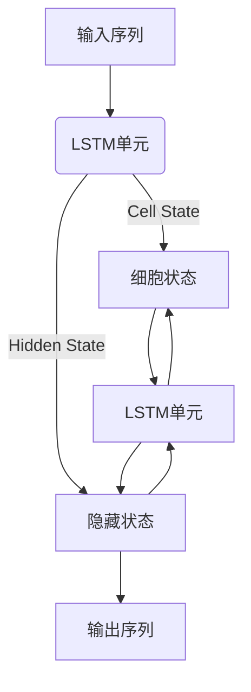

# 长短时记忆网络LSTM原理与代码实例讲解

## 1.背景介绍

### 1.1 序列数据处理的挑战

在自然语言处理、语音识别、时间序列预测等众多应用领域中,我们经常会遇到需要处理序列数据的情况。与传统的数据不同,序列数据具有时间相关性和长期依赖性。这意味着序列中的每个元素都与其他元素有关联,而且序列的当前输出不仅取决于当前输入,还取决于之前的输入序列。

传统的神经网络如前馈神经网络和卷积神经网络在处理固定维度的数据时表现出色,但在处理可变长度序列数据时存在局限性。它们无法有效地捕获序列数据中的长期依赖关系,导致了梯度消失或爆炸等问题。

### 1.2 循环神经网络RNN的局限性

为了解决序列数据处理的挑战,循环神经网络(Recurrent Neural Network,RNN)应运而生。与传统神经网络不同,RNN在隐藏层之间增加了循环连接,使得网络能够对序列数据进行建模。然而,标准的RNN在捕获长期依赖关系方面仍然存在局限性,主要原因是在反向传播过程中,梯度会随着时间步的增加而呈指数级衰减或爆炸。

### 1.3 LSTM的提出

为了解决RNN的长期依赖问题,1997年,Sepp Hochreiter和Jürgen Schmidhuber提出了长短期记忆网络(Long Short-Term Memory,LSTM)。LSTM通过精心设计的门控机制和内存细胞状态,使网络能够有效地捕获长期依赖关系,从而在序列数据建模方面取得了突破性的进展。

## 2.核心概念与联系

### 2.1 LSTM的核心组成部分

LSTM是一种特殊的RNN,它由以下几个核心组成部分构成:

1. **Cell State(细胞状态)**: 细胞状态就像一条传输带,它可以将信息传递到序列的后续时间步,从而捕获长期依赖关系。

2. **Gates(门控机制)**: LSTM通过特殊的门控机制来控制信息的流动,包括忘记门(Forget Gate)、输入门(Input Gate)和输出门(Output Gate)。这些门控机制决定了细胞状态和隐藏状态的更新方式。

3. **Hidden State(隐藏状态)**: 隐藏状态是LSTM在每个时间步的输出,它基于当前输入和细胞状态计算得到。

### 2.2 LSTM与RNN的关系

LSTM可以看作是RNN的一种特殊变体。与标准RNN相比,LSTM引入了细胞状态和门控机制,使其能够更好地捕获长期依赖关系。然而,LSTM仍然保留了RNN的核心思想,即通过循环连接来处理序列数据。

尽管LSTM在架构上比标准RNN更加复杂,但它提供了更强大的建模能力,在许多序列数据处理任务中表现出色。



## 3.核心算法原理具体操作步骤

### 3.1 LSTM单元的结构

LSTM单元由多个门控机制和一个细胞状态组成。每个时间步,LSTM单元会根据当前输入和上一时间步的隐藏状态,计算出当前时间步的细胞状态和隐藏状态。

LSTM单元的核心操作步骤如下:

1. **忘记门(Forget Gate)**: 决定从上一时间步的细胞状态中丢弃多少信息。
   $$f_t = \sigma(W_f \cdot [h_{t-1}, x_t] + b_f)$$

2. **输入门(Input Gate)**: 决定从当前输入和上一隐藏状态中获取多少信息,以及如何更新细胞状态。
   $$i_t = \sigma(W_i \cdot [h_{t-1}, x_t] + b_i)$$
   $$\tilde{C}_t = \tanh(W_C \cdot [h_{t-1}, x_t] + b_C)$$

3. **更新细胞状态(Update Cell State)**: 根据忘记门和输入门的输出,更新细胞状态。
   $$C_t = f_t \odot C_{t-1} + i_t \odot \tilde{C}_t$$

4. **输出门(Output Gate)**: 决定细胞状态中有多少信息将输出到隐藏状态。
   $$o_t = \sigma(W_o \cdot [h_{t-1}, x_t] + b_o)$$

5. **更新隐藏状态(Update Hidden State)**: 根据细胞状态和输出门的输出,计算当前时间步的隐藏状态。
   $$h_t = o_t \odot \tanh(C_t)$$

其中,$ \sigma $是sigmoid激活函数,$ \odot $表示元素wise乘积,$ W $和$ b $分别表示权重矩阵和偏置向量。

### 3.2 LSTM的前向传播过程

在LSTM的前向传播过程中,我们需要按照时间步骤依次计算每个时间步的细胞状态和隐藏状态。具体步骤如下:

1. 初始化细胞状态$ C_0 $和隐藏状态$ h_0 $(通常初始化为全0向量)。

2. 对于每个时间步$ t $:
   - 根据当前输入$ x_t $和上一隐藏状态$ h_{t-1} $,计算忘记门$ f_t $、输入门$ i_t $、候选细胞状态$ \tilde{C}_t $和输出门$ o_t $。
   - 根据上一细胞状态$ C_{t-1} $、忘记门$ f_t $、输入门$ i_t $和候选细胞状态$ \tilde{C}_t $,计算当前细胞状态$ C_t $。
   - 根据当前细胞状态$ C_t $和输出门$ o_t $,计算当前隐藏状态$ h_t $。

3. 重复步骤2,直到处理完整个序列。

4. 根据需求,使用最后一个隐藏状态$ h_T $或所有隐藏状态$ \{h_1, h_2, \ldots, h_T\} $作为输出。

### 3.3 LSTM的反向传播过程

LSTM的反向传播过程与标准RNN类似,但由于引入了门控机制和细胞状态,计算过程更加复杂。我们需要计算每个时间步的梯度,并通过反向传播更新权重和偏置。

具体步骤如下:

1. 初始化梯度累加器。

2. 对于每个时间步$ t $:
   - 计算当前时间步的误差项。
   - 计算当前时间步的门控机制和候选细胞状态的梯度。
   - 计算上一时间步的隐藏状态和细胞状态的梯度。
   - 累加梯度。

3. 更新权重和偏置。

由于LSTM的反向传播过程涉及较多的数学推导,这里不再赘述。感兴趣的读者可以参考相关资料进行深入学习。

## 4.数学模型和公式详细讲解举例说明

在上一节中,我们介绍了LSTM的核心算法原理和操作步骤。现在,让我们深入探讨LSTM的数学模型和公式。

### 4.1 LSTM单元的数学表示

LSTM单元的输入包括当前时间步的输入$ x_t $和上一时间步的隐藏状态$ h_{t-1} $。我们将它们拼接成一个向量,作为LSTM单元的输入:

$$\begin{aligned}
\mathbf{x}_t &= [h_{t-1}, x_t] \\
\mathbf{X}_t &= [\mathbf{x}_t; \mathbf{x}_t; \mathbf{x}_t; \mathbf{x}_t]
\end{aligned}$$

其中,$ \mathbf{X}_t $是重复$ \mathbf{x}_t $四次的矩阵,用于分别计算忘记门、输入门、输出门和候选细胞状态。

接下来,我们计算每个门控机制和候选细胞状态:

$$\begin{aligned}
f_t &= \sigma(\mathbf{W}_f \cdot \mathbf{X}_t + \mathbf{b}_f) \\
i_t &= \sigma(\mathbf{W}_i \cdot \mathbf{X}_t + \mathbf{b}_i) \\
o_t &= \sigma(\mathbf{W}_o \cdot \mathbf{X}_t + \mathbf{b}_o) \\
\tilde{C}_t &= \tanh(\mathbf{W}_C \cdot \mathbf{X}_t + \mathbf{b}_C)
\end{aligned}$$

其中,$ \sigma $是sigmoid激活函数,$ \tanh $是双曲正切激活函数,$ \mathbf{W} $和$ \mathbf{b} $分别表示权重矩阵和偏置向量。

### 4.2 细胞状态和隐藏状态的更新

根据上一节的介绍,细胞状态$ C_t $和隐藏状态$ h_t $的更新公式如下:

$$\begin{aligned}
C_t &= f_t \odot C_{t-1} + i_t \odot \tilde{C}_t \\
h_t &= o_t \odot \tanh(C_t)
\end{aligned}$$

其中,$ \odot $表示元素wise乘积。

细胞状态$ C_t $由两部分组成:一部分是上一时间步的细胞状态$ C_{t-1} $,通过忘记门$ f_t $控制保留多少信息;另一部分是当前时间步的候选细胞状态$ \tilde{C}_t $,通过输入门$ i_t $控制获取多少新信息。

隐藏状态$ h_t $则由细胞状态$ C_t $和输出门$ o_t $共同决定。输出门控制了细胞状态中有多少信息将输出到隐藏状态。

### 4.3 LSTM的梯度计算

在LSTM的反向传播过程中,我们需要计算每个时间步的梯度,并通过反向传播更新权重和偏置。由于LSTM的结构较为复杂,梯度的计算过程也相对繁琐。

以细胞状态$ C_t $的梯度为例,我们可以按照链式法则计算:

$$\begin{aligned}
\frac{\partial L}{\partial C_t} &= \frac{\partial L}{\partial h_t} \odot o_t \odot (1 - \tanh^2(C_t)) + \frac{\partial L}{\partial C_{t+1}} \odot i_{t+1} \\
\frac{\partial L}{\partial C_{t-1}} &= \frac{\partial L}{\partial C_t} \odot f_t
\end{aligned}$$

其中,$ L $表示损失函数,$ \frac{\partial L}{\partial h_t} $和$ \frac{\partial L}{\partial C_{t+1}} $分别表示隐藏状态和下一时间步的细胞状态的梯度。

通过类似的方式,我们可以计算其他门控机制和候选细胞状态的梯度,并利用这些梯度更新LSTM的权重和偏置。

需要注意的是,由于LSTM的反向传播过程涉及大量的数学推导,这里只给出了一个简单的示例。在实际应用中,我们通常会使用深度学习框架(如TensorFlow或PyTorch)提供的自动微分功能,以简化梯度计算的过程。

## 5.项目实践:代码实例和详细解释说明

为了更好地理解LSTM的工作原理,我们将通过一个简单的序列预测任务来实践LSTM的代码实现。在这个任务中,我们将使用Python和PyTorch框架构建一个LSTM模型,并在人工生成的数据集上进行训练和测试。

### 5.1 准备工作

首先,我们需要导入所需的Python库:

```python
import torch
import torch.nn as nn
import matplotlib.pyplot as plt
import numpy as np
```

### 5.2 生成数据集

为了简化问题,我们将生成一个人工的数据集,其中包含一系列长度为10的序列,每个序列由0和1随机组成。我们的目标是根据前9个时间步的输入,预测第10个时间步的输出。

```python
# 生成数据集
def generate_data(num_samples=1000):
    X = np.random.choice(2, (num_samples, 10))
    y = X[:, -1]
    X = X[:, :-1]
    X = torch.from_numpy(X).float()
    y = torch.from_numpy(y).{"msg_type":"generate_answer_finish","data":"","from_module":null,"from_unit":null}