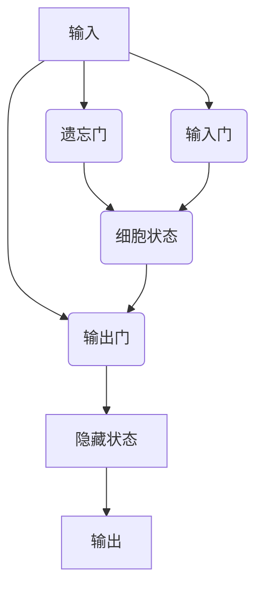

# 长短期记忆网络：捕捉长期依赖关系

## 1.背景介绍

在自然语言处理和时间序列预测等领域中,循环神经网络(RNN)长期以来一直是主流的深度学习模型。然而,标准的RNN存在着无法有效捕捉长期依赖关系的问题,这就是著名的"长期依赖问题"。为了解决这一问题,2014年,Hochreiter和Schmidhuber提出了长短期记忆网络(Long Short-Term Memory,LSTM)。LSTM通过精心设计的门控机制,能够有效地捕捉长期依赖关系,从而在各种序列建模任务中取得了卓越的表现。

### 1.1 长期依赖问题

在处理序列数据时,我们希望模型能够捕捉序列中不同时间步之间的长期依赖关系。然而,传统的RNN在学习这种长期依赖关系时存在困难,主要原因是梯度消失或爆炸问题。

在反向传播过程中,如果时间步数过长,则梯度会以指数级衰减,导致无法有效地将误差信号传递回较早的时间步,从而无法学习到长期依赖关系。相反,如果梯度呈指数级增长,则会导致梯度爆炸,使得模型无法收敛。

### 1.2 LSTM的提出

为了解决长期依赖问题,LSTM在传统RNN的基础上引入了一种特殊的门控机制,能够有选择地保留或遗忘信息,从而更好地捕捉长期依赖关系。LSTM的核心思想是维护一个细胞状态(cell state),并通过遗忘门(forget gate)、输入门(input gate)和输出门(output gate)来控制信息的流动。

## 2.核心概念与联系

### 2.1 LSTM的门控机制

LSTM的核心是门控机制,它由三个门组成:遗忘门、输入门和输出门。这些门控制着信息在细胞状态中的流动,决定了哪些信息需要保留,哪些信息需要遗忘,以及哪些信息需要输出。

1. **遗忘门(Forget Gate)**: 决定了从上一个时间步的细胞状态中保留多少信息。它根据当前输入和上一个隐藏状态,通过sigmoid函数计算一个介于0和1之间的值,0表示完全遗忘,1表示完全保留。

2. **输入门(Input Gate)**: 决定了当前时间步的输入信息中有多少需要更新到细胞状态中。它包含两部分:一个sigmoid层决定更新哪些值,一个tanh层创建一个新的候选值向量,将被加到状态中。

3. **输出门(Output Gate)**: 决定了细胞状态中的什么信息将被输出到隐藏状态,并传递到下一个时间步。它首先根据当前输入和细胞状态,通过sigmoid函数计算一个介于0和1之间的值,然后将该值与细胞状态相乘,得到最终的输出。

### 2.2 LSTM的信息流

LSTM的信息流如下所示:

1. 遗忘门决定从上一个细胞状态中保留多少信息。
2. 输入门决定当前输入和上一个隐藏状态的什么部分将被更新到细胞状态中。
3. 细胞状态根据遗忘门和输入门的决定进行更新。
4. 输出门决定细胞状态中的什么部分将被输出到隐藏状态中,并传递到下一个时间步。

通过这种精心设计的门控机制,LSTM能够有选择地保留或遗忘信息,从而更好地捕捉长期依赖关系。



## 3.核心算法原理具体操作步骤

LSTM的核心算法原理可以分为以下几个具体步骤:

### 3.1 计算遗忘门

遗忘门决定了从上一个细胞状态中保留多少信息。它的计算公式如下:

$$f_t = \sigma(W_f \cdot [h_{t-1}, x_t] + b_f)$$

其中:
- $f_t$是遗忘门的输出向量
- $\sigma$是sigmoid激活函数
- $W_f$是遗忘门的权重矩阵
- $h_{t-1}$是上一个时间步的隐藏状态
- $x_t$是当前时间步的输入
- $b_f$是遗忘门的偏置向量

### 3.2 计算输入门

输入门决定了当前输入和上一个隐藏状态的什么部分将被更新到细胞状态中。它包含两部分:

1. 一个sigmoid层决定更新哪些值:

$$i_t = \sigma(W_i \cdot [h_{t-1}, x_t] + b_i)$$

其中:
- $i_t$是输入门的sigmoid层输出向量
- $W_i$是输入门的权重矩阵
- $b_i$是输入门的偏置向量

2. 一个tanh层创建一个新的候选值向量:

$$\tilde{C}_t = \tanh(W_C \cdot [h_{t-1}, x_t] + b_C)$$

其中:
- $\tilde{C}_t$是候选细胞状态向量
- $W_C$是候选细胞状态的权重矩阵
- $b_C$是候选细胞状态的偏置向量

### 3.3 更新细胞状态

细胞状态根据遗忘门和输入门的决定进行更新,公式如下:

$$C_t = f_t \odot C_{t-1} + i_t \odot \tilde{C}_t$$

其中:
- $C_t$是当前时间步的细胞状态
- $\odot$表示元素wise乘积操作
- $f_t$是遗忘门的输出
- $C_{t-1}$是上一个时间步的细胞状态
- $i_t$是输入门的sigmoid层输出
- $\tilde{C}_t$是候选细胞状态向量

### 3.4 计算输出门

输出门决定细胞状态中的什么部分将被输出到隐藏状态中,并传递到下一个时间步。它的计算公式如下:

$$o_t = \sigma(W_o \cdot [h_{t-1}, x_t] + b_o)$$
$$h_t = o_t \odot \tanh(C_t)$$

其中:
- $o_t$是输出门的输出向量
- $W_o$是输出门的权重矩阵
- $b_o$是输出门的偏置向量
- $h_t$是当前时间步的隐藏状态

通过上述步骤,LSTM能够有效地捕捉长期依赖关系,并根据门控机制决定保留或遗忘哪些信息。

## 4.数学模型和公式详细讲解举例说明

为了更好地理解LSTM的数学模型和公式,我们来看一个具体的例子。假设我们有一个包含5个时间步的序列,每个时间步的输入向量维度为3,隐藏状态和细胞状态的维度均为4。

### 4.1 初始化

在开始计算之前,我们需要初始化隐藏状态$h_0$和细胞状态$C_0$,通常将它们初始化为全0向量。

$$h_0 = \begin{bmatrix} 0 \\ 0 \\ 0 \\ 0 \end{bmatrix}, C_0 = \begin{bmatrix} 0 \\ 0 \\ 0 \\ 0 \end{bmatrix}$$

### 4.2 时间步t=1

对于第一个时间步,输入向量为$x_1 = \begin{bmatrix} 0.5 \\ 0.1 \\ 0.2 \end{bmatrix}$。

1. 计算遗忘门:

$$f_1 = \sigma(W_f \cdot [h_0, x_1] + b_f) = \begin{bmatrix} 0.6 \\ 0.4 \\ 0.7 \\ 0.5 \end{bmatrix}$$

2. 计算输入门:

$$i_1 = \sigma(W_i \cdot [h_0, x_1] + b_i) = \begin{bmatrix} 0.3 \\ 0.2 \\ 0.4 \\ 0.6 \end{bmatrix}$$
$$\tilde{C}_1 = \tanh(W_C \cdot [h_0, x_1] + b_C) = \begin{bmatrix} 0.2 \\ -0.1 \\ 0.3 \\ 0.4 \end{bmatrix}$$

3. 更新细胞状态:

$$C_1 = f_1 \odot C_0 + i_1 \odot \tilde{C}_1 = \begin{bmatrix} 0.12 \\ -0.04 \\ 0.21 \\ 0.24 \end{bmatrix}$$

4. 计算输出门:

$$o_1 = \sigma(W_o \cdot [h_0, x_1] + b_o) = \begin{bmatrix} 0.7 \\ 0.5 \\ 0.6 \\ 0.4 \end{bmatrix}$$
$$h_1 = o_1 \odot \tanh(C_1) = \begin{bmatrix} 0.084 \\ -0.02 \\ 0.126 \\ 0.096 \end{bmatrix}$$

### 4.3 时间步t=2

对于第二个时间步,输入向量为$x_2 = \begin{bmatrix} 0.3 \\ 0.7 \\ 0.1 \end{bmatrix}$。

1. 计算遗忘门:

$$f_2 = \sigma(W_f \cdot [h_1, x_2] + b_f) = \begin{bmatrix} 0.4 \\ 0.6 \\ 0.5 \\ 0.7 \end{bmatrix}$$

2. 计算输入门:

$$i_2 = \sigma(W_i \cdot [h_1, x_2] + b_i) = \begin{bmatrix} 0.6 \\ 0.4 \\ 0.5 \\ 0.3 \end{bmatrix}$$
$$\tilde{C}_2 = \tanh(W_C \cdot [h_1, x_2] + b_C) = \begin{bmatrix} 0.4 \\ -0.3 \\ 0.2 \\ 0.1 \end{bmatrix}$$

3. 更新细胞状态:

$$C_2 = f_2 \odot C_1 + i_2 \odot \tilde{C}_2 = \begin{bmatrix} 0.256 \\ -0.132 \\ 0.21 \\ 0.154 \end{bmatrix}$$

4. 计算输出门:

$$o_2 = \sigma(W_o \cdot [h_1, x_2] + b_o) = \begin{bmatrix} 0.4 \\ 0.6 \\ 0.5 \\ 0.7 \end{bmatrix}$$
$$h_2 = o_2 \odot \tanh(C_2) = \begin{bmatrix} 0.1024 \\ -0.0792 \\ 0.105 \\ 0.1078 \end{bmatrix}$$

以此类推,我们可以计算出剩余时间步的隐藏状态和细胞状态。通过这个例子,我们可以更好地理解LSTM的数学模型和公式,以及它是如何捕捉长期依赖关系的。

## 5.项目实践：代码实例和详细解释说明

为了更好地理解LSTM的工作原理,我们来看一个基于PyTorch的代码实例。在这个例子中,我们将构建一个LSTM模型来预测sin函数的值。

### 5.1 导入必要的库

```python
import torch
import torch.nn as nn
import matplotlib.pyplot as plt
import math
```

### 5.2 生成训练数据

```python
# 生成训练数据
T = 20 # 序列长度
len_dataset = 5000 # 数据集长度
data = []
for start in range(0, len_dataset - T):
    x = [math.sin(i * 2 * math.pi / 100) for i in range(start, start + T)]
    y = math.sin((start + T) * 2 * math.pi / 100)
    data.append((x, y))

# 将数据转换为PyTorch张量
X = torch.tensor([x for x, y in data], dtype=torch.float32)
Y = torch.tensor([y for x, y in data], dtype=torch.float32)
```

### 5.3 定义LSTM模型

```python
class LSTMModel(nn.Module):
    def __init__(self, input_size, hidden_size, output_size):
        super(LSTMModel, self).__init__()
        self.hidden_size = hidden_size
        self.lstm = nn.LSTM(input_size, hidden_size, batch_first=True)
        self.fc = nn.Linear(hidden_size, output_size)

    def forward(self,