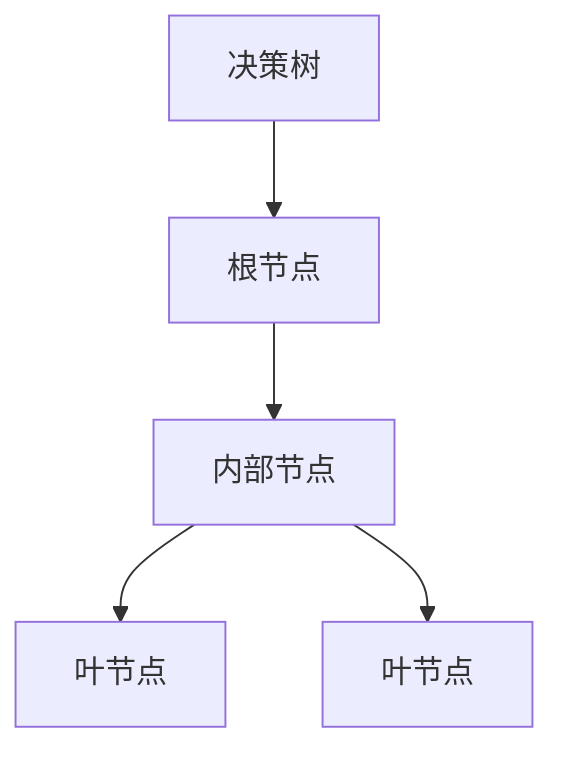
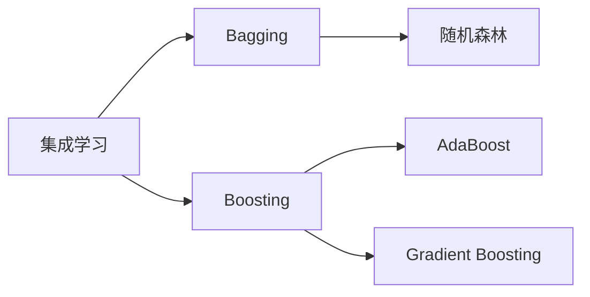
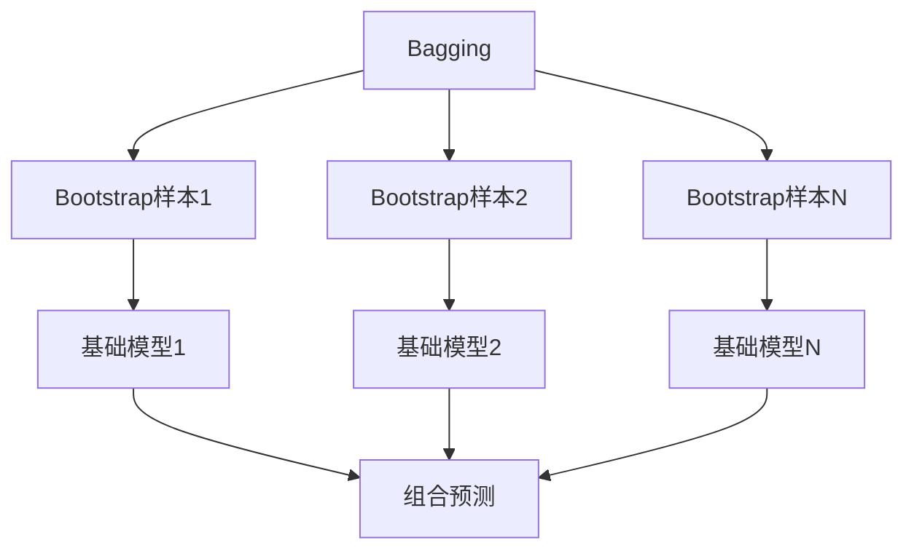
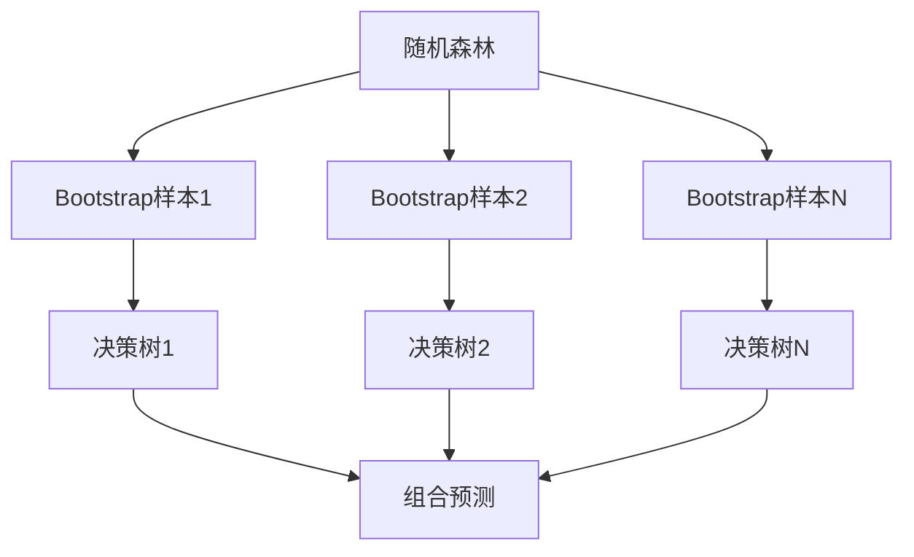

# 随机森林：集成学习的强大力量

## 1.背景介绍

随着数据的快速增长和机器学习算法的不断发展,集成学习(Ensemble Learning)作为一种强大的机器学习范式,越来越受到关注和应用。集成学习的核心思想是将多个基础模型(base models)组合在一起,从而获得比单个模型更加准确和鲁棒的预测结果。在集成学习算法中,随机森林(Random Forest)作为一种流行且有效的集成学习技术,展现出了卓越的性能和广泛的应用前景。

随机森林算法最初由Leo Breiman于2001年提出,它是在决策树(Decision Tree)的基础上发展而来的。与单一决策树相比,随机森林通过构建多个决策树并将它们的预测结果进行组合,从而显著提高了模型的准确性和泛化能力。这种组合策略不仅可以减少过拟合的风险,还能够捕捉数据中更加复杂和细微的模式。

随机森林算法在诸多领域展现出了优异的表现,如图像识别、自然语言处理、生物信息学等,并被广泛应用于分类、回归和异常检测等任务中。它的成功不仅源于其强大的预测能力,还因为它具有很好的可解释性、对异常值的鲁棒性以及对高维数据的处理能力。

## 2.核心概念与联系

要深入理解随机森林算法,我们需要先了解一些核心概念和相关联的理论基础。

### 2.1 决策树(Decision Tree)

决策树是一种基于树形结构的监督学习算法,它通过递归地对特征空间进行划分,将输入数据划分到不同的叶节点,从而进行分类或回归预测。决策树具有可解释性强、易于理解的优点,但也存在过拟合的风险。



### 2.2 集成学习(Ensemble Learning)

集成学习是将多个基础模型(如决策树)组合在一起,从而获得比单个模型更好的预测性能的一种方法。常见的集成学习技术包括Bagging(Bootstrap Aggregating)和Boosting。



### 2.3 Bagging(Bootstrap Aggregating)

Bagging是一种常用的集成学习技术,它通过从原始数据集中有放回地抽取多个Bootstrap样本,并在每个Bootstrap样本上训练一个基础模型,最后将这些基础模型的预测结果进行平均或投票,从而获得最终的预测结果。Bagging可以有效减少基础模型的方差,提高模型的泛化能力。



### 2.4 随机森林(Random Forest)

随机森林是Bagging技术在决策树上的一种扩展和改进,它在构建每个决策树时,不仅从原始数据集中有放回地抽取Bootstrap样本,还会在每个节点上随机选择一部分特征进行分裂,从而进一步减少了基础模型之间的相关性,提高了模型的多样性和泛化能力。



## 3.核心算法原理具体操作步骤

随机森林算法的核心步骤如下:

1. 从原始数据集中有放回地抽取 $N$ 个 Bootstrap 样本,每个样本的大小与原始数据集相同。
2. 对每个 Bootstrap 样本,构建一个决策树:
   - 在每个节点上,随机选择 $m$ 个特征(其中 $m \ll M$,M 为总特征数)。
   - 在选定的 $m$ 个特征中,选择最优特征进行分裂。
   - 每棵树在构建过程中不进行剪枝。
3. 对于分类问题,每棵决策树对测试样本进行分类预测,随机森林的最终预测结果是由个体树预测结果的简单投票(majority vote)决定的。对于回归问题,随机森林的预测结果是所有决策树预测值的均值。

随机森林算法的伪代码如下:

```
函数 RandomForest(数据集 D, 特征数 M, 树数量 N):
    初始化森林 F
    for i = 1 to N:
        从 D 中有放回地抽取一个 Bootstrap 样本 S
        在 S 上构建一棵决策树 T:
            对每个节点:
                从 M 个特征中随机选择 m 个特征
                在选定的 m 个特征中选择最优特征进行分裂
        将决策树 T 添加到森林 F 中
    返回森林 F

函数 Predict(样本 x, 森林 F):
    对于分类问题:
        初始化计数器 count = 0
        for 每棵树 T 在 F 中:
            将 x 输入到 T 中获得预测值 y
            if y == 1:
                count += 1
        if count > N/2:
            返回 1
        else:
            返回 0
    对于回归问题:
        初始化和 sum = 0
        for 每棵树 T 在 F 中:
            将 x 输入到 T 中获得预测值 y
            sum += y
        返回 sum / N
```

## 4.数学模型和公式详细讲解举例说明

随机森林算法的核心思想是通过构建多个决策树,并将它们的预测结果进行组合,从而获得比单个决策树更加准确和鲁棒的预测结果。我们可以用数学模型来描述这一过程。

设有 $N$ 棵决策树 $\{T_1, T_2, \dots, T_N\}$,对于一个输入样本 $x$,每棵树都会给出一个预测值 $y_i = T_i(x)$。

### 4.1 分类问题

对于二分类问题,我们可以将每棵树的预测结果 $y_i$ 视为一个伯努利随机变量,取值为 0 或 1。随机森林的预测值 $\hat{y}(x)$ 可以通过个体树预测结果的简单投票(majority vote)决定:

$$\hat{y}(x) = \begin{cases}
1, & \text{if } \sum_{i=1}^N y_i > N/2 \\
0, & \text{otherwise}
\end{cases}$$

对于多分类问题,我们可以将每棵树的预测结果 $y_i$ 视为一个多项式随机变量,取值为 $\{1, 2, \dots, K\}$,其中 $K$ 为类别数。随机森林的预测值 $\hat{y}(x)$ 可以通过个体树预测结果的简单投票(majority vote)决定:

$$\hat{y}(x) = \arg\max_k \sum_{i=1}^N \mathbb{I}(y_i = k)$$

其中 $\mathbb{I}(\cdot)$ 是指示函数。

### 4.2 回归问题

对于回归问题,我们可以将每棵树的预测结果 $y_i$ 视为一个连续随机变量。随机森林的预测值 $\hat{y}(x)$ 可以通过对所有决策树预测值取均值得到:

$$\hat{y}(x) = \frac{1}{N} \sum_{i=1}^N y_i$$

### 4.3 示例

假设我们有一个二分类问题,构建了 5 棵决策树,对于一个输入样本 $x$,每棵树的预测结果如下:

- $T_1(x) = 1$
- $T_2(x) = 0$
- $T_3(x) = 1$
- $T_4(x) = 1$
- $T_5(x) = 0$

根据投票规则,我们有:

$$\sum_{i=1}^5 y_i = 1 + 0 + 1 + 1 + 0 = 3 > 5/2$$

因此,随机森林的预测结果为 $\hat{y}(x) = 1$。

## 5.项目实践：代码实例和详细解释说明

为了更好地理解随机森林算法,我们将通过一个实际的代码示例来演示如何使用 Python 中的 scikit-learn 库构建和训练一个随机森林模型。

```python
from sklearn.ensemble import RandomForestClassifier
from sklearn.datasets import make_classification
from sklearn.model_selection import train_test_split
from sklearn.metrics import accuracy_score

# 生成模拟数据
X, y = make_classification(n_samples=1000, n_features=10, n_informative=5, random_state=42)

# 划分训练集和测试集
X_train, X_test, y_train, y_test = train_test_split(X, y, test_size=0.2, random_state=42)

# 创建随机森林分类器
rf = RandomForestClassifier(n_estimators=100, max_depth=None, random_state=42)

# 训练模型
rf.fit(X_train, y_train)

# 在测试集上进行预测
y_pred = rf.predict(X_test)

# 计算准确率
accuracy = accuracy_score(y_test, y_pred)
print(f"Random Forest Accuracy: {accuracy:.2f}")
```

在这个示例中,我们首先使用 `make_classification` 函数生成了一个模拟的二分类数据集,包含 1000 个样本和 10 个特征,其中有 5 个特征是信息特征。然后,我们将数据集划分为训练集和测试集。

接下来,我们创建了一个 `RandomForestClassifier` 对象,并设置了一些参数:

- `n_estimators=100` 表示我们将构建 100 棵决策树。
- `max_depth=None` 表示每棵树在构建过程中不进行剪枝。
- `random_state=42` 用于设置随机种子,确保每次运行结果一致。

我们调用 `fit` 方法在训练集上训练随机森林模型,然后使用 `predict` 方法在测试集上进行预测。最后,我们计算了模型在测试集上的准确率。

在这个示例中,我们得到的随机森林模型在测试集上的准确率约为 0.95,这表明随机森林算法在这个模拟数据集上表现出了很好的性能。

## 6.实际应用场景

随机森林算法由于其出色的性能和广泛的适用性,在许多实际应用场景中发挥着重要作用。以下是一些典型的应用场景:

### 6.1 图像识别和计算机视觉

随机森林在图像识别和计算机视觉领域有着广泛的应用,如人脸识别、手写数字识别、场景分类等。由于随机森林对高维数据的处理能力,它可以有效地处理图像像素数据,并捕捉图像中的复杂模式。

### 6.2 自然语言处理

在自然语言处理领域,随机森林可以用于文本分类、情感分析、命名实体识别等任务。通过将文本数据转换为特征向量,随机森林可以学习文本数据中的模式,并进行准确的预测。

### 6.3 生物信息学

随机森林在生物信息学领域也有着广泛的应用,如基因表达分析、蛋白质结构预测、疾病诊断等。由于随机森林对异常值的鲁棒性,它可以有效地处理生物数据中常见的噪声和异常值。

### 6.4 金融风险管理

在金融领域,随机森林可以用于信用评分、欺诈检测、风险评估等任务。通过建模历史数据,随机森林可以学习到影响风险的关键因素,并对新的数据进行准确的风险评估。

### 6.5 推荐系统

随机森林也可以应用于推荐系统,通过分析用户的历史行为数据和商品特征,随机森林可以预测用户对不同商品的偏好,从而为用户提供个性化的推荐。

## 7.工具和资源推荐

如果您想进一步学习和实践随机森林算法,以下是一些推荐的工具和资源: