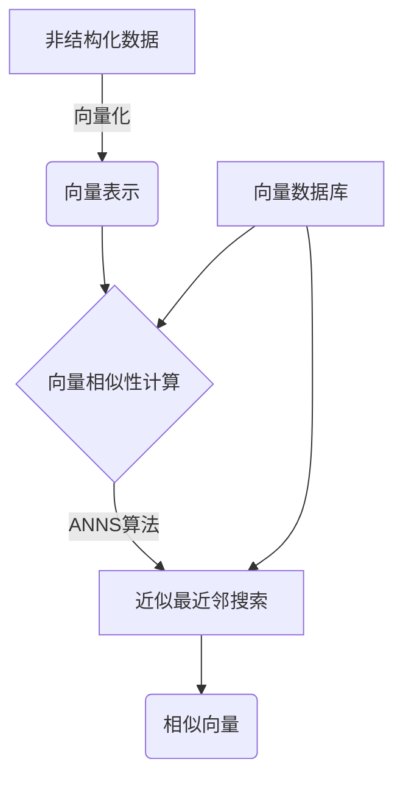
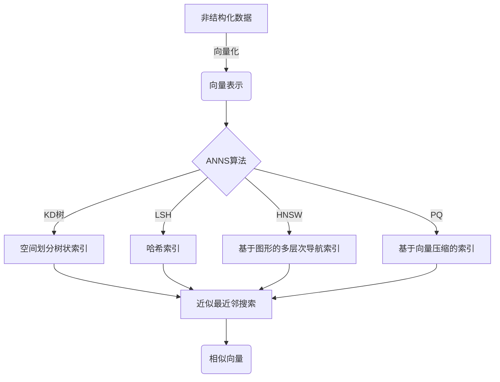

# 高效检索：构建基于向量数据库的高性能搜索引擎

## 1.背景介绍

### 1.1 数据爆炸时代的挑战

在当今信息时代，数据的产生和积累速度呈现出前所未有的指数级增长。无论是个人还是企业,都面临着如何高效地存储、检索和利用这些海量数据的巨大挑战。传统的关系型数据库和搜索引擎在处理结构化数据方面表现出色,但在应对非结构化数据(如文本、图像、音频等)时却显得力不从心。

### 1.2 向量搜索的兴起

为了解决这一难题,向量搜索(Vector Search)技术应运而生。它通过将非结构化数据映射到高维向量空间,利用向量之间的相似性来实现高效的相似性搜索。这种新型搜索范式为处理海量非结构化数据提供了一种全新的解决方案,在信息检索、推荐系统、知识库构建等领域展现出巨大的潜力。

### 1.3 向量数据库的重要性

向量数据库(Vector Database)作为向量搜索技术的关键支撑,承担着高效存储和检索向量数据的重任。它们通过专门设计的索引结构和查询算法,实现了对海量向量数据的快速相似性搜索,成为构建高性能向量搜索引擎的核心基础设施。

## 2.核心概念与联系

### 2.1 向量化

向量化(Vectorization)是将非结构化数据(如文本、图像等)转换为向量表示的过程。常见的向量化方法包括:

- 文本向量化: 利用词袋模型(Bag-of-Words)、TF-IDF、Word2Vec等技术将文本映射为向量。
- 图像向量化: 使用卷积神经网络(CNN)等深度学习模型提取图像的特征向量。

向量化使得原本难以计算的非结构化数据具备了数值化表示,为后续的相似性计算和搜索奠定基础。

### 2.2 向量相似性

向量相似性(Vector Similarity)描述了两个向量在向量空间中的接近程度。常用的相似性度量包括:

- 欧几里得距离(Euclidean Distance)
- 余弦相似度(Cosine Similarity)
- 内积(Dot Product)

相似性度量是向量搜索的核心,它决定了搜索结果的相关性排序。选择合适的相似性度量对于获得高质量的搜索结果至关重要。

### 2.3 近似最近邻搜索

近似最近邻搜索(Approximate Nearest Neighbor Search, ANNS)是向量搜索的核心算法。给定一个查询向量,它的目标是在海量向量数据中快速找到与查询向量最相似的 K 个向量。由于精确最近邻搜索在高维空间中的计算复杂度极高,因此需要使用近似算法来实现高效的近似最近邻搜索。

常见的 ANNS 算法包括:

- 树状索引结构,如 KD 树、球树等。
- 哈希索引,如局部敏感哈希(Locality Sensitive Hashing, LSH)。
- 基于图形的索引,如层次导航小世界(Hierarchical Navigable Small World, HNSW)。
- 基于向量压缩的索引,如产品量化(Product Quantization, PQ)、标量量化(Scalar Quantization, SQ)等。

选择合适的 ANNS 算法对于构建高性能向量搜索引擎至关重要,它决定了搜索的精度和效率。

### 2.4 向量数据库

向量数据库是专门为存储和检索向量数据而设计的数据库系统。它们通常包括以下关键组件:

- 向量存储引擎: 高效存储和管理海量向量数据。
- ANNS 索引: 基于特定的 ANNS 算法构建的索引结构,加速向量相似性搜索。
- 查询引擎: 接收查询请求,利用 ANNS 索引执行高效的相似性搜索,返回最相关的结果。

流行的开源向量数据库包括 Milvus、Weaviate、FAISS 等。选择合适的向量数据库对于构建高性能向量搜索引擎至关重要。

### 2.5 Mermaid 流程图

上图展示了向量搜索的核心流程:

1. 非结构化数据经过向量化转换为向量表示。
2. 向量表示与向量数据库中的向量进行相似性计算。
3. 基于 ANNS 算法执行近似最近邻搜索,快速找到最相似的向量。
4. 返回相似向量作为搜索结果。

## 3.核心算法原理具体操作步骤

### 3.1 向量化算法

#### 3.1.1 文本向量化

##### 词袋模型(Bag-of-Words)

1. 构建词典(Vocabulary),包含所有出现过的单词。
2. 对每个文档,统计词典中每个单词在该文档中出现的频率。
3. 将文档表示为一个向量,其中每个维度对应词典中的一个单词,值为该单词在文档中的频率。

##### TF-IDF

1. 计算每个单词在文档中出现的频率(Term Frequency, TF)。
2. 计算每个单词在整个语料库中的逆文档频率(Inverse Document Frequency, IDF),常见单词的 IDF 值较低。
3. 将 TF 和 IDF 相乘,得到 TF-IDF 值作为单词的权重。
4. 将文档表示为一个向量,其中每个维度对应一个单词,值为该单词的 TF-IDF 权重。

##### Word2Vec

1. 使用浅层神经网络模型(如 Skip-gram 或 CBOW)对大规模语料库进行训练。
2. 模型将每个单词映射为一个固定长度的向量(通常为 300 维)。
3. 语义相似的单词在向量空间中彼此靠近。

#### 3.1.2 图像向量化

1. 使用预训练的卷积神经网络(CNN)模型,如 VGGNet、ResNet 等。
2. 将图像输入到 CNN 模型,在特定层提取特征向量。
3. 特征向量通常具有高维度(如 4096 维),能够捕捉图像的语义信息。

### 3.2 近似最近邻搜索算法

#### 3.2.1 KD 树

KD 树(K-Dimensional Tree)是一种基于空间划分的树状数据结构,常用于执行最近邻搜索。其基本原理如下:

1. 构建过程:
    - 选择一个维度作为切分维度,以该维度的中位数将数据集划分为两个子集。
    - 递归地在两个子集上重复上述过程,直到子集足够小或满足其他终止条件。

2. 搜索过程:
    - 从根节点开始,根据查询向量在切分维度上的值决定搜索哪个子树。
    - 递归地在子树中搜索,同时维护当前最近邻候选。
    - 根据某些剪枝条件决定是否需要搜索另一个子树。

KD 树在低维空间中表现良好,但在高维情况下会遭受"维数灾难"(Curse of Dimensionality),导致性能下降。

#### 3.2.2 局部敏感哈希

局部敏感哈希(Locality Sensitive Hashing, LSH)是一种基于哈希的 ANNS 算法。其核心思想是:对于相似的向量,经过哈希函数映射后,它们有很高的概率落入同一个哈希桶中。

1. 构建过程:
    - 定义一组局部敏感哈希函数族。
    - 对每个向量使用多个哈希函数计算哈希值,形成一个哈希签名(Hash Signature)。
    - 根据哈希签名将向量存储到对应的哈希桶中。

2. 搜索过程:
    - 对查询向量计算哈希签名。
    - 检索与查询向量哈希签名相同的哈希桶,获取候选向量。
    - 在候选向量中计算真实距离,返回最近邻向量。

LSH 具有较好的理论保证,但在实践中可能需要大量哈希函数和存储空间才能获得良好的搜索精度。

#### 3.2.3 层次导航小世界

层次导航小世界(Hierarchical Navigable Small World, HNSW)是一种基于图形的 ANNS 算法,它通过构建多层次的导航结构来加速最近邻搜索。

1. 构建过程:
    - 将所有向量作为图的节点,计算节点之间的距离作为边权重。
    - 从任意节点出发,按照距离从小到大的顺序添加边,构建多层次的导航结构。
    - 每个节点维护一个邻居列表,包含距离最近的 M 个节点。

2. 搜索过程:
    - 从入口节点开始,沿着距离最近的邻居节点移动。
    - 利用导航结构快速接近查询向量的最近邻。
    - 在局部区域内进行精确搜索,返回最终结果。

HNSW 在高维空间中表现出色,能够在较小的内存占用下实现高效的近似最近邻搜索。

#### 3.2.4 产品量化

产品量化(Product Quantization, PQ)是一种基于向量压缩的 ANNS 算法,它将高维向量分解为多个低维子向量,分别对每个子向量进行量化编码,从而实现高效的距离计算和索引。

1. 构建过程:
    - 将原始高维向量 $\vec{x}$ 分解为 $m$ 个低维子向量 $\vec{x}_1, \vec{x}_2, \dots, \vec{x}_m$。
    - 对每个子向量 $\vec{x}_i$ 学习一个量化码本 $C_i$,将 $\vec{x}_i$ 量化为码字 $c_i$。
    - 将所有码字 $c_1, c_2, \dots, c_m$ 拼接成压缩向量 $\vec{c}$,作为原始向量 $\vec{x}$ 的近似表示。

2. 搜索过程:
    - 对查询向量 $\vec{q}$ 执行相同的分解和量化操作,得到压缩向量 $\vec{c}_q$。
    - 计算 $\vec{c}_q$ 与数据集中所有压缩向量的距离,返回最近邻向量。

产品量化能够在保持较高搜索精度的同时,极大地减小向量的存储空间和加速距离计算。

### 3.3 Mermaid 流程图

上图展示了常见的 ANNS 算法在向量搜索中的应用流程:

1. 非结构化数据经过向量化转换为向量表示。
2. 根据选择的 ANNS 算法,构建相应的索引结构,如 KD 树、哈希索引、导航结构或压缩向量索引。
3. 利用构建的索引,执行高效的近似最近邻搜索。
4. 返回与查询向量最相似的向量作为搜索结果。

## 4.数学模型和公式详细讲解举例说明

### 4.1 向量相似性度量

#### 4.1.1 欧几里得距离

欧几里得距离(Euclidean Distance)是最直观的向量距离度量,它描述了两个向量在向量空间中的直线距离。对于 $n$ 维向量 $\vec{x}$ 和 $\vec{y}$,它们的欧几里得距离定义为:

$$
d_{Euclidean}(\vec{x}, \vec{y}) = \sqrt{\sum_{i=1}^{n}(x_i - y_i)^2}
$$