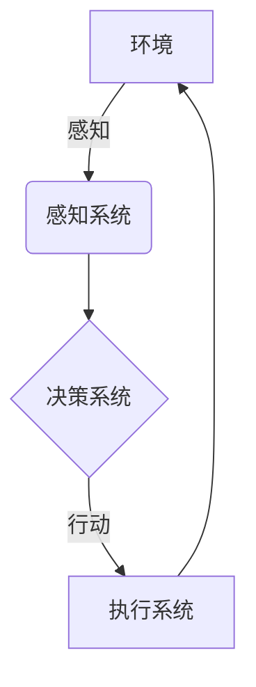

# AI Agent: AI的下一个风口 从感知到行动的过程

## 1.背景介绍

### 1.1 人工智能的发展历程

人工智能(Artificial Intelligence, AI)是当代科技发展的前沿领域,自20世纪50年代问世以来,已经经历了几个重要的发展阶段。早期的人工智能系统主要集中在专家系统、机器学习等领域,能够模拟人类的一些基本认知能力。随着算力和数据的不断增长,深度学习等新兴技术的兴起,人工智能系统的能力得到了极大的提升,在语音识别、图像识别、自然语言处理等领域取得了突破性的进展。

### 1.2 AI Agent的兴起

然而,传统的人工智能系统大多停留在感知层面,缺乏对环境的主动交互和决策能力。为了突破这一局限,AI Agent(智能体)应运而生。AI Agent是一种能够感知环境、做出决策并执行行动的智能系统,旨在模拟人类在现实世界中的行为方式。与传统AI系统相比,AI Agent不仅能够获取和处理信息,还能根据获取的信息主动做出判断并采取相应的行动,从而真正实现"从感知到行动"的闭环过程。

### 1.3 AI Agent的重要性

AI Agent的出现标志着人工智能发展进入了一个新的阶段。它将人工智能的应用从虚拟世界拓展到了现实世界,为人工智能系统赋予了更强的自主性和适应性。AI Agent在无人驾驶、智能家居、机器人技术等诸多领域发挥着越来越重要的作用,被认为是推动人工智能实现质的飞跃的关键技术之一。

## 2.核心概念与联系

### 2.1 AI Agent的定义

AI Agent是一种能够感知环境、做出决策并执行行动的智能系统。它由感知系统、决策系统和执行系统三个核心部分组成:

- 感知系统负责获取环境信息,包括视觉、听觉、触觉等多种感知能力。
- 决策系统根据感知系统获取的信息,结合预设目标和约束条件,做出相应的决策判断。
- 执行系统则负责将决策系统的输出转化为具体的行动,对环境产生影响。

### 2.2 AI Agent与环境的交互

AI Agent与环境之间存在着动态的交互过程。Agent通过感知系统不断获取环境信息,并根据这些信息做出决策和行动。同时,Agent的行动也会影响和改变环境的状态,环境的变化又会反过来影响Agent的感知和决策。这种循环往复的交互过程,使得AI Agent能够持续地适应和应对环境的变化。



### 2.3 AI Agent的分类

根据Agent与环境的交互方式,AI Agent可以分为以下几种类型:

- 反应型Agent:只根据当前的感知信息做出反应,没有内部状态。
- 基于模型的Agent:维护了环境的内部状态模型,可以根据模型预测环境的变化。
- 基于目标的Agent:具有预设的目标,决策过程旨在实现这些目标。
- 基于效用的Agent:根据预定义的效用函数(utility function)评估行动的价值,选择效用最大的行动。
- 学习型Agent:能够根据过去的经验,不断优化自身的决策策略。

## 3.核心算法原理具体操作步骤

### 3.1 马尔可夫决策过程(MDP)

马尔可夫决策过程(Markov Decision Process, MDP)是AI Agent决策系统的核心算法之一。MDP建模了Agent与环境的交互过程,将其视为一个由状态、行动、奖励函数和状态转移概率组成的数学模型。

MDP的具体操作步骤如下:

1. 定义状态空间(State Space)$S$和行动空间(Action Space)$A$。
2. 确定奖励函数(Reward Function)$R(s,a,s')$,表示在状态$s$下执行行动$a$转移到状态$s'$时获得的即时奖励。
3. 确定状态转移概率(State Transition Probability)$P(s'|s,a)$,表示在状态$s$下执行行动$a$转移到状态$s'$的概率。
4. 选择一个策略(Policy)$\pi(a|s)$,表示在状态$s$下选择行动$a$的概率分布。
5. 定义价值函数(Value Function)$V^{\pi}(s)$或$Q^{\pi}(s,a)$,分别表示在策略$\pi$下处于状态$s$或在状态$s$执行行动$a$后的长期累计奖励。
6. 使用动态规划(Dynamic Programming)或强化学习(Reinforcement Learning)算法,找到一个最优策略$\pi^*$,使得价值函数$V^{\pi^*}(s)$或$Q^{\pi^*}(s,a)$最大化。

$$
V^{\pi}(s) = \mathbb{E}_{\pi}\left[ \sum_{t=0}^{\infty} \gamma^t R(s_t, a_t, s_{t+1}) \right]
$$

$$
Q^{\pi}(s,a) = \mathbb{E}_{\pi}\left[ \sum_{t=0}^{\infty} \gamma^t R(s_t, a_t, s_{t+1}) | s_0 = s, a_0 = a \right]
$$

其中$\gamma \in [0,1]$是折现因子,用于平衡即时奖励和长期奖励的权重。

### 3.2 深度强化学习(Deep Reinforcement Learning)

深度强化学习是将深度学习技术应用于强化学习的一种方法,旨在解决MDP中状态空间和行动空间过大的问题。深度强化学习算法通常采用神经网络来近似价值函数或策略函数,从而能够处理高维的状态和行动空间。

一些典型的深度强化学习算法包括:

- 深度Q网络(Deep Q-Network, DQN)
- 策略梯度(Policy Gradient)算法
- 优势Actor-Critic(Advantage Actor-Critic, A2C)算法
- 深度确定性策略梯度(Deep Deterministic Policy Gradient, DDPG)算法

这些算法在训练过程中,通过与环境的不断交互,调整神经网络的参数,使得Agent能够逐步学习到一个优秀的策略。

## 4.数学模型和公式详细讲解举例说明

### 4.1 马尔可夫链(Markov Chain)

马尔可夫链是MDP的基础,用于描述系统状态的转移过程。在马尔可夫链中,系统的下一个状态只依赖于当前状态,与过去的状态无关。

设$X_t$表示时刻$t$的系统状态,状态空间为$S$,则马尔可夫链的状态转移概率可表示为:

$$
P(X_{t+1} = j | X_t = i, X_{t-1} = i_{t-1}, \dots, X_0 = i_0) = P(X_{t+1} = j | X_t = i)
$$

其中$P(X_{t+1} = j | X_t = i)$称为状态$i$到$j$的一步转移概率,记为$p_{ij}$。

对于任意时刻$t$和状态$i,j,k$,马尔可夫链满足以下性质:

$$
\sum_{j \in S} p_{ij} = 1
$$

$$
p_{ijk} = p_{ij} p_{jk}
$$

其中$p_{ijk}$表示从$i$状态经过$j$状态到达$k$状态的两步转移概率。

### 4.2 贝叶斯决策理论(Bayesian Decision Theory)

贝叶斯决策理论是AI Agent决策系统的另一个重要理论基础。在这一理论中,Agent需要根据观测到的证据(Evidence)$E$,选择一个行动(Action)$a$,使得在给定的效用函数(Utility Function)$U(a,h)$下,期望效用(Expected Utility)最大化。

$$
\begin{aligned}
EU(a|E) &= \sum_h P(h|E) U(a,h) \\
         &= \sum_h P(E|h)P(h) U(a,h) / P(E)
\end{aligned}
$$

其中$h$表示世界的可能状态(Hypotheses),$P(h|E)$是在观测到证据$E$后,$h$为真的后验概率,$P(h)$是$h$的先验概率,$P(E|h)$是在假设$h$为真时观测到证据$E$的概率。

根据贝叶斯决策理论,Agent应该选择使期望效用$EU(a|E)$最大化的行动$a^*$:

$$
a^* = \arg\max_a EU(a|E)
$$

贝叶斯决策理论为AI Agent在不确定环境下做出最优决策提供了理论依据。

### 4.3 多臂老虎机问题(Multi-Armed Bandit Problem)

多臂老虎机问题是强化学习中一个经典的探索与利用(Exploration vs Exploitation)权衡问题。假设有$K$个老虎机臂,每次拉动一个臂会获得一定的奖励,但每个臂的奖励分布是未知的。Agent的目标是最大化长期累计奖励。

设第$i$个臂的奖励分布为$p_i$,第$t$次拉动第$k_t$个臂获得的奖励为$r_t$,则Agent需要设计一个策略$\pi$,使得长期累计奖励的期望值最大化:

$$
\max_{\pi} \mathbb{E}\left[ \sum_{t=1}^{\infty} r_t \right]
$$

一种常用的策略是$\epsilon$-贪婪(epsilon-greedy)策略,它在每一步随机以$\epsilon$的概率探索(选择一个随机臂),以$1-\epsilon$的概率利用(选择当前估计最优的臂)。

另一种策略是Upper Confidence Bound(UCB)算法,它通过计算每个臂的置信上界,在探索与利用之间实现更好的权衡。

$$
UCB_i = \hat{\mu}_i + c \sqrt{\frac{\log n}{n_i}}
$$

其中$\hat{\mu}_i$是第$i$个臂的平均奖励估计值,$n_i$是第$i$个臂被选择的次数,$n$是总的试验次数,$c$是一个超参数,用于控制探索和利用的程度。

多臂老虎机问题为设计AI Agent的探索与利用策略提供了重要的理论基础。

## 5.项目实践:代码实例和详细解释说明

以下是一个使用Python实现的简单的基于Q-Learning的强化学习Agent示例,用于解决一个格子世界(Gridworld)问题。

### 5.1 环境设置

我们首先定义格子世界的环境,包括状态空间、行动空间、奖励函数和状态转移函数。

```python
import numpy as np

# 格子世界的大小
GRID_SIZE = 5

# 定义行动空间
ACTIONS = ['UP', 'DOWN', 'LEFT', 'RIGHT']

# 定义奖励函数
REWARDS = np.zeros((GRID_SIZE, GRID_SIZE))
REWARDS[0, 0] = 1  # 起点奖励为1
REWARDS[GRID_SIZE-1, GRID_SIZE-1] = 10  # 终点奖励为10

# 定义状态转移函数
def step(state, action):
    i, j = state
    if action == 'UP':
        next_state = (max(i - 1, 0), j)
    elif action == 'DOWN':
        next_state = (min(i + 1, GRID_SIZE - 1), j)
    elif action == 'LEFT':
        next_state = (i, max(j - 1, 0))
    else:
        next_state = (i, min(j + 1, GRID_SIZE - 1))
    reward = REWARDS[next_state]
    return next_state, reward
```

### 5.2 Q-Learning算法实现

接下来,我们使用Q-Learning算法训练一个Agent,让它学习在格子世界中从起点到达终点的最优路径。

```python
import random

# 初始化Q表格
Q = np.zeros((GRID_SIZE, GRID_SIZE, len(ACTIONS)))

# 设置超参数
ALPHA = 0.1  # 学习率
GAMMA = 0.9  # 折现因子
EPSILON = 0.1  # 探索率

# 训练函数
def train(num_episodes):
    for episode in range(num_episodes):
        state = (0, 0)  # 初始状态
        done = False
        while not done:
            # 选择行动
            if random.uniform(0, 1) < EPSILON:
                action = random.choice(ACTIONS)  # 探索
            else:
                action = np.argmax(Q[state])  # 利用{"msg_type":"generate_answer_finish","data":"","from_module":null,"from_unit":null}