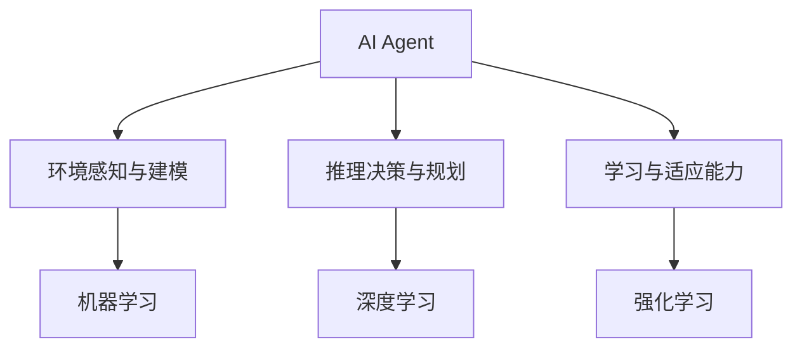

# AI Agent: AI的下一个风口 从早期萌芽到深度学习

## 1. 背景介绍
### 1.1 人工智能的发展历程
#### 1.1.1 人工智能的起源与定义
#### 1.1.2 人工智能发展的三个阶段
#### 1.1.3 人工智能的现状与挑战

### 1.2 AI Agent的概念与意义
#### 1.2.1 AI Agent的定义
#### 1.2.2 AI Agent的特点与优势
#### 1.2.3 AI Agent在人工智能领域的地位

## 2. 核心概念与联系
### 2.1 Agent的概念与分类
#### 2.1.1 Agent的定义与特征
#### 2.1.2 反应式Agent与认知型Agent
#### 2.1.3 单Agent系统与多Agent系统

### 2.2 AI Agent的核心要素
#### 2.2.1 环境感知与建模
#### 2.2.2 推理决策与规划
#### 2.2.3 学习与适应能力

### 2.3 AI Agent与其他AI技术的关系
#### 2.3.1 AI Agent与机器学习的关系
#### 2.3.2 AI Agent与深度学习的关系
#### 2.3.3 AI Agent与强化学习的关系



## 3. 核心算法原理具体操作步骤
### 3.1 基于搜索的AI Agent
#### 3.1.1 状态空间搜索算法
#### 3.1.2 启发式搜索算法
#### 3.1.3 博弈树搜索算法

### 3.2 基于规划的AI Agent
#### 3.2.1 经典规划算法STRIPS
#### 3.2.2 层次化任务网络规划HTN
#### 3.2.3 部分可观测马尔可夫决策过程POMDP

### 3.3 基于学习的AI Agent  
#### 3.3.1 监督学习算法
#### 3.3.2 无监督学习算法
#### 3.3.3 强化学习算法

## 4. 数学模型和公式详细讲解举例说明
### 4.1 马尔可夫决策过程MDP
MDP是一个五元组$(S,A,P,R,\gamma)$，其中:
- $S$是有限的状态集合
- $A$是有限的动作集合  
- $P$是状态转移概率矩阵，$P(s'|s,a)$表示在状态$s$下执行动作$a$后转移到状态$s'$的概率
- $R$是奖励函数，$R(s,a)$表示在状态$s$下执行动作$a$获得的即时奖励
- $\gamma \in [0,1]$是折扣因子，表示未来奖励的重要程度

求解MDP的目标是寻找一个最优策略$\pi^*$，使得期望累积奖励最大化：

$$\pi^* = \arg\max_\pi \mathbb{E}\left[\sum_{t=0}^{\infty} \gamma^t R(s_t,a_t)\right]$$

其中$s_t$和$a_t$分别表示在时刻$t$的状态和动作。求解最优策略的经典算法有值迭代、策略迭代等。

### 4.2 Q-Learning算法
Q-Learning是一种无模型的离线策略强化学习算法，其迭代公式为：

$$Q(s,a) \leftarrow Q(s,a) + \alpha \left[r + \gamma \max_{a'}Q(s',a') - Q(s,a)\right]$$

其中$\alpha \in (0,1]$是学习率，$r$是执行动作$a$后获得的即时奖励，$s'$是执行动作$a$后转移到的下一个状态。

Q-Learning的优点是简单且收敛性有保证，缺点是探索效率较低，容易陷入局部最优。改进的变体有Double Q-Learning、Dueling DQN等。

### 4.3 蒙特卡洛树搜索MCTS
MCTS是一种启发式搜索算法，常用于博弈问题和规划问题中。其基本流程为：
1. 选择：从根节点开始，递归地选择最有潜力的子节点，直到叶节点
2. 扩展：在叶节点处随机扩展出新的子节点
3. 仿真：从新节点开始，随机模拟走完一局游戏，得到最终奖励 
4. 回溯：将奖励反向传播回根节点，更新沿途节点的统计信息

节点$v$的选择依据是UCB值：

$$UCB(v) = \frac{Q(v)}{N(v)} + c \sqrt{\frac{\ln N(parent(v))}{N(v)}}$$

其中$Q(v)$是节点$v$的平均奖励，$N(v)$是节点$v$被访问的次数，$c$是探索常数，$parent(v)$是$v$的父节点。

MCTS的优点是不需要领域知识，对状态空间的要求较低，缺点是需要大量的仿真，计算开销大。著名的应用有AlphaGo系列算法。

## 5. 项目实践：代码实例和详细解释说明
下面我们以一个简单的迷宫问题为例，演示如何用Python实现基于Q-Learning的AI Agent。

### 5.1 迷宫环境设置
我们考虑一个4x4的网格迷宫，每个格子表示一个状态，Agent可以执行上下左右四个动作。我们用0-15编号表示状态，用字符'u','d','l','r'表示动作。

```python
states = [i for i in range(16)] 
actions = ['u', 'd', 'l', 'r']
```

我们定义状态转移函数`get_next_state`，输入当前状态和动作，输出下一个状态。如果下一个状态不合法（如撞墙），则保持当前状态不变。我们还定义奖励函数`get_reward`，Agent到达目标状态15时获得奖励1，其他情况奖励为0。

```python
def get_next_state(state, action):
    if action == 'u' and state >= 4:
        return state - 4
    elif action == 'd' and state < 12:
        return state + 4
    elif action == 'l' and state % 4 > 0:
        return state - 1
    elif action == 'r' and state % 4 < 3:
        return state + 1
    else:
        return state

def get_reward(state):
    if state == 15:
        return 1
    else:
        return 0
```

### 5.2 Q-Learning算法实现
我们用一个`QTable`类来实现Q-Learning算法，初始化时创建一个`q_table`，用于存储每个状态-动作对的Q值。

```python
class QTable:
    def __init__(self, states, actions):
        self.q_table = pd.DataFrame(
            np.zeros((len(states), len(actions))),
            index=states, 
            columns=actions
        )
```

`learn`方法实现Q-Learning的更新公式，输入当前状态、动作、奖励、下一个状态和折扣因子，输出更新后的Q值。

```python
def learn(self, state, action, reward, next_state, gamma):
    old_value = self.q_table.loc[state, action]
    next_max = self.q_table.loc[next_state].max()
    new_value = (1 - alpha) * old_value + alpha * (reward + gamma * next_max)
    self.q_table.loc[state, action] = new_value
    return new_value
```

`choose_action`方法实现基于Q值的动作选择，以$\epsilon$的概率随机探索，否则选择Q值最大的动作。

```python
def choose_action(self, state, epsilon):
    if np.random.uniform() < epsilon:
        return np.random.choice(actions)
    else:
        return self.q_table.loc[state].idxmax()
```

### 5.3 训练过程
我们设置训练轮数为1000，每轮从初始状态0出发，不断与环境交互直到达到终止状态15。每一步都更新Q表，并根据$\epsilon$-贪婪策略选择下一步动作。

```python
gamma = 0.9
alpha = 0.1
epsilon = 0.1

q_table = QTable(states, actions)

for episode in range(1000):
    state = 0
    while state != 15:
        action = q_table.choose_action(state, epsilon)
        next_state = get_next_state(state, action)
        reward = get_reward(next_state)
        q_table.learn(state, action, reward, next_state, gamma)
        state = next_state
```

### 5.4 测试过程
训练完成后，我们让Agent从初始状态出发，根据学到的Q表选择最优动作，看看能否顺利到达目标。

```python
state = 0
while state != 15:
    action = q_table.q_table.loc[state].idxmax()
    print(f'State: {state}, Action: {action}')
    state = get_next_state(state, action)
print(f'State: {state}, Reach the goal!')
```

输出结果为：

```
State: 0, Action: r
State: 1, Action: r
State: 2, Action: r
State: 3, Action: d
State: 7, Action: d
State: 11, Action: r
State: 12, Action: r
State: 13, Action: r
State: 14, Action: d
State: 15, Reach the goal!
```

可见Agent成功学会了一条从起点到终点的最短路径。当然，这只是一个简单示例，实际问题要复杂得多。我们还可以进一步优化算法，如引入经验回放、目标网络等机制，以提高训练效率和稳定性。

## 6. 实际应用场景
### 6.1 智能游戏AI
- AlphaGo：基于MCTS和深度学习的围棋AI，击败多位世界冠军
- DeepStack：基于深度学习的德州扑克AI，达到职业选手水平
- OpenAI Five：基于深度强化学习的Dota 2 AI，击败人类职业战队

### 6.2 自动驾驶
- Waymo：Alphabet旗下自动驾驶公司，累计测试里程超2000万公里
- Tesla Autopilot：特斯拉电动汽车搭载的自动辅助驾驶系统
- Apollo：百度开源的自动驾驶平台，支持多种车型和硬件

### 6.3 智能客服与对话系统
- 小爱同学：小米推出的智能语音助手，月活跃用户超7800万
- 微软小冰：微软旗下情感化聊天机器人，支持多轮对话和个性化服务
- IBM Watson：IBM开发的认知计算系统，在医疗、金融等领域得到广泛应用

### 6.4 推荐系统
- 亚马逊商品推荐：基于用户历史行为和商品相似度的个性化推荐
- 网易云音乐推荐：基于用户听歌记录和歌曲特征的音乐推荐
- 今日头条新闻推荐：基于用户兴趣和新闻热度的信息流推荐

### 6.5 智能调度与优化
- 滴滴智能调度：基于强化学习的动态派单和实时定价算法
- 京东智能物流：基于机器学习的智能仓储、配送和运输调度系统
- 华为基站智能优化：基于深度学习的无线网络参数自动优化方案

## 7. 工具和资源推荐
### 7.1 开源框架
- OpenAI Gym：强化学习算法的训练环境和基准测试平台
- TensorFlow：谷歌开源的端到端机器学习平台，支持多种模型和硬件
- PyTorch：Facebook开源的深度学习框架，提供动态计算图和自动微分
- PaddlePaddle：百度开源的深度学习平台，支持大规模分布式训练

### 7.2 在线课程
- CS188 Intro to AI：UC Berkeley开设的人工智能导论课，覆盖搜索、博弈、机器学习等
- CS234 Reinforcement Learning：斯坦福大学开设的强化学习课，由强化学习领域大牛授课
- CS285 Deep Reinforcement Learning：UC Berkeley开设的深度强化学习课，注重理论和实践结合
- 吴恩达机器学习：Coursera上广受欢迎的机器学习入门课，由吴恩达亲自授课

### 7.3 书籍推荐
- 《人工智能：一种现代的方法》：经典的人工智能教材，涵盖多个领域的基础知识
- 《强化学习》：由强化学习奠基人Richard Sutton和Andrew Barto合著，系统介绍强化学习理论和算法
- 《深度学习》：由AI三巨头Bengio、Hinton和LeCun合著，全面论述深度学习的理论基础和实践应用
- 《百面机器学习》：周志华教授的新作，从多个角