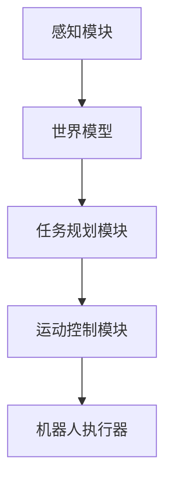

# AI Agent: AI的下一个风口 具身机器人的应用场景

## 1.背景介绍

### 1.1 人工智能的发展历程

人工智能(Artificial Intelligence, AI)是当代科技领域最具革命性和颠覆性的技术之一。自20世纪50年代AI概念被正式提出以来,经历了起起落落、曲折发展的过程。在过去十年中,受益于算力的飞速增长、海量数据的积累以及算法突破,AI取得了令人瞩目的进展,尤其是在计算机视觉、自然语言处理、决策控制等领域的应用。

### 1.2 AI赋能机器人发展

机器人技术是AI技术的重要应用领域之一。传统的工业机器人主要执行重复性的操作任务,缺乏感知环境、自主决策的能力。而AI赋能机器人,使其具备了智能化的感知、决策、控制和交互能力,可以根据环境变化做出相应反应,在更广阔的场景中发挥作用。

### 1.3 具身机器人(Embodied AI)的兴起  

具身机器人(Embodied AI)是指将AI系统嵌入到具有物理形态的机器人体内,使之能够在现实世界中感知、规划和执行任务。相比于纯软件的AI系统,具身AI不仅需要处理视觉、语音等感知信号,还需要与物理世界进行交互,面临着更多的挑战和复杂性。

具身AI的兴起,标志着AI技术从虚拟世界迈向现实世界,将为人类社会带来全新的体验和变革。本文将重点探讨具身AI机器人在不同应用场景中的实践,以及面临的技术挑战和未来发展趋势。

## 2.核心概念与联系

### 2.1 机器人系统架构

具身AI机器人系统通常由以下几个核心模块组成:

1. **感知模块**: 负责获取来自机器人传感器(视觉、语音、触觉等)的数据,并对数据进行处理和理解,形成对环境的感知表征。
2. **世界模型**: 基于感知数据构建对环境的内部表征,包括物体、空间布局、语义信息等,为任务规划提供依据。
3. **任务规划模块**: 根据世界模型和任务目标,规划出实现目标的行为序列。
4. **运动控制模块**: 将规划好的行为序列转化为可执行的运动指令,控制机器人的运动器。
5. **机器人执行器**: 包括各种运动器,如机械手臂、移动机构等,用于在物理世界中执行运动指令。

上述模块通过闭环控制相互协调工作,使机器人能够持续感知环境、更新世界模型、重新规划并执行新的行为序列。

### 2.2 感知与世界模型

感知是具身AI的基础,需要处理多模态传感器数据,并将其融合成统一的世界模型表征。常见的感知任务包括:

- **计算机视觉**: 基于视觉传感器(RGB相机、深度相机等)对物体、场景进行检测、分割和识别。
- **语音识别与自然语言理解**: 将语音信号转化为文本,并理解其语义含义。
- **触觉感知**: 通过压力、力矩等传感器感知物体的形状、质地等物理属性。

构建准确的世界模型是具身AI的核心挑战之一。需要将多模态感知数据进行融合,建立对环境的统一表征,包括物体的位置、形状、语义属性等,为后续任务规划提供依据。

### 2.3 任务规划与控制

任务规划模块需要根据世界模型和任务目标,生成一系列行为序列,使机器人能够完成期望的任务。常见的规划方法包括:

- **经典规划算法**: 如A*算法、RRT(Rapidly-exploring Random Tree)等,用于确定机器人的运动路径。
- **强化学习**: 通过试错与反馈,学习出最优的策略,实现期望的任务目标。
- **层次化规划**: 将复杂任务分解为多个子任务,分层次进行规划和控制。

运动控制模块则需要将规划好的行为序列转化为可执行的运动指令,控制机器人的各种执行器(如机械手臂、车辆等)进行精确的运动。常用的控制算法包括PID控制、模型预测控制等。

## 3.核心算法原理具体操作步骤  

### 3.1 视觉感知算法

视觉感知是具身AI的重要组成部分,常用的算法包括:

1. **目标检测(Object Detection)**:
   - 算法步骤:
     1) 选择合适的目标检测模型,如YOLO、Faster R-CNN等。
     2) 在大量标注数据上训练模型。
     3) 对输入图像进行前向传播,获取目标边界框和类别概率。
     4) 使用非极大值抑制(NMS)去除重叠的冗余框。
   - 核心原理:利用卷积神经网络对图像进行特征提取,并在特征图上进行目标分类和边界框回归。

2. **语义分割(Semantic Segmentation)**:
   - 算法步骤: 
     1) 选择分割模型,如FCN、DeepLab等。
     2) 在像素级别标注的数据上训练模型。
     3) 对输入图像进行前向传播,获取每个像素的类别预测。
     4) 根据预测结果对图像进行着色,生成分割掩码。
   - 核心原理:使用编码器-解码器结构的卷积网络,对图像进行像素级别的分类。

3. **实例分割(Instance Segmentation)**:
   - 算法步骤:
     1) 选择实例分割模型,如Mask R-CNN、YOLACT等。
     2) 在实例级别标注的数据上训练模型。
     3) 对输入图像进行前向传播,获取每个目标实例的分割掩码。
     4) 结合目标检测结果,关联实例掩码和目标边界框。
   - 核心原理:在目标检测的基础上,增加分支网络预测每个目标实例的分割掩码。

上述算法通常采用端到端的深度学习方法,在大规模数据集上进行训练,以获得良好的泛化能力。在具身AI系统中,这些算法为后续的世界模型构建和任务规划提供了关键的视觉理解能力。

### 3.2 强化学习算法

强化学习是具身AI任务规划的重要算法范式,常用算法包括:

1. **深度Q网络(Deep Q-Network, DQN)**:
   - 算法步骤:
     1) 初始化Q网络,用于估计每个状态-动作对的Q值。
     2) 使用经验回放池存储状态转移样本。
     3) 采样批量样本,计算目标Q值和当前Q值的差异,更新Q网络参数。
     4) 根据更新后的Q网络,选择Q值最大的动作执行。
   - 核心原理:利用Q网络近似最优Q函数,通过时序差分(TD)学习减小Q值的偏差。

2. **策略梯度(Policy Gradient)**:
   - 算法步骤:
     1) 初始化策略网络,用于生成动作概率分布。
     2) 执行一段轨迹,记录状态、动作和奖励。
     3) 计算轨迹的累积回报,作为策略梯度的权重。
     4) 根据策略梯度,更新策略网络参数。
   - 核心原理:直接优化策略网络参数,使期望累积回报最大化。

3. **Actor-Critic算法**:
   - 算法步骤:
     1) 初始化Actor网络(策略网络)和Critic网络(值函数网络)。
     2) 执行一段轨迹,记录状态、动作和奖励。
     3) 使用Critic网络估计状态值,计算Advantage值。
     4) 根据Advantage值,更新Actor网络和Critic网络参数。
   - 核心原理:将策略梯度和值函数估计相结合,提高了学习效率和稳定性。

强化学习算法通过与环境的交互,学习出最优的策略,实现期望的任务目标。在具身AI系统中,这些算法可以用于机器人的运动规划、操作控制等任务,使机器人能够自主学习并适应复杂的环境。

### 3.3 多模态融合算法

具身AI系统需要融合来自多种传感器的异构数据,构建统一的世界模型表征。常用的多模态融合算法包括:

1. **早期融合**:
   - 算法步骤:
     1) 将不同模态的传感器数据拼接为一个高维特征向量。
     2) 使用深度神经网络对拼接后的特征进行处理和建模。
     3) 网络输出为所需的任务目标,如分类、检测或分割结果。
   - 核心原理:在特征级别对不同模态数据进行融合,由神经网络自动学习模态间的相关性。

2. **晚期融合**:
   - 算法步骤:
     1) 对每一种模态数据单独建模,获取各自的特征表征。
     2) 将不同模态的特征表征拼接或融合。
     3) 使用神经网络对融合后的特征进行进一步处理,得到任务目标。
   - 核心原理:先分别对每种模态进行建模,再在更高层次融合不同模态的特征表征。

3. **注意力融合**:
   - 算法步骤:
     1) 对每一种模态数据单独编码,获取各自的特征表征。
     2) 使用注意力机制,学习不同模态特征之间的相关性权重。
     3) 根据注意力权重,加权融合不同模态的特征表征。
     4) 将融合后的特征输入神经网络,得到任务目标。
   - 核心原理:通过注意力机制自适应地学习不同模态之间的相关性,实现更有效的融合。

多模态融合算法能够充分利用异构传感器数据,提高具身AI系统的感知和理解能力。在复杂的真实场景中,准确的多模态融合对于构建可靠的世界模型至关重要。

## 4.数学模型和公式详细讲解举例说明

### 4.1 目标检测数学模型

目标检测任务的核心是预测目标的边界框和类别。常用的目标检测模型采用单阶段(如YOLO)或双阶段(如Faster R-CNN)的结构。以YOLO为例,其数学模型可表示为:

$$
\begin{aligned}
\mathbf{b}_x &= \sigma(t_x) + c_x \\
\mathbf{b}_y &= \sigma(t_y) + c_y \\
\mathbf{b}_w &= p_w e^{t_w} \\
\mathbf{b}_h &= p_h e^{t_h} \\
\mathbf{c} &= \text{softmax}(p_c)
\end{aligned}
$$

其中:

- $\mathbf{b}_x, \mathbf{b}_y, \mathbf{b}_w, \mathbf{b}_h$分别表示预测的边界框中心坐标、宽度和高度。
- $t_x, t_y, t_w, t_h$是网络输出的边界框回归值。
- $c_x, c_y$是当前网格单元的坐标。
- $p_w, p_h$是先验框的宽度和高度。
- $\sigma$是sigmoid激活函数,用于将坐标值限制在$[0, 1]$范围内。
- $\mathbf{c}$是预测的目标类别概率分布,通过softmax函数从$p_c$计算得到。

该模型将图像划分为多个网格单元,每个单元预测一组边界框和类别概率。通过非极大值抑制(NMS)去除冗余的预测框,即可获得最终的目标检测结果。

### 4.2 强化学习中的价值函数

在强化学习中,价值函数(Value Function)用于估计一个状态或状态-动作对的长期累积回报。定义状态值函数$V^\pi(s)$为在策略$\pi$下,从状态$s$开始执行,期望得到的累积回报:

$$
V^\pi(s) = \mathbb{E}_\pi\left[\sum_{k=0}^\infty \gamma^k r_{t+k+1} \mid s_t=s\right]