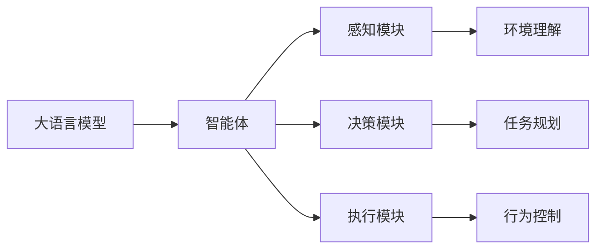

# AI Agent: AI的下一个风口 大模型驱动的智能体

## 1. 背景介绍
### 1.1 人工智能的发展历程
#### 1.1.1 早期的人工智能
#### 1.1.2 机器学习的崛起 
#### 1.1.3 深度学习的突破

### 1.2 大语言模型的出现
#### 1.2.1 Transformer 架构的提出
#### 1.2.2 GPT 系列模型的发展
#### 1.2.3 大模型的优势和局限性

### 1.3 AI Agent 的概念
#### 1.3.1 AI Agent 的定义
#### 1.3.2 AI Agent 与传统 AI 的区别
#### 1.3.3 AI Agent 的应用前景

## 2. 核心概念与联系
### 2.1 大语言模型
#### 2.1.1 语言模型的基本原理
#### 2.1.2 大语言模型的特点
#### 2.1.3 大语言模型的训练方法

### 2.2 智能体(Agent)
#### 2.2.1 智能体的定义和特征
#### 2.2.2 智能体的分类
#### 2.2.3 智能体的决策机制

### 2.3 大模型驱动的智能体
#### 2.3.1 大模型与智能体的结合
#### 2.3.2 大模型赋能智能体的优势
#### 2.3.3 大模型驱动智能体的架构设计



## 3. 核心算法原理与具体操作步骤
### 3.1 基于 Transformer 的大语言模型
#### 3.1.1 Transformer 的基本结构
#### 3.1.2 自注意力机制
#### 3.1.3 位置编码

### 3.2 预训练和微调
#### 3.2.1 无监督预训练
#### 3.2.2 有监督微调
#### 3.2.3 领域适应

### 3.3 强化学习与智能体
#### 3.3.1 强化学习的基本概念
#### 3.3.2 值函数近似
#### 3.3.3 策略梯度方法

## 4. 数学模型和公式详细讲解举例说明
### 4.1 Transformer 的数学表示
#### 4.1.1 自注意力机制的数学表示
$Attention(Q,K,V) = softmax(\frac{QK^T}{\sqrt{d_k}})V$
#### 4.1.2 多头注意力的数学表示
$MultiHead(Q,K,V) = Concat(head_1,...,head_h)W^O$
#### 4.1.3 前馈神经网络的数学表示
$FFN(x) = max(0, xW_1 + b_1)W_2 + b_2$

### 4.2 强化学习的数学表示
#### 4.2.1 马尔可夫决策过程
$<S,A,P,R,\gamma>$
#### 4.2.2 值函数与贝尔曼方程
$V^{\pi}(s) = \mathbb{E}[G_t|S_t=s]$
$Q^{\pi}(s,a) = \mathbb{E}[G_t|S_t=s,A_t=a]$
#### 4.2.3 策略梯度定理
$\nabla_{\theta}J(\theta) = \mathbb{E}_{\tau \sim \pi_{\theta}}[\sum_{t=0}^{T}\nabla_{\theta}log\pi_{\theta}(a_t|s_t)G_t]$

## 5. 项目实践：代码实例和详细解释说明
### 5.1 使用 PyTorch 实现 Transformer
```python
class Transformer(nn.Module):
    def __init__(self, d_model, nhead, num_layers):
        super().__init__()
        self.encoder = TransformerEncoder(d_model, nhead, num_layers)
        self.decoder = TransformerDecoder(d_model, nhead, num_layers)
        
    def forward(self, src, tgt):
        memory = self.encoder(src)
        output = self.decoder(tgt, memory)
        return output
```

### 5.2 使用 TensorFlow 实现 PPO 算法
```python
class PPO:
    def __init__(self, state_dim, action_dim, actor_lr, critic_lr):
        self.actor = Actor(state_dim, action_dim)
        self.critic = Critic(state_dim)
        self.actor_optimizer = tf.keras.optimizers.Adam(actor_lr)
        self.critic_optimizer = tf.keras.optimizers.Adam(critic_lr)
        
    def train(self, states, actions, rewards, next_states, dones):
        with tf.GradientTape() as tape1, tf.GradientTape() as tape2:
            # Actor loss
            action_probs = self.actor(states)
            action_log_probs = tf.math.log(action_probs)
            actor_loss = -tf.math.reduce_mean(action_log_probs * advantages)
            
            # Critic loss
            values = self.critic(states)
            critic_loss = tf.math.reduce_mean(tf.square(returns - values))
        
        actor_grads = tape1.gradient(actor_loss, self.actor.trainable_variables)
        critic_grads = tape2.gradient(critic_loss, self.critic.trainable_variables)
        
        self.actor_optimizer.apply_gradients(zip(actor_grads, self.actor.trainable_variables))
        self.critic_optimizer.apply_gradients(zip(critic_grads, self.critic.trainable_variables))
```

### 5.3 使用 Hugging Face 的 Transformers 库进行预训练和微调
```python
from transformers import AutoTokenizer, AutoModelForCausalLM, TrainingArguments, Trainer

tokenizer = AutoTokenizer.from_pretrained("gpt2")
model = AutoModelForCausalLM.from_pretrained("gpt2")

train_dataset = ...
eval_dataset = ...

training_args = TrainingArguments(
    output_dir="./results",
    num_train_epochs=3,
    per_device_train_batch_size=4,
    per_device_eval_batch_size=4,
    eval_steps=400,
    save_steps=800,
    warmup_steps=500,
)

trainer = Trainer(
    model=model,
    args=training_args,
    train_dataset=train_dataset,
    eval_dataset=eval_dataset,
)

trainer.train()
```

## 6. 实际应用场景
### 6.1 智能客服
#### 6.1.1 客户问题理解与意图识别
#### 6.1.2 个性化回复生成
#### 6.1.3 多轮对话管理

### 6.2 智能助手
#### 6.2.1 任务理解与规划
#### 6.2.2 信息检索与知识推理
#### 6.2.3 行为执行与反馈

### 6.3 自动编程
#### 6.3.1 代码理解与生成
#### 6.3.2 代码优化与调试
#### 6.3.3 程序合成与自动修复

## 7. 工具和资源推荐
### 7.1 开源框架
#### 7.1.1 TensorFlow
#### 7.1.2 PyTorch
#### 7.1.3 Hugging Face Transformers

### 7.2 预训练模型
#### 7.2.1 GPT 系列
#### 7.2.2 BERT 系列
#### 7.2.3 T5 系列

### 7.3 数据集
#### 7.3.1 Wikipedia
#### 7.3.2 Common Crawl
#### 7.3.3 BookCorpus

## 8. 总结：未来发展趋势与挑战
### 8.1 大模型的持续发展
#### 8.1.1 模型规模的扩大
#### 8.1.2 训练效率的提升
#### 8.1.3 泛化能力的增强

### 8.2 智能体的自主学习
#### 8.2.1 元学习与迁移学习
#### 8.2.2 好奇心驱动的探索
#### 8.2.3 终身学习与持续进化

### 8.3 人机协作与伦理挑战
#### 8.3.1 人机交互与协作
#### 8.3.2 可解释性与透明度
#### 8.3.3 隐私保护与安全问题

## 9. 附录：常见问题与解答
### 9.1 大模型需要多少计算资源？
大模型的训练需要大量的计算资源，通常需要使用高性能的 GPU 或 TPU 集群。模型规模越大，所需的计算资源也越多。目前，训练一个大型语言模型可能需要数百个 GPU 并行计算数周时间。

### 9.2 如何处理大模型的过拟合问题？
过拟合是大模型面临的一个常见问题。可以采取以下措施来缓解过拟合：
- 增加训练数据的规模和多样性
- 使用正则化技术，如 L1/L2 正则化、Dropout 等
- 进行早停(Early Stopping)，根据验证集性能决定最优的训练时间
- 使用模型集成(Ensemble)技术，结合多个模型的预测结果

### 9.3 大模型驱动的智能体如何确保安全性？
大模型驱动的智能体在应用中需要考虑安全性问题，主要包括以下几个方面：
- 数据隐私保护：确保用户数据的隐私性，避免敏感信息泄露
- 输出内容过滤：对智能体生成的内容进行过滤，避免产生有害、违法或不适宜的内容
- 行为约束与监督：对智能体的行为进行约束和监督，防止其做出危险或非预期的行为
- 可解释性与可审计性：提供智能体决策过程的可解释性，方便对其行为进行审计和追踪

作者：禅与计算机程序设计艺术 / Zen and the Art of Computer Programming