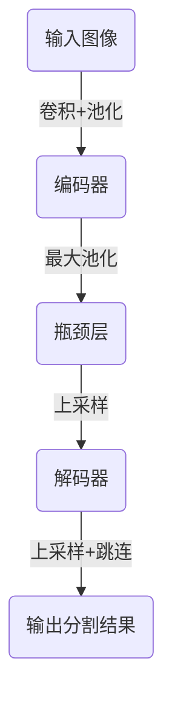

# AI Agent: AI的下一个风口 感知和解析环境与自主决策

## 1. 背景介绍

### 1.1 人工智能的发展历程

人工智能(Artificial Intelligence, AI)是当代科技发展的核心驱动力之一。自20世纪50年代AI概念被提出以来,经历了起起落落的发展历程。早期的AI系统主要集中在专家系统、机器学习和自然语言处理等领域。随着计算能力和数据量的不断增长,AI技术取得了长足进步,尤其是在深度学习、计算机视觉和自然语言处理等领域取得了突破性进展。

### 1.2 AI Agent的重要性

在当前AI发展的新阶段,AI Agent(智能代理)的概念备受关注。AI Agent是指能够感知环境、解析环境信息并根据预定目标自主做出决策的智能系统。它是AI系统向更高层次发展的关键一步,代表着AI系统从被动响应转向主动感知和决策的飞跃。AI Agent能够更好地理解和适应复杂的环境,为人类提供更智能、更高效的辅助,在诸多领域发挥重要作用。

### 1.3 AI Agent的应用前景

AI Agent的应用前景广阔,可以在智能家居、智能交通、智能制造、智能医疗等多个领域发挥作用。它能够根据环境变化自主做出决策,提高系统的智能化水平和适应性。同时,AI Agent也面临着诸多技术挑战,例如感知能力、决策能力、安全性和可解释性等,需要持续的研究和创新。

## 2. 核心概念与联系

### 2.1 AI Agent的定义

AI Agent是一种能够感知环境、解析环境信息并根据预定目标自主做出决策的智能系统。它具有以下三个核心特征:

1. **感知能力**:AI Agent能够通过各种传感器获取环境信息,包括视觉、听觉、触觉等多模态信息。
2. **解析能力**:AI Agent能够对获取的环境信息进行解析和理解,建立对环境的表征。
3. **决策能力**:根据预定目标和环境表征,AI Agent能够自主做出决策,选择合适的行为方案。

### 2.2 AI Agent与传统AI系统的区别

传统的AI系统通常是被动响应式的,它们无法主动感知环境变化,也无法根据环境自主做出决策。相比之下,AI Agent具有以下优势:

1. **主动性**:AI Agent能够主动感知环境变化,而不是被动等待指令。
2. **自主决策**:AI Agent能够根据环境信息和预定目标自主做出决策,而不需要人工干预。
3. **适应性**:AI Agent能够根据环境变化动态调整决策,具有更强的适应能力。

### 2.3 AI Agent的关键技术

AI Agent涉及多个技术领域,包括计算机视觉、自然语言处理、机器学习、决策理论等,其中最关键的技术包括:

1. **多模态感知技术**:用于获取和融合视觉、听觉、触觉等多模态环境信息。
2. **环境建模技术**:用于对获取的环境信息进行解析和表征,建立对环境的理解。
3. **决策算法**:用于根据环境表征和预定目标,选择合适的行为决策方案。
4. **人机交互技术**:用于实现人机之间的自然交互,提高AI Agent的可用性。

## 3. 核心算法原理具体操作步骤

### 3.1 感知环境信息

AI Agent通过各种传感器获取环境信息,包括视觉、听觉、触觉等多模态信息。以计算机视觉为例,常用的算法包括:

1. **目标检测**:使用深度学习模型(如YOLO、Faster R-CNN等)对图像中的目标进行检测和定位。
2. **语义分割**:使用全卷积神经网络(如FCN、U-Net等)对图像中的每个像素进行语义分类。
3. **实例分割**:结合目标检测和语义分割,对图像中的每个实例进行分割。

这些算法能够从图像中提取出目标、语义和实例等重要信息,为后续的环境建模提供基础。

### 3.2 建模环境表征

基于获取的环境信息,AI Agent需要建立对环境的表征,以便进行决策。常用的环境建模技术包括:

1. **场景理解**:通过对图像、点云等数据进行处理,理解场景的语义信息、空间结构等。
2. **物体跟踪**:跟踪场景中物体的运动轨迹,捕捉物体的动态变化。
3. **行为识别**:识别场景中人或物体的行为,如行走、跑步、打开门等。
4. **语音识别**:将语音信号转换为文本,理解语音指令或对话内容。

这些技术能够从环境信息中提取出高层次的语义和动态信息,为决策提供依据。

### 3.3 决策算法

AI Agent需要根据环境表征和预定目标,选择合适的行为决策方案。常用的决策算法包括:

1. **规划算法**:根据当前状态和目标状态,规划出一系列行为序列,如A*算法、RRT算法等。
2. **强化学习**:通过与环境的交互,学习到一个最优的策略,如Q-Learning、PolicyGradient等。
3. **多智能体决策**:在多个智能体之间协调决策,如博弈论、协作过滤等。
4. **约束优化**:在满足一定约束条件下,优化决策方案,如线性规划、非线性规划等。

这些算法能够根据环境表征和目标,输出合理的决策方案,指导AI Agent执行相应的行为。

### 3.4 执行行为

AI Agent根据决策算法的输出,执行相应的行为,如控制机器人运动、发出语音指令等。常用的执行方式包括:

1. **机器人控制**:通过运动学和动力学模型,计算出机器人每个关节的运动轨迹,实现机器人的运动控制。
2. **语音合成**:将文本转换为语音信号,通过扬声器输出语音指令或对话。
3. **图像/视频生成**:通过生成对抗网络(GAN)等技术,生成图像或视频,用于可视化或增强现实(AR)等应用。

执行行为是AI Agent与环境交互的关键环节,需要与感知、建模和决策环节紧密配合,形成闭环控制。

## 4. 数学模型和公式详细讲解举例说明

### 4.1 目标检测算法

目标检测是计算机视觉中的一个核心任务,常用的算法包括YOLO(You Only Look Once)和Faster R-CNN等。以YOLO为例,其核心思想是将目标检测问题转化为回归问题,直接预测目标的边界框和类别。

YOLO将输入图像划分为 $S \times S$ 个网格,如果一个目标的中心落在某个网格中,则由该网格负责预测该目标。每个网格需要预测 $B$ 个边界框,每个边界框包含5个预测值:$x,y,w,h,c$,分别表示边界框的中心坐标、宽高和置信度。置信度 $c$ 由两部分组成:

$$c = p(Object) \times IOU_{pred}^{truth}$$

其中 $p(Object)$ 表示该边界框内是否存在目标的概率, $IOU_{pred}^{truth}$ 表示预测边界框与真实边界框的交并比(Intersection over Union)。

此外,每个边界框还需要预测 $C$ 个条件类别概率 $p(Class_i|Object)$,表示该边界框内目标属于第 $i$ 类的概率。

YOLO的损失函数由三部分组成:边界框坐标损失、置信度损失和分类损失,通过梯度下降算法进行优化。

### 4.2 场景理解算法

场景理解是理解环境的关键,常用的算法包括基于深度学习的语义分割和实例分割等。以U-Net为例,它是一种用于语义分割的全卷积神经网络。

U-Net的网络结构如下图所示:



U-Net由编码器(Encoder)、瓶颈层(BottleNeck)和解码器(Decoder)三部分组成。编码器通过卷积和最大池化操作提取图像特征,瓶颈层对特征进行压缩,解码器则通过上采样和跳连操作逐步恢复特征分辨率,最终输出每个像素的语义分类结果。

U-Net的损失函数通常采用交叉熵损失,用于优化网络参数。在训练过程中,常采用数据增强、预训练模型等技术提高模型的泛化能力。

### 4.3 强化学习算法

强化学习是一种基于环境交互的学习范式,常用于AI Agent的决策算法。以Q-Learning为例,它是一种基于价值迭代的强化学习算法。

Q-Learning的目标是学习一个最优的状态-行为价值函数 $Q^*(s,a)$,表示在状态 $s$ 下执行行为 $a$ 后可获得的最大期望累积奖励。Q-Learning通过不断与环境交互,根据下式更新 $Q$ 值:

$$Q(s_t,a_t) \leftarrow Q(s_t,a_t) + \alpha \left[ r_t + \gamma \max_{a} Q(s_{t+1},a) - Q(s_t,a_t) \right]$$

其中 $\alpha$ 为学习率, $\gamma$ 为折现因子, $r_t$ 为在时刻 $t$ 获得的即时奖励, $\max_{a} Q(s_{t+1},a)$ 为在下一状态 $s_{t+1}$ 下可获得的最大期望累积奖励。

通过不断更新 $Q$ 值,算法最终会收敛到最优的 $Q^*$ 函数。在决策时,AI Agent只需选择在当前状态 $s$ 下 $Q^*(s,a)$ 最大的行为 $a$ 即可。

Q-Learning的优点是模型简单、收敛性理论完备,但也存在维数灾难、样本利用率低等缺陷。在实际应用中,常采用深度神经网络来拟合 $Q$ 函数,形成深度Q网络(DQN)算法。

## 5. 项目实践:代码实例和详细解释说明

### 5.1 目标检测实例

以下是使用PyTorch实现YOLO目标检测算法的简化代码示例:

```python
import torch
import torch.nn as nn

# YOLO网络模型
class YOLONet(nn.Module):
    def __init__(self, num_classes, num_boxes):
        super(YOLONet, self).__init__()
        # 卷积层和池化层
        # ...
        
        # 全连接层
        self.fc = nn.Linear(...)
        
        # 预测头
        self.pred_boxes = nn.Linear(...)  # 预测边界框
        self.pred_conf = nn.Linear(...)   # 预测置信度
        self.pred_classes = nn.Linear(...) # 预测类别
        
    def forward(self, x):
        # 特征提取
        x = self.conv_layers(x)
        x = x.view(x.size(0), -1)
        x = self.fc(x)
        
        # 预测
        boxes = self.pred_boxes(x)
        conf = self.pred_conf(x)
        classes = self.pred_classes(x)
        
        return boxes, conf, classes

# 损失函数
def yolo_loss(pred_boxes, pred_conf, pred_classes, targets):
    # 计算边界框坐标损失
    # ...
    
    # 计算置信度损失
    # ...
    
    # 计算分类损失
    # ...
    
    return coord_loss + conf_loss + class_loss

# 训练
model = YOLONet(num_classes, num_boxes)
optimizer = torch.optim.SGD(model.parameters(), lr=0.001)

for epoch in range(num_epochs):
    for images, targets in data_loader:
        pred_boxes, pred_conf, pred_classes = model(images)
        loss = yolo_loss(pred_boxes, pred_conf, pred_classes, targets)
        
        optimizer.zero_grad()
        loss.backward()
        optimizer.step()
```

上述代码实现了YOLO网络模型的前向传播和损失函数计算。在前向传播中,输入图像经过卷积层和池化层提取特征,然后通过全连接层和预测头预