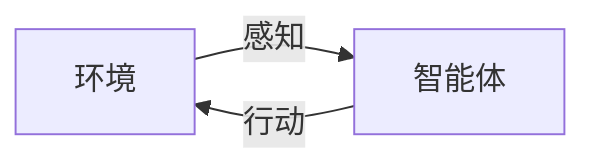

# AI Agent: AI的下一个风口 重新审视智能体的重要性

## 1.背景介绍

### 1.1 人工智能的发展历程

人工智能(Artificial Intelligence, AI)是当代科技发展的重要领域,自20世纪50年代问世以来,已经经历了半个多世纪的发展。在这一过程中,AI不断突破技术瓶颈,展现出越来越强大的能力,逐步深入到各个领域,对人类社会产生了深远影响。

### 1.2 AI发展的三次浪潮

AI的发展大致经历了三次浪潮:

- 第一次浪潮(1956-1974年)以专家系统和逻辑推理为代表;
- 第二次浪潮(1980-1987年)以知识表示为核心;
- 第三次浪潮(1993年至今)以机器学习、深度学习等数据驱动方法为主导。

### 1.3 AI智能体的重要性日益凸显

在AI的发展过程中,智能体(Agent)的概念和重要性日益凸显。智能体是AI系统的关键组成部分,负责感知环境、做出决策并执行相应动作,是赋予AI系统"智能"的核心。随着AI技术的不断演进,智能体也在不断发展和完善。

## 2.核心概念与联系

### 2.1 什么是智能体

智能体(Agent)是一个感知和行动于某个环境的自主实体。根据Russell和Norvig在《人工智能:一种现代的方法》一书中的定义:

> "An agent is anything that can be viewed as perceiving its environment through sensors and acting upon that environment through actuators."

智能体通过传感器获取环境信息,并根据这些信息做出决策,通过执行器对环境施加影响。

### 2.2 智能体与环境的交互

智能体与环境之间是一个持续的交互过程,如下图所示:



智能体首先感知环境的状态,然后根据感知到的信息做出决策,并通过执行器采取行动,这些行动会影响环境的状态,环境状态的变化又会被智能体感知到,如此循环往复。

### 2.3 智能体的分类

根据智能体与环境的交互方式,可将智能体分为以下几种类型:

- 简单反射智能体(Simple Reflex Agent)
- 基于模型的反射智能体(Model-based Reflex Agent)
- 基于目标的智能体(Goal-based Agent)
- 基于效用的智能体(Utility-based Agent)
- 学习智能体(Learning Agent)

## 3.核心算法原理具体操作步骤  

不同类型的智能体采用不同的决策算法,下面分别介绍几种主要智能体的工作原理和算法步骤。

### 3.1 简单反射智能体

简单反射智能体是最基本的智能体类型,它只根据当前的感知信息做出决策,不考虑历史信息和未来结果。其工作原理如下:

1. 获取当前环境状态的感知信息
2. 根据条件-动作规则映射表,查找与当前状态匹配的动作
3. 执行查找到的动作

简单反射智能体的核心是条件-动作规则映射表,该表事先由设计者或学习算法生成。

### 3.2 基于模型的反射智能体

基于模型的反射智能体在简单反射智能体的基础上,增加了对环境状态转移的模型。其工作流程如下:

1. 获取当前环境状态的感知信息
2. 根据环境模型,预测在不同动作下可能产生的后续状态
3. 根据条件-动作规则映射表,查找与预测状态匹配的最佳动作
4. 执行查找到的最佳动作

该智能体需要事先获知环境状态转移模型,并结合条件-动作规则进行决策。

### 3.3 基于目标的智能体

基于目标的智能体能够根据目标状态和当前状态,规划出一系列动作序列。其工作原理如下:

1. 获取当前环境状态的感知信息
2. 根据事先设定的目标状态,利用搜索算法(如A*算法)规划出从当前状态到目标状态的一系列动作序列
3. 执行规划出的第一个动作

该智能体需要事先设定目标状态,并具备搜索算法和环境模型,才能进行有效规划。

### 3.4 基于效用的智能体

基于效用的智能体能够根据期望的效用值(如奖赏、成本等)来做出最优决策。常见的算法有马尔可夫决策过程(MDP)和强化学习。

以MDP为例,其工作流程如下:

1. 获取当前环境状态的感知信息
2. 根据MDP模型,计算在当前状态下所有可能动作序列的期望效用值
3. 选择期望效用值最大的动作序列的第一个动作
4. 执行选择的动作

该智能体需要事先获知环境的MDP模型和奖赏函数,并采用价值迭代或策略迭代等算法求解最优策略。

### 3.5 学习智能体

学习智能体能够根据过往经验,自主学习做出最优决策。常见的算习算法如Q-Learning、深度强化学习等。

以Q-Learning为例,其工作流程如下:

1. 初始化Q值表格,表示在每个(状态,动作)对下的期望效用值
2. 对于每个时间步:
    - 获取当前环境状态的感知信息
    - 根据当前Q值表格,选择期望效用值最大的动作
    - 执行选择的动作,获得奖赏值和下一状态
    - 根据奖赏值和下一状态的最大Q值,更新当前(状态,动作)对应的Q值
3. 重复以上过程,直至Q值收敛

学习智能体无需事先了解环境模型,而是通过不断尝试和更新Q值表格,逐步学习获得最优策略。

## 4.数学模型和公式详细讲解举例说明

智能体的决策过程常常需要借助数学模型进行形式化描述和求解,下面将介绍几种常见的数学模型。

### 4.1 马尔可夫决策过程(MDP)

马尔可夫决策过程是描述基于效用的智能体决策问题的重要数学模型。一个MDP可以用一个五元组来表示:

$$MDP = \langle S, A, T, R, \gamma \rangle$$

其中:
- $S$是有限状态集合
- $A$是有限动作集合 
- $T(s, a, s')=P(s'|s, a)$是状态转移概率,表示在状态$s$执行动作$a$后,转移到状态$s'$的概率
- $R(s, a, s')$是在状态$s$执行动作$a$并转移到状态$s'$时获得的奖赏值
- $\gamma \in [0, 1)$是折现因子,用于权衡当前奖赏和未来奖赏的权重

在MDP中,智能体的目标是找到一个策略$\pi: S \rightarrow A$,使得期望的累积折现奖赏最大化:

$$\max_\pi E\left[\sum_{t=0}^\infty \gamma^t R(s_t, a_t, s_{t+1})\right]$$

其中$s_t$和$a_t$分别表示在时间步$t$的状态和动作。

求解MDP的常用算法有价值迭代(如值迭代、策略迭代)和强化学习等。

### 4.2 Q-Learning算法

Q-Learning是一种常用的强化学习算法,用于求解MDP中的最优策略。该算法维护一个Q值函数$Q(s, a)$,表示在状态$s$执行动作$a$后的期望累积奖赏。

Q-Learning算法的更新规则为:

$$Q(s_t, a_t) \leftarrow Q(s_t, a_t) + \alpha \left[r_t + \gamma \max_{a'} Q(s_{t+1}, a') - Q(s_t, a_t)\right]$$

其中:
- $\alpha$是学习率,控制更新幅度
- $r_t$是在时间步$t$获得的即时奖赏
- $\gamma$是折现因子
- $\max_{a'} Q(s_{t+1}, a')$是在下一状态$s_{t+1}$下,所有可能动作的最大Q值

通过不断迭代更新Q值,算法最终会收敛到最优策略对应的Q值函数。

### 4.3 深度强化学习

深度强化学习是将深度神经网络应用于强化学习的一种方法。传统的Q-Learning算法需要维护一张巨大的Q值表格,而深度强化学习则使用神经网络来逼近Q值函数,从而能够处理大规模、高维的状态空间。

深度Q网络(DQN)是一种经典的深度强化学习算法,其使用一个卷积神经网络来逼近Q值函数:

$$Q(s, a; \theta) \approx Q^*(s, a)$$

其中$\theta$是神经网络的参数。

在训练过程中,DQN从经验回放池中采样出一批$(s_t, a_t, r_t, s_{t+1})$的转换样本,计算目标Q值:

$$y_t = r_t + \gamma \max_{a'} Q(s_{t+1}, a'; \theta^-)$$

并最小化损失函数:

$$L(\theta) = \mathbb{E}_{(s, a, r, s')\sim U(D)}\left[\left(y_t - Q(s_t, a_t; \theta)\right)^2\right]$$

其中$\theta^-$是目标网络的参数,用于估计下一状态的最大Q值,以提高训练稳定性。

通过不断迭代训练,DQN可以学习到近似最优的Q值函数,并据此选择最优动作。

## 5.项目实践:代码实例和详细解释说明

为了更好地理解智能体的工作原理,我们将通过一个简单的网格世界示例,实现一个基于Q-Learning的智能体代理。

### 5.1 问题描述

我们考虑一个4x4的网格世界,如下图所示:

```
+---+---+---+---+
| X |   |   |   |
+---+---+---+---+
|   |   |   |   |
+---+---+---+---+
|   |   |   |   |
+---+---+---+---+
|   |   |   | T |
+---+---+---+---+
```

其中:
- X表示智能体的起始位置
- T表示目标位置
- 空白格子表示可行走的区域

智能体的目标是从起始位置X出发,找到一条路径到达目标位置T。在每一步,智能体可以选择上下左右四个动作,如果撞墙则停留在原地。

### 5.2 代码实现

我们使用Python实现该示例,代码如下:

```python
import numpy as np

# 定义网格世界
WORLD = np.array([
    [0, 0, 0, 0],
    [0, 0, 0, 0],
    [0, 0, 0, 0],
    [0, 0, 0, 1]
])

# 定义动作
ACTIONS = ['up', 'down', 'left', 'right']

# 定义奖赏
REWARDS = {
    0: -0.1,  # 空白格子的奖赏为-0.1
    1: 1.0   # 目标位置的奖赏为1.0
}

# 定义Q-Learning参数
ALPHA = 0.1  # 学习率
GAMMA = 0.9  # 折现因子
EPSILON = 0.1  # 探索率

# 初始化Q值表格
Q = np.zeros((WORLD.shape[0], WORLD.shape[1], len(ACTIONS)))

# 定义状态转移函数
def step(state, action):
    i, j = state
    if action == 'up':
        next_state = (max(i - 1, 0), j)
    elif action == 'down':
        next_state = (min(i + 1, WORLD.shape[0] - 1), j)
    elif action == 'left':
        next_state = (i, max(j - 1, 0))
    else:
        next_state = (i, min(j + 1, WORLD.shape[1] - 1))
    reward = REWARDS[WORLD[next_state]]
    return next_state, reward

# Q-Learning算法
def q_learning(num_episodes):
    for episode in range(num_episodes):
        state = (0, 0)  # 起始位置
        done = False
        while not done:
            # 选择动作
            if np.random.uniform() < EPSILON:
                action = np.random.choice(ACTIONS)
            else:
                action = ACTIONS[np.argmax(Q[state])]
            
            # 执行动作
            next_state, reward = step(state,