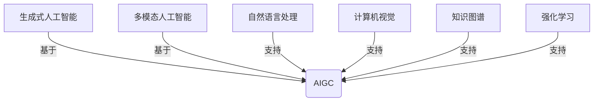

# AIGC 原理与代码实例讲解

## 1. 背景介绍

人工智能生成内容（Artificial Intelligence Generated Content，AIGC）是一种利用人工智能技术自动生成文本、图像、音频和视频等多种形式内容的新兴技术。随着深度学习、自然语言处理、计算机视觉等技术的快速发展，AIGC已经在各个领域展现出了巨大的潜力和应用前景。

AIGC的出现极大地提高了内容生产的效率和质量，降低了生产成本，为各行业带来了全新的机遇和挑战。在内容创作、营销广告、客户服务、教育培训等领域，AIGC已经开始发挥重要作用。未来，AIGC有望成为推动数字经济发展的关键驱动力之一。

## 2. 核心概念与联系

### 2.1 生成式人工智能

生成式人工智能（Generative AI）是指能够基于训练数据自主生成新的、合理的、有意义的内容的人工智能系统。与判别式人工智能（Discriminative AI）不同，生成式人工智能不仅可以对输入数据进行分类和预测，还能够生成全新的内容。

生成式人工智能是 AIGC 的核心技术基础，包括生成对抗网络（Generative Adversarial Networks，GAN）、变分自编码器（Variational Autoencoders，VAE）、transformer 等模型。

### 2.2 多模态人工智能

多模态人工智能（Multimodal AI）是指能够同时处理和生成多种模态（如文本、图像、语音等）数据的人工智能系统。多模态人工智能模型可以从不同模态的输入中捕获信息，并生成相应模态的输出。

多模态人工智能是实现 AIGC 的关键技术之一，能够支持生成多种形式的内容。典型的多模态模型包括 DALL-E、Stable Diffusion、ChatGPT 等。

## 3. 核心算法原理具体操作步骤

### 3.1 生成对抗网络（GAN）

生成对抗网络是一种生成式模型，由生成器（Generator）和判别器（Discriminator）两个神经网络组成。生成器的目标是生成逼真的数据样本，而判别器的目标是区分生成的样本和真实数据样本。两个网络相互对抗，不断优化，最终使生成器能够生成逼真的数据样本。

1. 初始化生成器 G 和判别器 D 的参数。
2. 从真实数据集中采样一批真实样本 $x_{real}$。
3. 从噪声分布（如高斯分布）中采样一批噪声 $z$，将其输入生成器 G，生成一批假样本 $x_{fake} = G(z)$。
4. 将真实样本 $x_{real}$ 和假样本 $x_{fake}$ 输入判别器 D，计算判别器对真实样本的判别概率 $D(x_{real})$ 和对假样本的判别概率 $D(x_{fake})$。
5. 更新判别器 D 的参数，使得 $D(x_{real})$ 最大化，$D(x_{fake})$ 最小化，目标函数为：$\max_D V(D) = \mathbb{E}_{x \sim p_{data}(x)}[\log D(x)] + \mathbb{E}_{z \sim p_z(z)}[\log(1 - D(G(z)))]$。
6. 更新生成器 G 的参数，使得 $D(G(z))$ 最大化，目标函数为：$\min_G V(G) = \mathbb{E}_{z \sim p_z(z)}[\log(1 - D(G(z)))]$。
7. 重复步骤 2-6，直到生成器 G 和判别器 D 达到平衡。

### 3.2 变分自编码器（VAE）

变分自编码器是一种生成式模型，由编码器（Encoder）和解码器（Decoder）两个神经网络组成。编码器将输入数据编码为潜在变量的分布，解码器从潜在变量的分布中采样，生成新的数据样本。

1. 初始化编码器 $q_\phi(z|x)$ 和解码器 $p_\theta(x|z)$ 的参数。
2. 从真实数据集中采样一批真实样本 $x$。
3. 将真实样本 $x$ 输入编码器 $q_\phi(z|x)$，获得潜在变量 $z$ 的分布 $q_\phi(z|x)$。
4. 从 $q_\phi(z|x)$ 中采样潜在变量 $z$，将其输入解码器 $p_\theta(x|z)$，生成重构样本 $\hat{x}$。
5. 计算重构损失 $\mathcal{L}_{rec}(x, \hat{x})$，即真实样本 $x$ 和重构样本 $\hat{x}$ 之间的差异。
6. 计算 KL 散度 $D_{KL}(q_\phi(z|x) \| p(z))$，即编码器输出的分布 $q_\phi(z|x)$ 与先验分布 $p(z)$ 之间的差异。
7. 更新编码器 $q_\phi(z|x)$ 和解码器 $p_\theta(x|z)$ 的参数，优化目标函数 $\mathcal{L}(\phi, \theta) = \mathbb{E}_{q_\phi(z|x)}[\log p_\theta(x|z)] - \beta D_{KL}(q_\phi(z|x) \| p(z))$，其中 $\beta$ 是一个超参数，用于平衡重构损失和 KL 散度。
8. 重复步骤 2-7，直到模型收敛。

### 3.3 Transformer

Transformer 是一种基于自注意力机制的序列到序列模型，广泛应用于自然语言处理、计算机视觉等领域。Transformer 的核心思想是通过自注意力机制捕获输入序列中元素之间的长程依赖关系，从而更好地建模序列数据。

1. 将输入序列（如文本或图像）转换为嵌入向量序列。
2. 添加位置编码（Positional Encoding）到嵌入向量序列中，以引入位置信息。
3. 将嵌入向量序列输入编码器（Encoder），经过多层自注意力和前馈神经网络的处理，获得编码后的序列表示。
4. 将编码后的序列表示输入解码器（Decoder），同样经过多层自注意力和交叉注意力的处理，生成输出序列。
5. 在训练阶段，使用监督学习方法，最小化输出序列与目标序列之间的损失函数。
6. 在推理阶段，通过解码器自回归地生成输出序列。

自注意力机制是 Transformer 的核心，它允许每个位置的输出向量通过注意力权重捕获整个输入序列的信息。对于长度为 $n$ 的输入序列 $X = (x_1, x_2, \dots, x_n)$，自注意力计算过程如下：

$$\begin{aligned}
Q &= XW^Q \\
K &= XW^K \\
V &= XW^V \\
\text{Attention}(Q, K, V) &= \text{softmax}\left(\frac{QK^T}{\sqrt{d_k}}\right)V
\end{aligned}$$

其中 $W^Q$、$W^K$、$W^V$ 是可学习的权重矩阵，$d_k$ 是缩放因子。自注意力机制通过计算查询向量 $Q$ 与键向量 $K$ 的点积，获得注意力权重矩阵，再与值向量 $V$ 相乘，从而捕获输入序列中元素之间的依赖关系。

## 4. 数学模型和公式详细讲解举例说明

### 4.1 生成对抗网络的数学模型

生成对抗网络的目标是训练一个生成器 $G$，使得从生成器 $G$ 生成的样本分布 $p_g$ 尽可能逼近真实数据分布 $p_{data}$。同时，训练一个判别器 $D$，使其能够很好地区分真实样本和生成样本。生成器 $G$ 和判别器 $D$ 相互对抗，形成一个极小极大游戏问题：

$$\min_G \max_D V(D, G) = \mathbb{E}_{x \sim p_{data}(x)}[\log D(x)] + \mathbb{E}_{z \sim p_z(z)}[\log(1 - D(G(z)))]$$

其中，$p_z(z)$ 是生成器 $G$ 的输入噪声分布，通常是一个高斯分布或均匀分布。

在理想情况下，当 $G$ 和 $D$ 达到纳什均衡时，$p_g = p_{data}$，判别器 $D$ 无法区分真实样本和生成样本。但在实践中，由于优化困难和模型容量有限，很难达到理想的纳什均衡。因此，通常采用以下策略进行优化：

1. 固定生成器 $G$，最大化判别器 $D$ 的目标函数：$\max_D V(D) = \mathbb{E}_{x \sim p_{data}(x)}[\log D(x)] + \mathbb{E}_{z \sim p_z(z)}[\log(1 - D(G(z)))]$。
2. 固定判别器 $D$，最小化生成器 $G$ 的目标函数：$\min_G V(G) = \mathbb{E}_{z \sim p_z(z)}[\log(1 - D(G(z)))]$。

通过不断迭代上述两个步骤，生成器 $G$ 和判别器 $D$ 相互博弈，最终使生成器 $G$ 能够生成逼真的样本。

### 4.2 变分自编码器的数学模型

变分自编码器的目标是最大化边缘对数似然 $\log p(x)$，其中 $x$ 是观测数据。由于直接计算 $\log p(x)$ 很困难，变分自编码器引入一个潜在变量 $z$，并使用变分推断（Variational Inference）来近似计算 $\log p(x)$。

根据证明，对数似然 $\log p(x)$ 可以被下界所限制：

$$\log p(x) \geq \mathbb{E}_{q_\phi(z|x)}[\log p_\theta(x|z)] - D_{KL}(q_\phi(z|x) \| p(z))$$

其中，$q_\phi(z|x)$ 是编码器网络，用于近似后验分布 $p(z|x)$；$p_\theta(x|z)$ 是解码器网络，用于生成观测数据 $x$；$p(z)$ 是潜在变量 $z$ 的先验分布，通常设置为标准高斯分布；$D_{KL}(\cdot \| \cdot)$ 表示 KL 散度。

变分自编码器的目标是最大化该下界，等价于最小化以下损失函数：

$$\mathcal{L}(\phi, \theta) = -\mathbb{E}_{q_\phi(z|x)}[\log p_\theta(x|z)] + \beta D_{KL}(q_\phi(z|x) \| p(z))$$

其中，$\beta$ 是一个超参数，用于平衡重构损失和 KL 散度项。

在训练过程中，变分自编码器通过重参数技巧（Reparameterization Trick）来近似计算期望项，并使用随机梯度下降法优化编码器 $q_\phi(z|x)$ 和解码器 $p_\theta(x|z)$ 的参数。

变分自编码器不仅可以用于生成新样本，还可以用于降维、表示学习和异常检测等任务。

### 4.3 Transformer 的注意力机制

Transformer 模型中的自注意力机制是一种计算输入序列元素之间相关性的方法。对于长度为 $n$ 的输入序列 $X = (x_1, x_2, \dots, x_n)$，自注意力计算过程如下：

1. 将输入序列 $X$ 投影到查询向量 $Q$、键向量 $K$ 和值向量 $V$ 上：

$$\begin{aligned}
Q &= XW^Q \\
K &= XW^K \\
V &= XW^V
\end{aligned}$$

其中 $W^Q$、$W^K$、$W^V$ 是可学习的权重矩阵。

2. 计算查询向量 $Q$ 与键向量 $K$ 的点积，获