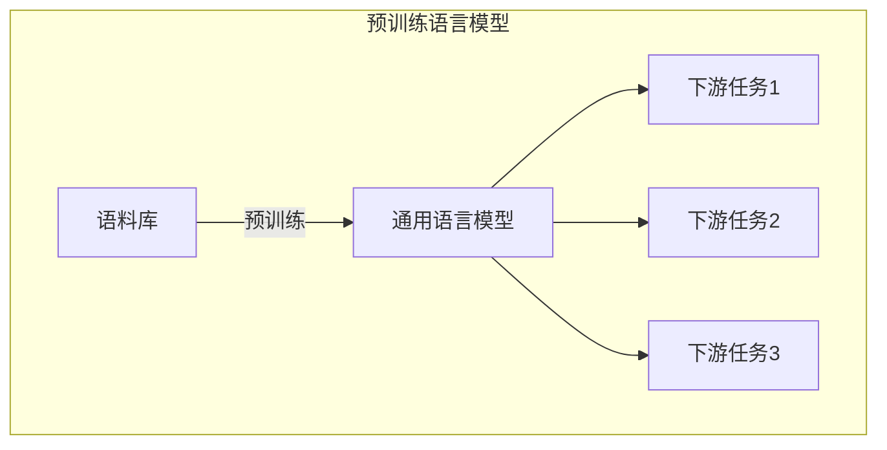
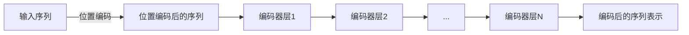
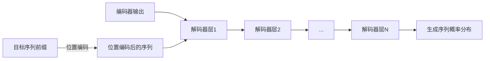
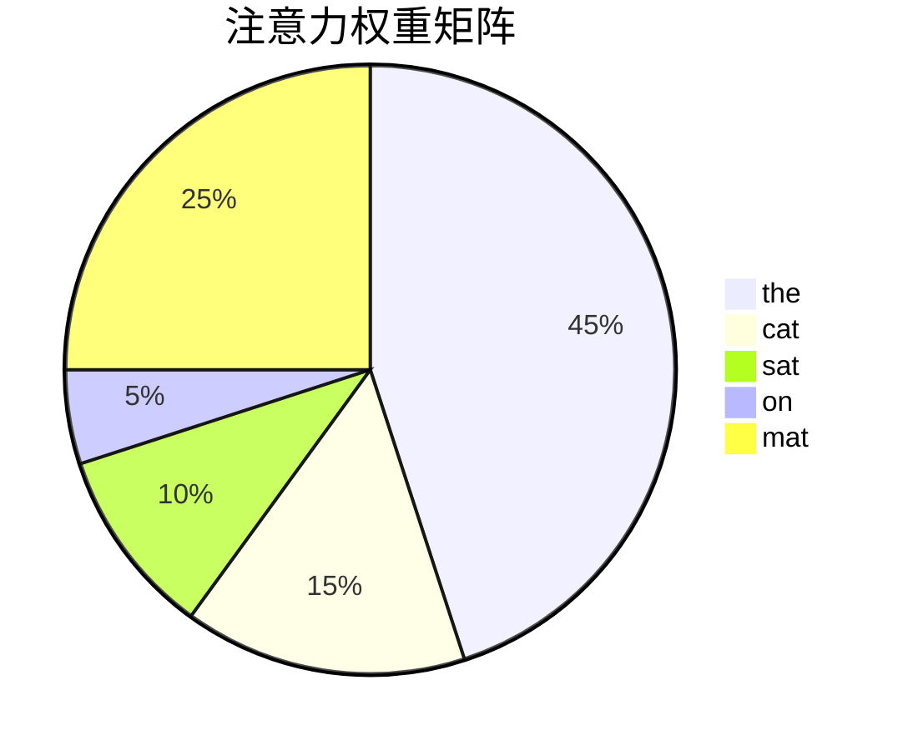

# AIGC从入门到实战：ChatGPT 为什么能生成代码，背后的原理是什么？

## 1. 背景介绍

### 1.1 人工智能的发展历程

人工智能(Artificial Intelligence, AI)是当代科技发展的热点领域之一。自20世纪50年代问世以来,AI经历了几个重要的发展阶段:

1. 早期阶段(1950s-1960s):专家系统、博弈论等奠基性工作。
2. 知识浪潮(1980s-1990s):发展了知识库、机器学习等技术。
3. 大数据时代(2000s-2010s):海量数据和计算能力的提升,推动了深度学习的兴起。
4. 当前阶段(2010s-):深度学习、强化学习、迁移学习等新技术不断涌现,AI开始渗透到各行各业。

### 1.2 AIGC(AI Generated Content)的兴起

伴随AI技术的飞速发展,AIGC(AI Generated Content)应运而生。AIGC是指利用人工智能算法生成的文字、图像、音频、视频等内容。代表性的AIGC系统包括:

- 文本生成:GPT-3、ChatGPT等
- 图像生成:DALL-E、Stable Diffusion等
- 音频/视频生成:AI音乐生成、AI视频生成等

其中,ChatGPT因其强大的自然语言生成能力而备受关注,尤其是它可以生成代码的能力。

## 2. 核心概念与联系

### 2.1 自然语言处理(NLP)

自然语言处理(Natural Language Processing, NLP)是AI的一个重要分支,旨在使计算机能够理解和生成人类语言。NLP技术是ChatGPT等语言模型的核心基础。

常见的NLP任务包括:

- 文本分类
- 命名实体识别
- 关系抽取
- 机器翻译
- 文本摘要
- 问答系统
- 自然语言生成

### 2.2 语言模型(Language Model)

语言模型是NLP中的一种基础模型,用于捕捉语言的统计规律。给定前文,语言模型可以预测下一个单词/字符的概率分布。

常见的语言模型架构包括:

- N-gram模型
- 神经网络语言模型
- 自回归模型(如Transformer)

语言模型可以用于多种NLP任务,如机器翻译、文本生成等。ChatGPT使用的就是一种基于Transformer的大型语言模型。

### 2.3 Transformer架构

Transformer是一种全新的序列到序列(Seq2Seq)模型架构,由Google在2017年提出,主要用于机器翻译任务。

Transformer的核心思想是使用Self-Attention机制来捕捉序列中元素之间的长程依赖关系,摒弃了传统的RNN/CNN结构。

Transformer架构的主要组成部分:

- 编码器(Encoder):将输入序列编码为向量表示
- 解码器(Decoder):根据编码器输出及前文生成输出序列
- 多头注意力机制(Multi-Head Attention)
- 位置编码(Positional Encoding)

由于Transformer架构的高效并行性和长程依赖建模能力,使其在各种NLP任务上表现优异,成为目前主流的序列模型架构。

### 2.4 预训练语言模型

预训练语言模型(Pre-trained Language Model)是一种通过自监督方式在大规模语料上预先训练得到的通用语言表示模型。常见的预训练模型包括:

- BERT
- GPT
- T5
- PALM

这些模型在下游任务上可以通过微调(Fine-tuning)的方式进行迁移学习,从而显著提高性能。

ChatGPT使用的就是一种基于GPT架构的大型预训练语言模型,通过在海量文本数据上预训练获得了强大的语言理解和生成能力。



上图展示了预训练语言模型的工作流程。通过在大规模语料库上预训练,可以获得通用的语言表示模型,然后将其应用于各种下游NLP任务。

## 3. 核心算法原理具体操作步骤

### 3.1 Transformer编码器

Transformer编码器的主要作用是将输入序列编码为向量表示,以捕获其中的上下文信息。编码器的核心是多头注意力机制和前馈神经网络。

1. 首先对输入序列进行位置编码,赋予每个词元位置信息。
2. 将位置编码后的输入馈送至编码器层。
3. 在编码器层内部,先经过多头注意力子层,捕获序列内元素之间的依赖关系。
4. 然后经过前馈神经网络子层,对每个元素进行非线性变换。
5. 重复3-4步骤,经过N层编码器层的处理。
6. 最终输出编码后的序列表示。



### 3.2 Transformer解码器

解码器的作用是根据编码器输出和前文生成目标序列。解码器的架构与编码器类似,但增加了一个额外的注意力子层,用于关注编码器输出。

1. 将目标序列的前缀(已生成部分)进行位置编码。
2. 将位置编码后的序列馈送至解码器层。
3. 在解码器层内部,先经过第一个注意力子层(掩码多头注意力),只关注前文部分。
4. 然后经过第二个注意力子层(编码器-解码器注意力),关注编码器输出。
5. 最后经过前馈神经网络子层进行非线性变换。
6. 重复3-5步骤,经过N层解码器层的处理。
7. 最终输出生成的序列概率分布,从中采样得到下一个词元。



### 3.3 生成代码的过程

ChatGPT生成代码的过程可以概括为:

1. 将代码生成问题转化为序列到序列(Seq2Seq)的形式,即将输入的自然语言问题映射为代码序列。
2. 使用预训练的语言模型(如GPT)对输入进行编码,获得其向量表示。
3. 将编码后的向量表示输入至Transformer解码器。
4. 解码器基于输入表示和前文,自回归地生成代码序列的下一个token的概率分布。
5. 根据概率分布采样获得下一个token,并将其附加到已生成的序列中。
6. 重复步骤4-5,直至生成完整的代码序列或达到最大长度。

需要注意的是,由于代码是一种高度结构化的语言,直接将其视为普通文本生成可能会导致语法错误或逻辑缺陷。因此,一些最新的工作尝试在语言模型中融入更多的结构化知识,以提高代码生成的质量和可靠性。

## 4. 数学模型和公式详细讲解举例说明

### 4.1 Self-Attention机制

Self-Attention是Transformer中的核心机制,用于捕捉序列内元素之间的依赖关系。给定一个查询(Query)序列和一组键值(Key-Value)对序列,Self-Attention的计算过程如下:

1. 计算查询与所有键的相似度得分: $\text{Score}(q_i, k_j) = q_i^T k_j$
2. 对得分进行缩放并应用softmax函数,得到注意力权重: $\alpha_{ij} = \text{softmax}(\frac{\text{Score}(q_i, k_j)}{\sqrt{d_k}})$
3. 对值序列进行加权求和,得到注意力输出: $\text{Attention}(Q, K, V) = \sum_{j=1}^n \alpha_{ij}v_j$

其中,$d_k$是键的维度,用于对得分进行缩放,防止过大的值导致softmax函数饱和。

Self-Attention的计算可以高效并行,能够有效捕捉长程依赖关系,是Transformer取得巨大成功的关键所在。

### 4.2 Transformer的目标函数

Transformer是一种基于自回归(Autoregressive)语言模型,其目标是最大化给定前缀序列时生成目标序列的条件概率。形式化地,目标函数可以表示为:

$$\mathcal{L}(\theta) = -\mathbb{E}_{(x,y) \sim \mathcal{D}}\left[\sum_{t=1}^{|y|}\log P_\theta(y_t|y_{<t}, x)\right]$$

其中:
- $\mathcal{D}$是训练数据集
- $(x, y)$是输入序列和目标序列的一个样本对
- $\theta$是模型参数
- $P_\theta(y_t|y_{<t}, x)$是给定前缀$y_{<t}$和输入$x$时,模型生成token $y_t$的条件概率

通过最小化上述目标函数,可以学习到一个能够很好地拟合训练数据的自回归语言模型。在推理阶段,模型将自回归地生成序列,直至生成终止符或达到最大长度。

### 4.3 注意力机制的可视化解释

注意力机制是Transformer的核心思想,它赋予模型"关注"不同位置的能力。我们可以通过可视化注意力权重矩阵来理解模型的注意力分布。

下图展示了一个机器翻译任务中,英语到法语的注意力权重矩阵:



从图中可以看出,在生成目标序列"le chat"时,模型主要关注了源序列中的"the"和"cat"两个词。这种选择性关注不同位置信息的能力,使得Transformer能够建模长程依赖,捕捉到更丰富的上下文语义信息。

## 5. 项目实践:代码实例和详细解释说明

为了更好地理解ChatGPT如何生成代码,我们来看一个实际的示例。假设我们想要生成一个Python函数,用于计算两个数字的最大公约数(GCD)。

首先,我们将需求转化为自然语言的问题描述:

"写一个Python函数,接受两个整数作为输入,返回它们的最大公约数。"

将这个问题输入到ChatGPT中,它会生成如下的Python代码:

```python
def gcd(a, b):
    while b != 0:
        a, b = b, a % b
    return a
```

让我们来解释一下这段代码的原理:

1. 函数`gcd`接受两个整数`a`和`b`作为输入参数。
2. 使用欧几里德算法(Euclidean Algorithm)来计算最大公约数。
   - 这是一种基于数论的算法,利用了`gcd(a, b) = gcd(b, a mod b)`的性质。
   - 在循环内部,不断交换`a`和`b`的值,直到`b`为0。
   - 当`b`为0时,`a`的值就是`a`和`b`的最大公约数。
3. 最终返回`a`作为结果。

这段代码不仅实现了正确的功能,而且代码结构紧凑、可读性良好。从中我们可以看出,ChatGPT不仅能够生成代码,而且还能生成高质量、符合编程最佳实践的代码。

接下来,我们可以测试一下这个函数:

```python
print(gcd(24, 16)) # 输出: 8
print(gcd(10, 15)) # 输出: 5
```

结果符合预期,说明ChatGPT生成的代码是正确的。

## 6. 实际应用场景

由于ChatGPT具有强大的代码生成能力,它在以下场景中有着广泛的应用前景:

### 6.1 代码自动补全和代码片段生成

在IDE(集成开发环境){"msg_type":"generate_answer_finish","data":"","from_module":null,"from_unit":null}