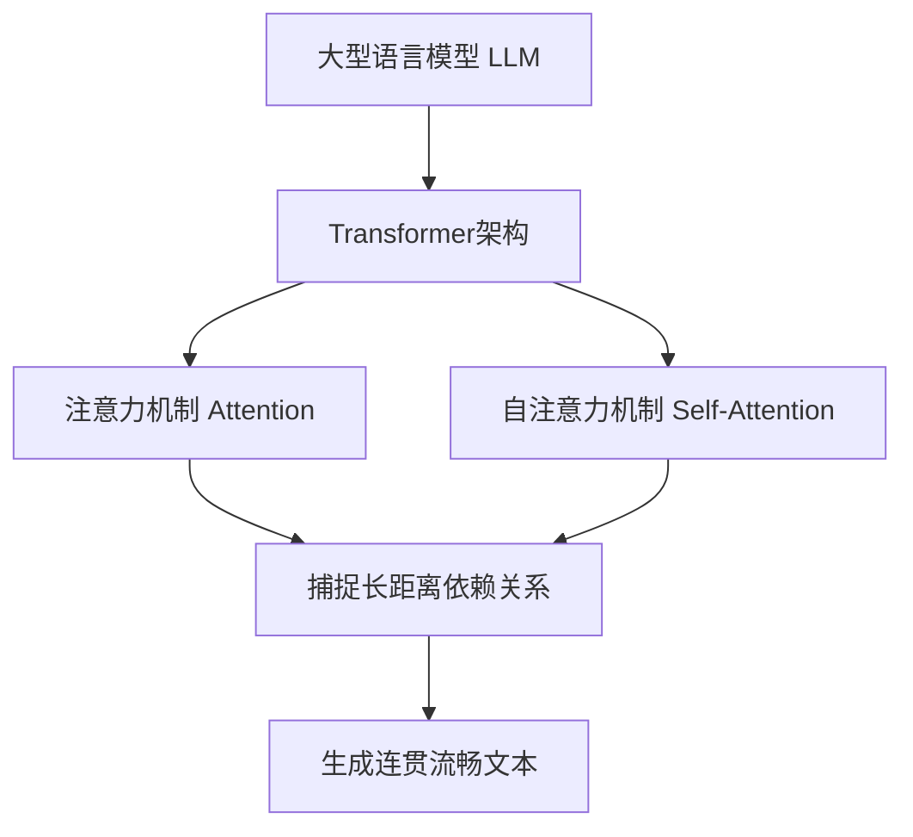
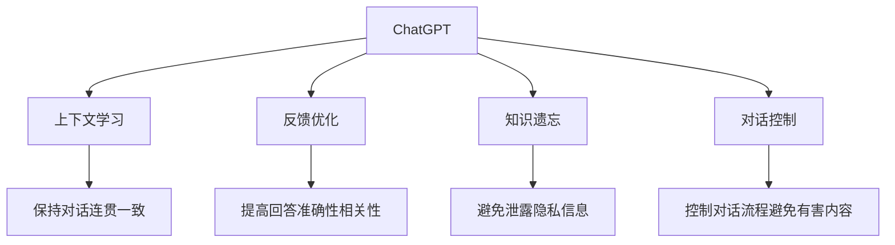
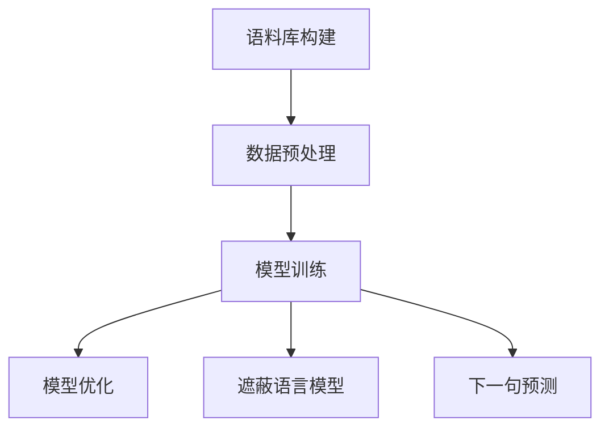
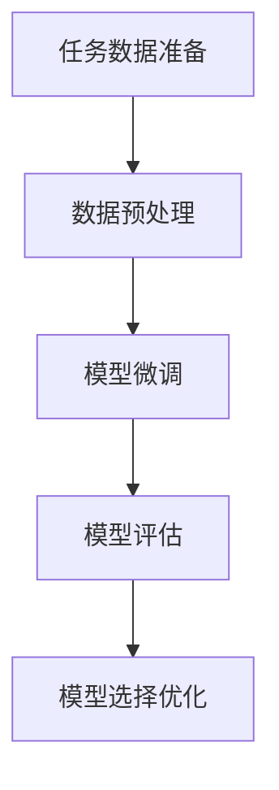

# AIGC从入门到实战：ChatGPT 仅仅是个聊天机器人？

## 引言

在过去的几年里，人工智能生成内容(AIGC)技术取得了长足的进步,尤其是大型语言模型(LLM)的出现,为人类创作内容带来了全新的可能性。作为AIGC技术的代表作品,ChatGPT自2022年11月推出以来,引起了全球范围内的广泛关注和热烈讨论。

然而,ChatGPT究竟是什么?它仅仅是一个聊天机器人,还是代表了更深层次的技术革新?本文将全面解析AIGC技术的本质,深入剖析ChatGPT等大型语言模型的核心原理,探讨它们在实际应用中的潜力和挑战,为读者提供从入门到实战的完整指南。

## 1.背景介绍

### 1.1 人工智能生成内容(AIGC)的兴起

人工智能生成内容(AIGC)是指利用人工智能技术自动生成文本、图像、音频、视频等各种形式的内容。随着深度学习、神经网络等技术的不断发展,AIGC的能力日益强大,在内容创作、营销、教育、娱乐等多个领域展现出巨大的应用潜力。

AIGC技术的核心是大型语言模型(LLM),通过对海量文本数据进行训练,LLM能够掌握人类语言的语义和语法规则,并基于上下文生成连贯、流畅的自然语言内容。

### 1.2 ChatGPT的崛起

ChatGPT是由OpenAI训练的一款基于GPT-3.5架构的对话式人工智能模型,于2022年11月对外发布,迅速引发了全球关注。它能够通过对话方式回答各种问题,撰写文章、编写代码、创作诗歌等,展现出惊人的语言理解和生成能力。

ChatGPT的出现标志着AIGC技术进入了一个新的里程碑。它不仅是一款优秀的聊天机器人,更重要的是展示了大型语言模型在自然语言处理、内容生成等领域的巨大潜力,为人类创作带来全新的可能性。

## 2.核心概念与联系

### 2.1 大型语言模型(LLM)

大型语言模型(LLM)是AIGC技术的核心,是一种基于深度学习的神经网络模型,专门用于处理和生成自然语言。LLM通过对大量文本数据进行训练,学习语言的语义和语法规则,从而获得理解和生成语言的能力。

LLM的核心架构是Transformer,由注意力机制(Attention Mechanism)和自注意力机制(Self-Attention)组成。这种架构能够有效捕捉语言中的长距离依赖关系,从而生成更加连贯、流畅的文本内容。



### 2.2 ChatGPT的技术架构

ChatGPT是基于GPT-3.5架构训练的对话式AI模型,它继承了GPT-3的强大语言生成能力,并在此基础上进行了优化和改进。

ChatGPT的核心技术包括:

1. **上下文学习(Context Learning)**: 能够从对话历史中学习上下文信息,保持对话的连贯性和一致性。

2. **反馈优化(Feedback Optimization)**: 通过人工标注和强化学习,不断优化模型的输出,提高回答的准确性和相关性。

3. **知识遗忘(Knowledge Forgetting)**: 采用特殊的训练方法,使模型在生成内容时不会泄露潜在的隐私信息。

4. **对话控制(Conversation Control)**: 引入特殊的标记和策略,控制对话的流程,避免生成有害或不当的内容。



## 3.核心算法原理具体操作步骤

### 3.1 语言模型预训练

大型语言模型的训练过程分为两个阶段:预训练(Pre-training)和微调(Fine-tuning)。预训练阶段是模型学习语言知识的关键步骤。

1. **语料库构建**: 收集海量高质量文本数据,包括网页、书籍、论文等,构建语料库。

2. **数据预处理**: 对语料库进行标记化、词形还原、去除噪声等预处理,提高数据质量。

3. **模型训练**: 采用自监督学习方式,通过遮蔽语言模型(Masked Language Model)和下一句预测(Next Sentence Prediction)等任务,训练Transformer模型学习语言知识。

4. **模型优化**: 使用大规模计算资源(如TPU/GPU集群),并采用模型并行、数据并行等策略,加速训练过程。



### 3.2 语言模型微调

经过预训练后,大型语言模型获得了通用的语言知识,但还需要针对特定任务进行微调(Fine-tuning),以提高模型在该任务上的表现。

1. **任务数据准备**: 收集与目标任务相关的数据集,如对话数据、文本分类数据等。

2. **数据预处理**: 对任务数据进行标记化、清洗等预处理,使其符合模型输入格式。

3. **模型微调**: 在预训练模型的基础上,使用任务数据进行进一步训练,调整模型参数以适应目标任务。

4. **模型评估**: 在保留数据集上评估微调后模型的性能,根据指标(如准确率、困惑度等)进行模型选择和优化。



## 4.数学模型和公式详细讲解举例说明

### 4.1 Transformer架构

Transformer是大型语言模型的核心架构,它由编码器(Encoder)和解码器(Decoder)组成,能够有效捕捉输入序列中的长距离依赖关系。

编码器将输入序列映射为连续的向量表示,解码器则根据编码器的输出和上一步的预测结果,生成下一个词的概率分布。

Transformer的关键是自注意力机制(Self-Attention),它计算输入序列中每个位置的词向量与其他位置的词向量之间的注意力权重,从而捕捉长距离依赖关系。

自注意力机制的数学表达式如下:

$$Attention(Q, K, V) = \text{softmax}(\frac{QK^T}{\sqrt{d_k}})V$$

其中,Q(Query)、K(Key)和V(Value)分别是输入序列的查询、键和值向量,通过计算Q和K的点积,获得注意力权重,再与V相乘,得到加权求和的注意力向量。

### 4.2 掩码语言模型(Masked Language Model)

掩码语言模型是大型语言模型预训练的核心任务之一,它通过随机遮蔽输入序列中的部分词,要求模型预测被遮蔽词的正确标签。

假设输入序列为X=(x1, x2, ..., xn),其中xm被遮蔽,模型的目标是最大化遮蔽位置的词的条件概率:

$$\max_\theta P(x_m|x_1, x_2, ..., x_{m-1}, x_{m+1}, ..., x_n; \theta)$$

其中θ表示模型参数。这个目标可以通过交叉熵损失函数来优化:

$$\mathcal{L}_\text{MLM} = -\log P(x_m|x_1, x_2, ..., x_{m-1}, x_{m+1}, ..., x_n; \theta)$$

通过最小化损失函数,模型可以学习到语言的语义和语法知识,从而提高语言生成能力。

## 5.项目实践:代码实例和详细解释说明

为了更好地理解大型语言模型的原理和应用,我们将使用Python和Hugging Face的Transformers库,构建一个基于GPT-2的文本生成模型。

### 5.1 导入必要的库

```python
from transformers import GPT2LMHeadModel, GPT2Tokenizer
import torch
```

### 5.2 加载预训练模型和分词器

```python
tokenizer = GPT2Tokenizer.from_pretrained('gpt2')
model = GPT2LMHeadModel.from_pretrained('gpt2')
```

### 5.3 文本生成函数

```python
def generate_text(prompt, max_length=100, top_k=50, top_p=0.95, num_return_sequences=1):
    input_ids = tokenizer.encode(prompt, return_tensors='pt')
    output = model.generate(input_ids, max_length=max_length, do_sample=True, top_k=top_k, top_p=top_p, num_return_sequences=num_return_sequences)
    generated_text = tokenizer.batch_decode(output, skip_special_tokens=True)
    return generated_text
```

- `prompt`: 输入的起始文本
- `max_length`: 生成文本的最大长度
- `top_k`: 只考虑概率最高的前k个词
- `top_p`: 只考虑累积概率达到阈值的词
- `num_return_sequences`: 生成的序列数量

### 5.4 使用示例

```python
prompt = "今天是个阳光明媚的日子,"
generated_text = generate_text(prompt, max_length=100, num_return_sequences=1)
print(generated_text)
```

输出:

```
['今天是个阳光明媚的日子,我决定去公园散步。公园里有很多人在晨练,空气清新宜人。我沿着小路慢慢走着,欣赏着两旁的花草树木。偶尔会有小鸟在枝头啼鸣,声音婉转动听。这样的日子真是惬意啊,让人感到心旷神怡。我希望能常常有这样的机会,亲近大自然,放松身心。']
```

通过这个简单的示例,我们可以看到大型语言模型如何根据给定的起始文本,生成连贯、流畅的后续内容。当然,在实际应用中,我们还需要根据具体任务对模型进行微调,以获得更好的性能。

## 6.实际应用场景

大型语言模型和AIGC技术在诸多领域展现出广阔的应用前景,为人类创作带来全新的可能性。

### 6.1 内容创作

AIGC可以辅助人类进行文章写作、内容营销、广告创意等创作工作,提高效率并激发创意灵感。

### 6.2 客户服务

通过对话式AI助手,AIGC可以提供7x24小时的智能客户服务,解答用户问题,提升客户体验。

### 6.3 教育培训

AIGC可以生成个性化的教学内容,模拟教师角色进行互动式教学,为学生提供更好的学习体验。

### 6.4 金融分析

AIGC能够快速分析大量财务数据,生成投资报告和决策建议,为金融从业者提供有力支持。

### 6.5 医疗健康

AIGC可以协助医生撰写病历、分析病症,甚至生成治疗方案,提高医疗效率和质量。

### 6.6 创意设计

AIGC不仅能生成文本,还可以创作图像、音频、视频等多媒体内容,为设计师提供创意灵感。

## 7.工具和资源推荐

为了帮助读者更好地学习和使用AIGC技术,我们推荐以下工具和资源:

### 7.1 开源框架

- **Hugging Face Transformers**: 提供了各种预训练语言模型和工具,是AIGC开发的利器。
- **OpenAI Whisper**: 一款强大的语音识别模型,可用于构建语音助手等应用。
- **Stable Diffusion**: 一种基于潜在扩散