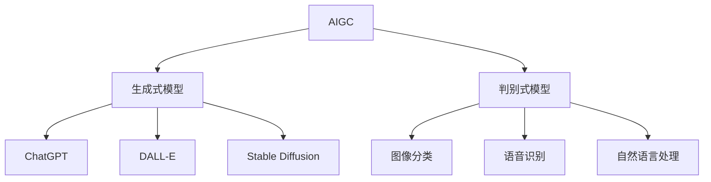

# AIGC从入门到实战：ChatGPT 仅仅是个聊天机器人？

## 1. 背景介绍

### 1.1 人工智能的发展历程
#### 1.1.1 人工智能的起源与早期发展
#### 1.1.2 机器学习的兴起
#### 1.1.3 深度学习的突破

### 1.2 生成式AI的崛起
#### 1.2.1 生成式模型的概念
#### 1.2.2 生成式AI的应用领域
#### 1.2.3 AIGC的出现与影响

### 1.3 ChatGPT的诞生
#### 1.3.1 OpenAI的发展历程
#### 1.3.2 GPT系列模型的演进
#### 1.3.3 ChatGPT的特点与优势

## 2. 核心概念与联系

### 2.1 AIGC的定义与分类
#### 2.1.1 AIGC的定义
#### 2.1.2 AIGC的分类
#### 2.1.3 AIGC与传统AI的区别

### 2.2 生成式模型的原理
#### 2.2.1 生成式模型的数学基础
#### 2.2.2 生成式模型的训练方法
#### 2.2.3 生成式模型的评估指标

### 2.3 ChatGPT与AIGC的关系
#### 2.3.1 ChatGPT在AIGC中的地位
#### 2.3.2 ChatGPT与其他AIGC模型的比较
#### 2.3.3 ChatGPT在AIGC发展中的意义



## 3. 核心算法原理具体操作步骤

### 3.1 Transformer模型
#### 3.1.1 Transformer的结构
#### 3.1.2 Self-Attention机制
#### 3.1.3 位置编码

### 3.2 预训练与微调
#### 3.2.1 预训练的概念与方法
#### 3.2.2 微调的概念与方法
#### 3.2.3 预训练与微调的优缺点

### 3.3 ChatGPT的训练过程
#### 3.3.1 数据准备与预处理
#### 3.3.2 模型结构设计
#### 3.3.3 训练参数设置与优化

## 4. 数学模型和公式详细讲解举例说明

### 4.1 Transformer的数学表示
#### 4.1.1 Self-Attention的数学公式
$$Attention(Q,K,V) = softmax(\frac{QK^T}{\sqrt{d_k}})V$$
#### 4.1.2 多头注意力机制的数学表示
$$MultiHead(Q,K,V) = Concat(head_1, ..., head_h)W^O$$
#### 4.1.3 前馈神经网络的数学表示
$$FFN(x) = max(0, xW_1 + b_1)W_2 + b_2$$

### 4.2 损失函数与优化算法
#### 4.2.1 交叉熵损失函数
$$L(y, \hat{y}) = -\sum_{i=1}^{n} y_i \log(\hat{y}_i)$$
#### 4.2.2 Adam优化算法
$$m_t = \beta_1 m_{t-1} + (1 - \beta_1) g_t$$
$$v_t = \beta_2 v_{t-1} + (1 - \beta_2) g_t^2$$
$$\hat{m}_t = \frac{m_t}{1 - \beta_1^t}$$
$$\hat{v}_t = \frac{v_t}{1 - \beta_2^t}$$
$$\theta_t = \theta_{t-1} - \frac{\eta}{\sqrt{\hat{v}_t} + \epsilon} \hat{m}_t$$

### 4.3 评估指标与方法
#### 4.3.1 困惑度(Perplexity)
$$PPL(W) = P(w_1, w_2, ..., w_N)^{-\frac{1}{N}}$$
#### 4.3.2 BLEU评分
$$BLEU = BP \cdot exp(\sum_{n=1}^{N} w_n \log p_n)$$
#### 4.3.3 人工评估方法

## 5. 项目实践：代码实例和详细解释说明

### 5.1 使用Hugging Face的Transformers库
#### 5.1.1 安装与环境配置
```bash
pip install transformers
```
#### 5.1.2 加载预训练模型
```python
from transformers import AutoTokenizer, AutoModelForCausalLM

tokenizer = AutoTokenizer.from_pretrained("gpt2")
model = AutoModelForCausalLM.from_pretrained("gpt2")
```
#### 5.1.3 生成文本
```python
prompt = "Once upon a time"
input_ids = tokenizer.encode(prompt, return_tensors='pt')
output = model.generate(input_ids, max_length=100, num_return_sequences=1)
generated_text = tokenizer.decode(output[0], skip_special_tokens=True)
print(generated_text)
```

### 5.2 使用PyTorch实现Transformer
#### 5.2.1 定义模型结构
```python
import torch
import torch.nn as nn

class Transformer(nn.Module):
    def __init__(self, vocab_size, d_model, nhead, num_layers):
        super().__init__()
        self.embedding = nn.Embedding(vocab_size, d_model)
        self.pos_encoder = PositionalEncoding(d_model)
        encoder_layer = nn.TransformerEncoderLayer(d_model, nhead)
        self.transformer_encoder = nn.TransformerEncoder(encoder_layer, num_layers)
        self.fc = nn.Linear(d_model, vocab_size)
        
    def forward(self, src):
        src = self.embedding(src) * math.sqrt(self.d_model)
        src = self.pos_encoder(src)
        output = self.transformer_encoder(src)
        output = self.fc(output)
        return output
```
#### 5.2.2 训练模型
```python
criterion = nn.CrossEntropyLoss()
optimizer = torch.optim.Adam(model.parameters(), lr=0.001)

for epoch in range(num_epochs):
    for batch in train_dataloader:
        optimizer.zero_grad()
        output = model(batch['input_ids'])
        loss = criterion(output.view(-1, vocab_size), batch['labels'].view(-1))
        loss.backward()
        optimizer.step()
```
#### 5.2.3 生成文本
```python
model.eval()
prompt = "Once upon a time"
input_ids = tokenizer.encode(prompt, return_tensors='pt')
output = model.generate(input_ids, max_length=100, num_return_sequences=1)
generated_text = tokenizer.decode(output[0], skip_special_tokens=True)
print(generated_text)
```

## 6. 实际应用场景

### 6.1 智能客服
#### 6.1.1 客户问题自动解答
#### 6.1.2 个性化服务推荐
#### 6.1.3 情感分析与舆情监测

### 6.2 内容创作
#### 6.2.1 文案撰写与编辑
#### 6.2.2 故事情节生成
#### 6.2.3 新闻摘要与标题生成

### 6.3 教育与培训
#### 6.3.1 智能辅导与答疑
#### 6.3.2 个性化学习路径规划
#### 6.3.3 知识图谱构建与问答

### 6.4 医疗健康
#### 6.4.1 医疗记录自动摘要
#### 6.4.2 药物说明书生成
#### 6.4.3 医患交互与咨询

## 7. 工具和资源推荐

### 7.1 开源框架与库
#### 7.1.1 Hugging Face Transformers
#### 7.1.2 OpenAI GPT系列模型
#### 7.1.3 Google BERT

### 7.2 数据集与语料库
#### 7.2.1 维基百科语料库
#### 7.2.2 Common Crawl数据集
#### 7.2.3 BookCorpus数据集

### 7.3 学习资源与社区
#### 7.3.1 吴恩达深度学习课程
#### 7.3.2 fast.ai实用深度学习课程
#### 7.3.3 Kaggle竞赛平台

## 8. 总结：未来发展趋势与挑战

### 8.1 AIGC的发展趋势
#### 8.1.1 模型规模与性能的持续提升
#### 8.1.2 多模态生成能力的增强
#### 8.1.3 个性化与交互性的提高

### 8.2 AIGC面临的挑战
#### 8.2.1 数据隐私与安全问题
#### 8.2.2 生成内容的可控性与伦理性
#### 8.2.3 版权与知识产权保护

### 8.3 AIGC的未来展望
#### 8.3.1 人机协作与增强智能
#### 8.3.2 AIGC在各行业的深度应用
#### 8.3.3 AIGC与AGI的关系探讨

## 9. 附录：常见问题与解答

### 9.1 ChatGPT与其他语言模型的区别
### 9.2 如何判断生成内容的质量与可靠性
### 9.3 AIGC对就业市场的影响
### 9.4 AIGC技术的学习路径与建议
### 9.5 AIGC在中文场景下的应用与挑战

作者：禅与计算机程序设计艺术 / Zen and the Art of Computer Programming