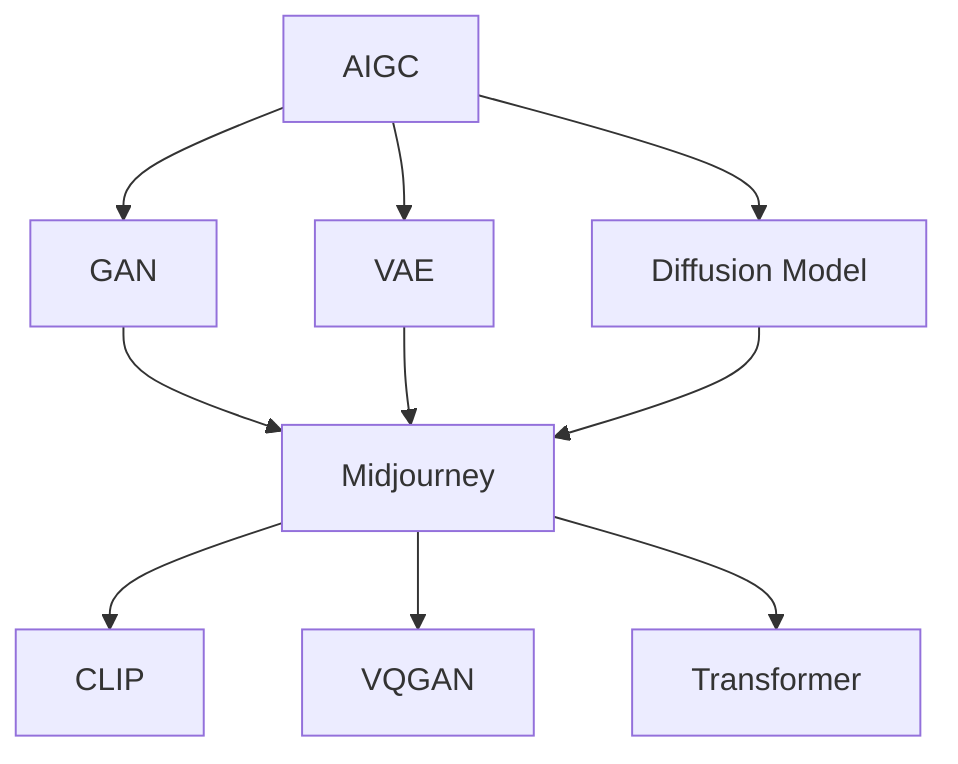

# AIGC从入门到实战：云想衣裳花想容：Midjourney 助你成为画中仙

## 1. 背景介绍
### 1.1 AIGC的兴起
#### 1.1.1 人工智能技术的发展
#### 1.1.2 AIGC的定义与特点
#### 1.1.3 AIGC的应用领域

### 1.2 Midjourney的诞生
#### 1.2.1 Midjourney的创始团队
#### 1.2.2 Midjourney的发展历程
#### 1.2.3 Midjourney的独特之处

## 2. 核心概念与联系
### 2.1 AIGC的核心概念
#### 2.1.1 生成式对抗网络(GAN)
#### 2.1.2 变分自编码器(VAE)
#### 2.1.3 扩散模型(Diffusion Model)

### 2.2 Midjourney的核心技术
#### 2.2.1 CLIP(Contrastive Language-Image Pre-training)
#### 2.2.2 VQGAN(Vector Quantized Generative Adversarial Network)
#### 2.2.3 Transformer

### 2.3 AIGC与Midjourney的关系
#### 2.3.1 Midjourney在AIGC领域的地位
#### 2.3.2 Midjourney与其他AIGC工具的比较
#### 2.3.3 Midjourney的技术优势

## 3. 核心算法原理具体操作步骤
### 3.1 CLIP算法原理
#### 3.1.1 CLIP的训练过程
#### 3.1.2 CLIP的图像编码器
#### 3.1.3 CLIP的文本编码器

### 3.2 VQGAN算法原理  
#### 3.2.1 VQGAN的生成器
#### 3.2.2 VQGAN的判别器
#### 3.2.3 VQGAN的量化器

### 3.3 Transformer算法原理
#### 3.3.1 Self-Attention机制
#### 3.3.2 Multi-Head Attention
#### 3.3.3 位置编码

### 3.4 Midjourney的具体操作步骤
#### 3.4.1 输入文本提示
#### 3.4.2 图像生成过程
#### 3.4.3 图像优化与后处理

## 4. 数学模型和公式详细讲解举例说明
### 4.1 GAN的数学模型
#### 4.1.1 生成器的目标函数
$$\min_G \max_D V(D,G) = \mathbb{E}_{x \sim p_{data}(x)}[\log D(x)] + \mathbb{E}_{z \sim p_z(z)}[\log(1 - D(G(z)))]$$
#### 4.1.2 判别器的目标函数
$$\max_D V(D,G) = \mathbb{E}_{x \sim p_{data}(x)}[\log D(x)] + \mathbb{E}_{z \sim p_z(z)}[\log(1 - D(G(z)))]$$

### 4.2 VAE的数学模型
#### 4.2.1 VAE的目标函数
$$\mathcal{L}(\theta, \phi) = \mathbb{E}_{q_\phi(z|x)}[\log p_\theta(x|z)] - D_{KL}(q_\phi(z|x) || p(z))$$
#### 4.2.2 重参数化技巧
$z = \mu + \sigma \odot \epsilon, \epsilon \sim \mathcal{N}(0,I)$

### 4.3 Diffusion Model的数学模型
#### 4.3.1 前向扩散过程
$q(x_t|x_{t-1}) = \mathcal{N}(x_t; \sqrt{1-\beta_t} x_{t-1}, \beta_t I)$
#### 4.3.2 反向去噪过程
$p_\theta(x_{t-1}|x_t) = \mathcal{N}(x_{t-1}; \mu_\theta(x_t, t), \Sigma_\theta(x_t, t))$

## 5. 项目实践：代码实例和详细解释说明
### 5.1 使用Midjourney生成图像
#### 5.1.1 注册Midjourney账号
#### 5.1.2 加入Midjourney Discord服务器
#### 5.1.3 在指定频道输入文本提示

### 5.2 Midjourney的提示语技巧
#### 5.2.1 使用具体的描述
#### 5.2.2 参考著名艺术家的风格
#### 5.2.3 利用情感和氛围词汇

### 5.3 Midjourney生成图像的参数调整
#### 5.3.1 调整图像分辨率
#### 5.3.2 调整图像纵横比
#### 5.3.3 调整生成图像的数量

### 5.4 Midjourney图像的后处理
#### 5.4.1 使用图像编辑软件进行修饰
#### 5.4.2 结合其他AIGC工具进行优化
#### 5.4.3 将生成图像应用于实际项目

## 6. 实际应用场景
### 6.1 游戏与影视行业
#### 6.1.1 游戏概念设计
#### 6.1.2 影视分镜头绘制
#### 6.1.3 虚拟角色创作

### 6.2 广告与设计行业
#### 6.2.1 广告创意生成
#### 6.2.2 产品设计与渲染
#### 6.2.3 品牌形象设计

### 6.3 教育与科研领域
#### 6.3.1 教学资源制作
#### 6.3.2 科研可视化
#### 6.3.3 数据增强与扩充

## 7. 工具和资源推荐
### 7.1 AIGC工具推荐
#### 7.1.1 Stable Diffusion
#### 7.1.2 DALL-E 2
#### 7.1.3 Artbreeder

### 7.2 Prompt Engineering资源
#### 7.2.1 Prompt Engineering指南
#### 7.2.2 Prompt分享社区
#### 7.2.3 Prompt优化工具

### 7.3 AIGC学习资源
#### 7.3.1 AIGC相关课程
#### 7.3.2 AIGC研究论文
#### 7.3.3 AIGC开源项目

## 8. 总结：未来发展趋势与挑战
### 8.1 AIGC的发展趋势
#### 8.1.1 多模态AIGC
#### 8.1.2 个性化AIGC
#### 8.1.3 AIGC与传统创作的融合

### 8.2 AIGC面临的挑战
#### 8.2.1 版权与伦理问题
#### 8.2.2 生成内容的可控性
#### 8.2.3 AIGC工具的可解释性

### 8.3 Midjourney的未来展望
#### 8.3.1 Midjourney的迭代更新
#### 8.3.2 Midjourney的商业化探索
#### 8.3.3 Midjourney在AIGC领域的影响力

## 9. 附录：常见问题与解答
### 9.1 Midjourney的使用常见问题
#### 9.1.1 如何提高生成图像的质量？
#### 9.1.2 如何避免生成重复或相似的图像？
#### 9.1.3 Midjourney生成图像的版权归属？

### 9.2 AIGC的常见误区
#### 9.2.1 AIGC是否会取代人类创作？
#### 9.2.2 AIGC生成的内容是否具有艺术价值？
#### 9.2.3 AIGC是否会加剧信息茧房效应？

### 9.3 AIGC的学习建议
#### 9.3.1 如何系统学习AIGC知识？
#### 9.3.2 AIGC领域有哪些值得关注的研究方向？
#### 9.3.3 AIGC初学者应该如何入门？

作者：禅与计算机程序设计艺术 / Zen and the Art of Computer Programming