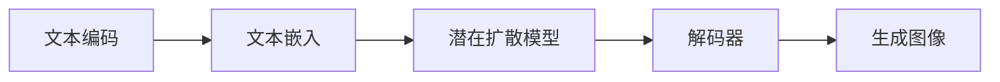

# AIGC从入门到实战：多快好省搞定各种风格的 logo 设计

## 1.背景介绍
### 1.1 什么是AIGC
AIGC(AI Generated Content)是指利用人工智能技术自动生成各种类型内容的技术,包括文本、图像、音频、视频等。随着AI技术的快速发展,AIGC正在成为一种革命性的内容生产方式,为各行各业带来巨大的创新和变革。

### 1.2 AIGC在logo设计中的应用前景
logo设计是企业品牌形象塑造的重要一环,传统的logo设计流程需要专业设计师投入大量时间和精力。而AIGC技术的出现,为logo设计带来了全新的可能。利用AIGC,即使是没有专业设计背景的人,也能快速生成各种风格的logo,大大提升了logo设计的效率和可及性。

### 1.3 本文的主要内容
本文将重点介绍如何利用AIGC技术,特别是文生图模型,来实现多快好省地完成各种风格logo的设计。全文将涵盖AIGC的核心概念、关键算法、数学原理、代码实践、应用场景等方方面面,帮助读者系统地掌握AIGC在logo设计中的应用。

## 2.核心概念与联系
### 2.1 AIGC的分类
AIGC主要可以分为以下几类:

- 文生图(Text-to-Image):根据文本描述生成对应的图像
- 文生文(Text-to-Text):根据输入文本生成相关的文本内容
- 音频生图(Audio-to-Image):根据音频输入生成相应的图像
- 视频生图(Video-to-Image):从视频中提取信息生成图像

其中文生图是目前AIGC领域最热门也是发展最快的方向,在logo设计中有广阔的应用前景。

### 2.2 文生图的关键技术
文生图的实现主要依赖以下几个关键技术:

- 自然语言处理(NLP):理解文本描述的语义信息
- 计算机视觉(CV):图像特征提取与分析
- 生成对抗网络(GAN):生成逼真的图像内容
- 扩散模型(Diffusion Model):图像生成的另一种主流范式

这些技术在文生图模型中协同工作,将文本信息映射到图像空间,生成与描述相符的图像。

### 2.3 主流文生图模型
目前主流的文生图模型包括:

- DALL-E、DALL-E 2:由OpenAI开发,基于Transformer结构
- Stable Diffusion:基于潜在扩散模型,支持图像生成和编辑
- Midjourney:强大的AI绘画工具,侧重艺术创作
- ERNIE-ViLG:百度发布的多模态文生图预训练模型

这些模型在图像生成质量、语义理解、训练效率等方面各有特点,适用于不同的应用场景。

## 3.核心算法原理具体操作步骤
下面我们以当前最流行的Stable Diffusion模型为例,详细讲解其核心算法原理和操作步骤。

### 3.1 Stable Diffusion 总体架构
Stable Diffusion是一个基于潜在扩散模型(Latent Diffusion Model)的文生图框架。其总体架构如下:



整个流程可以分为以下几个关键步骤:

1. 将输入的文本描述通过文本编码器转换为文本嵌入向量
2. 将文本嵌入向量输入潜在扩散模型,生成图像的潜在表示
3. 使用解码器将潜在表示解码为最终的图像

### 3.2 潜在扩散模型
潜在扩散模型是Stable Diffusion的核心,其主要思想是:将图像看作一个潜在空间中的点,通过迭代的扩散过程,逐步将随机噪声映射到有意义的图像。

具体来说,潜在扩散模型包含以下几个关键组件:

1. AutoEncoder:将图像编码到潜在空间,再解码回原始图像空间
2. 正向扩散过程:通过逐步添加高斯噪声,将数据分布变换到标准正态分布
3. 逆向扩散过程:学习逆向扩散过程的条件转移概率,从噪声恢复出图像

其中,正向扩散过程可以表示为:

$$q(z_t|z_{t-1}) = \mathcal{N}(z_t; \sqrt{1-\beta_t} z_{t-1}, \beta_t \mathbf{I})$$

其中$z_t$表示扩散过程中的潜变量,$\beta_t$是扩散速率的超参数。

逆向扩散过程的目标是估计条件概率$p_\theta(z_{t-1}|z_t)$,可以通过神经网络来参数化:

$$p_\theta(z_{t-1}|z_t) = \mathcal{N}(z_{t-1}; \mu_\theta(z_t, t), \sigma_\theta(z_t, t))$$

通过不断迭代上述逆向扩散过程,就可以从随机噪声恢复出与条件匹配的图像。

### 3.3 训练和推理流程
Stable Diffusion的训练和推理流程可以总结如下:

训练阶段:
1. 准备大规模图文对数据集
2. 训练AutoEncoder,学习图像的潜在表示
3. 固定AutoEncoder,训练逆向扩散模型,学习从噪声恢复图像的条件转移概率

推理阶段:
1. 将文本描述编码为嵌入向量
2. 随机采样高斯噪声,作为扩散过程的起点
3. 迭代执行逆向扩散过程,逐步去噪并生成图像
4. 使用AutoEncoder的解码器将潜在表示解码为最终图像

## 4.数学模型和公式详细讲解举例说明
本节我们将详细讲解Stable Diffusion中涉及的几个关键数学模型和公式,并给出具体的例子帮助理解。

### 4.1 高斯噪声
正向扩散过程中,我们通过逐步添加高斯噪声将数据分布变换到标准正态分布。高斯噪声是指服从高斯分布(即正态分布)的随机噪声。

一维高斯分布的概率密度函数为:

$$f(x) = \frac{1}{\sqrt{2\pi}\sigma}\exp(-\frac{(x-\mu)^2}{2\sigma^2})$$

其中$\mu$为均值,$\sigma$为标准差。当$\mu=0,\sigma=1$时,称为标准正态分布。

举例说明:假设我们有一张图片,像素值在0到255之间。我们可以给每个像素添加均值为0,标准差为1的高斯噪声,得到噪声图像:

```python
import numpy as np
import matplotlib.pyplot as plt

# 原始图像
img = plt.imread('example.jpg')

# 添加高斯噪声
noise = np.random.normal(0, 1, img.shape)
noisy_img = img + noise

plt.subplot(1,2,1)
plt.imshow(img)
plt.subplot(1,2,2) 
plt.imshow(noisy_img)
plt.show()
```

通过逐步增大噪声的标准差,我们可以将图像逐渐"扩散"到接近标准正态分布的随机噪声。

### 4.2 变分下界(ELBO)
训练Stable Diffusion的目标是最大化如下的边际似然:

$$p(x) = \int p(x|z)p(z)dz$$

其中$x$为图像,$z$为潜变量。但由于边际似然难以直接优化,我们通常转而最大化其变分下界(ELBO):

$$\log p(x) \geq \mathbb{E}_{q(z|x)}[\log \frac{p(x,z)}{q(z|x)}] = \mathcal{L}(x)$$

其中$q(z|x)$是近似后验分布。最大化ELBO等价于最小化真实后验$p(z|x)$和近似后验$q(z|x)$之间的KL散度:

$$\mathcal{L}(x) = \log p(x) - D_{KL}(q(z|x)||p(z|x))$$

直观地说,ELBO提供了对数似然函数的一个紧的下界,使得我们可以通过优化这个下界来间接地最大化真实的对数似然。

### 4.3 条件概率估计
逆向扩散过程的核心是估计条件转移概率$p_\theta(z_{t-1}|z_t)$。这里我们假设条件概率服从高斯分布:

$$p_\theta(z_{t-1}|z_t) = \mathcal{N}(z_{t-1}; \mu_\theta(z_t, t), \Sigma_\theta(z_t, t))$$

其中$\mu_\theta$和$\Sigma_\theta$分别为估计的均值和协方差矩阵,可以通过神经网络从$z_t$和时间步$t$估计得到。

举例说明:假设我们当前时间步$t$的潜变量$z_t$为一个512维的向量,我们可以设计一个简单的MLP网络来估计均值和对角协方差矩阵:

```python
import torch
import torch.nn as nn

class CondMLP(nn.Module):
  def __init__(self, in_dim, out_dim):
    super().__init__()
    self.mlp = nn.Sequential(
      nn.Linear(in_dim, 1024),
      nn.ReLU(),
      nn.Linear(1024, 1024),
      nn.ReLU(),
      nn.Linear(1024, out_dim)
    )
  
  def forward(self, z, t):
    t_embed = self.time_embedding(t)  # 时间步嵌入
    z_t_embed = torch.cat([z, t_embed], dim=-1)
    out = self.mlp(z_t_embed)
    mu, log_sigma = out.chunk(2, dim=-1)
    sigma = torch.exp(log_sigma)
    return mu, sigma
```

其中`time_embedding`可以是一个简单的正弦编码函数,将时间步$t$映射到高维空间。通过优化上述网络,我们就可以估计任意时间步从$z_t$恢复$z_{t-1}$的条件概率。

## 5.项目实践：代码实例和详细解释说明
下面我们通过一个简化版的Stable Diffusion实现,来演示如何用代码实现文生图的整个流程。

### 5.1 文本编码器
首先我们需要将输入的文本描述转换为嵌入向量。这里我们使用预训练的CLIP文本编码器:

```python
import torch
from transformers import CLIPTokenizer, CLIPTextModel

tokenizer = CLIPTokenizer.from_pretrained("openai/clip-vit-base-patch32")
text_encoder = CLIPTextModel.from_pretrained("openai/clip-vit-base-patch32")

def get_text_embeds(prompt, device):
  inputs = tokenizer(prompt, padding=True, return_tensors="pt")
  inputs = {k: v.to(device) for k,v in inputs.items()}
  with torch.no_grad():
    text_embeds = text_encoder(**inputs).last_hidden_state
  return text_embeds
```

### 5.2 AutoEncoder
接下来我们定义AutoEncoder,用于学习图像的潜在表示:

```python
class AutoEncoder(nn.Module):
  def __init__(self, in_channels, latent_dim):
    super().__init__()
    self.encoder = nn.Sequential(
      nn.Conv2d(in_channels, 64, 3, stride=2, padding=1),
      nn.ReLU(),
      nn.Conv2d(64, 128, 3, stride=2, padding=1),
      nn.ReLU(),
      nn.Conv2d(128, 256, 3, stride=2, padding=1),
      nn.ReLU(),
      nn.Flatten(),
      nn.Linear(256*8*8, latent_dim)
    )
    self.decoder = nn.Sequential(
      nn.Linear(latent_dim, 256*8*8),
      nn.Unflatten(1, (256, 8, 8)),
      nn.ConvTranspose2d(256, 128, 4, stride=2, padding=1),
      nn.ReLU(),
      nn.ConvTranspose2d(128, 64, 4, stride=2, padding=1),
      nn.ReLU(),
      nn.ConvTranspose2d(64, in_channels, 4, stride=2, padding=1),
      nn.Sigmoid()
    )

  def forward(self, x):
    z = self.encoder(x)
    x_recon = self.decoder(z)
    return x_recon, z
```

### 5.3 扩散模型
下面定义扩散模型,包括正向和逆向扩散过程:

```python
class DiffusionModel(nn.Module):
  def __init__(self, latent_dim, T):
    super().__init__()
    self.T = T
    self.beta =