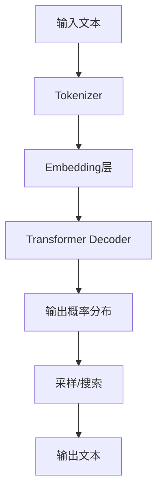

# AIGC从入门到实战：简单的 ChatGPT 应用范例

## 1.背景介绍

### 1.1 什么是 AIGC?

AIGC(Artificial Intelligence Generated Content)即人工智能生成内容,是指利用人工智能技术自动生成文字、图像、音频、视频等多种形式的内容。随着人工智能技术的不断发展,AIGC已经开始在内容创作、营销、客户服务等多个领域发挥重要作用。

### 1.2 AIGC 的发展历程

AIGC 的发展可以追溯到 20 世纪 50 年代,当时的文字生成主要依赖于规则库和模板。进入 21 世纪以来,机器学习和深度学习技术的兴起为 AIGC 带来了新的发展机遇。近年来,生成式预训练语言模型(如 GPT、BERT等)的出现,使 AIGC 在文本生成领域取得了突破性进展。

### 1.3 ChatGPT 的崛起

ChatGPT 是一种基于 GPT-3.5 语言模型的对话式人工智能助手,由 OpenAI 于 2022 年 11 月推出。它能够通过对话方式回答各种问题、撰写文章、编写代码等,展现出令人惊叹的自然语言处理能力。ChatGPT 的出现引发了社会各界对 AIGC 的广泛关注和热议。

## 2.核心概念与联系

### 2.1 生成式预训练语言模型

生成式预训练语言模型(Generative Pre-trained Language Model)是 AIGC 领域的核心技术之一。它通过在大规模文本语料库上进行预训练,学习语言的统计规律和语义知识,从而获得生成自然语言的能力。

常见的生成式预训练语言模型包括:

- GPT(Generative Pre-trained Transformer)系列模型
- BERT(Bidirectional Encoder Representations from Transformers)
- XLNet
- ALBERT
- RoBERTa
- ...

这些模型通过掌握语言的内在规律,能够生成流畅、连贯、符合语义的文本内容。

### 2.2 自然语言处理(NLP)

自然语言处理(Natural Language Processing)是人工智能的一个重要分支,旨在使计算机能够理解和生成人类语言。NLP 技术是 AIGC 的核心支撑,包括以下主要任务:

- 文本生成(Text Generation)
- 机器翻译(Machine Translation)
- 文本摘要(Text Summarization)
- 命名实体识别(Named Entity Recognition)
- 情感分析(Sentiment Analysis)
- ...

ChatGPT 等 AIGC 系统通过掌握 NLP 技术,能够进行高质量的文本生成、对话交互等。

### 2.3 人工智能与内容创作

人工智能正在重塑内容创作的方式,AIGC 为内容创作带来了全新的机遇和挑战:

- 提高内容创作效率
- 降低内容创作成本
- 个性化定制内容
- 打破创作者的地域和语言限制
- 存在版权和知识产权问题
- 可能带来内容同质化风险
- ...

AIGC 有望成为内容创作的有力补充,但同时也需要人工智能与人类创作者的紧密结合。

## 3.核心算法原理具体操作步骤

ChatGPT 是一种基于 GPT-3.5 语言模型的对话式人工智能助手。它的核心算法原理可以概括为以下几个步骤:



### 3.1 Tokenizer(分词器)

Tokenizer 的作用是将输入的文本序列转换为一系列的 token(词元)序列,以便后续的模型处理。常用的分词方式包括 Word-Piece、Byte-Pair Encoding(BPE)等。

### 3.2 Embedding 层

Embedding 层将每个 token 映射为一个固定长度的向量表示,这些向量能够捕捉 token 之间的语义关系。Embedding 层的输出将作为 Transformer Decoder 的输入。

### 3.3 Transformer Decoder

Transformer Decoder 是 GPT 模型的核心部分,它基于自注意力(Self-Attention)机制,能够有效地捕捉输入序列中 token 之间的长程依赖关系。Decoder 的输出是一个概率分布,表示下一个 token 的预测概率。

### 3.4 输出概率分布

Transformer Decoder 的输出是一个概率分布,表示下一个 token 的预测概率。这个概率分布将作为后续采样或搜索的基础。

### 3.5 采样/搜索

根据输出的概率分布,可以采用不同的策略来生成下一个 token,常见的方法包括:

- 贪婪搜索(Greedy Search):始终选择概率最大的 token
- 顶端采样(Top-k Sampling):从概率最大的 k 个 token 中随机采样
- 顶端核采样(Top-p Nucleus Sampling):从累积概率达到阈值 p 的 token 中随机采样

### 3.6 输出文本

通过上述步骤,ChatGPT 可以逐个生成 token,最终得到完整的输出文本序列。

## 4.数学模型和公式详细讲解举例说明

### 4.1 Self-Attention 机制

Self-Attention 是 Transformer 模型的核心,它能够有效地捕捉输入序列中 token 之间的长程依赖关系。Self-Attention 的计算过程如下:

$$
\begin{aligned}
    \text{Attention}(Q, K, V) &= \text{softmax}\left(\frac{QK^T}{\sqrt{d_k}}\right)V \\
    \text{MultiHead}(Q, K, V) &= \text{Concat}(\text{head}_1, \ldots, \text{head}_h)W^O\\
    \text{where}\ \text{head}_i &= \text{Attention}(QW_i^Q, KW_i^K, VW_i^V)
\end{aligned}
$$

其中:
- $Q$、$K$、$V$ 分别表示 Query、Key 和 Value
- $d_k$ 是缩放因子,用于防止点积的值过大导致梯度消失
- MultiHead Attention 将多个 Attention 头的结果拼接在一起,捕捉不同子空间的特征

Self-Attention 机制使 Transformer 能够直接捕捉任意距离的依赖关系,从而有效解决了传统 RNN 模型的长程依赖问题。

### 4.2 掩码自回归语言模型

ChatGPT 采用的是掩码自回归语言模型(Masked Autoregressive Language Model),其目标是最大化下一个 token 的条件概率:

$$
P(x_t | x_{<t}) = \text{softmax}(h_t^T W_e)
$$

其中:
- $x_t$ 是第 t 个 token
- $x_{<t}$ 表示前 t-1 个 token
- $h_t$ 是第 t 个位置的隐藏状态向量
- $W_e$ 是 Embedding 矩阵

通过最大化上述条件概率,模型可以学习到生成自然语言的能力。

### 4.3 示例:生成文本

假设我们希望 ChatGPT 生成一段关于"人工智能"的文本,输入为"人工智能是"。根据上述原理,ChatGPT 将执行以下步骤:

1. 将输入"人工智能是"分词为 token 序列
2. 将每个 token 映射为 Embedding 向量
3. 将 Embedding 输入 Transformer Decoder
4. Decoder 输出下一个 token 的概率分布
5. 根据概率分布采样/搜索下一个 token
6. 重复步骤 4-5,直到生成完整的文本

例如,ChatGPT 可能生成的文本为:"人工智能是一门跨学科的技术,它涉及计算机科学、数学、心理学等多个领域,旨在使机器能够模拟人类的认知功能,如学习、推理、规划等。"

通过上述示例,我们可以直观地理解 ChatGPT 生成文本的核心原理和过程。

## 5.项目实践:代码实例和详细解释说明

虽然 ChatGPT 的底层实现细节并未公开,但我们可以通过开源的 Transformer 库来了解其基本原理和使用方法。以下是一个使用 HuggingFace Transformers 库生成文本的简单示例:

```python
from transformers import GPT2LMHeadModel, GPT2Tokenizer

# 加载预训练模型和分词器
model = GPT2LMHeadModel.from_pretrained('gpt2')
tokenizer = GPT2Tokenizer.from_pretrained('gpt2')

# 输入文本
text = "人工智能是"
input_ids = tokenizer.encode(text, return_tensors='pt')

# 生成文本
output = model.generate(input_ids, max_length=100, num_return_sequences=1, early_stopping=True)
generated_text = tokenizer.decode(output[0], skip_special_tokens=True)

print(generated_text)
```

上述代码的主要步骤如下:

1. 导入 GPT2LMHeadModel 和 GPT2Tokenizer
2. 加载预训练的 GPT-2 模型和分词器
3. 将输入文本"人工智能是"编码为 token 序列
4. 调用 model.generate() 方法生成文本,设置最大长度为 100 个 token,生成 1 个序列,并启用提前停止机制
5. 使用分词器将生成的 token 序列解码为文本,并打印输出

运行上述代码,你可能会得到类似这样的输出:

```
人工智能是一种能够模拟人类智能行为的计算机系统,它可以通过学习和推理来解决复杂的问题。人工智能技术已经广泛应用于各个领域,如计算机视觉、自然语言处理、机器人技术等。
```

需要注意的是,由于 GPT-2 模型的随机性,每次运行可能会得到不同的输出结果。此外,上述代码仅为入门级示例,在实际应用中还需要进行更多的配置和优化,例如设置更高的生成质量、控制生成内容的主题等。

通过这个简单的示例,我们可以初步了解如何使用 Transformer 库来实现类似 ChatGPT 的文本生成功能。

## 6.实际应用场景

AIGC 技术在诸多领域都有广泛的应用前景,以下是一些典型的应用场景:

### 6.1 内容创作

AIGC 可以辅助创作各种形式的内容,如新闻报道、营销文案、小说、剧本等。它能够提高内容创作效率,降低成本,实现个性化定制。

### 6.2 客户服务

AIGC 可以构建智能客服系统,通过自然语言对话解答客户的各种问题,提供 7x24 小时的无间断服务。

### 6.3 教育领域

AIGC 可以生成个性化的教学资源、练习题目,为学生提供智能辅导。它还可以模拟考官角色,为学生提供模拟面试的机会。

### 6.4 金融行业

AIGC 可以自动生成财经新闻、研究报告,为投资者提供决策参考。它还可以通过对话方式解答投资者的各种咨询。

### 6.5 法律领域

AIGC 可以辅助律师起草法律文书、撰写诉讼材料,提高工作效率。它还可以为普通民众提供法律咨询服务。

### 6.6 创意设计

AIGC 可以生成图像、视频等创意内容,为设计师提供灵感和素材。它还可以根据用户需求定制个性化的设计作品。

### 6.7 代码生成

AIGC 可以根据自然语言描述生成代码,为程序员提供辅助编程的能力,提高开发效率。

以上只是 AIGC 应用的一些典型场景,随着技术的不断进步,AIGC 的应用领域将会越来越广泛。

## 7.工具和资源推荐

对于希望入门 AIGC 领域的开发者和爱好者,以下是一些推荐的工具和资源:

### 7.1 开源模型和库

- HuggingFace Transformers: https://huggingface.co/transformers/
- OpenAI GPT-3: https://openai.com/api/
- Google T5: https://github.com/google-research/text-to-text-transfer-transformer
- Facebook BART: https://github.com/facebookresearch/fairseq/tree/main/examples/bart