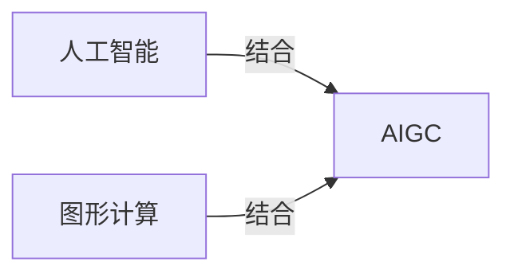

## 1.背景介绍

在今日的科技环境中，人工智能（AI）已经成为了我们生活的一部分，而AI的进步也在不断地推动着各行各业的发展。在这其中，AI图形计算（AIGC）作为AI的一个重要分支，它的出现给我们带来了前所未有的视觉体验。本文将深入探讨AIGC的相关知识，并且通过实际的项目实战，让我们一起走进AIGC的世界。

## 2.核心概念与联系

AIGC是一种结合了人工智能和图形计算的技术，它通过AI的算法，能够对图形进行智能化的处理和生成。这种技术在许多领域都有着广泛的应用，例如游戏、影视、设计等。



## 3.核心算法原理具体操作步骤

AIGC的核心算法原理主要包括了图形生成、图形处理、图形识别等部分。在图形生成中，我们主要使用了GAN（生成对抗网络）这种算法；在图形处理中，我们主利用了CNN（卷积神经网络）来进行图像的特征提取；在图形识别中，我们主要使用了R-CNN（区域卷积神经网络）来进行目标的识别。

## 4.数学模型和公式详细讲解举例说明

在AIGC中，我们主要使用了深度学习的模型。例如在图形生成中，我们使用了GAN的模型。GAN的模型可以表示为：

$$
\min_G \max_D V(D,G) = \mathbb{E}_{\boldsymbol{x} \sim p_{\text{data}}(\boldsymbol{x})}[\log D(\boldsymbol{x})] + \mathbb{E}_{\boldsymbol{z} \sim p_{\boldsymbol{z}}(\boldsymbol{z})}[\log (1 - D(G(\boldsymbol{z})))]
$$

其中，$D$代表判别器，$G$代表生成器。

## 5.项目实践：代码实例和详细解释说明

在实际的项目实践中，我们可以利用Python的库，例如TensorFlow、Keras等，来实现AIGC的相关算法。例如在图形生成中，我们可以使用以下的代码来实现GAN的算法：

```python
from keras.models import Sequential
from keras.layers import Dense, Activation

# 创建生成器
generator = Sequential()
generator.add(Dense(256, input_dim=100))
generator.add(Activation('relu'))
generator.add(Dense(512))
generator.add(Activation('relu'))
generator.add(Dense(1024))
generator.add(Activation('relu'))
generator.add(Dense(784, activation='tanh'))

# 创建判别器
discriminator = Sequential()
discriminator.add(Dense(1024, input_dim=784))
discriminator.add(Activation('relu'))
discriminator.add(Dense(512))
discriminator.add(Activation('relu'))
discriminator.add(Dense(256))
discriminator.add(Activation('relu'))
discriminator.add(Dense(1, activation='sigmoid'))
```

## 6.实际应用场景

AIGC在许多领域都有着广泛的应用，例如在游戏领域，我们可以利用AIGC来生成更加真实的游戏场景；在影视领域，我们可以利用AIGC来生成更加逼真的特效；在设计领域，我们可以利用AIGC来生成更加独特的设计。

## 7.工具和资源推荐

在进行AIGC的学习和实践中，以下的工具和资源可能会对你有所帮助：

- TensorFlow：一个开源的深度学习框架，可以用来实现AIGC的相关算法。
- Keras：一个基于Python的深度学习库，可以用来快速地实现深度学习的模型。
- NVIDIA CUDA：一个可以利用NVIDIA的GPU来进行高性能计算的平台。

## 8.总结：未来发展趋势与挑战

随着AI的发展，AIGC的应用也将越来越广泛。然而，AIGC的发展也面临着许多的挑战，例如算法的复杂性、计算资源的需求等。但是，我相信随着技术的进步，这些挑战都将会被我们克服。

## 9.附录：常见问题与解答

Q: AIGC需要什么样的基础知识？
A: AIGC需要一定的数学和编程基础，例如线性代数、概率论、Python编程等。

Q: AIGC有哪些应用？
A: AIGC在许多领域都有应用，例如游戏、影视、设计等。

Q: AIGC的学习资源有哪些？
A: 可以参考TensorFlow、Keras的官方文档，以及相关的论文和书籍。

作者：禅与计算机程序设计艺术 / Zen and the Art of Computer Programming
