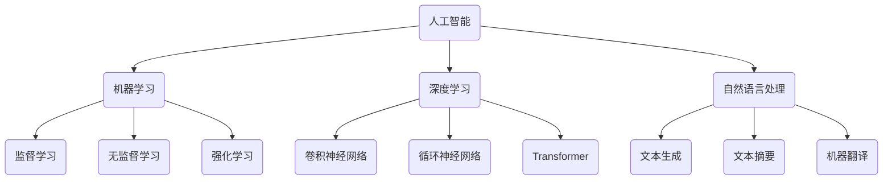
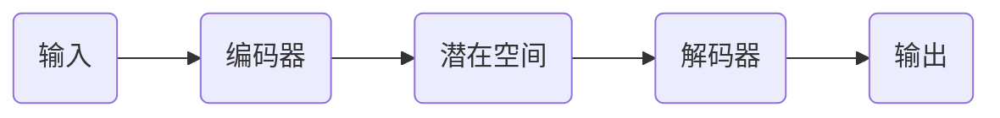
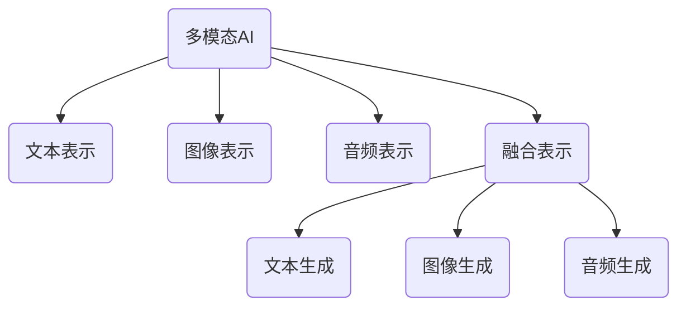
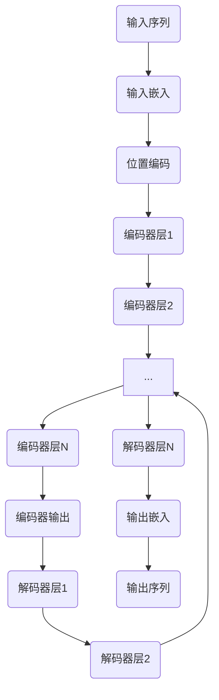
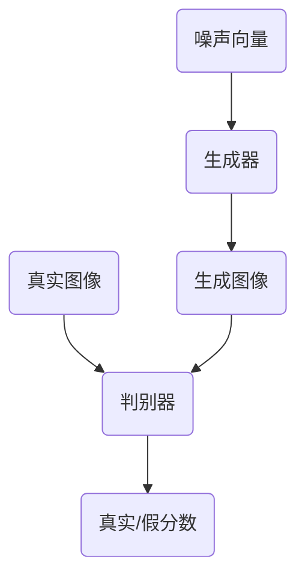

# AIGC从入门到实战：超强的"理科状元"

## 1.背景介绍

### 1.1 什么是AIGC?

AIGC(Artificial Intelligence Generated Content)是指利用人工智能技术生成的内容,包括文本、图像、音频、视频等多种形式。随着深度学习、自然语言处理、计算机视觉等技术的不断发展,AIGC已经渗透到内容创作的方方面面,正在重塑内容产业。

### 1.2 AIGC的重要性

AIGC可以极大提高内容创作的效率,降低成本,并为人类创作者提供辅助和创意来源。在营销、教育、娱乐等领域,AIGC都展现出了巨大的应用潜力。未来,AIGC将成为内容产业的重要驱动力。

### 1.3 AIGC发展现状

目前,以ChatGPT、Midjourney等为代表的AIGC工具已经问世,能够生成高质量的文本、图像内容。但AIGC仍处于起步阶段,存在一些局限性,如缺乏情感把控、内容独创性有限等。未来AIGC需要在多模态、知识融合、创意生成等方面取得突破。

## 2.核心概念与联系

### 2.1 人工智能(AI)

人工智能是AIGC的核心驱动力,包括机器学习、深度学习、自然语言处理等技术。这些技术赋予了AI系统理解和生成内容的能力。



### 2.2 生成式AI

生成式AI指的是能够生成新内容的AI系统,如文本生成、图像生成等,这是AIGC的核心能力。生成式AI通常采用编码器-解码器架构,将输入编码为潜在表示,再由解码器从潜在空间生成所需内容。



### 2.3 多模态AI

多模态AI指的是能够处理和生成多种模态(文本、图像、语音等)内容的AI系统。多模态AI需要融合不同模态的表示,实现跨模态的理解和生成。这是AIGC发展的重要方向。



## 3.核心算法原理具体操作步骤

### 3.1 Transformer架构

Transformer是AIGC中常用的序列到序列(Seq2Seq)模型架构,广泛应用于文本生成、机器翻译等任务。它主要由编码器(Encoder)和解码器(Decoder)组成。

#### 3.1.1 Encoder

1) 输入嵌入(Input Embedding)
2) 位置编码(Positional Encoding)
3) 多头注意力(Multi-Head Attention)
4) 前馈网络(Feed-Forward Network)
5) 残差连接(Residual Connection)
6) 层归一化(Layer Normalization)

#### 3.1.2 Decoder

1) 输出嵌入(Output Embedding)
2) 掩码多头注意力(Masked Multi-Head Attention)
3) 编码器-解码器注意力(Encoder-Decoder Attention)
4) 前馈网络(Feed-Forward Network)
5) 残差连接(Residual Connection)
6) 层归一化(Layer Normalization)



### 3.2 生成对抗网络(GAN)

GAN是AIGC中常用的图像生成模型,由生成器(Generator)和判别器(Discriminator)组成,两者相互对抗训练,最终使生成器能够生成高质量的图像。

#### 3.2.1 生成器(Generator)

1) 从噪声向量(Noise Vector)开始
2) 上采样(Upsampling)
3) 卷积(Convolution)
4) 批归一化(Batch Normalization)
5) 激活函数(Activation Function)
6) 输出生成图像(Generated Image)

#### 3.2.2 判别器(Discriminator) 

1) 输入真实图像或生成图像
2) 下采样(Downsampling)
3) 卷积(Convolution)
4) 批归一化(Batch Normalization)
5) 激活函数(Activation Function)
6) 输出真实/假分数(Real/Fake Score)



## 4.数学模型和公式详细讲解举例说明

### 4.1 Transformer的注意力机制

注意力机制是Transformer的核心,它能够捕捉输入序列中不同位置之间的依赖关系。给定查询(Query)、键(Key)和值(Value)向量,注意力机制的计算过程如下:

$$\begin{aligned}
\text{Attention}(Q, K, V) &= \text{softmax}(\frac{QK^T}{\sqrt{d_k}})V \\
\text{head}_i &= \text{Attention}(QW_i^Q, KW_i^K, VW_i^V) \\
\text{MultiHead}(Q, K, V) &= \text{Concat}(\text{head}_1, ..., \text{head}_h)W^O
\end{aligned}$$

其中 $Q、K、V$ 分别表示查询、键和值向量。$d_k$ 是缩放因子,防止点积的方差过大。$W_i^Q、W_i^K、W_i^V$ 是线性映射的权重矩阵。$W^O$ 是最终的线性变换。

例如,对于输入序列 "思考人工智能的本质",注意力机制能够捕捉到"人工智能"一词与其他词之间的关联,从而更好地编码语义信息。

### 4.2 GAN的损失函数

GAN的目标是最小化判别器的损失,同时最大化生成器的损失,形成对抗训练。具体来说:

- 判别器损失:
$$\min_D V(D) = \mathbb{E}_{x\sim p_\text{data}(x)}[\log D(x)] + \mathbb{E}_{z\sim p_z(z)}[\log(1-D(G(z)))]$$

- 生成器损失: 
$$\min_G V(G) = \mathbb{E}_{z\sim p_z(z)}[\log(1-D(G(z)))]$$

其中,$p_\text{data}(x)$是真实数据分布,$p_z(z)$是噪声向量的分布,$G(z)$表示生成器输出,$D(x)$表示判别器对输入$x$为真实数据的概率得分。

通过交替优化判别器和生成器,最终达到生成器生成的图像无法被判别器区分的状态,此时生成器就能生成高质量的图像了。

## 5.项目实践：代码实例和详细解释说明  

### 5.1 文本生成示例

以下是使用Transformer模型生成文本的Python代码示例,基于PyTorch实现:

```python
import torch
import torch.nn as nn

# 定义Transformer模型
class TransformerModel(nn.Module):
    def __init__(self, vocab_size, d_model, nhead, num_layers, dim_feedforward):
        super(TransformerModel, self).__init__()
        self.embedding = nn.Embedding(vocab_size, d_model)
        self.pos_encoder = PositionalEncoding(d_model)
        encoder_layer = nn.TransformerEncoderLayer(d_model, nhead, dim_feedforward)
        self.encoder = nn.TransformerEncoder(encoder_layer, num_layers)
        decoder_layer = nn.TransformerDecoderLayer(d_model, nhead, dim_feedforward)
        self.decoder = nn.TransformerDecoder(decoder_layer, num_layers)
        self.out = nn.Linear(d_model, vocab_size)

    def forward(self, src, tgt):
        src = self.embedding(src) * math.sqrt(self.embedding.embedding_dim)
        src = self.pos_encoder(src)
        memory = self.encoder(src)
        tgt = self.embedding(tgt) * math.sqrt(self.embedding.embedding_dim)
        tgt = self.pos_encoder(tgt)
        output = self.decoder(tgt, memory)
        output = self.out(output)
        return output

# 加载数据和训练模型
# ...

# 生成文本
model.eval()
start_token = torch.tensor([[token_ids['<start>']]])
generated = start_token

for _ in range(max_length):
    output = model(src, generated)
    last_output = output[:, -1, :]
    next_token = torch.argmax(last_output, dim=-1)
    generated = torch.cat((generated, next_token.unsqueeze(0)), dim=-1)
    if next_token.item() == token_ids['<end>']:
        break

generated_text = ' '.join([reverse_token_ids[tok] for tok in generated.squeeze().tolist()])
print(generated_text)
```

这个示例定义了一个Transformer模型,包含编码器(Encoder)和解码器(Decoder)。在生成文本时,首先将起始标记(`<start>`)输入解码器,然后基于编码器的输出和当前生成的文本,模型会预测下一个最可能的标记,直到生成终止标记(`<end>`)或达到最大长度。

### 5.2 图像生成示例

以下是使用DCGAN(Deep Convolutional GAN)生成图像的PyTorch代码示例:

```python
import torch
import torch.nn as nn

# 定义生成器
class Generator(nn.Module):
    def __init__(self, z_dim, img_channels):
        super(Generator, self).__init__()
        self.gen = nn.Sequential(
            nn.ConvTranspose2d(z_dim, 512, 4, 1, 0, bias=False),
            nn.BatchNorm2d(512),
            nn.ReLU(True),
            nn.ConvTranspose2d(512, 256, 4, 2, 1, bias=False),
            nn.BatchNorm2d(256),
            nn.ReLU(True),
            nn.ConvTranspose2d(256, 128, 4, 2, 1, bias=False),
            nn.BatchNorm2d(128),
            nn.ReLU(True),
            nn.ConvTranspose2d(128, 64, 4, 2, 1, bias=False),
            nn.BatchNorm2d(64),
            nn.ReLU(True),
            nn.ConvTranspose2d(64, img_channels, 4, 2, 1, bias=False),
            nn.Tanh()
        )

    def forward(self, z):
        return self.gen(z.view(-1, z.size(1), 1, 1))

# 定义判别器
class Discriminator(nn.Module):
    def __init__(self, img_channels):
        super(Discriminator, self).__init__()
        self.disc = nn.Sequential(
            nn.Conv2d(img_channels, 64, 4, 2, 1, bias=False),
            nn.LeakyReLU(0.2, inplace=True),
            nn.Conv2d(64, 128, 4, 2, 1, bias=False),
            nn.BatchNorm2d(128),
            nn.LeakyReLU(0.2, inplace=True),
            nn.Conv2d(128, 256, 4, 2, 1, bias=False),
            nn.BatchNorm2d(256),
            nn.LeakyReLU(0.2, inplace=True),
            nn.Conv2d(256, 512, 4, 2, 1, bias=False),
            nn.BatchNorm2d(512),
            nn.LeakyReLU(0.2, inplace=True),
            nn.Conv2d(512, 1, 4, 1, 0, bias