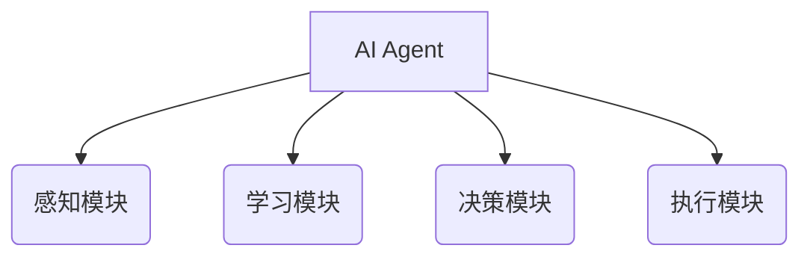
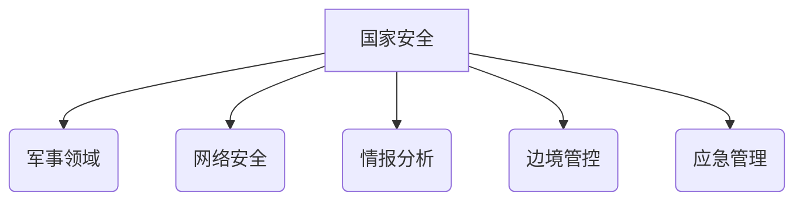
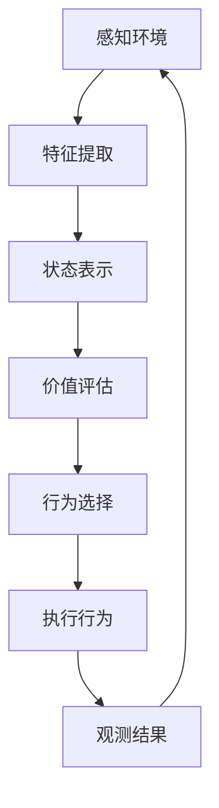

# AI人工智能 Agent：对国家安全的影响

## 1.背景介绍

### 1.1 人工智能的兴起

人工智能(AI)是当代科技发展的前沿领域,近年来取得了长足进步。AI系统可以通过机器学习算法从大量数据中自主学习,并对复杂问题做出智能决策。AI技术在语音识别、图像处理、自然语言处理等领域得到广泛应用,极大提高了计算机系统的智能化水平。

### 1.2 AI Agent的概念

AI Agent是指具备一定智能和自主性的软件实体,能够感知环境、处理信息、做出决策并采取行动。AI Agent可广泛应用于军事领域、网络安全、智能交通等,对国家安全构成重大影响。

### 1.3 国家安全的重要性  

国家安全关乎国家主权、领土完整和利益,是国家生存和发展的根本。在当今复杂的地缘政治形势下,加强国家安全建设至关重要。AI技术的发展给国家安全带来新的机遇和挑战。

## 2.核心概念与联系

### 2.1 AI Agent的构成

AI Agent通常由以下几个核心模块构成:

- 感知模块:用于获取环境信息
- 学习模块:通过机器学习算法学习经验
- 决策模块:根据已学习知识做出决策
- 执行模块:执行相应的行为



### 2.2 AI Agent与国家安全的关系

AI Agent可应用于以下几个与国家安全密切相关的领域:

- 军事领域:用于目标识别、战略规划等
- 网络安全:检测和防御网络攻击
- 情报分析:分析和预测安全威胁
- 边境管控:监控和管理边境活动
- 应急管理:规划和协调应急响应



## 3.核心算法原理具体操作步骤

### 3.1 机器学习算法

AI Agent的学习能力主要依赖于机器学习算法,常用算法包括:

1. 监督学习
   - 分类算法:逻辑回归、支持向量机等
   - 回归算法:线性回归、决策树等
2. 无监督学习 
   - 聚类算法:K-Means、层次聚类等
   - 降维算法:主成分分析、t-SNE等
3. 强化学习
   - Q-Learning
   - 深度Q网络(DQN)
4. 深度学习
   - 卷积神经网络(CNN)
   - 循环神经网络(RNN)

这些算法可用于对各类数据(图像、文本、时序等)进行智能分析和决策。

### 3.2 AI Agent决策过程

AI Agent的决策过程通常包括以下步骤:



1. 感知环境,获取相关信息
2. 特征提取,对信息进行预处理
3. 状态表示,将特征映射到状态空间 
4. 价值评估,评估各个状态的价值
5. 行为选择,选择价值最大的行为
6. 执行行为,并观测执行结果
7. 循环上述过程,不断优化决策

## 4.数学模型和公式详细讲解举例说明

### 4.1 监督学习

监督学习算法通过学习带标签的训练数据,建立输入特征到输出标签的映射模型。

#### 4.1.1 线性回归

线性回归用于预测连续型变量,其模型为:

$$y = w_0 + w_1x_1 + w_2x_2 + ... + w_nx_n$$

其中$y$为预测值,$x_i$为特征值,$w_i$为权重参数。通过最小化损失函数:

$$\min_{w} \sum_{i=1}^{m} (y_i - (w_0 + w_1x_{i1} + ... + w_nx_{in}))^2$$

可以求解出最优参数$w$。

#### 4.1.2 逻辑回归

逻辑回归用于二分类问题,其模型为:

$$P(y=1|x) = \sigma(w_0 + w_1x_1 + ... + w_nx_n)$$

其中$\sigma(z) = 1/(1+e^{-z})$为Sigmoid函数。通过最大化似然函数:

$$\max_{w} \prod_{i=1}^{m} P(y_i|x_i;w)$$

可以求解出最优参数$w$。

### 4.2 无监督学习

无监督学习算法直接从无标签数据中学习潜在模式。

#### 4.2.1 K-Means聚类

K-Means是一种常用的聚类算法,目标是将$n$个样本点$\{x_1,x_2,...,x_n\}$划分到$K$个簇$\{C_1,C_2,...,C_K\}$中,使得簇内点之间的距离平方和最小:

$$\min_{C} \sum_{k=1}^{K} \sum_{x \in C_k} ||x - \mu_k||^2$$

其中$\mu_k$为第$k$个簇的质心。算法通过迭代优化簇划分和质心位置。

#### 4.2.2 主成分分析(PCA)

PCA是一种常用的降维算法,其目标是找到能够最大程度保留原始数据信息的低维投影。具体做法是:对样本矩阵$X$进行特征分解,得到协方差矩阵$\Sigma$的特征向量$\{v_1,v_2,...,v_d\}$及其对应的特征值$\{\lambda_1,\lambda_2,...,\lambda_d\}$,选取前$k$个最大特征值对应的特征向量$\{v_1,v_2,...,v_k\}$作为投影矩阵$P$,将原始数据$X$投影到$k$维空间:

$$X' = XP^T$$

### 4.3 强化学习 

强化学习算法通过与环境交互并获得反馈,学习如何选择最优行为策略。

#### 4.3.1 Q-Learning

Q-Learning是一种常用的强化学习算法,其核心是学习状态-行为对的价值函数$Q(s,a)$,表示在状态$s$下选择行为$a$后的期望回报。算法通过不断更新$Q$值逼近最优$Q^*$函数:

$$Q(s,a) \leftarrow Q(s,a) + \alpha[r + \gamma\max_{a'}Q(s',a') - Q(s,a)]$$

其中$\alpha$为学习率,$\gamma$为折扣因子,$r$为获得的即时回报,$s'$为执行$a$后转移到的新状态。

#### 4.3.2 深度Q网络(DQN)

DQN将Q-Learning与深度神经网络相结合,使用神经网络来拟合Q函数。具体来说,定义一个参数化的Q网络$Q(s,a;\theta)$,其中$\theta$为网络参数,通过最小化损失函数:

$$L(\theta) = \mathbb{E}_{(s,a,r,s')\sim D}[(r + \gamma\max_{a'}Q(s',a';\theta^-) - Q(s,a;\theta))^2]$$

来更新参数$\theta$,其中$D$为经验回放池,$\theta^-$为目标网络参数。

## 5.项目实践：代码实例和详细解释说明

以下是一个使用Python和PyTorch实现的简单DQN Agent示例,用于解决经典的CartPole控制问题。

```python
import torch
import torch.nn as nn
import numpy as np

# 定义Q网络
class QNet(nn.Module):
    def __init__(self, state_dim, action_dim):
        super(QNet, self).__init__()
        self.fc1 = nn.Linear(state_dim, 128)
        self.fc2 = nn.Linear(128, action_dim)

    def forward(self, x):
        x = torch.relu(self.fc1(x))
        return self.fc2(x)

# 定义DQN Agent
class DQNAgent:
    def __init__(self, state_dim, action_dim):
        self.q_net = QNet(state_dim, action_dim)
        self.target_q_net = QNet(state_dim, action_dim)
        self.optimizer = torch.optim.Adam(self.q_net.parameters(), lr=1e-3)
        self.replay_buffer = []
        self.gamma = 0.99

    def get_action(self, state):
        state = torch.tensor(state, dtype=torch.float32)
        q_values = self.q_net(state)
        action = torch.argmax(q_values).item()
        return action

    def update(self, batch_size):
        # 从经验回放池中采样
        samples = random.sample(self.replay_buffer, batch_size)
        states, actions, rewards, next_states, dones = zip(*samples)

        # 计算当前Q值和目标Q值
        curr_q = self.q_net(torch.tensor(states, dtype=torch.float32))
        curr_q = curr_q.gather(1, torch.tensor(actions).unsqueeze(1)).squeeze()
        next_q = self.target_q_net(torch.tensor(next_states, dtype=torch.float32))
        max_next_q = next_q.max(1)[0]
        expected_q = torch.tensor(rewards, dtype=torch.float32) + self.gamma * max_next_q * (1 - torch.tensor(dones, dtype=torch.float32))

        # 更新Q网络
        loss = nn.MSELoss()(curr_q, expected_q)
        self.optimizer.zero_grad()
        loss.backward()
        self.optimizer.step()

        # 更新目标Q网络
        self.target_q_net.load_state_dict(self.q_net.state_dict())
```

该示例中,我们首先定义了一个简单的全连接Q网络,然后实现了DQN Agent类。Agent可以根据当前状态选择行为,并将经验存入回放池。在每个时间步,Agent会从回放池中采样一批经验,计算当前Q值和目标Q值,并最小化它们之间的均方差来更新Q网络参数。此外,我们还定期将Q网络的参数复制到目标Q网络,使其保持相对稳定。

在实际应用中,我们可以根据具体问题构建更加复杂的Q网络结构,并调整超参数以获得更好的性能。

## 6.实际应用场景

AI Agent在国家安全领域有广泛的应用前景:

### 6.1 军事领域

- 目标识别与跟踪
- 自主武器系统
- 战略规划与决策
- 模拟训练

### 6.2 网络安全

- 入侵检测与防御
- 恶意软件分析
- 网络流量监控
- 漏洞挖掘

### 6.3 情报分析

- 数据挖掘与关联分析
- 威胁检测与预警
- 情报可视化

### 6.4 边境管控

- 无人机/机器人巡逻
- 人员身份识别
- 走私品监测
- 海上执法

### 6.5 应急管理

- 灾害预测与评估
- 资源调度与优化
- 应急决策支持
- 人员疏散引导

## 7.工具和资源推荐

AI Agent的开发需要综合运用多种工具和资源:

- 深度学习框架: PyTorch, TensorFlow, MXNet等
- 机器学习库: Scikit-learn, XGBoost, LightGBM等
- 自然语言处理库: NLTK, SpaCy, Hugging Face等
- 计算机视觉库: OpenCV, Pillow, Detectron等
- 规划与决策库: OR-Tools, Python-MIP等
- 数据集: ImageNet, COCO, SQuAD等
- 云计算资源: AWS, GCP, Azure等
- 在线学习资源: Coursera, edX, fast.ai等

## 8.总结：未来发展趋势与挑战

### 8.1 发展趋势

- AI Agent智能化水平不断提高
- 多智能体协作系统
- 人机协同决策
- 自主学习能力增强
- 可解释性与安全性提升

### 8.2 挑战

- 算力与数据需求持续增长
- 隐私与伦理问题
- 对抗性攻击与防御
- 鲁棒性与可信赖性
- 监管政策与法律法规

AI Agent技术的发展将深刻影响国家安全,我们需要高度重视其带来的机遇与挑战,制定相应的发展战略,促进技术健康有序发展。

## 9.附录：常见问题与解答  

1