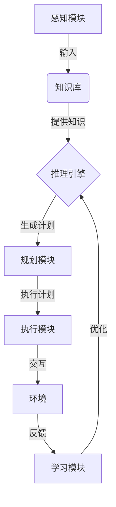

# AI人工智能代理工作流AI Agent WorkFlow：智能代理在医疗保健系统中的应用

## 1.背景介绍

### 1.1 医疗保健系统的挑战

医疗保健系统是一个复杂的生态系统,涉及多个利益相关者,包括医生、护士、患者、医院管理人员和保险公司等。这个系统面临着诸多挑战,例如:

- 医疗资源分配不均衡
- 医疗费用不断上涨
- 医疗错误和并发症的风险
- 患者数据的隐私和安全性
- 医疗服务的可及性和可用性

### 1.2 人工智能在医疗保健中的作用

人工智能(AI)技术在医疗保健领域的应用可以帮助解决上述挑战。AI可以通过以下方式改善医疗保健系统:

- 提高诊断准确性和效率
- 优化医疗资源分配
- 个性化治疗方案
- 预测疾病风险和发展趋势
- 提高医疗服务的可及性和可用性

### 1.3 智能代理的概念

智能代理(Intelligent Agent)是一种自主的软件实体,能够感知环境、处理信息、作出决策并采取行动。智能代理可以代表用户执行特定任务,并根据用户的偏好和目标进行优化。

在医疗保健系统中,智能代理可以扮演多种角色,如个人健康助理、医疗决策支持系统、医疗资源调度器等。

## 2.核心概念与联系

### 2.1 智能代理的构成要素

一个完整的智能代理系统通常包括以下几个核心组件:

1. **感知模块**: 收集来自环境的数据,如患者信息、医疗记录、医疗设备数据等。
2. **知识库**: 存储领域知识、规则、模型等,为代理的决策提供支持。
3. **推理引擎**: 基于知识库和感知数据,进行逻辑推理和决策。
4. **规划模块**: 根据目标和约束条件,生成行动计划。
5. **执行模块**: 执行规划好的行动,与环境交互。
6. **学习模块**: 从过去的经验中学习,不断优化代理的行为。



### 2.2 智能代理的类型

根据不同的应用场景和目标,智能代理可以分为以下几种类型:

1. **反应型代理**(Reactive Agent): 根据当前的感知数据作出即时反应,没有内部状态或记忆。
2. **基于模型的代理**(Model-based Agent): 维护了环境的内部模型,可以基于模型进行规划和预测。
3. **基于目标的代理**(Goal-based Agent): 具有明确的目标,会选择最优的行动来实现目标。
4. **基于效用的代理**(Utility-based Agent): 根据效用函数(Utility Function)评估每个行动的预期效用,选择效用最大的行动。
5. **学习型代理**(Learning Agent): 能够从过去的经验中学习,不断优化自身的行为策略。

不同类型的智能代理可以根据具体需求进行组合和扩展,形成更加复杂和智能的系统。

## 3.核心算法原理具体操作步骤

智能代理系统的核心算法原理涉及多个方面,包括知识表示、推理、规划、学习等。下面将分别介绍这些核心算法的具体操作步骤。

### 3.1 知识表示与推理

#### 3.1.1 知识表示

知识表示是将现实世界的知识以计算机可理解的形式进行建模和存储。常用的知识表示方法包括:

1. **逻辑规则**(Logic Rules): 使用命题逻辑或一阶逻辑来表示事实和规则。
2. **语义网络**(Semantic Networks): 使用节点和边来表示概念及其关系。
3. **框架**(Frames): 使用层次结构来表示对象及其属性和关系。
4. **本体**(Ontologies): 形式化的概念模型,定义了领域中的术语及其关系。

#### 3.1.2 推理算法

推理是从已知的知识中推导出新的知识或结论的过程。常用的推理算法包括:

1. **前向链接**(Forward Chaining): 从已知事实出发,应用规则推导出新的结论。
2. **后向链接**(Backward Chaining): 从目标出发,寻找支持该目标的规则和事实。
3. **模式匹配**(Pattern Matching): 在知识库中搜索与给定模式相匹配的实例。
4. **约束满足问题**(Constraint Satisfaction Problems, CSP): 通过约束传播和回溯搜索找到满足所有约束的解。

这些算法可以根据具体场景和需求进行组合和扩展,以实现更加复杂的推理任务。

### 3.2 规划算法

规划算法的目标是根据当前状态和目标状态,生成一系列行动来实现目标。常用的规划算法包括:

1. **状态空间搜索**(State-space Search): 构建一个状态空间图,使用启发式搜索算法(如A*算法)找到从初始状态到目标状态的最优路径。
2. **部分订单规划**(Partial-order Planning, POP): 将行动表示为部分有序的集合,通过添加约束来解决冲突和缺失条件。
3. **层次任务网络规划**(Hierarchical Task Network Planning, HTN): 将复杂任务分解为子任务,递归地规划和执行子任务。
4. **马尔可夫决策过程**(Markov Decision Processes, MDP): 将环境建模为马尔可夫过程,使用动态规划或强化学习算法求解最优策略。

规划算法需要考虑诸多约束条件,如时间、资源、前置条件等,并且需要与执行模块紧密配合,以实现有效的行动执行。

### 3.3 机器学习算法

机器学习算法使智能代理能够从过去的经验中学习,不断优化自身的行为策略。常用的机器学习算法包括:

1. **监督学习**(Supervised Learning): 从标注的训练数据中学习一个映射函数,用于分类或回归任务。常用算法有决策树、支持向量机、神经网络等。
2. **无监督学习**(Unsupervised Learning): 从未标注的数据中发现隐藏的模式或结构。常用算法有聚类算法、关联规则挖掘、降维算法等。
3. **强化学习**(Reinforcement Learning): 通过与环境的交互,学习一个策略,使长期累积奖励最大化。常用算法有Q-Learning、策略梯度等。
4. **迁移学习**(Transfer Learning): 将在一个领域或任务中学习到的知识迁移到另一个相关的领域或任务中,加速学习过程。
5. **元学习**(Meta-Learning): 学习如何更好地学习,提高学习算法本身的性能和泛化能力。

机器学习算法可以与其他模块紧密结合,例如从知识库中学习规则,优化规划算法的启发式函数,或者直接学习整个智能代理的行为策略。

## 4.数学模型和公式详细讲解举例说明

在智能代理系统中,数学模型和公式扮演着重要的角色,为算法提供理论基础和量化支持。下面将详细介绍一些常用的数学模型和公式。

### 4.1 贝叶斯推理

贝叶斯推理是一种基于概率论的推理方法,它利用贝叶斯定理来更新事件发生的概率。贝叶斯定理可以表示为:

$$P(H|E) = \frac{P(E|H)P(H)}{P(E)}$$

其中:
- $P(H|E)$ 是已知证据 $E$ 发生时,假设 $H$ 为真的后验概率(Posterior Probability)。
- $P(E|H)$ 是假设 $H$ 为真时,证据 $E$ 发生的条件概率(Likelihood)。
- $P(H)$ 是假设 $H$ 的先验概率(Prior Probability)。
- $P(E)$ 是证据 $E$ 的边缘概率(Marginal Probability)。

贝叶斯推理在医疗诊断、风险评估等场景中有广泛应用。例如,给定一个患者的症状和检查结果(证据 $E$),我们可以计算出患有某种疾病(假设 $H$)的后验概率,从而为诊断提供量化支持。

### 4.2 马尔可夫决策过程

马尔可夫决策过程(Markov Decision Process, MDP)是一种用于建模序列决策问题的数学框架。一个MDP可以表示为一个元组 $(S, A, P, R, \gamma)$,其中:

- $S$ 是状态集合
- $A$ 是行动集合
- $P(s'|s,a)$ 是状态转移概率,表示在状态 $s$ 执行行动 $a$ 后,转移到状态 $s'$ 的概率
- $R(s,a,s')$ 是即时奖励函数,表示在状态 $s$ 执行行动 $a$ 并转移到状态 $s'$ 时获得的奖励
- $\gamma \in [0,1)$ 是折现因子,用于权衡即时奖励和长期奖励的重要性

目标是找到一个策略 $\pi: S \rightarrow A$,使得期望的累积折现奖励最大化:

$$\max_\pi \mathbb{E}\left[ \sum_{t=0}^\infty \gamma^t R(s_t, a_t, s_{t+1}) \right]$$

其中 $s_0$ 是初始状态, $a_t = \pi(s_t)$, $s_{t+1} \sim P(\cdot|s_t, a_t)$。

MDP在医疗决策支持、治疗方案优化等场景中有广泛应用。例如,我们可以将患者的健康状态建模为MDP的状态,医疗行为作为行动,健康结果作为即时奖励,然后求解最优策略以最大化患者的长期健康水平。

### 4.3 生存分析模型

生存分析模型(Survival Analysis Models)是一类用于分析事件发生时间的统计模型,在医疗领域中常用于预测患者的存活时间或疾病进展时间。

一种常用的生存分析模型是Cox比例风险模型(Cox Proportional Hazards Model),它可以表示为:

$$h(t|X) = h_0(t) \exp(\beta_1 X_1 + \beta_2 X_2 + \cdots + \beta_p X_p)$$

其中:
- $h(t|X)$ 是在给定协变量 $X$ 的条件下,时间 $t$ 时的风险率(Hazard Rate)
- $h_0(t)$ 是基线风险率(Baseline Hazard Rate)
- $X_i$ 是第 $i$ 个协变量
- $\beta_i$ 是第 $i$ 个协变量的回归系数

该模型可以用于评估各种风险因素(如年龄、性别、基因等)对患者存活时间的影响,从而为个性化治疗和风险评估提供支持。

## 5.项目实践：代码实例和详细解释说明

为了更好地理解智能代理在医疗保健系统中的应用,我们将通过一个简化的示例项目来实践相关概念和算法。该项目旨在开发一个基于规则的医疗诊断系统,能够根据患者的症状和检查结果,推理出可能的疾病诊断。

### 5.1 知识表示

我们将使用逻辑规则来表示医学知识,包括症状、检查结果和疾病之间的关系。例如:

```python
# 症状规则
symptom(Patient, fever) \
    if body_temp(Patient, Temp) and Temp > 38.5

# 疾病规则
disease(Patient, flu) \
    if symptom(Patient, fever) and symptom(Patient, cough)

# 检查结果规则
test_result(Patient, positive, flu_test) \
    if disease(Patient, flu)
```

这些规则可以存储在知识库中,供推理引擎使用。

### 5.2 推理引擎

我们将使用后向链接算法(Backward Chaining)作为推理引擎的核心。该算法从目标出发,寻找支持该